# 南开大学 计算机研究生 专业数学基础A 分题型速成

### 考试形式：闭卷，6道计算大题(4道20分的，2道10分的)，可以带计算器

#### 背景

因为南开大学 计算机 研究生 专业数学基础A这门课，讲得杂而考得精，PPT也不太好复习，所以我分成多种题型，每种都做了一遍。

分题型速成视频见：https://www.bilibili.com/video/BV157yGBvEqS

速成视频尽量做到：即使没有上课，速成视频全部看懂就安全。

这门课的PPT还有我写的题解都在文件夹里面了。

考试大纲：见标上红星的部分。

---

## 我的手稿

---

##  --- 我的题解 ---

---
## 题解：题型：协方差矩阵

### 题型：协方差矩阵

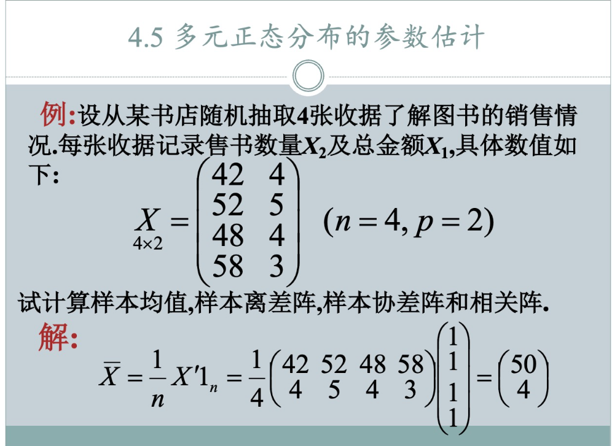

**例题信息：**
从某书店随机抽取4张收据，了解图书的销售情况。每张收据记录售书数量 $X_2$ 及总金额 $X_1$。
数据矩阵 $X$ 如下：
$X = \begin{pmatrix} 42 & 4 \\ 52 & 5 \\ 48 & 4 \\ 58 & 3 \end{pmatrix}$

这里 $n=4$ (样本数量)，$p=2$ (变量数量，$X_1$ 是总金额， $X_2$ 是售书数量)。

---

**1. 计算样本均值向量 $\bar{X}$**

样本均值向量 $\bar{X}$ 的计算公式为：
$\bar{X} = \frac{1}{n} \sum_{\alpha=1}^n X_\alpha$

或者，如果数据以行为观测值（如您提供的矩阵 $X$），则可以按列求平均。
$X_1$ 列 (总金额): $42, 52, 48, 58$
$X_2$ 列 (售书数量): $4, 5, 4, 3$

$\bar{x}_1 = \frac{42 + 52 + 48 + 58}{4} = \frac{200}{4} = 50$
$\bar{x}_2 = \frac{4 + 5 + 4 + 3}{4} = \frac{16}{4} = 4$

所以，样本均值向量为：
$\bar{X} = \begin{pmatrix} 50 \\ 4 \end{pmatrix}$

---

**2. 计算样本离差阵 $A$**

样本离差阵的定义是 $A = \sum_{\alpha=1}^n (X_\alpha - \bar{X})(X_\alpha - \bar{X})'$。
首先，我们需要计算每个观测值与均值向量的离差。
$X_\alpha - \bar{X}$

观测值1: $X_1 = \begin{pmatrix} 42 \\ 4 \end{pmatrix}$
$X_1 - \bar{X} = \begin{pmatrix} 42 \\ 4 \end{pmatrix} - \begin{pmatrix} 50 \\ 4 \end{pmatrix} = \begin{pmatrix} -8 \\ 0 \end{pmatrix}$

观测值2: $X_2 = \begin{pmatrix} 52 \\ 5 \end{pmatrix}$
$X_2 - \bar{X} = \begin{pmatrix} 52 \\ 5 \end{pmatrix} - \begin{pmatrix} 50 \\ 4 \end{pmatrix} = \begin{pmatrix} 2 \\ 1 \end{pmatrix}$

观测值3: $X_3 = \begin{pmatrix} 48 \\ 4 \end{pmatrix}$
$X_3 - \bar{X} = \begin{pmatrix} 48 \\ 4 \end{pmatrix} - \begin{pmatrix} 50 \\ 4 \end{pmatrix} = \begin{pmatrix} -2 \\ 0 \end{pmatrix}$

观测值4: $X_4 = \begin{pmatrix} 58 \\ 3 \end{pmatrix}$
$X_4 - \bar{X} = \begin{pmatrix} 58 \\ 3 \end{pmatrix} - \begin{pmatrix} 50 \\ 4 \end{pmatrix} = \begin{pmatrix} 8 \\ -1 \end{pmatrix}$

现在，计算 $(X_\alpha - \bar{X})(X_\alpha - \bar{X})'$ 并求和：

第一项：$\begin{pmatrix} -8 \\ 0 \end{pmatrix} \begin{pmatrix} -8 & 0 \end{pmatrix} = \begin{pmatrix} 64 & 0 \\ 0 & 0 \end{pmatrix}$

第二项：$\begin{pmatrix} 2 \\ 1 \end{pmatrix} \begin{pmatrix} 2 & 1 \end{pmatrix} = \begin{pmatrix} 4 & 2 \\ 2 & 1 \end{pmatrix}$

第三项：$\begin{pmatrix} -2 \\ 0 \end{pmatrix} \begin{pmatrix} -2 & 0 \end{pmatrix} = \begin{pmatrix} 4 & 0 \\ 0 & 0 \end{pmatrix}$

第四项：$\begin{pmatrix} 8 \\ -1 \end{pmatrix} \begin{pmatrix} 8 & -1 \end{pmatrix} = \begin{pmatrix} 64 & -8 \\ -8 & 1 \end{pmatrix}$

将这四项相加：
$A = \begin{pmatrix} 64 & 0 \\ 0 & 0 \end{pmatrix} + \begin{pmatrix} 4 & 2 \\ 2 & 1 \end{pmatrix} + \begin{pmatrix} 4 & 0 \\ 0 & 0 \end{pmatrix} + \begin{pmatrix} 64 & -8 \\ -8 & 1 \end{pmatrix}$
$A = \begin{pmatrix} 64+4+4+64 & 0+2+0-8 \\ 0+2+0-8 & 0+1+0+1 \end{pmatrix} = \begin{pmatrix} 136 & -6 \\ -6 & 2 \end{pmatrix}$

所以，样本离差阵为：
$A = \begin{pmatrix} 136 & -6 \\ -6 & 2 \end{pmatrix}$

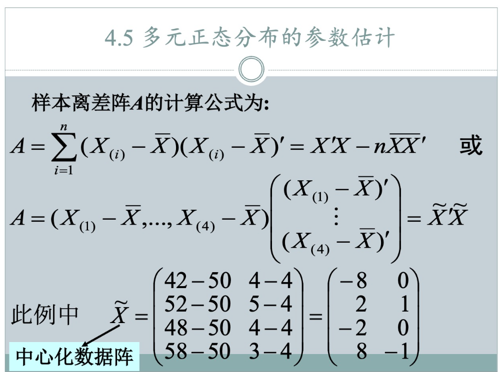

---

**3. 计算样本协差阵 $S$**

样本协差阵 $S$ 通常定义为 $S = \frac{1}{n-1} A$ (无偏估计)。
这里 $n=4$，所以 $n-1 = 3$。

$S = \frac{1}{3} \begin{pmatrix} 136 & -6 \\ -6 & 2 \end{pmatrix} = \begin{pmatrix} 136/3 & -6/3 \\ -6/3 & 2/3 \end{pmatrix} = \begin{pmatrix} 45.333 & -2 \\ -2 & 0.667 \end{pmatrix}$ (保留三位小数)

所以，样本协差阵为：
$S = \begin{pmatrix} 45.333 & -2 \\ -2 & 0.667 \end{pmatrix}$

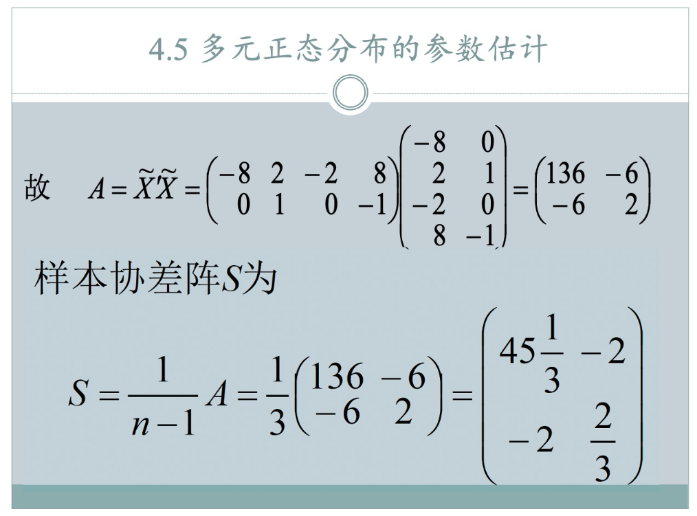

---

**4. 计算相关阵 $R$**

相关阵 $R$ 的元素 $r_{ij}$ 定义为：
$r_{ij} = \frac{s_{ij}}{\sqrt{s_{ii}s_{jj}}}$
其中 $s_{ij}$ 是协方差矩阵 $S$ 的元素，$s_{ii}$ 和 $s_{jj}$ 是主对角线元素（即方差）。

从协方差矩阵 $S$ 中，我们有：
$s_{11} = 136/3 = 45.333$ (变量 $X_1$ 的方差)
$s_{22} = 2/3 = 0.667$ (变量 $X_2$ 的方差)
$s_{12} = s_{21} = -2$ (变量 $X_1$ 和 $X_2$ 的协方差)

首先计算标准差：
$\sqrt{s_{11}} = \sqrt{136/3} \approx \sqrt{45.333} \approx 6.733$
$\sqrt{s_{22}} = \sqrt{2/3} \approx \sqrt{0.667} \approx 0.816$

现在计算相关系数：
$r_{11} = 1$ (任何变量与其自身的相关系数都为1)
$r_{22} = 1$

$r_{12} = \frac{s_{12}}{\sqrt{s_{11}s_{22}}} = \frac{-2}{\sqrt{(136/3)(2/3)}} = \frac{-2}{\sqrt{272/9}} = \frac{-2}{ \frac{\sqrt{272}}{3} } = \frac{-6}{\sqrt{272}} = \frac{-6}{4\sqrt{17}} = \frac{-3}{2\sqrt{17}}$
$r_{12} \approx \frac{-3}{2 \times 4.123} \approx \frac{-3}{8.246} \approx -0.364$

$r_{21} = r_{12} \approx -0.364$

所以，相关阵为：
$R = \begin{pmatrix} 1 & -0.364 \\ -0.364 & 1 \end{pmatrix}$

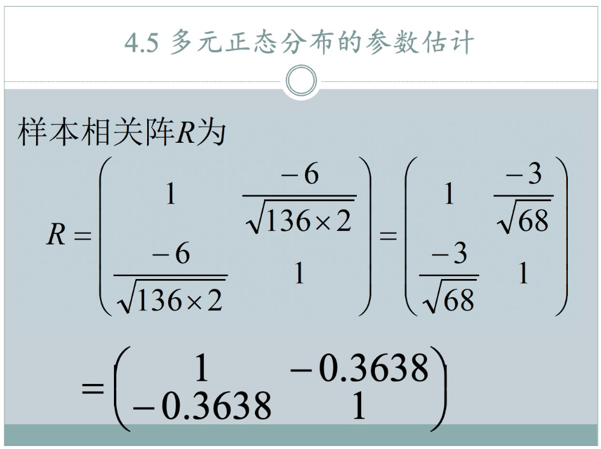

---

**总结计算结果：**

1.  **样本均值向量 $\bar{X}$:**
    $\bar{X} = \begin{pmatrix} 50 \\ 4 \end{pmatrix}$

2.  **样本离差阵 $A$:**
    $A = \begin{pmatrix} 136 & -6 \\ -6 & 2 \end{pmatrix}$

3.  **样本协差阵 $S$:**
    $S = \begin{pmatrix} 136/3 & -2 \\ -2 & 2/3 \end{pmatrix} \approx \begin{pmatrix} 45.333 & -2 \\ -2 & 0.667 \end{pmatrix}$

4.  **相关阵 $R$:**
    $R = \begin{pmatrix} 1 & -0.364 \\ -0.364 & 1 \end{pmatrix}$

---
## 题解：选看：正规方程的几何理解

### 什么是正规方程

简单来说，**正规方程 (Normal Equations)** 是将一个可能无解的线性方程组 **Ax = y**，转化为一个可解的新方程组，用来寻找原问题的**最优近似解**（即最小二乘解）。

这个新方程组就是：

**AᵀAx = Aᵀy**

它的解 **x** 能让 **Ax** 成为 **y** 在 **A** 的列空间上的投影，从而使误差 **||y - Ax||** 最小。

### 从几何角度推导正规方程

在一个三维空间中进行讨论。

#### 1. 问题设定

我们有一个线性方程组 **Ax = y**。

*   **A** 是一个 m x 3 的矩阵，我们可以将其列向量看作三维空间中的三个向量 **A = [α₁, α₂, α₃]**。
*   **x** 是一个 3 x 1 的列向量，包含我们想要求的未知数 **x = [x₁, x₂, x₃]ᵀ**。
*   **y** 是一个 m x 1 的列向量，代表目标向量。

根据矩阵向量乘法的定义，**Ax** 的结果是 **A** 的列向量的线性组合：
**Ax = x₁α₁ + x₂α₂ + x₃α₃**

这个线性组合所能构成的所有向量的集合，被称为矩阵 **A** 的**列空间** (Column Space)。在假设中，**α₁, α₂, α₃** 是共面的，所以 **A** 的列空间是一个平面。

#### 2. 几何直觉：投影

假设向量 **y** 不在该平面上。这意味着 **y** 不在 **A** 的列空间中。因此，方程 **Ax = y** 无解。我们无法找到一组系数 **(x₁, x₂, x₃)** 使得 **α₁, α₂, α₃** 的线性组合恰好等于 **y**。

既然无法找到精确解，我们的目标就变为寻找一个**最优近似解**。从几何上看，这个最优解就是让向量 **Ax** 成为 **y** 在 **A** 的列空间（那个平面）上的**正交投影** (Orthogonal Projection)。我们将这个投影向量表示为 **ŷ**。

为什么正交投影是最近的？因为点到平面的最短距离是垂线段。所以，误差向量 **e = y - Ax** 的长度 (即 ||**y - Ax**||) 在 **Ax** 是 **y** 的正交投影时达到最小。这就是“最小二乘法”的几何意义。

#### 3. 正交性条件

当 **Ax** 是 **y** 在由 **α₁, α₂, α₃** 张成的平面上的正交投影时，误差向量 **e = y - Ax** 必须与这个平面**垂直**。

一个向量垂直于一个平面，意味着它垂直于这个平面上的**所有**向量。由于 **α₁, α₂, α₃** 在这个平面内，所以误差向量 **(y - Ax)** 必然与 **α₁, α₂, α₃** 都正交。

#### 4. 转换为代数方程

两个向量正交，意味着它们的点积（内积）为零。因此，我们可以写出以下方程：
*   **α₁ ⋅ (y - Ax) = 0**  =>  **α₁ᵀ (y - Ax) = 0**
*   **α₂ ⋅ (y - Ax) = 0**  =>  **α₂ᵀ (y - Ax) = 0**
*   **α₃ ⋅ (y - Ax) = 0**  =>  **α₃ᵀ (y - Ax) = 0**

这三个独立的方程可以被优雅地合并成一个矩阵方程。我们知道矩阵 **A** 的转置 **Aᵀ** 是由 **α₁, α₂, α₃** 的转置作为行向量构成的：
**Aᵀ = [ α₁ᵀ; α₂ᵀ; α₃ᵀ ]**

因此，将这三个方程组合起来，就得到了：
**Aᵀ (y - Ax) = 0**

这个方程就是**正规方程**。

#### 5. 求解 x

现在我们得到了一个可以求解的方程：
**Aᵀ (y - Ax) = 0**
展开后得到：
**Aᵀy - AᵀAx = 0**
移项后：
**AᵀAx = Aᵀy**

如果矩阵 **AᵀA** 是可逆的，我们就可以在等式两边同时左乘 **(AᵀA)⁻¹** 来解出 **x**：
**x = (AᵀA)⁻¹ Aᵀy**

至此，我们从几何投影的角度完整地推导出了正规方程的解。

---

### 关于 "左边同时乘以 Aᵀ"

**为什么很有意思的事情是，如果左边同时乘以 Aᵀ，等式自然成立？**

这句话可能有一点误解。我们并不是从 **y - Ax** 出发，然后随意地在左边乘以 **Aᵀ**。

正确地理解是：**乘以 Aᵀ 是将几何上的“正交”条件转化为代数方程的核心步骤**。

*   **几何意义**: 我们要找到的解 **x** 必须满足误差向量 **(y - Ax)** 与 **A** 的列空间正交。
*   **代数翻译**: "与 **A** 的列空间正交" 这个条件，在代数上就等价于 "与 **A** 的所有列向量 **αᵢ** 正交"。
*   **矩阵运算**: 将误差向量 **(y - Ax)** 与**所有**列向量 **αᵢ** 做点积并使其等于零，这个运算恰好可以用矩阵乘法 **Aᵀ (y - Ax) = 0** 来简洁地表示。

所以，左乘 **Aᵀ** 并不是一个巧合的代数技巧，而是我们建立在几何直觉上的“正交性”要求的直接数学体现。 它是一个将几何问题转化为代数问题的桥梁。

---
## 题解：知识回顾、题型：多元正态分布

## 选看：多元正态分布的知识回顾

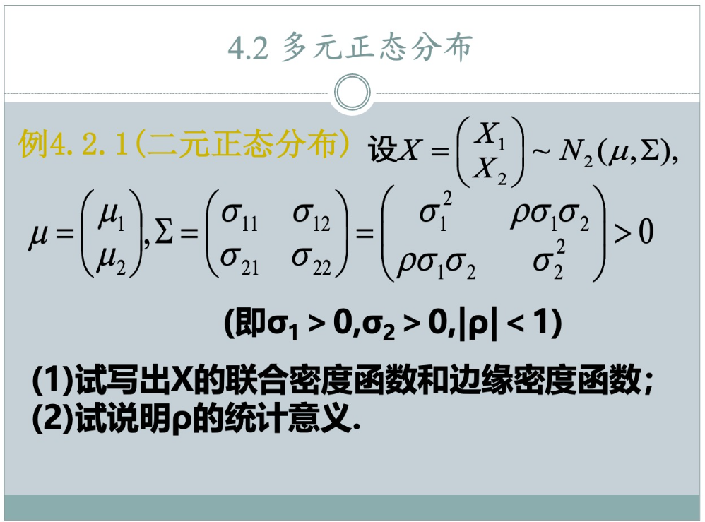

### 从身高和体重的角度，理解正态分布

想象一下，我们去测量全校同学的身高和体重。

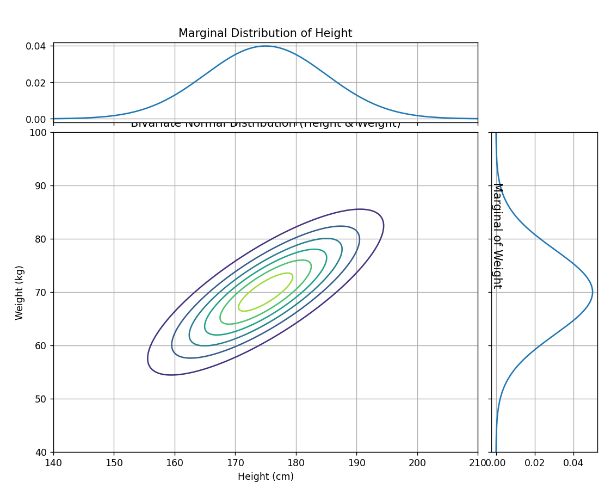

#### 什么是一元正态分布 (Univariate Normal Distribution)？

我们先只看 **身高**。

*   我们会发现，大部分人的身高都集中在某个平均值附近（比如170cm）。
*   身高特别高（比如200cm）和特别矮（比如140cm）的人都非常少。
*   如果我们把不同身高的人数画成一个图，它会呈现一个中间高、两边低的“钟形曲线”，这就是**正态分布**。

在这个“钟形曲线”里，有两个非常重要的参数：

*   **μ (mu) - 均值**: 就是大家身高的**平均值**（比如170cm）。它决定了钟形曲线的中心位置在哪里。
*   **σ (sigma) - 标准差**: 它衡量了大家身高数据的**分散程度**。
    *   如果 **σ** 很小，说明大家身高都差不多，钟形曲线就会又高又瘦。
    *   如果 **σ** 很大，说明大家身高差异很大，有高有矮，钟形曲线就会又矮又胖。

所以，一个一元正态分布 `N(μ, σ²)` 就完整地描述了一个变量（比如身高）的分布情况。

#### 对于概率密度函数的理解

| 维度          | 变量示例         | 概率密度函数 (PDF)     | 如何计算概率                | 直观理解             |
| :------------ | :--------------- | :--------------------- | :-------------------------- | :------------------- |
| **一元 (1D)** | 身高             | `f(x)` (一条曲线)      | **面积** (在区间上积分)     | 曲线下的面积         |
| **二元 (2D)** | 身高、体重       | `f(x₁, x₂)` (一个曲面) | **体积** (在区域上二重积分) | 曲面下的体积         |
| **三元 (3D)** | 身高、体重、年龄 | `f(x₁, x₂, x₃)`        | **超体积** (在体上三重积分) | 数学推广，无法可视化 |
| **n元 (nD)**  | n个特征          | `f(x₁, ..., xₙ)`       | **超体积** (n重积分)        | 概率集中度的数学描述 |

#### 什么是二元正态分布 (Bivariate Normal Distribution)？

现在，我们不仅看身高，还把每个人的**体重**也记录下来。我们得到了一对对的数据 `(身高, 体重)`。

我们想研究这两个变量**联合起来**的分布规律。

*   直觉上，身高和体重是有关联的：**身高比较高的人，体重也倾向于比较重。**
*   二元正态分布就是用来描述这种两个变量联合情况的“钟形”分布。只不过，现在这个“钟”是三维的，像一座山。山顶最高的地方，就是平均身高和平均体重组成的点。

现在我们来解释题目中的符号 `N₂(μ, Σ)`：

*   **N**: 代表正态（Normal）分布。
*   **下标的 2**: 代表这是**二元**（2个变量）的分布。如果是三元就是 `N₃`。
*   **μ**: 不再是一个数，而是一个**均值向量** `μ = (μ₁, μ₂)`。
    *   `μ₁` 是第一个变量（身高）的平均值。
    *   `μ₂` 是第二个变量（体重）的平均值。
    *   这个向量 `(μ₁, μ₂)` 就是3D山峰的中心点坐标。
*   **Σ (Sigma)**: 这不再是标准差，而是一个 **协方差矩阵**。这是二元正态分布的灵魂，它描述了两个变量的“胖瘦”以及它们之间的“关系”。

让我们拆解一下这个矩阵 `Σ`:

`Σ = (σ₁₁  σ₁₂)`
`    (σ₂₁  σ₂₂)`

* **σ₁₁**: 是第一个变量（身高）的**方差**，也就是 `σ₁²`。它描述了身高这个维度的“胖瘦”。

* **σ₂₂**: 是第二个变量（体重）的**方差**，也就是 `σ₂²`。它描述了体重这个维度的“胖瘦”。

*   **σ₁₂ 和 σ₂₁**: 这是两个变量之间的**协方差**。它描述了身高和体重变化的**关联方向**。
    *   **σ₁₂ 一定等于 σ₂₁ 吗？** **是的，一定等于**。因为身高相对于体重的关联，和体重相对于身高的关联是一样的。所以这个矩阵是对称的。
    *   如果协方差是正数，意味着身高增加时，体重也倾向于增加（正相关）。
    *   如果协方差是负数，意味着一个变量增加时，另一个倾向于减少（负相关）。
    *   ρ (rho) 是什么意思？
        协方差（比如 `σ₁₂`）的大小很难直观解释，因为它受变量本身单位的影响。为了消除这种影响，我们用一个标准化的值来表示相关性，这就是 **相关系数 ρ**。
    
    *   `ρ = σ₁₂ / (σ₁ * σ₂)`
    *   ρ 的取值范围在 -1 到 1 之间。
    *   **ρ > 0**: 正相关。身高越高，体重越重。我们画出的数据点（散点图）会像一个从左下到右上的椭圆。
    *   **ρ < 0**: 负相关。例如“学习时间”和“游戏时间”，一个多另一个就少。数据点会像一个从左上到右下的椭圆。
    *   **ρ = 0**: 线性不相关。两个变量之间没有直线关系。
    *   题目中 `σ₁₂` 被写成 `ρσ₁σ₂` 就是基于这个定义。

### ρ = 0: 等高线是正圆吗？ (Is the contour a perfect circle?)

**答：不一定。** 当 `ρ = 0` 时，等高线是一个**轴对齐的椭圆**（an ellipse aligned with the coordinate axes）。它只有在一个**特殊情况**下才会是正圆。

*   **一般情况 (`ρ = 0`, 但 `σ₁ ≠ σ₂`)**:
    当 `ρ = 0` 时，两个变量**线性不相关**。在二维正态分布的图像上，这意味着代表概率山丘的椭圆的**主轴和次轴会与坐标轴X和Y平行**。但是，如果身高数据的分散程度 (`σ₁`) 和体重数据的分散程度 (`σ₂`) 不同，那么这个椭圆在X轴和Y轴方向上的“胖瘦”程度就不同。例如，如果 `σ₁` (身高标准差) 比 `σ₂` (体重标准差) 大，那么椭圆在身高（X）轴方向上会更长。

    

*   **特殊情况 (`ρ = 0` 并且 `σ₁ = σ₂`)**:
    **只有当**两个变量不仅不相关，而且它们各自的标准差（分散程度）也**完全相等**时，这个轴对齐的椭圆才会变成一个**正圆**。因为此时，数据在所有方向上的分散程度都是一样的。

**总结：`ρ = 0` 决定了椭圆的“朝向”（与坐标轴平行），而 `σ₁` 和 `σ₂` 的相对大小决定了椭圆的“形状”（是扁是圆）。**

---

### 如果是3元正态分布，`ρ` 怎么求？也是只有一个 `ρ`，还是有3个？

**答：对于3元正态分布，会有3个 `ρ`。**

当你有3个变量 `X₁`, `X₂`, `X₃` 时（比如身高、体重、年龄），你需要描述它们之间**两两配对**的关系。

可以形成的配对有：
1.  `X₁` 和 `X₂` 之间的关系 (身高 vs 体重)
2.  `X₁` 和 `X₃` 之间的关系 (身高 vs 年龄)
3.  `X₂` 和 `X₃` 之间的关系 (体重 vs 年龄)

因此，会有三个不同的相关系数，我们通常用下标来区分它们：

*   **`ρ₁₂`**: `X₁` 和 `X₂` 之间的相关系数。
*   **`ρ₁₃`**: `X₁` 和 `X₃` 之间的相关系数。
*   **`ρ₂₃`**: `X₂` 和 `X₃` 之间的相关系数。

此时，协方差矩阵 `Σ` 会变成一个 3x3 的对称矩阵：
$$
\Sigma = \begin{pmatrix}
\sigma_{11} & \sigma_{12} & \sigma_{13} \\
\sigma_{21} & \sigma_{22} & \sigma_{23} \\
\sigma_{31} & \sigma_{32} & \sigma_{33}
\end{pmatrix}
= \begin{pmatrix}
\sigma_1^2 & \rho_{12}\sigma_1\sigma_2 & \rho_{13}\sigma_1\sigma_3 \\
\rho_{12}\sigma_1\sigma_2 & \sigma_2^2 & \rho_{23}\sigma_2\sigma_3 \\
\rho_{13}\sigma_1\sigma_3 & \rho_{23}\sigma_2\sigma_3 & \sigma_3^2
\end{pmatrix}
$$
每个 `ρ` 的计算公式依然遵循其定义：
*   `ρ₁₂ = σ₁₂ / (σ₁ * σ₂)`
*   `ρ₁₃ = σ₁₃ / (σ₁ * σ₃)`
*   `ρ₂₃ = σ₂₃ / (σ₂ * σ₃)`

**推广**：对于一个n元正态分布，会有 `n * (n - 1) / 2` 个不同的相关系数需要考虑。

### 一个随机变量和它自己的相关系数永远等于1

我们回到相关系数 `ρ` 的根本定义：
$$
\rho_{ij} = \frac{\sigma_{ij}}{\sigma_i \sigma_j} = \frac{\text{Cov}(X_i, X_j)}{\sqrt{\text{Var}(X_i)} \sqrt{\text{Var}(X_j)}}
$$
现在，让我们看看当 `i` 和 `j` 相等时会发生什么，比如我们计算 `ρ₁₁`：
$$
\rho_{11} = \frac{\sigma_{11}}{\sigma_1 \sigma_1} = \frac{\text{Cov}(X_1, X_1)}{\sqrt{\text{Var}(X_1)} \sqrt{\text{Var}(X_1)}}
$$
我们知道两件事：
1.  一个变量与自身的协方差 `Cov(X₁, X₁)`，根据定义，就是它自身的**方差** `Var(X₁)`。
2.  方差 `Var(X₁)` 等于标准差的平方，即 `σ₁²`。

所以，我们把 `Cov(X₁, X₁)` 替换成 `Var(X₁)`：
$$
\rho_{11} = \frac{\text{Var}(X_1)}{\text{Var}(X_1)} = 1
$$
或者，用 `σ` 符号来写：
$$
\rho_{11} = \frac{\sigma_1^2}{\sigma_1 \cdot \sigma_1} = \frac{\sigma_1^2}{\sigma_1^2} = 1
$$
(前提是方差不为0，即变量不是一个常数)。

---

### 可视化身高和体重的二元正态分布

下面将生成一个符合我们直觉（身高和体重正相关）的二元正态分布图，以及它们各自的边缘分布图。

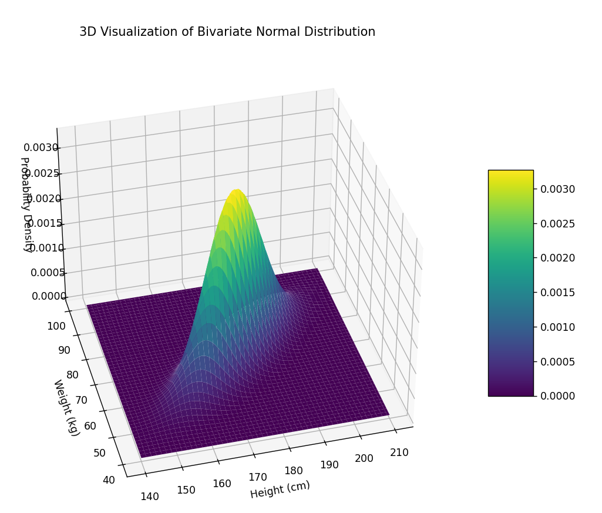

*   **中间的图 (联合分布)**: 这是身高和体重的二元正态分布的“俯视图”。每一圈等高线代表一个概率密度。圈是椭圆形的，并且向右上方倾斜，这完美地展示了身高和体重之间的**正相关关系(ρ > 0)**。
*   **上方的图 (边缘分布)**: 如果我们把中间那座“山”压扁，只看身高轴，就得到了这个图。它是一个标准的一元正态分布钟形曲线，描述了**只考虑身高时**的分布情况。
*   **右侧的图 (边缘分布)**: 同理，这是把“山”压扁到体重轴上得到的结果，描述了**只考虑体重时**的分布情况。

---

### 一元和二元正态分布的关系

**问题：两个一元正态分布的随机变量，它们的联合分布一定是二元正态分布吗？**

**答案：不一定！** 这是一个非常常见的误解。

我们可以构造出两个变量 `X` 和 `Y`，它们各自都完美服从一元正态分布，但它们的联合分布却不是二元正态分布。简单来说，二元正态分布不仅要求每个变量是正态的，还要求它们之间的**关系**（由协方差矩阵Σ定义）也必须符合特定的数学形式。

**反之：如果两个变量的联合分布是二元正态分布，那么它们各自的边缘分布一定是一元正态分布吗？**

**答案：是的，一定！**

这正是二元（或多元）正态分布的一个美妙特性。正如我们在上面的可视化中看到的，只要我们有一个二元正态分布的“山丘”，我们把它往任何一个坐标轴上“投影”或“压扁”，得到的边缘分布（Marginal Distribution）必然是一个完美的一元正态分布（钟形曲线）。

### 如何快速记忆正态分布公式 (更直观的推导记忆法)

要记住这个公式，可以遵循一个建立在基本原理上的三步推导过程：

#### 第一步：奠定基础 

我们从一个最基础的、总面积为1的“钟形”概率密度函数开始。基于关键结论 $\int_{-\infty}^{\infty} e^{-x^2} dx = \sqrt{\pi}$，我们得到归一化后的基础函数：
$$
g(x) = \frac{1}{\sqrt{\pi}}e^{-x^2}
$$
这个函数是所有正态分布的“原型”：它以0为中心，总面积为1。

#### 第二步：引入宽度 

现在，我们要控制这个钟形曲线的“胖瘦”。我们利用**面积守恒定律（积分很容易证明）**：如果 $g(x)$ 是一个概率密度函数，那么 $\frac{1}{a}g(\frac{x}{a})$ 也一定是，因为面积不变。

让缩放因子 $a = \sqrt{2}\sigma$。现在，将它应用到面积守恒定律中，得到一个新的、总面积仍为1的函数：
$$
h(x) = \frac{1}{a}g\left(\frac{x}{a}\right) = \frac{1}{\sqrt{2}\sigma} \cdot \frac{1}{\sqrt{\pi}}e^{-\left(\frac{x}{\sqrt{2}\sigma}\right)^2} = \frac{1}{\sigma\sqrt{2\pi}}e^{-\frac{x^2}{2\sigma^2}}
$$
至此，我们已经得到了一个以0为中心、标准差为 $\sigma$ 的正态分布。

#### 第三步：平移中心

最后一步最简单。我们知道，将一个函数图像沿x轴水平平移，其下方的总面积不会改变。为了将分布的中心从0移动到均值 $\mu$，我们只需将函数中的每一个 $x$ 替换为 $(x-\mu)$。
$$
f(x) = h(x-\mu) = \frac{1}{\sigma\sqrt{2\pi}}e^{-\frac{(x-\mu)^2}{2\sigma^2}}
$$
这样，我们就通过三个逻辑清晰且基于基本原理的步骤，完整地推导出并记住了标准正态分布的公式。

### 从多元到一元的推导

我们的起点是 p-维正态分布的通用概率密度函数：
$$
f(\mathbf{x}) = \frac{1}{(2\pi)^{p/2} |\Sigma|^{1/2}} \exp\left[ -\frac{1}{2} (\mathbf{x} - \boldsymbol{\mu})^T \Sigma^{-1} (\mathbf{x} - \boldsymbol{\mu}) \right]
$$

#### 第一步：设定维度 p = 1

当维度 $p=1$ 时，所有的向量和矩阵都会退化为标量（即普通的数值）：

*   随机向量 $\mathbf{x}$ 变为一个标量随机变量 $x$。
    $$ \mathbf{x} = [x_1] \rightarrow x $$
*   均值向量 $\boldsymbol{\mu}$ 变为一个标量均值 $\mu$。
    $$ \boldsymbol{\mu} = [\mu_1] \rightarrow \mu $$
*   协方差矩阵 $\Sigma$ 是一个 $1 \times 1$ 的矩阵，其唯一的元素是变量自身的方差，即 $\sigma^2$。
    $$ \Sigma = [\sigma_{11}] = [\sigma^2] $$

#### 第二步：分别简化公式的各个部分

现在，我们将这些标量代入通用公式的两个主要部分：系数部分和指数部分。

1.  **简化系数部分 $\frac{1}{(2\pi)^{p/2} |\Sigma|^{1/2}}$**:
    *   将 $p=1$ 代入，$(2\pi)^{p/2}$ 变为 $(2\pi)^{1/2} = \sqrt{2\pi}$。
    *   计算协方差矩阵的行列式 $|\Sigma|$。对于一个 $1 \times 1$ 矩阵 $[a]$，其行列式就是它本身 $a$。所以：
        $$ |\Sigma| = |[\sigma^2]| = \sigma^2 $$
    *   因此，`|\Sigma|`1/2 就是 $(\sigma^2)^{1/2} = \sigma$。
    *   将这两部分组合起来，系数部分变为：
        $$ \frac{1}{\sqrt{2\pi} \cdot \sigma} = \frac{1}{\sigma\sqrt{2\pi}} $$

2.  **简化指数部分 $-\frac{1}{2} (\mathbf{x} - \boldsymbol{\mu})^T \Sigma^{-1} (\mathbf{x} - \boldsymbol{\mu})$**:
    *   向量差 $(\mathbf{x} - \boldsymbol{\mu})$ 变为标量差 $(x - \mu)$。
    *   标量的转置 $(\mathbf{x} - \boldsymbol{\mu})^T$ 还是其本身 $(x - \mu)$。
    *   计算协方差矩阵的逆矩阵 $\Sigma^{-1}$。对于一个 $1 \times 1$ 矩阵 $[a]$，其逆矩阵是 $[1/a]$。所以：
        $$ \Sigma^{-1} = [\sigma^2]^{-1} = \left[\frac{1}{\sigma^2}\right] $$
    *   现在，我们将这些标量代入二次型。原本的矩阵乘法现在变成了普通的标量乘法：
        $$ (\mathbf{x} - \boldsymbol{\mu})^T \Sigma^{-1} (\mathbf{x} - \boldsymbol{\mu}) \rightarrow (x-\mu) \cdot \left(\frac{1}{\sigma^2}\right) \cdot (x-\mu) = \frac{(x-\mu)^2}{\sigma^2} $$
    *   最后，乘上系数 $-\frac{1}{2}$，整个指数部分变为：
        $$ -\frac{1}{2}\frac{(x-\mu)^2}{\sigma^2} = -\frac{(x-\mu)^2}{2\sigma^2} $$

#### 第三步：组合得到最终结果

我们将简化后的系数部分和指数部分重新组合起来，放入 $\exp[\dots]$ 中：
$$
f(x) = \frac{1}{\sigma\sqrt{2\pi}} \exp\left[ -\frac{(x-\mu)^2}{2\sigma^2} \right]
$$
这正是我们所熟知的一元正态分布的概率密度函数。这个推导过程完美地展示了多元公式的普适性，以及矩阵的行列式、逆和转置等运算是如何优雅地退化为标量的基本运算的。

## 题型：求多元正态分布

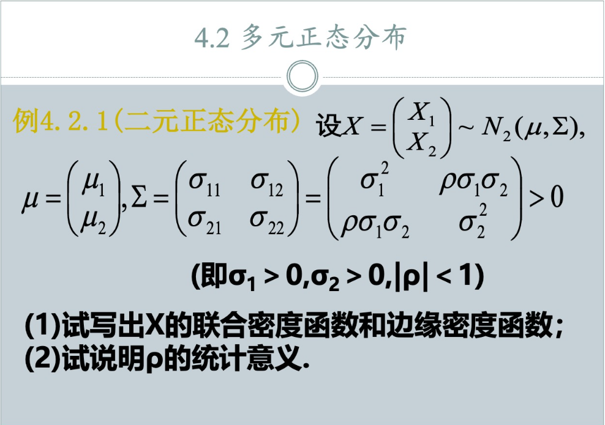

**题目**：
设 `X = (X₁, X₂) ~ N₂(μ, Σ)`，其中 `μ` 和 `Σ` 已给出。
(1) 试写出X的联合密度函数和边缘密度函数；
(2) 试说明ρ的统计意义。

---

| 特征                          | 联合分布 (Joint Distribution)                                | 边缘分布 (Marginal Distribution)                             | 条件分布 (Conditional Distribution)                          |
| :---------------------------- | :----------------------------------------------------------- | :----------------------------------------------------------- | :----------------------------------------------------------- |
| **核心问题**                  | “身高 **和** 体重 **同时** 发生的概率是怎样的？”             | “如果我们 **完全不管** 体重，只看 **身高** 的整体分布是怎样的？” | “**已知** 身高是170cm，在这种 **情况下**，体重的分布是怎样的？” |
| **描述对象**                  | 描述 **所有变量作为一个整体** 的行为。                       | 描述 **某一个变量** 的个体行为，忽略其他变量。               | 描述在 **某个变量取特定值** 的前提下，**另一个变量** 的行为。 |
| **变量数量**                  | 涉及 **多个** 变量 ($X_1, X_2, \dots$)。                     | 只涉及 **一个** 变量 ($X_1$)。                               | 涉及 **一个** 变量，但其分布依赖于另一个变量的给定值 ($X_2 | X_1=x_1$)。 |
| **数学记号**                  | $f(x_1, x_2)$                                                | $f(x_1)$ 或 $f(x_2)$                                         | $f(x_2 | x_1)$ 或 $f(x_1 | x_2)$                             |
| **直观类比 (班级学生花名册)** | **整个花名册表格**，包含“身高”和“体重”两列，我们同时关注每一行的数据。 | **只看“身高”那一列**，并根据这一列画出全班的身高直方图，完全不看体重列。 | **筛选花名册**：先找出所有身高为170cm的学生，然后对 **这个筛选出的小组** 的体重画直方图。 |
| **3D概率山丘模型**            | **整座3D山丘本身**。山丘在任意点的高度代表该点的联合概率密度。 | **山丘的投影/影子**。把山丘向身高轴“压扁”，得到的2D钟形曲线就是身高的边缘分布。 | **山丘的垂直切片**。用一把刀在“身高=170cm”处垂直切下，切面形成的曲线就是条件分布。 |
| **如何得到**                  | 这是**最基础、最完整**的分布信息。                           | 对联合分布**积分掉**另一个变量。  $f(x_1) = \int f(x_1, x_2) dx_2$ | 联合分布**除以**你所知道的那个变量的边缘分布。  $f(x_2|x_1) = \frac{f(x_1, x_2)}{f(x_1)}$ |
| **一句话总结**                | **完整的全局图景**                                           | **某个维度的宏观概览**                                       | **基于已知信息的局部特写**                                   |

### 假设看了上一章，已经懂了如何推导公式

### **解答：二元正态分布的联合与边缘密度函数**

#### **第一步：直接写出边缘密度函数**

多元正态分布有一个非常优美的性质：它的任意一个分量的边缘分布都是一元正态分布。

对于题目中的二元正态随机向量 `X = (X₁, X₂) ~ N₂(μ, Σ)`，我们可以直接从均值向量 `μ` 和协方差矩阵 `Σ` 中读取每个分量的参数：

*   对于 `X₁`：均值为 `μ₁`，方差为 `σ₁₁ = σ₁²`。
*   对于 `X₂`：均值为 `μ₂`，方差为 `σ₂₂ = σ₂²`。

因此，我们可以直接写出它们各自的边缘密度函数：

*   **X₁的边缘密度函数** `f(x₁)`，服从 `N(μ₁, σ₁²)`:
    $$
    f(x_1) = \frac{1}{\sqrt{2\pi}\sigma_1} \exp\left\{ -\frac{(x_1 - \mu_1)^2}{2\sigma_1^2} \right\}
    $$

*   **X₂的边缘密度函数** `f(x₂)`，服从 `N(μ₂, σ₂²)`:
    $$
    f(x_2) = \frac{1}{\sqrt{2\pi}\sigma_2} \exp\left\{ -\frac{(x_2 - \mu_2)^2}{2\sigma_2^2} \right\}
    $$

#### **第二步：回顾多元正态分布的通用矩阵公式**

现在，我们来推导联合密度函数。我们从 p 维正态分布的通用矩阵定义开始：
$$
f(\mathbf{x}) = \frac{1}{(2\pi)^{p/2} |\Sigma|^{1/2}} \exp\left[ -\frac{1}{2} (\mathbf{x} - \boldsymbol{\mu})^T \Sigma^{-1} (\mathbf{x} - \boldsymbol{\mu}) \right]
$$
对于我们的**二元**正态分布，`p=2`，向量和矩阵具体为：
*   $\mathbf{x} = \begin{pmatrix} x_1 \\ x_2 \end{pmatrix}$
*   $\boldsymbol{\mu} = \begin{pmatrix} \mu_1 \\ \mu_2 \end{pmatrix}$
*   $\Sigma = \begin{pmatrix} \sigma_1^2 & \rho\sigma_1\sigma_2 \\ \rho\sigma_1\sigma_2 & \sigma_2^2 \end{pmatrix}$

为了将这个通用公式展开，我们需要计算两个关键部分：**行列式 `|Σ|`** 和 **逆矩阵 `Σ⁻¹`**。

#### **第三步：计算 `|Σ|` 和 `Σ⁻¹` (展开矩阵)**

1.  **计算行列式 `|Σ|`**:
    $$
    |\Sigma| = (\sigma_1^2)(\sigma_2^2) - (\rho\sigma_1\sigma_2)(\rho\sigma_1\sigma_2) = \sigma_1^2\sigma_2^2 - \rho^2\sigma_1^2\sigma_2^2
    $$
    提取公因式，得到：
    $$
    |\Sigma| = \sigma_1^2\sigma_2^2(1-\rho^2)
    $$

2.  **计算逆矩阵 `Σ⁻¹`**:
    对于一个2x2矩阵 $A = \begin{pmatrix} a & b \\ c & d \end{pmatrix}$，其逆矩阵为 $A^{-1} = \frac{1}{ad-bc} \begin{pmatrix} d & -b \\ -c & a \end{pmatrix}$。
    将此公式应用于 `Σ`：
    $$
    \Sigma^{-1} = \frac{1}{\sigma_1^2\sigma_2^2(1-\rho^2)} \begin{pmatrix} \sigma_2^2 & -\rho\sigma_1\sigma_2 \\ -\rho\sigma_1\sigma_2 & \sigma_1^2 \end{pmatrix}
    $$
    为了简化，我们可以将分母中的 `σ₁²σ₂²` 乘入矩阵内部：
    $$
    \Sigma^{-1} = \frac{1}{1-\rho^2} \begin{pmatrix} \frac{\sigma_2^2}{\sigma_1^2\sigma_2^2} & \frac{-\rho\sigma_1\sigma_2}{\sigma_1^2\sigma_2^2} \\ \frac{-\rho\sigma_1\sigma_2}{\sigma_1^2\sigma_2^2} & \frac{\sigma_1^2}{\sigma_1^2\sigma_2^2} \end{pmatrix} = \frac{1}{1-\rho^2} \begin{pmatrix} \frac{1}{\sigma_1^2} & \frac{-\rho}{\sigma_1\sigma_2} \\ \frac{-\rho}{\sigma_1\sigma_2} & \frac{1}{\sigma_2^2} \end{pmatrix}
    $$

#### **第四步：代入并展开，得到最终的联合密度函数**

现在，我们将计算出的 `|Σ|` 和 `Σ⁻¹` 代回通用的矩阵公式中。

1.  **处理系数部分**:
    $$
    \frac{1}{(2\pi)^{2/2} |\Sigma|^{1/2}} = \frac{1}{2\pi \sqrt{\sigma_1^2\sigma_2^2(1-\rho^2)}} = \frac{1}{2\pi\sigma_1\sigma_2\sqrt{1-\rho^2}}
    $$

2.  **处理指数部分 `exp[...]`**:
    指数的核心是二次型 $(\mathbf{x} - \boldsymbol{\mu})' \Sigma^{-1} (\mathbf{x} - \boldsymbol{\mu})$。我们来展开它：
    $$
    \begin{pmatrix} x_1-\mu_1 & x_2-\mu_2 \end{pmatrix} \left[ \frac{1}{1-\rho^2} \begin{pmatrix} \frac{1}{\sigma_1^2} & \frac{-\rho}{\sigma_1\sigma_2} \\ \frac{-\rho}{\sigma_1\sigma_2} & \frac{1}{\sigma_2^2} \end{pmatrix} \right] \begin{pmatrix} x_1-\mu_1 \\ x_2-\mu_2 \end{pmatrix}
    $$
    将常数 `1/(1-ρ²)` 提到最前面，先计算矩阵乘法。
    $$
    = \frac{1}{1-\rho^2} \left[ \left(\frac{x_1-\mu_1}{\sigma_1}\right)^2 - 2\rho\frac{(x_1-\mu_1)(x_2-\mu_2)}{\sigma_1\sigma_2} + \left(\frac{x_2-\mu_2}{\sigma_2}\right)^2 \right]
    $$
    
3.  **组合成最终函数**:
    将系数和指数部分组合起来，并代入 `exp[-1/2 * ...]` 中，我们得到最终的联合密度函数：
    $$
    f(x_1, x_2) = \frac{1}{2\pi\sigma_1\sigma_2\sqrt{1-\rho^2}} \exp\left\{ -\frac{1}{2(1-\rho^2)} \left[ \left(\frac{x_1-\mu_1}{\sigma_1}\right)^2 - 2\rho\left(\frac{x_1-\mu_1}{\sigma_1}\right)\left(\frac{x_2-\mu_2}{\sigma_2}\right) + \left(\frac{x_2-\mu_2}{\sigma_2}\right)^2 \right] \right\}
    $$

这个过程展示了如何从一个简洁的、适用于任何维度的矩阵公式，通过具体的代数运算，推导出我们熟悉的二元正态分布的展开式。

#### (2) 说明ρ的统计意义

**ρ 是随机变量 `X₁` 和 `X₂` 之间的线性相关系数 (Linear Correlation Coefficient)。**

它的统计意义如下：

1.  **度量线性关系强度和方向**:
    *   `ρ` 的值域为 `[-1, 1]`。
    *   当 `ρ > 0` 时，`X₁` 和 `X₂` 呈**正相关**。一个变量增大时，另一个变量也倾向于增大。
    *   当 `ρ < 0` 时，`X₁` 和 `X₂` 呈**负相关**。一个变量增大时，另一个变量倾向于减小。
    *   当 `ρ = 0` 时，`X₁` 和 `X₂` **线性不相关**。
    *   `|ρ|` 的绝对值越接近1，表示两个变量之间的线性关系越强。`|ρ| = 1` 意味着它们之间是完全的线性关系。

2.  **在正态分布下的特殊意义**:
    对于**一般的**随机变量，`ρ = 0`（不相关）**不一定**意味着两个变量是**独立**的。
    但是，对于**二元正态分布**的变量 `X₁` 和 `X₂`，这是一个非常特殊的性质：
    **`ρ = 0` (不相关) 与 `X₁` 和 `X₂` 相互独立是等价的。**
    这意味着，如果两个正态分布的变量没有线性关系，那它们就没有任何关系，是完全独立的。这极大地简化了统计分析。

#### (3)条件分布

 $f(x_2|x_1) = \frac{f(x_1, x_2)}{f(x_1)}$

不再赘述。

---
## 题解：题型：求多元正态分布线性变换之后的分布

### 题型：多元正态分布线性变换之后的分布

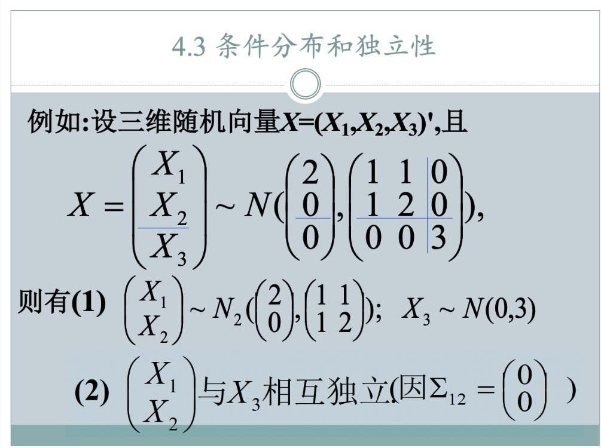

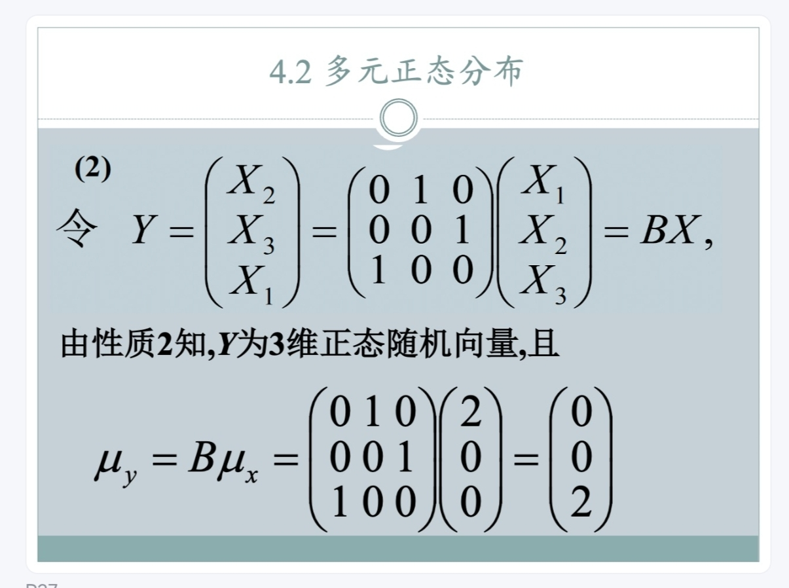

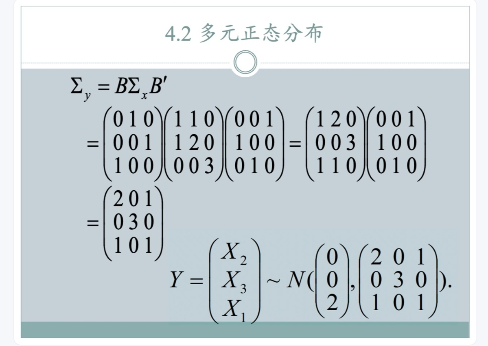

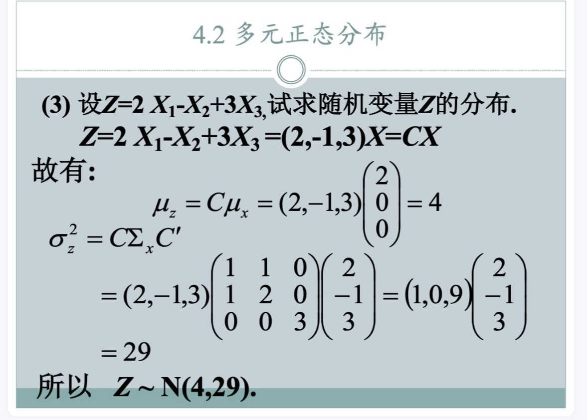

### 题目

设三维随机向量 $\mathbf{X}=(X_1,X_2,X_3)'$ 服从多元正态分布 $N\left(\begin{pmatrix} 2 \\ 0 \\ 0 \end{pmatrix}, \begin{pmatrix} 1 & 1 & 0 \\ 1 & 2 & 0 \\ 0 & 0 & 3 \end{pmatrix}\right)$。

试求：

1.  $X_1$ 的分布以及 $\begin{pmatrix} X_2 \\ X_3 \end{pmatrix}$ 的分布。
2.  令 $\mathbf{Y}=\begin{pmatrix} X_2 \\ X_3 \\ X_1 \end{pmatrix}$，求 $\mathbf{Y}$ 的分布。
3.  设 $Z = 2X_1 - X_2 + 3X_3$，求随机变量 $Z$ 的分布。

### 解答

#### 第一问：求 $X_1$ 的分布以及 $\begin{pmatrix} X_2 \\ X_3 \end{pmatrix}$ 的分布

根据多元正态分布的性质，如果一个随机向量服从多元正态分布，那么其任何子向量也服从多元正态分布。

对于 $X_1$，它是 $\mathbf{X}$ 的第一个分量。
其均值是 $\mathbf{\mu}_{\mathbf{X}}$ 的第一个分量，即 $\mu_{X_1} = 2$。
其方差是 $\mathbf{\Sigma}_{\mathbf{X}}$ 的 (1,1) 位置元素，即 $\sigma^2_{X_1} = 1$。
所以，$X_1 \sim N(2, 1)$。

对于 $\begin{pmatrix} X_2 \\ X_3 \end{pmatrix}$，它是 $\mathbf{X}$ 的后两个分量。
其均值向量是 $\mathbf{\mu}_{\mathbf{X}}$ 的后两个分量，即 $\begin{pmatrix} \mu_{X_2} \\ \mu_{X_3} \end{pmatrix} = \begin{pmatrix} 0 \\ 0 \end{pmatrix}$。
其协方差矩阵是 $\mathbf{\Sigma}_{\mathbf{X}}$ 对应的子矩阵，即取第2、3行和第2、3列构成的矩阵：
$\begin{pmatrix} \sigma^2_{X_2} & \text{Cov}(X_2, X_3) \\ \text{Cov}(X_3, X_2) & \sigma^2_{X_3} \end{pmatrix} = \begin{pmatrix} 2 & 0 \\ 0 & 3 \end{pmatrix}$。
所以，$\begin{pmatrix} X_2 \\ X_3 \end{pmatrix} \sim N_2\left(\begin{pmatrix} 0 \\ 0 \end{pmatrix}, \begin{pmatrix} 2 & 0 \\ 0 & 3 \end{pmatrix}\right)$。

#### 第二问：求 $\mathbf{Y}=\begin{pmatrix} X_2 \\ X_3 \\ X_1 \end{pmatrix}$ 的分布

令 $\mathbf{Y} = B\mathbf{X}$，其中 $B$ 是一个置换矩阵，用于重新排列 $\mathbf{X}$ 的分量。
要得到 $\begin{pmatrix} X_2 \\ X_3 \\ X_1 \end{pmatrix}$，我们需要：
第一行选取 $X_2$ (对应 $\mathbf{X}$ 的第二列)
第二行选取 $X_3$ (对应 $\mathbf{X}$ 的第三列)
第三行选取 $X_1$ (对应 $\mathbf{X}$ 的第一列)
所以矩阵 $B$ 为：
$B = \begin{pmatrix} 0 & 1 & 0 \\ 0 & 0 & 1 \\ 1 & 0 & 0 \end{pmatrix}$

根据线性变换的性质，如果 $\mathbf{X} \sim N(\mathbf{\mu}_{\mathbf{X}}, \mathbf{\Sigma}_{\mathbf{X}})$，那么 $\mathbf{Y} = B\mathbf{X} \sim N(B\mathbf{\mu}_{\mathbf{X}}, B\mathbf{\Sigma}_{\mathbf{X}}B')$。

首先计算 $\mathbf{\mu}_{\mathbf{Y}} = B\mathbf{\mu}_{\mathbf{X}}$：
$\mathbf{\mu}_{\mathbf{Y}} = \begin{pmatrix} 0 & 1 & 0 \\ 0 & 0 & 1 \\ 1 & 0 & 0 \end{pmatrix} \begin{pmatrix} 2 \\ 0 \\ 0 \end{pmatrix} = \begin{pmatrix} 0 \cdot 2 + 1 \cdot 0 + 0 \cdot 0 \\ 0 \cdot 2 + 0 \cdot 0 + 1 \cdot 0 \\ 1 \cdot 2 + 0 \cdot 0 + 0 \cdot 0 \end{pmatrix} = \begin{pmatrix} 0 \\ 0 \\ 2 \end{pmatrix}$

接下来计算 $\mathbf{\Sigma}_{\mathbf{Y}} = B\mathbf{\Sigma}_{\mathbf{X}}B'$：
$B\mathbf{\Sigma}_{\mathbf{X}} = \begin{pmatrix} 0 & 1 & 0 \\ 0 & 0 & 1 \\ 1 & 0 & 0 \end{pmatrix} \begin{pmatrix} 1 & 1 & 0 \\ 1 & 2 & 0 \\ 0 & 0 & 3 \end{pmatrix} = \begin{pmatrix} 1 & 2 & 0 \\ 0 & 0 & 3 \\ 1 & 1 & 0 \end{pmatrix}$

$B' = \begin{pmatrix} 0 & 0 & 1 \\ 1 & 0 & 0 \\ 0 & 1 & 0 \end{pmatrix}$

$\mathbf{\Sigma}_{\mathbf{Y}} = (B\mathbf{\Sigma}_{\mathbf{X}})B' = \begin{pmatrix} 1 & 2 & 0 \\ 0 & 0 & 3 \\ 1 & 1 & 0 \end{pmatrix} \begin{pmatrix} 0 & 0 & 1 \\ 1 & 0 & 0 \\ 0 & 1 & 0 \end{pmatrix} = \begin{pmatrix} 1 \cdot 0 + 2 \cdot 1 + 0 \cdot 0 & 1 \cdot 0 + 2 \cdot 0 + 0 \cdot 1 & 1 \cdot 1 + 2 \cdot 0 + 0 \cdot 0 \\ 0 \cdot 0 + 0 \cdot 1 + 3 \cdot 0 & 0 \cdot 0 + 0 \cdot 0 + 3 \cdot 1 & 0 \cdot 1 + 0 \cdot 0 + 3 \cdot 0 \\ 1 \cdot 0 + 1 \cdot 1 + 0 \cdot 0 & 1 \cdot 0 + 1 \cdot 0 + 0 \cdot 1 & 1 \cdot 1 + 1 \cdot 0 + 0 \cdot 0 \end{pmatrix} = \begin{pmatrix} 2 & 0 & 1 \\ 0 & 3 & 0 \\ 1 & 0 & 1 \end{pmatrix}$

所以，$\mathbf{Y} = \begin{pmatrix} X_2 \\ X_3 \\ X_1 \end{pmatrix} \sim N\left(\begin{pmatrix} 0 \\ 0 \\ 2 \end{pmatrix}, \begin{pmatrix} 2 & 0 & 1 \\ 0 & 3 & 0 \\ 1 & 0 & 1 \end{pmatrix}\right)$。

#### 第三问：求 $Z = 2X_1 - X_2 + 3X_3$ 的分布

令 $Z = C\mathbf{X}$，其中 $C = (2, -1, 3)$。

根据线性变换的性质，如果 $\mathbf{X} \sim N(\mathbf{\mu}_{\mathbf{X}}, \mathbf{\Sigma}_{\mathbf{X}})$，那么 $Z = C\mathbf{X} \sim N(C\mathbf{\mu}_{\mathbf{X}}, C\mathbf{\Sigma}_{\mathbf{X}}C')$.

首先计算均值 $\mu_Z = C\mathbf{\mu}_{\mathbf{X}}$：
$\mu_Z = (2, -1, 3) \begin{pmatrix} 2 \\ 0 \\ 0 \end{pmatrix} = 2 \cdot 2 + (-1) \cdot 0 + 3 \cdot 0 = 4$

接下来计算方差 $\sigma^2_Z = C\mathbf{\Sigma}_{\mathbf{X}}C'$：
$C\mathbf{\Sigma}_{\mathbf{X}} = (2, -1, 3) \begin{pmatrix} 1 & 1 & 0 \\ 1 & 2 & 0 \\ 0 & 0 & 3 \end{pmatrix} = (2 \cdot 1 + (-1) \cdot 1 + 3 \cdot 0, \quad 2 \cdot 1 + (-1) \cdot 2 + 3 \cdot 0, \quad 2 \cdot 0 + (-1) \cdot 0 + 3 \cdot 3)$
$= (2 - 1 + 0, \quad 2 - 2 + 0, \quad 0 + 0 + 9)$
$= (1, 0, 9)$

$\sigma^2_Z = (1, 0, 9) \begin{pmatrix} 2 \\ -1 \\ 3 \end{pmatrix} = 1 \cdot 2 + 0 \cdot (-1) + 9 \cdot 3 = 2 + 0 + 27 = 29$

所以，$Z \sim N(4, 29)$。

---
## 题解：题型：用LU分解来解方程

### 题型：求矩阵的LU分解来解方程

---
## 题解：题型：QR分解(Householder法)

### 题型：QR分解(Householder法)

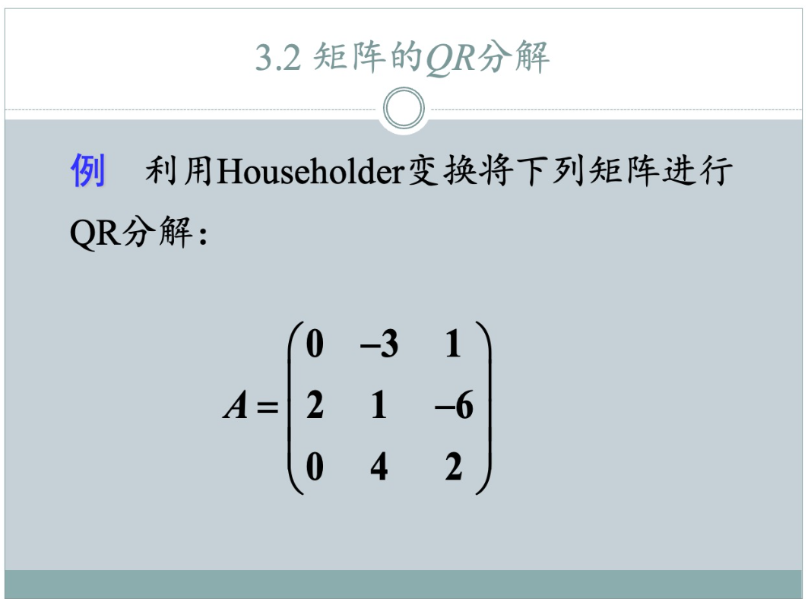

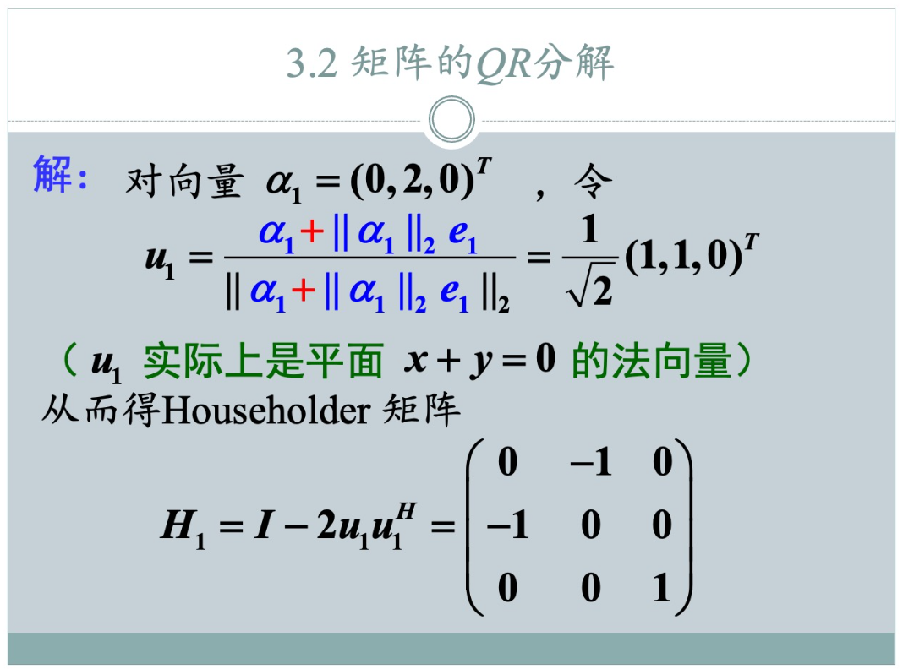

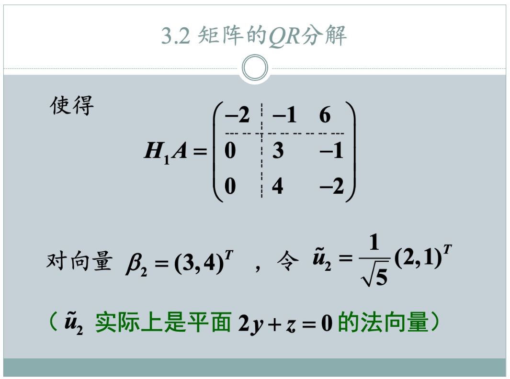

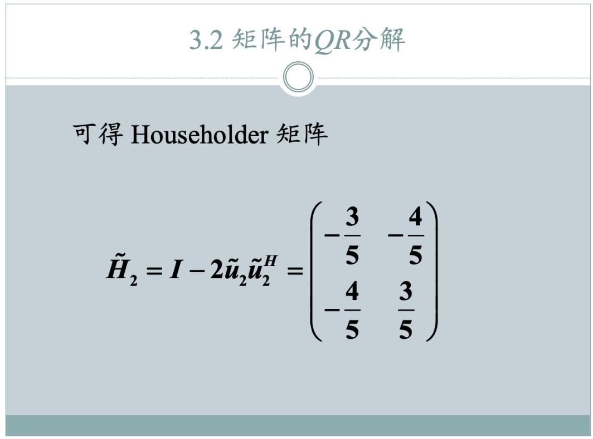

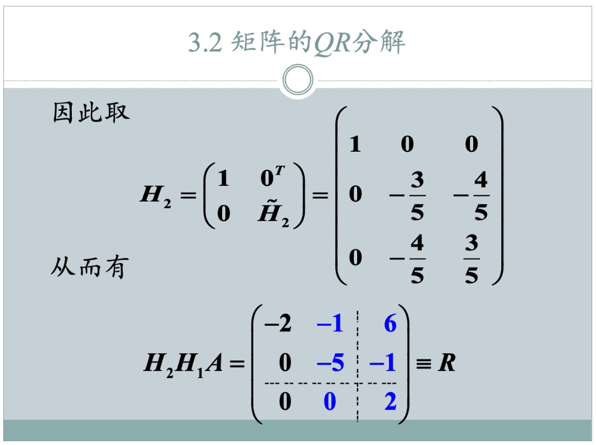

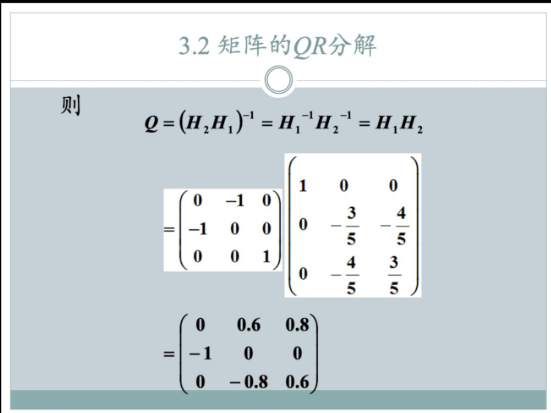

**问题：** 对矩阵 $A = \begin{pmatrix} 0 & -3 & 1 \\ 2 & 1 & -6 \\ 0 & 4 & 2 \end{pmatrix}$ 进行 QR 分解。

QR 分解的目标是将矩阵 A 分解为 $A = QR$，其中 Q 是正交矩阵，R 是上三角矩阵。Householder 变换是一种常用的方法，它通过一系列正交变换将 A 逐步转化为上三角矩阵 R。

---
## 题解：选看：Householder性质证明和几何理解

###　**选看：QR分解知识回顾与几何理解**

[TOC]

###　**Householder反射性质的几何证明**

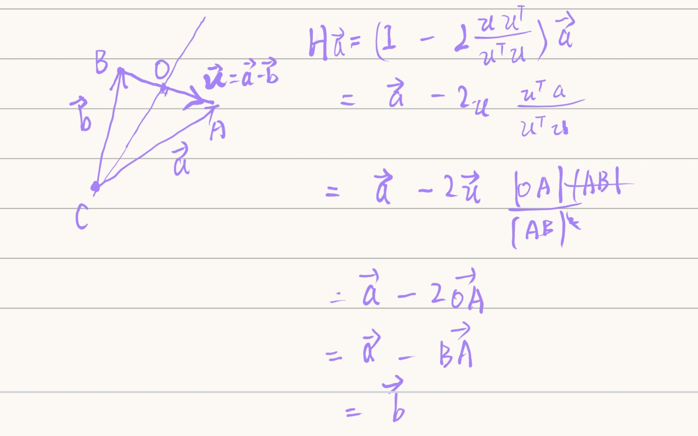

考虑欧几里得空间中的三个点 $C, A, B$。
*   设点 $C$ 为原点。
*   将向量 $\vec{CA}$ 记作 $a$。
*   将向量 $\vec{CB}$ 记作 $b$。

我们证明 Householder 变换能够将 $a$ 反射到 $b$ 的前提是 $\|a\| = \|b\|$，即 $CA = CB$。
在这种情况下，三角形 $CAB$ 是一个以 $C$ 为顶点的等腰三角形。

Householder 向量定义为 $u = a - b = \vec{CA} - \vec{CB} = \vec{BA}$。
（这个向量是从点 $B$ 指向点 $A$ 的，其长度为 $BA$。）

**作辅助线与投影：**

1.  在线段 $AB$ 上作一条通过原点 $C$ 的垂线。
2.  设垂足为 $O$。
3.  由于 $\triangle CAB$ 是等腰三角形 ($CA=CB$)，$CO$ 是底边 $AB$ 上的高。因此，点 $O$ 也是线段 $AB$ 的中点，且 $CO \perp AB$。
4.  向量 $\vec{CO}$ 是与 $u = \vec{BA}$ 正交的分量。

**Householder 变换的几何解释与修正的投影描述：**

Householder 矩阵定义为 $H = I - 2 \frac{u u^T}{u^T u}$。我们目标是证明 $Ha = b$。
$Ha = a - 2 \frac{u (u^T a)}{u^T u}$

我们关注项 $\frac{u (u^T a)}{u^T u}$，这是向量 $a$ 在向量 $u$ 方向上的投影向量 $P_u a$。
现在，我们用线段长度来精确计算 $u^T a$ 和 $u^T u$。

1.  **计算 $u^T u$：**
    $u^T u = \|u\|^2$。
    在我们的几何构造中，$u = \vec{BA}$。所以，**$u^T u = (BA)^2$**。

2.  **计算 $u^T a$：**
    $u^T a = \vec{BA} \cdot \vec{CA}$。
    根据点积的几何定义，$\vec{BA} \cdot \vec{CA} = \|\vec{BA}\| \|\vec{CA}\| \cos(\angle CBA \text{ 的外角})$。
    或者更直接地，我们可以将 $\vec{CA}$ 在 $\vec{BA}$ 方向上的投影理解为 $\vec{OA}$。
    在你的几何图中，**点 $O$ 是垂足**。
    所以，向量 $a = \vec{CA}$ 在向量 $u = \vec{BA}$ 方向上的投影长度是 $OA$。
    因为 $\vec{BA}$ 和 $\vec{OA}$ 方向一致，所以 $u^T a = \vec{BA} \cdot \vec{CA} = (BA) \cdot (OA)$。
    所以，**$u^T a = BA \cdot OA$**。

3.  **计算投影向量 $P_u a$：**
    $P_u a = \frac{u (u^T a)}{u^T u} = \frac{\vec{BA} (BA \cdot OA)}{(BA)^2} = \frac{OA}{BA} \vec{BA}$。
    由于 $\vec{BA}$ 是从 $B$ 到 $A$ 的向量，其长度是 $BA$。
    向量 $\frac{OA}{BA} \vec{BA}$ 表示一个与 $\vec{BA}$ 同方向，长度为 $\frac{OA}{BA} \cdot BA = OA$ 的向量。
    这个向量就是 $\vec{OA}$。
    所以，**$P_u a = \vec{OA}$**。

**代回 Householder 变换：**

$Ha = a - 2 P_u a$
$Ha = \vec{CA} - 2 \vec{OA}$

**向量代数运算完成证明：**

由于点 $O$ 是线段 $AB$ 的中点，且 $\vec{OA}$ 和 $\vec{BA}$ 方向相同，所以 $\vec{BA} = 2 \vec{OA}$。
将 $2 \vec{OA}$ 替换为 $\vec{BA}$：
$Ha = \vec{CA} - \vec{BA}$

根据向量减法的法则：
$\vec{CA} - \vec{BA} = \vec{CA} + (-\vec{BA}) = \vec{CA} + \vec{AB}$

根据向量加法的三角形法则：
$\vec{CA} + \vec{AB} = \vec{CB}$

而 $\vec{CB}$ 正是向量 $b$。

因此，**$Ha = b$**。

### **对于任意向量 $v$（非零），先归一化为 $u = v/\|v\|$ 后求 $H = I - 2uu^T$，还是直接用 $H = I - 2 \frac{v v^T}{v^T v}$ 求 $H$，结果相同？**

**证明：**
我们设任意非零向量为 $v$。其模长为 $\|v\|$。
归一化后的单位向量为 $u = \frac{v}{\|v\|}$。

**方法一：先归一化，再求 $H$**
按照这种方法，Householder 矩阵 $H_u$ 的定义是基于单位向量 $u$：
$H_u = I - 2uu^T$

现在，我们将 $u = \frac{v}{\|v\|}$ 代入这个表达式：
$H_u = I - 2 \left( \frac{v}{\|v\|} \right) \left( \frac{v}{\|v\|} \right)^T$
$H_u = I - 2 \frac{v v^T}{\|v\|^2}$

因为对于实数向量，$\|v\|^2 = v^T v$。
所以：
$H_u = I - 2 \frac{v v^T}{v^T v}$

**方法二：直接用 $v$ 求 $H$**
按照这种方法，Householder 矩阵 $H_v$ 的定义是基于任意非零向量 $v$：
$H_v = I - 2 \frac{v v^T}{v^T v}$

**比较两种方法：**
我们看到 $H_u = I - 2 \frac{v v^T}{v^T v}$ 和 $H_v = I - 2 \frac{v v^T}{v^T v}$。
因此，$H_u = H_v$。

**结论：**
对于任意非零向量 $v$，先归一化后求 Householder 矩阵，还是直接用其原始形式求 Householder 矩阵，结果是完全相同的。这是因为分母上的 $\|v\|^2$ (即 $v^T v$) 恰好抵消了分子中 $v v^T$ 的标量因子 $\|v\|^2$。
实际计算中，通常使用 $H = I - 2 \frac{v v^T}{v^T v}$，因为这样可以避免先计算平方根来归一化向量 $v$，从而提高效率并减少数值误差。

###　**Householder 矩阵性质的证明**

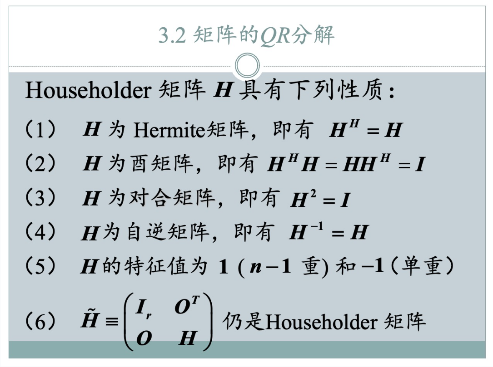

**预备说明：**

我们将使用 Householder 矩阵的简化形式进行证明，即假设 Householder 向量 $u$ 已经归一化为单位向量。
此时 Householder 矩阵 $H$ 的定义为：
$H = I - 2uu^T$
其中 $u$ 是一个列向量，且 $\|u\| = 1$，即 $u^T u = 1$。

**关于实数矩阵的符号约定：**
Householder 变换在实数和复数域都适用。对于实数矩阵，其所有元素都是实数，因此：

*   复共轭操作没有作用，即 $a^* = a$。
*   共轭转置 $A^H$ 等同于普通转置 $A^T$。
鉴于PPT 例子是实数矩阵，我们将在证明中使用 $H^T$ 来表示转置，并强调其在实数域中的等价性。

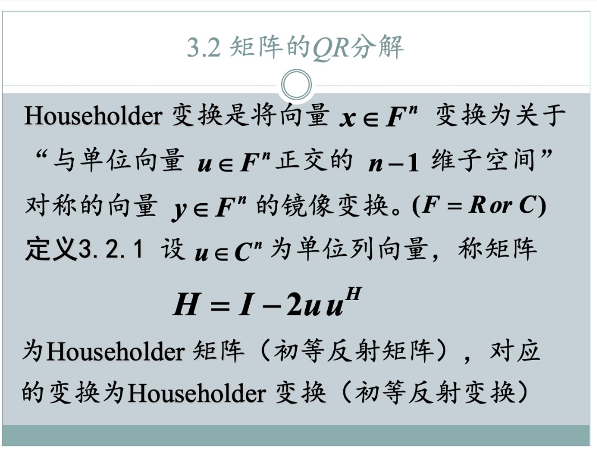

---

### **性质 (1) $H$ 为 Hermite 矩阵，即 $H^H = H$**

**证明：**
我们使用 $H^T$ 来代替 $H^H$ 进行证明，这对于实数 Householder 矩阵是等价的。
目标是证明 $H^T = H$。

$H^T = (I - 2uu^T)^T$
根据转置的性质 $(A-B)^T = A^T - B^T$ 和 $(AB)^T = B^T A^T$：
$H^T = I^T - (2uu^T)^T$
$H^T = I - 2(uu^T)^T$
$H^T = I - 2(u^T)^T u^T$
$H^T = I - 2uu^T$

所以，$H^T = H$。
对于实数矩阵，这等价于 $H^H = H$。因此，$H$ 是 Hermite 矩阵（对于实数矩阵，Hermite 矩阵就是对称矩阵）。

---

### **性质 (2) $H$ 为酉矩阵，即 $H^H H = HH^H = I$**

**证明：**
由于我们已经证明了 $H^H = H$ (对于实数矩阵，即 $H^T = H$)，所以我们只需要证明 $H H = I$ (或者 $H^T H = I$ 或 $H H^T = I$) 即可。
目标是证明 $H H = I$。

$H H = (I - 2uu^T)(I - 2uu^T)$
展开乘积：
$H H = I \cdot I - I \cdot (2uu^T) - (2uu^T) \cdot I + (2uu^T)(2uu^T)$
$H H = I - 2uu^T - 2uu^T + 4(uu^T)(uu^T)$
$H H = I - 4uu^T + 4u(u^T u)u^T$

现在，利用 Householder 向量 $u$ 是单位向量的条件：$u^T u = 1$。
$H H = I - 4uu^T + 4u(1)u^T$
$H H = I - 4uu^T + 4uu^T$
$H H = I$

所以，$H H = I$。结合性质 (1) $H^H = H$，这自然意味着 $H^H H = H H^H = I$。
因此，$H$ 是酉矩阵（对于实数矩阵，酉矩阵就是正交矩阵）。

---

### **性质 (3) $H$ 为对合矩阵，即 $H^2 = I$**

**证明：**
这个性质直接从性质 (2) 的证明中得出。
在证明性质 (2) 时，我们直接计算了 $H H = H^2$ 并得到了 $H^2 = I$。
因此，$H$ 是对合矩阵。

---

### **性质 (4) $H$ 为自逆矩阵，即 $H^{-1} = H$**

**证明：**
从性质 (3) 我们知道 $H^2 = I$。
我们将等式两边同时乘以 $H^{-1}$：
$H^{-1} (H^2) = H^{-1} I$
$H^{-1} H H = H^{-1}$
$I H = H^{-1}$
$H = H^{-1}$

因此，$H$ 是自逆矩阵。

---

### **性质 (5) $H$ 的特征值为 $1$ ($n-1$ 重) 和 $-1$ (单重)**

**证明思路 (非严格代数证明，侧重几何理解)：**

1.  **特征值 $-1$：**
    我们知道 Householder 变换的目的是将一个向量 $x$ 反射到 $y = s e_1$ 的形式。而 $H = I - 2 P_u$ 可以理解为：
    $H x = x - 2 (\text{x 在 u 上的投影})$。
    如果 $x$ 与 Householder 向量 $u$ 平行（即 $x = c u$ for some scalar $c \neq 0$），那么 $x$ 在 $u$ 上的投影就是它本身 $x$。
    所以，$H x = x - 2x = -x$。
    即 $H(cu) = - (cu)$。
    这意味着 $u$ 是特征值 $-1$ 对应的特征向量。
    由于 $u$ 是一个非零向量，所以 $-1$ 至少是一个单重特征值。

2.  **特征值 $1$：**
    如果 $x$ 与 Householder 向量 $u$ 正交，那么 $x$ 在 $u$ 上的投影为 $0$。
    所以，$H x = x - 2(0) = x$。
    即 $H x = x$。
    这意味着任何与 $u$ 正交的向量都是特征值 $1$ 对应的特征向量。
    Householder 向量 $u$ 所在的向量空间是 1 维的。与 $u$ 正交的向量组成的子空间（即 $u$ 的正交补空间 $u^\perp$）的维度是 $n-1$ (如果矩阵是 $n \times n$ 的)。
    这个 $n-1$ 维空间中的所有向量都是特征值 $1$ 对应的特征向量。
    因此，$1$ 是 $n-1$ 重特征值。

**总结：** Householder 矩阵 $H$ 将与 $u$ 平行的向量翻转方向（乘以 $-1$），而将与 $u$ 正交的所有向量保持不变（乘以 $1$）。所以特征值是 $1$ (在 $u^\perp$ 空间中) 和 $-1$ (在 $u$ 的方向上)。

---

### **性质 (6) $\tilde{H} = \begin{pmatrix} I_r & O^T \\ O & H \end{pmatrix}$ 仍是 Householder 矩阵**

**证明：**

这个性质 (6) 是在 Householder QR 分解迭代过程中使用的关键构造，它描述了如何将一个作用于子空间的 Householder 矩阵嵌入到更大的矩阵中。

假设 $H$ 是一个 $k \times k$ 的 Householder 矩阵，由 $u \in \mathbb{R}^k$ (单位向量) 构造得到：$H = I_k - 2uu^T$。
我们构造一个更大的矩阵 $\tilde{H}$ 如下：
$\tilde{H} = \begin{pmatrix} I_r & O \\ O & H \end{pmatrix}$
其中 $I_r$ 是 $r \times r$ 的单位矩阵，$O$ 代表适当维度的零矩阵。
$\tilde{H}$ 是一个 $(r+k) \times (r+k)$ 的矩阵。

要证明 $\tilde{H}$ 仍然是 Householder 矩阵，我们需要找到一个合适的 Householder 向量 $\tilde{u}$，使得 $\tilde{H} = I_{r+k} - 2\tilde{u}\tilde{u}^T$。

构造 $\tilde{u}$ 如下：
$\tilde{u} = \begin{pmatrix} \mathbf{0}_r \\ u \end{pmatrix}$
其中 $\mathbf{0}_r$ 是 $r$ 维的零向量。

首先，检查 $\tilde{u}$ 是否是单位向量：
$\tilde{u}^T \tilde{u} = \begin{pmatrix} \mathbf{0}_r^T & u^T \end{pmatrix} \begin{pmatrix} \mathbf{0}_r \\ u \end{pmatrix} = \mathbf{0}_r^T \mathbf{0}_r + u^T u = 0 + 1 = 1$。
所以 $\tilde{u}$ 是一个单位向量。

现在，我们计算 $I_{r+k} - 2\tilde{u}\tilde{u}^T$：
$I_{r+k} - 2\tilde{u}\tilde{u}^T = \begin{pmatrix} I_r & O \\ O & I_k \end{pmatrix} - 2 \begin{pmatrix} \mathbf{0}_r \\ u \end{pmatrix} \begin{pmatrix} \mathbf{0}_r^T & u^T \end{pmatrix}$
$= \begin{pmatrix} I_r & O \\ O & I_k \end{pmatrix} - 2 \begin{pmatrix} \mathbf{0}_r \mathbf{0}_r^T & \mathbf{0}_r u^T \\ u \mathbf{0}_r^T & u u^T \end{pmatrix}$
$= \begin{pmatrix} I_r & O \\ O & I_k \end{pmatrix} - 2 \begin{pmatrix} O & O \\ O & u u^T \end{pmatrix}$
$= \begin{pmatrix} I_r - 2O & O - 2O \\ O - 2O & I_k - 2u u^T \end{pmatrix}$
$= \begin{pmatrix} I_r & O \\ O & I_k - 2u u^T \end{pmatrix}$
$= \begin{pmatrix} I_r & O \\ O & H \end{pmatrix}$

这正是 $\tilde{H}$。
因此，$\tilde{H}$ 仍然是一个 Householder 矩阵。

---

### **矩阵乘法性质：$\begin{pmatrix} I_r & O \\ O & H \end{pmatrix} \begin{pmatrix} A & B \\ O & C \end{pmatrix} = \begin{pmatrix} A & B \\ O & HC \end{pmatrix}$，这是 QR 分解可以对子矩阵操作的前提**

**证明：**
设 $\tilde{H} = \begin{pmatrix} I_r & O \\ O & H \end{pmatrix}$ 和 $M = \begin{pmatrix} A & B \\ O & C \end{pmatrix}$。
这里：

*   $I_r$ 是 $r \times r$ 单位矩阵。
*   $O$ 代表适当维度的零矩阵。
*   $H$ 是一个 Householder 矩阵，维度与 $C$ 匹配。
*   $A, B, C$ 是原始矩阵的分块。

我们执行矩阵乘法：
$\tilde{H} M = \begin{pmatrix} I_r & O \\ O & H \end{pmatrix} \begin{pmatrix} A & B \\ O & C \end{pmatrix}$

根据分块矩阵乘法的规则，结果矩阵的每个块由对应分块的乘积和求和得到：

*   **左上角块：** $I_r A + O \cdot O = A$
*   **右上角块：** $I_r B + O C = B$
*   **左下角块：** $O A + H O = O$
*   **右下角块：** $O B + H C = HC$

将这些结果组合起来，得到：
$\tilde{H} M = \begin{pmatrix} A & B \\ O & HC \end{pmatrix}$

**结论：**
这个矩阵乘法性质完美地解释了为什么 Householder QR 分解可以对子矩阵进行操作而不影响已经处理过的部分。
当我们将一个 Householder 矩阵 $H$ 嵌入到 $\tilde{H}$ 中，作用于一个已经部分上三角化的矩阵 $M$ (即 $M$ 的左下角是零矩阵 $O$) 时：

*   左上角的 $I_r$ 确保了已经形成的 $A$ (上三角部分) 保持不变。
*   右上角的 $O$ 确保了 $B$ 部分只受 $I_r$ 影响，即 $B$ 保持不变。
*   左下角的 $O$ 确保了 $O$ 仍然是 $O$，即已经清零的下三角部分保持为零。
*   只有右下角的子矩阵 $C$ 受到 $H$ 的作用，变为 $HC$。

这正是 Householder QR 分解迭代过程的精髓：每一步只处理一个未被清零的子矩阵的第一列，使其变为零，而不会破坏之前步骤已经获得的零元素。

### **Q 矩阵的性质：$Q = H_1 H_2 \dots H_p$**

**a) $Q$ 是一个 Householder 矩阵吗？**

**答案：不，一般情况下 $Q$ 不是一个 Householder 矩阵。**

*   **Householder 矩阵的定义：** 一个 Householder 矩阵 $H$ 具有形式 $I - 2uu^T$，它代表一个简单的反射操作（沿一个超平面反射）。
*   **$Q$ 的性质：** $Q = H_1 H_2 \dots H_p$ 是**多个 Householder 矩阵的乘积**。
    *   如果 $p=1$ (只需要一步 Householder 变换)，那么 $Q = H_1$，此时 $Q$ 是一个 Householder 矩阵。
    *   如果 $p>1$，那么 $Q$ 是多个反射的组合。多个反射的组合通常不再是一个简单的反射。它通常是一个更复杂的**旋转**（如果反射次数是偶数）或者**旋转加反射**（如果反射次数是奇数）。

**例如：**
例子中 $Q = H_1 H_2$。$H_1$ 是一个反射，$H_2$ 是另一个反射。它们的乘积是一个更复杂的正交变换，通常是一个旋转（因为两次反射）。它不再满足 $I - 2uu^T$ 的简单形式。

**b) $Q$ 一定可逆吗？**

**答案：是的，Q 矩阵一定可逆。**

*   **Householder 矩阵的性质：** 我们在前面的证明中已经看到，每个 Householder 矩阵 $H_i$ 都是**可逆的**，并且它还是**自逆的** ($H_i^{-1} = H_i$)。
*   **矩阵乘积的逆：** 如果多个矩阵都是可逆的，那么它们的乘积也是可逆的。
    $(H_1 H_2 \dots H_p)^{-1} = H_p^{-1} \dots H_2^{-1} H_1^{-1}$。
    由于每个 $H_i$ 都是可逆的，所以它们的乘积 $Q$ 必然是可逆的。

**c) 如何求 $Q$ 的逆？**

**答案：$Q^{-1}$ 可以通过 Householder 矩阵的逆来求得，且由于 Householder 矩阵的特殊性质，它非常简单。**

我们有 $Q = H_1 H_2 \dots H_p$。
那么 $Q^{-1} = (H_1 H_2 \dots H_p)^{-1}$。

根据矩阵乘积的逆的性质：
$Q^{-1} = H_p^{-1} H_{p-1}^{-1} \dots H_2^{-1} H_1^{-1}$

由于每个 Householder 矩阵 $H_i$ 都是**自逆的**（即 $H_i^{-1} = H_i$）：
$Q^{-1} = H_p H_{p-1} \dots H_2 H_1$

**结论：$Q$ 的逆矩阵就是所有 Householder 矩阵以相反的顺序相乘。**
对于实数矩阵，Householder 矩阵还是对称的 ($H_i^T = H_i$)，所以 $H_i^{-1} = H_i^T = H_i$。
因此 $Q^{-1} = H_p^T H_{p-1}^T \dots H_1^T = (H_1 H_2 \dots H_p)^T = Q^T$。
这再次确认了 $Q$ 是一个**正交矩阵**的性质 ($Q^{-1} = Q^T$)。

当然可以！这是一个非常重要的性质，也是 QR 分解中 Q 矩阵的关键所在。

###　**证明：为什么若干 Householder 矩阵的乘积是正交矩阵？**

**前提：**

1.  Householder 矩阵 $H_k$ 是正交矩阵。
    *   我们已经在性质 (2) 中证明了，对于实数矩阵，$H_k^T H_k = I$ 且 $H_k H_k^T = I$。

**证明：**
设 $Q$ 是 $p$ 个 Householder 矩阵的乘积：
$Q = H_1 H_2 \dots H_p$

要证明 $Q$ 是正交矩阵，我们需要证明 $Q^T Q = I$。

首先，计算 $Q^T$：
$Q^T = (H_1 H_2 \dots H_p)^T$
根据矩阵乘积转置的性质 $(AB)^T = B^T A^T$（即转置的顺序是逆序的）：
$Q^T = H_p^T H_{p-1}^T \dots H_2^T H_1^T$

现在，计算 $Q^T Q$：
$Q^T Q = (H_p^T H_{p-1}^T \dots H_2^T H_1^T) (H_1 H_2 \dots H_p)$

由于 Householder 矩阵 $H_k$ 是正交矩阵，所以 $H_k^T H_k = I$。
我们从中间向外逐步简化这个乘积：

$Q^T Q = H_p^T H_{p-1}^T \dots H_2^T (H_1^T H_1) H_2 \dots H_p$
$Q^T Q = H_p^T H_{p-1}^T \dots H_2^T (I) H_2 \dots H_p$
$Q^T Q = H_p^T H_{p-1}^T \dots (H_2^T H_2) \dots H_p$
$Q^T Q = H_p^T H_{p-1}^T \dots (I) \dots H_p$

重复这个过程，直到所有的 $H_k^T H_k$ 都变为 $I$：
$Q^T Q = H_p^T (H_{p-1}^T H_{p-1}) \dots H_p$ (这里漏写了一些项，展开更清晰)

$Q^T Q = H_p^T H_{p-1}^T \dots H_2^T H_1^T H_1 H_2 \dots H_p$
$Q^T Q = H_p^T H_{p-1}^T \dots H_2^T (I) H_2 \dots H_p$
$Q^T Q = H_p^T H_{p-1}^T \dots (H_2^T H_2) \dots H_p$
$Q^T Q = H_p^T H_{p-1}^T \dots (I) \dots H_p$
$Q^T Q = H_p^T (H_{p-1}^T H_{p-1}) H_p$
$Q^T Q = H_p^T (I) H_p$
$Q^T Q = H_p^T H_p$
$Q^T Q = I$

**结论：**
由于 $Q^T Q = I$，因此 $Q$ 是一个正交矩阵。

**核心原理：**
这个证明的关键在于：
1.  Householder 矩阵本身是正交矩阵。(性质 2)
2.  两个或多个正交矩阵的乘积仍然是正交矩阵。 这是一个更一般的定理，而上述证明就是这个定理的一个具体应用。

所以，QR 分解得到的 $Q$ 矩阵必然是正交矩阵，这正是我们所期望的，因为它使得 QR 分解在数值计算中具有优越的稳定性。

### **正交矩阵的定义和性质：**

一个 $m \times m$ 的方阵 $Q$ 被称为**正交矩阵**，如果它满足以下任何一个等价条件：

1.  **$Q^T Q = I$** (这通常是正式的定义)。
2.  **$Q Q^T = I$** (与第一个条件等价)。
3.  **$Q^{-1} = Q^T$** (逆矩阵等于转置)。
4.  **$Q$ 的列向量是标准正交基**：它们都是单位向量，并且相互正交。
5.  **$Q$ 的行向量是标准正交基**：它们都是单位向量，并且相互正交。

你的观察正是第 (5) 条性质。

**为什么 $Q^T Q = I$ 蕴含行向量是标准正交基？**

让我们来简单推导一下。
设 $Q = \begin{pmatrix} \mathbf{q}_1^T \\ \mathbf{q}_2^T \\ \vdots \\ \mathbf{q}_m^T \end{pmatrix}$，其中 $\mathbf{q}_i^T$ 是 $Q$ 的第 $i$ 行向量。
那么 $Q^T = \begin{pmatrix} \mathbf{q}_1 & \mathbf{q}_2 & \dots & \mathbf{q}_m \end{pmatrix}$。

计算 $Q Q^T$:
$Q Q^T = \begin{pmatrix} \mathbf{q}_1^T \\ \mathbf{q}_2^T \\ \vdots \\ \mathbf{q}_m^T \end{pmatrix} \begin{pmatrix} \mathbf{q}_1 & \mathbf{q}_2 & \dots & \mathbf{q}_m \end{pmatrix} = \begin{pmatrix} \mathbf{q}_1^T \mathbf{q}_1 & \mathbf{q}_1^T \mathbf{q}_2 & \dots & \mathbf{q}_1^T \mathbf{q}_m \\ \mathbf{q}_2^T \mathbf{q}_1 & \mathbf{q}_2^T \mathbf{q}_2 & \dots & \mathbf{q}_2^T \mathbf{q}_m \\ \vdots & \vdots & \ddots & \vdots \\ \mathbf{q}_m^T \mathbf{q}_1 & \mathbf{q}_m^T \mathbf{q}_2 & \dots & \mathbf{q}_m^T \mathbf{q}_m \end{pmatrix}$

如果 $Q Q^T = I = \begin{pmatrix} 1 & 0 & \dots & 0 \\ 0 & 1 & \dots & 0 \\ \vdots & \vdots & \ddots & \vdots \\ 0 & 0 & \dots & 1 \end{pmatrix}$，那么：

*   对角线上的元素 $\mathbf{q}_i^T \mathbf{q}_i = 1$。由于 $\mathbf{q}_i^T \mathbf{q}_i = \|\mathbf{q}_i\|^2$，这意味着 $\|\mathbf{q}_i\|^2 = 1$，所以 $\|\mathbf{q}_i\| = 1$ (行向量是单位向量)。
*   非对角线上的元素 $\mathbf{q}_i^T \mathbf{q}_j = 0$ (当 $i \neq j$ 时)。这意味着行向量 $\mathbf{q}_i$ 和 $\mathbf{q}_j$ 的内积为 0，所以它们相互正交。

所以，一个矩阵是正交矩阵，当且仅当它的行向量（或列向量）构成一个标准正交基。

### **QR 分解的流程 (基于 Householder 变换)**

QR 分解的目标是将任意一个 $m \times n$ 矩阵 $A$ 分解为 $A = QR$ 的形式，其中 $Q$ 是一个 $m \times m$ 的正交矩阵，$R$ 是一个 $m \times n$ 的上三角矩阵。Householder 变换提供了一种高效且数值稳定的方法来实现这一分解。

**核心思想：通过一系列 Householder 反射，逐步将矩阵 $A$ 转化为上三角矩阵 $R$。**

**关键任务：构造一系列 Householder 矩阵 $H_p \dots H_2 H_1$ (其中 $p = \min(m-1, n)$)，使得 $H_p \dots H_2 H_1 A = R$。**

**步骤分解：**

1.  **第一步：处理矩阵 $A$ 的第一列**
    *   首先，我们关注矩阵 $A$ 的第一列向量 $\mathbf{a}_1$。
    *   我们的目标是找到一个 Householder 矩阵 $H_1$，使得 $H_1 \mathbf{a}_1$ 成为一个除了第一个元素外，其他所有元素都为零的向量 $\tilde{\mathbf{a}}_1 = (\pm \|\mathbf{a}_1\|, 0, \dots, 0)^T$。
    *   由于 Householder 变换是一种反射，它保持向量的模长不变，因此 $\tilde{\mathbf{a}}_1$ 的模长必须等于 $\mathbf{a}_1$ 的模长。为了数值稳定性，通常选择 $\tilde{\mathbf{a}}_1$ 的第一个非零元素的符号与 $\mathbf{a}_1$ 的第一个元素符号相反（如果 $\mathbf{a}_1$ 的第一个元素为零，则任意选择）。
    *   有了 $\mathbf{a}_1$ 和目标向量 $\tilde{\mathbf{a}}_1$，我们就可以构造 Householder 向量 $v_1 = \mathbf{a}_1 - \tilde{\mathbf{a}}_1$。
    *   使用 $v_1$ (或其归一化形式 $u_1$)，我们便能构建出第一个 Householder 矩阵 $H_1 = I - 2 \frac{v_1 v_1^T}{v_1^T v_1}$。
    *   将 $H_1$ 作用于 $A$：$H_1 A = H_1 \begin{pmatrix} \mathbf{a}_1 & \mathbf{a}_2 & \dots \end{pmatrix} = \begin{pmatrix} H_1 \mathbf{a}_1 & H_1 \mathbf{a}_2 & \dots \end{pmatrix} = \begin{pmatrix} \tilde{\mathbf{a}}_1 & H_1 \mathbf{a}_2 & \dots \end{pmatrix}$。
    *   此时，$H_1 A$ 的第一列已经成功地被清零（除了第一个元素）。

2.  **迭代处理子矩阵：**
    *   在第一步之后，矩阵 $A$ 已经部分上三角化，其形式为 $\begin{pmatrix} \tilde{\mathbf{a}}_{1,1} & \mathbf{b}^T \\ \mathbf{0} & A' \end{pmatrix}$，其中 $A'$ 是一个 $(m-1) \times (n-1)$ 的子矩阵。
    *   接下来，我们利用 Householder QR 分解的关键性质：一个嵌入式 Householder 矩阵 $\tilde{H}_k = \begin{pmatrix} I_r & O \\ O & H_k \end{pmatrix}$ 作用于分块矩阵 $\begin{pmatrix} A_{top} & B_{top} \\ O & C_{bottom} \end{pmatrix}$ 时，结果是 $\begin{pmatrix} A_{top} & B_{top} \\ O & H_k C_{bottom} \end{pmatrix}$。
    *   这意味着我们可以在不影响已经清零的第一列的情况下，将 Householder 变换应用于子矩阵 $A'$。
    *   我们将对 $A'$ 的第一列重复上述构造 Householder 矩阵的过程，得到 $H_2'$。然后构造一个更大的嵌入式 Householder 矩阵 $H_2 = \begin{pmatrix} 1 & O \\ O & H_2' \end{pmatrix}$ (对于 $3 \times 3$ 矩阵的第二步，这里的 $I_r$ 是 1)。
    *   $H_2 (H_1 A)$ 将在不影响第一列的基础上，清零第二列的下半部分。

3.  **最终得到上三角矩阵 $R$：**
    *   重复上述迭代过程 $\min(m-1, n)$ 次，每一步构造一个 Householder 矩阵 $H_k$ (嵌入到更大的单位矩阵中)，并将其左乘到当前矩阵上。
    *   最终，我们将得到一个上三角矩阵 $R = H_p \dots H_2 H_1 A$。

**构造正交矩阵 $Q$：**

1.  我们得到的关系是 $(H_p \dots H_2 H_1) A = R$。
2.  为了得到标准形式 $A = QR$，我们需要将 Householder 矩阵的乘积移到 $R$ 的右边。
3.  定义 $Q_{prod} = H_p \dots H_2 H_1$。
4.  那么 $A = Q_{prod}^{-1} R$。
5.  由于每个 Householder 矩阵 $H_i$ 都具有**自逆性质** ($H_i^{-1} = H_i$)，因此 $Q_{prod}^{-1} = H_1^{-1} H_2^{-1} \dots H_p^{-1} = H_1 H_2 \dots H_p$。
6.  我们将 $Q = H_1 H_2 \dots H_p$ 定义为最终的正交矩阵。
7.  因此，我们成功地将 $A$ 分解为 $A = QR$。

这个过程高效、稳定，是数值线性代数中 QR 分解的基石。

---
## 题解：题型：Householder变换将a向量反射到b

### 题型：Householder变换将a向量反射到b

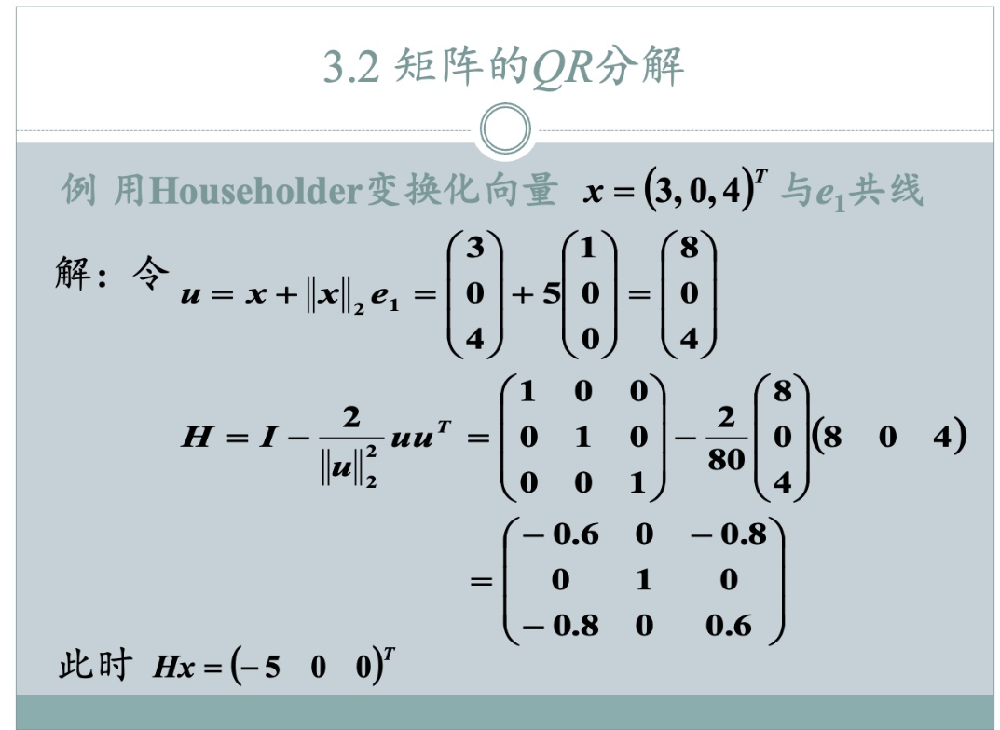

**题目：** 用 Householder 变换，将向量 $x = (3, 0, 4)^T$ 与 $e_1$ 共线。

**步骤：**

1.  **确定原始向量 $x$：**
    $x = \begin{pmatrix} 3 \\ 0 \\ 4 \end{pmatrix}$

2.  **计算 $x$ 的模长 $\|x\|$：**
    $\|x\| = \sqrt{3^2 + 0^2 + 4^2} = \sqrt{9 + 0 + 16} = \sqrt{25} = 5$

3.  **确定目标向量 $\tilde{x}$：**
    目标是使变换后的向量与 $e_1 = \begin{pmatrix} 1 \\ 0 \\ 0 \end{pmatrix}$ 共线，且模长与 $x$ 相同。
    根据 Householder 变换的常见约定，为了数值稳定性，我们通常选择目标向量 $\tilde{x}$ 的第一个分量的符号与原始向量 $x$ 的第一个分量的符号相反（除非原始向量第一个分量为零）。
    $x_1 = 3 > 0$，所以我们选择目标向量的第一个分量为负值。
    所以，目标向量 $\tilde{x} = -\|x\| e_1 = -5 \begin{pmatrix} 1 \\ 0 \\ 0 \end{pmatrix} = \begin{pmatrix} -5 \\ 0 \\ 0 \end{pmatrix}$。

4.  **构造 Householder 向量 $v$：**
    我们使用 $v = x - \tilde{x}$ 来构造 Householder 向量。
    $v = \begin{pmatrix} 3 \\ 0 \\ 4 \end{pmatrix} - \begin{pmatrix} -5 \\ 0 \\ 0 \end{pmatrix} = \begin{pmatrix} 3 - (-5) \\ 0 - 0 \\ 4 - 0 \end{pmatrix} = \begin{pmatrix} 8 \\ 0 \\ 4 \end{pmatrix}$

5.  **计算 $v^T v$ (即 $\|v\|^2$)：**
    $v^T v = 8^2 + 0^2 + 4^2 = 64 + 0 + 16 = 80$

6.  **构造 Householder 矩阵 $H$：**
    $H = I - 2 \frac{v v^T}{v^T v}$
    $H = \begin{pmatrix} 1 & 0 & 0 \\ 0 & 1 & 0 \\ 0 & 0 & 1 \end{pmatrix} - 2 \frac{1}{80} \begin{pmatrix} 8 \\ 0 \\ 4 \end{pmatrix} \begin{pmatrix} 8 & 0 & 4 \end{pmatrix}$
    $H = \begin{pmatrix} 1 & 0 & 0 \\ 0 & 1 & 0 \\ 0 & 0 & 1 \end{pmatrix} - \frac{2}{80} \begin{pmatrix} 8 \cdot 8 & 8 \cdot 0 & 8 \cdot 4 \\ 0 \cdot 8 & 0 \cdot 0 & 0 \cdot 4 \\ 4 \cdot 8 & 4 \cdot 0 & 4 \cdot 4 \end{pmatrix}$
    $H = \begin{pmatrix} 1 & 0 & 0 \\ 0 & 1 & 0 \\ 0 & 0 & 1 \end{pmatrix} - \frac{1}{40} \begin{pmatrix} 64 & 0 & 32 \\ 0 & 0 & 0 \\ 32 & 0 & 16 \end{pmatrix}$
    $H = \begin{pmatrix} 1 & 0 & 0 \\ 0 & 1 & 0 \\ 0 & 0 & 1 \end{pmatrix} - \begin{pmatrix} 64/40 & 0 & 32/40 \\ 0 & 0 & 0 \\ 32/40 & 0 & 16/40 \end{pmatrix}$
    $H = \begin{pmatrix} 1 & 0 & 0 \\ 0 & 1 & 0 \\ 0 & 0 & 1 \end{pmatrix} - \begin{pmatrix} 1.6 & 0 & 0.8 \\ 0 & 0 & 0 \\ 0.8 & 0 & 0.4 \end{pmatrix}$
    $H = \begin{pmatrix} 1 - 1.6 & 0 & 0 - 0.8 \\ 0 & 1 & 0 \\ 0 - 0.8 & 0 & 1 - 0.4 \end{pmatrix}$
    $H = \begin{pmatrix} -0.6 & 0 & -0.8 \\ 0 & 1 & 0 \\ -0.8 & 0 & 0.6 \end{pmatrix}$

7.  **验证 $Hx$：**
    $Hx = \begin{pmatrix} -0.6 & 0 & -0.8 \\ 0 & 1 & 0 \\ -0.8 & 0 & 0.6 \end{pmatrix} \begin{pmatrix} 3 \\ 0 \\ 4 \end{pmatrix}$
    $Hx = \begin{pmatrix} (-0.6)(3) + 0(0) + (-0.8)(4) \\ 0(3) + 1(0) + 0(4) \\ (-0.8)(3) + 0(0) + 0.6(4) \end{pmatrix}$
    $Hx = \begin{pmatrix} -1.8 - 3.2 \\ 0 \\ -2.4 + 2.4 \end{pmatrix}$
    $Hx = \begin{pmatrix} -5.0 \\ 0 \\ 0 \end{pmatrix}$

**结果：**

使用我们的方法，得到的 Householder 矩阵是 $H = \begin{pmatrix} -0.6 & 0 & -0.8 \\ 0 & 1 & 0 \\ -0.8 & 0 & 0.6 \end{pmatrix}$，并且 $Hx = \begin{pmatrix} -5 \\ 0 \\ 0 \end{pmatrix}$。

**与 PPT 结果的比较：**

*   **Householder 矩阵 $H$：** 我们的结果与 PPT 中计算出的 $H$ 完全一致。
*   **变换后的向量 $Hx$：** 我们的结果是 $\begin{pmatrix} -5 \\ 0 \\ 0 \end{pmatrix}$，这也与 PPT 中给出的结果完全一致。

---
## 题解：选看：SVD分解的证明和几何理解

# SVD分解的真正理解：几何角度

## 旋转矩阵(LLM旋转位置编码的前提)

### 教学演示：用复数推导逆时针旋转矩阵

#### 1. 建立对应关系

首先，我们把二维平面上的一个点（向量）$\begin{bmatrix} x \\ y \end{bmatrix}$ 对应到一个复数 $z$：

$$z = x + i y$$

*   实部 $x$ 对应横坐标。
*   虚部 $y$ 对应纵坐标。

#### 2. 旋转的神器：欧拉公式

在复数世界里，**旋转**就是一个乘法操作。
如果要把复数 $z$ 逆时针旋转 $\theta$ 度，只需要乘以一个模长为 1 的复数 $e^{i\theta}$。

根据欧拉公式：
$$e^{i\theta} = \cos\theta + i\sin\theta$$

所以，新的位置 $z'$ 等于旧的位置 $z$ 乘以旋转因子：
$$z' = z \cdot (\cos\theta + i\sin\theta)$$

#### 3. 展开计算（代数推导）

现在我们把 $z = x + iy$ 代进去，看看结果是什么。
设旋转后的新坐标为 $(x', y')$，即 $z' = x' + i y'$。

$$x' + i y' = (x + i y) (\cos\theta + i\sin\theta)$$

我们要做的就是简单的多项式乘法（注意 **$i^2 = -1$**）：

$$
\begin{aligned}
x' + i y' &= x\cos\theta + i x\sin\theta + i y\cos\theta + i^2 y\sin\theta \\
&= x\cos\theta + i x\sin\theta + i y\cos\theta - y\sin\theta
\end{aligned}
$$

现在，我们将**实部**（不带 $i$ 的）和**虚部**（带 $i$ 的）分开归类：

*   **实部 (Real Part):** $x' = x\cos\theta - y\sin\theta$
*   **虚部 (Imaginary Part):** $y' = x\sin\theta + y\cos\theta$

#### 4. 变回矩阵形式

看上面的实部和虚部方程组：
$$
\begin{cases}
x' = (\cos\theta) \cdot x + (-\sin\theta) \cdot y \\
y' = (\sin\theta) \cdot x + (\cos\theta) \cdot y
\end{cases}
$$

在线性代数中，这正是矩阵乘法的定义。我们将系数提取出来，写成矩阵形式：

$$
\begin{bmatrix} x' \\ y' \end{bmatrix} = \begin{bmatrix} \cos\theta & -\sin\theta \\ \sin\theta & \cos\theta \end{bmatrix} \begin{bmatrix} x \\ y \end{bmatrix}
$$

**证毕！**

中间那个矩阵：
$$R = \begin{bmatrix} \cos\theta & -\sin\theta \\ \sin\theta & \cos\theta \end{bmatrix}$$
正是标准的**逆时针旋转矩阵**。

### 第一部分：基础工具箱（公式速查）

在二维平面中，线性变换主要靠这两种基本矩阵：

#### 1. 旋转矩阵 (Rotation Matrix)

如果你想把一个点 $(x, y)$ 绕原点旋转 $\theta$ 度，你需要乘以旋转矩阵 $R$。

*   **逆时针旋转 (Counter-Clockwise, CCW) $\theta$ 度：**
    $$R_{ccw} = \begin{bmatrix} \cos\theta & -\sin\theta \\ \sin\theta & \cos\theta \end{bmatrix}$$

#### 2. 缩放矩阵 (Scaling Matrix)

如果你想把 $x$ 坐标拉伸 $s_x$ 倍，把 $y$ 坐标拉伸 $s_y$ 倍，你需要乘以对角矩阵 $S$。

$$S = \begin{bmatrix} s_x & 0 \\ 0 & s_y \end{bmatrix}$$

## 从圆到椭圆——看见矩阵背后的SVD

#### 1. 核心直觉

在线性代数中，一个 $2 \times 2$ 的矩阵 $A$ 就像是一个“变形金刚”。
如果你在纸上画一个**单位圆**（半径为1的圆），然后用矩阵 $A$ 去乘以圆上的每一个点，这个圆通常会变成一个**椭圆**。

SVD 分解公式 $A = U \Sigma V^T$ 告诉了我们这个变形动作是分三步完成的：

1.  **$V^T$ (旋转/反射)**：先把圆旋转一下，让圆上某些特殊的点对准坐标轴。
2.  **$\Sigma$ (缩放)**：沿着坐标轴方向拉伸或压缩。**这一步把圆变成了椭圆**。
3.  **$U$ (旋转/反射)**：把这个刚刚生成的椭圆再旋转到最终的位置。

**一句话总结：SVD 告诉了我们这个椭圆的长轴和短轴有多长（$\Sigma$），以及它们指向哪里（$U$）。**

---

#### 2. 动手算一算：一个简单的数值例子

为了看清过程，我们不直接给一个乱七八糟的矩阵 $A$，而是我们**自己构造**一个 $A$，看看它是如何把圆变成椭圆的。

假设我们想制造一个这样的变换：
*   **第一步**：顺时针旋转 $45^\circ$。
*   **第二步**：横向拉长 3 倍，纵向拉长 1 倍。
*   **第三步**：逆时针旋转 $90^\circ$。

根据 SVD 公式 $A = U \Sigma V^T$，我们来定义这三个矩阵。

##### 准备工作（为了计算方便，取 $\frac{1}{\sqrt{2}} \approx 0.7$）

1.  **定义 $V^T$ (初次旋转)**：
    为了方便理解，我们选取一个特殊的向量作为追踪对象。
    假设单位圆上有一个点 $x = \begin{bmatrix} 0.7 \\ 0.7 \end{bmatrix}$ （位于 $45^\circ$ 方向）。
    我们定义 $V^T$ 为顺时针旋转 $45^\circ$ 的矩阵：
    $$V^T = \begin{bmatrix} 0.7 & 0.7 \\ -0.7 & 0.7 \end{bmatrix}$$
    *(注：这是旋转矩阵，正交矩阵)*

2.  **定义 $\Sigma$ (缩放)**：
    奇异值矩阵是对角矩阵。这里 $\sigma_1 = 3$ (长轴)，$\sigma_2 = 1$ (短轴)。
    $$\Sigma = \begin{bmatrix} 3 & 0 \\ 0 & 1 \end{bmatrix}$$

3.  **定义 $U$ (最终旋转)**：
    我们想把拉伸后的图形逆时针旋转 $90^\circ$。
    $$U = \begin{bmatrix} 0 & -1 \\ 1 & 0 \end{bmatrix}$$

---

#### 3. 见证奇迹：追踪一个点的旅程

现在，我们要计算 $Ax$，也就是 $U \Sigma V^T x$。我们将目光死死盯着圆上的那个点 $x = \begin{bmatrix} 0.7 \\ 0.7 \end{bmatrix}$。

**Step 1: $V^T$ 进场（调整姿态）**
$$V^T x = \begin{bmatrix} 0.7 & 0.7 \\ -0.7 & 0.7 \end{bmatrix} \begin{bmatrix} 0.7 \\ 0.7 \end{bmatrix} = \begin{bmatrix} 0.49+0.49 \\ -0.49+0.49 \end{bmatrix} \approx \begin{bmatrix} 1 \\ 0 \end{bmatrix}$$
*   **发生了什么？** 原始向量 $x$ 指向 $45^\circ$。$V^T$ 把它旋转到了 X 轴上 $(1, 0)$。
*   **意义：** $V$ 的列向量（即 $V^T$ 的行）代表了**“圆上哪些方向会被拉伸得最长或最短”**。在这里，它把我们将要拉伸的方向对准了 X 轴。

**Step 2: $\Sigma$ 进场（变形！）**
$$\Sigma (V^T x) = \begin{bmatrix} 3 & 0 \\ 0 & 1 \end{bmatrix} \begin{bmatrix} 1 \\ 0 \end{bmatrix} = \begin{bmatrix} 3 \\ 0 \end{bmatrix}$$
*   **发生了什么？** 单位圆变成了椭圆。原本长度为 1 的向量，现在变成了长度为 3。
*   **意义：** 这里的 **3** 就是最大的奇异值 $\sigma_1$。它决定了椭圆**长半轴的长度**。

**Step 3: $U$ 进场（摆放位置）**
$$U (\Sigma V^T x) = \begin{bmatrix} 0 & -1 \\ 1 & 0 \end{bmatrix} \begin{bmatrix} 3 \\ 0 \end{bmatrix} = \begin{bmatrix} 0 \\ 3 \end{bmatrix}$$

*   **发生了什么？** 这个被拉长的椭圆（目前躺在X轴上），被整体旋转了 $90^\circ$，竖了起来。
*   **意义：** 最终的向量长度依然是 3，但方向变了。$U$ 的列向量决定了椭圆**最终主轴的方向**。

---

#### 4. 总结：SVD 与 椭圆的一一对应

如果有一个矩阵 $A$，它的 SVD 分解是 $A = U \Sigma V^T$，那么 $A$ 作用在单位圆上形成的椭圆具有以下特征：

1.  **椭圆的长短轴长度**：完全由 $\Sigma$ 对角线上的数字（奇异值 $\sigma_1, \sigma_2$）决定。
    *   例子中：长轴半径是 3，短轴半径是 1。
2.  **椭圆长短轴的方向**：完全由矩阵 $U$ 的列向量（$u_1, u_2$）决定。
    *   例子中：最终的长轴沿着 Y 轴方向（因为 $u_1 = [0, 1]^T$），短轴沿着 X 轴方向。
3.  **谁变成了长轴**：圆上原本位于 $V$ 的列向量（$v_1$）方向的点，被变换成了椭圆的长轴端点。

## SVD分解的证明

我们来用纯粹的代数逻辑，不带任何具体数字，来一步步推导出SVD分解的存在性。为了便于理解，我们假设 A 是一个 3x3 的实数矩阵。

**我们的目标**：证明任何 3x3 实矩阵 A 都可以被分解为 $A = U \Sigma V^T$ 的形式，其中：
*   **U** 是一个 3x3 的**正交矩阵** ($U^T U = I$)，它的列向量构成了输出空间的一组标准正交基。
*   **V** 是一个 3x3 的**正交矩阵** ($V^T V = I$)，它的列向量构成了输入空间的一组标准正交基。
*   **Σ** 是一个 3x3 的**对角矩阵**，对角线上的元素 $\sigma_1, \sigma_2, \sigma_3$ 是非负的，并按降序排列，称为**奇异值**。

---

### 第一部分：SVD分解的整体流程（算法视角）

在不知道为什么能这么做之前，我们先描述“怎么做”。这个流程本身就蕴含了证明的思路。

1.  **构造对称矩阵**：计算 $M = A^T A$。这个矩阵 M 是一个 3x3 的实对称矩阵。
2.  **寻找输入空间的基 (V)**：
    *   求解 M 的特征值 $\lambda_1, \lambda_2, \lambda_3$ 和对应的特征向量 $v_1, v_2, v_3$。
    *   因为 M 是实对称矩阵，我们总能找到一组相互**正交**的特征向量。
    *   将这些特征向量单位化，得到一组**标准正交基** $\{v_1, v_2, v_3\}$。
    *   用这些向量作为列，构建正交矩阵 $V = \begin{bmatrix} v_1 & v_2 & v_3 \end{bmatrix}$。
3.  **确定奇异值 (Σ)**：
    *   我们稍后会证明 M 的所有特征值 $\lambda_i$ 都是非负的。
    *   定义奇异值 $\sigma_i = \sqrt{\lambda_i}$。
    *   将它们按从大到小排列，并放在对角矩阵 Σ 的对角线上。
4.  **寻找输出空间的基 (U)**：
    *   对于所有 $\sigma_i > 0$ 的情况，我们定义 $u_i = \frac{1}{\sigma_i} A v_i$。
    *   对于 $\sigma_i=0$ 的情况，对应的 $u_i$ 需要通过其他方法补全，以形成一组完整的标准正交基。
    *   用得到的标准正交基 $\{u_1, u_2, u_3\}$ 作为列，构建正交矩阵 $U = \begin{bmatrix} u_1 & u_2 & u_3 \end{bmatrix}$。
5.  **组合**：最终，我们断言 $A = U \Sigma V^T$。

---

### 第二部分：从实对称矩阵的性质出发进行证明

现在，我们来证明为什么上述流程是可行且正确的。整个证明的核心基石是**实对称矩阵的谱定理 (Spectral Theorem)**。

**谱定理核心内容**：对于任何一个 n×n 的实对称矩阵 M，都存在一个由其特征向量构成的**标准正交基**，并且其所有特征值都是实数。

#### 步骤 1：分析 $A^T A$ 的性质

我们构造的矩阵是 $M = A^T A$。

*   **对称性**： $M^T = (A^T A)^T = A^T (A^T)^T = A^T A = M$。所以 $A^T A$ 是一个实对称矩阵。
*   **特征值的非负性**：这是至关重要的一步。
    *   设 $\lambda$ 是 $A^T A$ 的一个特征值，对应的特征向量为 $v$（$v \neq \mathbf{0}$）。
    *   根据定义，我们有 $(A^T A)v = \lambda v$。
    *   我们用 $v^T$ 左乘这个等式：$v^T (A^T A)v = v^T (\lambda v)$。
    *   左边可以重新组合：$(Av)^T (Av) = ||Av||^2$。
    *   右边可以提出标量 $\lambda$：$\lambda (v^T v) = \lambda ||v||^2$。
    *   所以我们得到：$||Av||^2 = \lambda ||v||^2$。
    *   因为向量的范数平方 $||Av||^2$ 和 $||v||^2$ 都是非负的，且 $v \neq \mathbf{0}$ 意味着 $||v||^2 > 0$，所以我们必须有 $\lambda \ge 0$。
    

**结论**：$A^T A$ 是一个实对称矩阵，且其所有特征值都是非负实数。这就保证了我们可以对特征值开平方得到实数奇异值 $\sigma_i = \sqrt{\lambda_i}$。

#### 步骤 2：构造 V 和 Σ

根据谱定理，因为 $A^T A$ 是实对称的，我们一定可以找到一组**标准正交**的特征向量 $\{v_1, v_2, v_3\}$，它们构成 $\mathbb{R}^3$ 的一组基。我们将它们作为列，构成正交矩阵 $V$。
同时，我们用对应的非负特征值的平方根 $\sigma_i = \sqrt{\lambda_i}$ 构成对角矩阵 $\Sigma$。

#### 步骤 3：构造 U 并证明其正交性

这是证明中最巧妙的部分。我们定义了一组新的向量 $\{u_i\}$，现在需要证明它们也是标准正交的。

*   我们定义 $u_i = \frac{1}{\sigma_i} A v_i$ （暂时只考虑 $\sigma_i > 0$ 的情况）。
*   现在我们来计算任意两个这样的向量 $u_i$ 和 $u_j$ 的点积 $u_i^T u_j$：
    $u_i^T u_j = (\frac{1}{\sigma_i} Av_i)^T (\frac{1}{\sigma_j} Av_j) = \frac{1}{\sigma_i \sigma_j} (v_i^T A^T) (A v_j)$
    $u_i^T u_j = \frac{1}{\sigma_i \sigma_j} v_i^T (A^T A v_j)$

*   我们知道 $v_j$ 是 $A^T A$ 的特征向量，所以 $A^T A v_j = \lambda_j v_j = \sigma_j^2 v_j$。代入上式：
    $u_i^T u_j = \frac{1}{\sigma_i \sigma_j} v_i^T (\sigma_j^2 v_j) = \frac{\sigma_j^2}{\sigma_i \sigma_j} (v_i^T v_j) = \frac{\sigma_j}{\sigma_i} (v_i^T v_j)$

*   现在分情况讨论：
    *   **如果 $i \neq j$**: 因为 $\{v_i\}$ 是一组标准正交基，所以 $v_i^T v_j = 0$。因此，$u_i^T u_j = 0$。这意味着这些 $u$ 向量是相互**正交**的。
    *   **如果 $i = j$**: 因为 $\{v_i\}$ 是单位向量，所以 $v_i^T v_i = 1$。因此，$u_i^T u_i = \frac{\sigma_i}{\sigma_i}(1) = 1$。这意味着每个 $u$ 向量都是**单位向量**。

**结论**：我们通过 $A v_i$ 构造出来的这组向量 $\{u_i\}$ (对应非零奇异值的部分) 自动就是**标准正交**的！

*   **处理零奇异值**：如果存在某个 $\sigma_k = 0$，这意味着 $A^T A v_k = \mathbf{0}$，也意味着 $||Av_k||^2 = 0$，即 $Av_k = \mathbf{0}$。我们已经有了一组标准正交向量 $\{u_i\}$，如果它们不足以张成整个 $\mathbb{R}^3$ 空间，我们可以通过 Gram-Schmidt 等方法，添加新的标准正交向量来补全这组基，形成完整的 $\{u_1, u_2, u_3\}$。然后用它们构建正交矩阵 U。

#### 步骤 4：整合与验证

我们已经建立了关系：
*   $A v_i = \sigma_i u_i$  (对于 $\sigma_i > 0$)
*   $A v_i = \mathbf{0}$ (对于 $\sigma_i = 0$)

我们可以将这两种情况统一写成矩阵形式。考虑整个矩阵 $AV$：
$AV = A \begin{bmatrix} v_1 & v_2 & v_3 \end{bmatrix} = \begin{bmatrix} Av_1 & Av_2 & Av_3 \end{bmatrix}$
$AV = \begin{bmatrix} \sigma_1 u_1 & \sigma_2 u_2 & \dots & \sigma_n u_n \end{bmatrix}$ (*这里 $\sigma_i u_i$ 对于 $\sigma_i=0$ 的情况就是零向量*)

现在我们再看 $U\Sigma$：
$U\Sigma = \begin{bmatrix} u_1 & u_2 & u_3 \end{bmatrix} \begin{pmatrix} \sigma_1 & 0 & 0 \\ 0 & \sigma_2 & 0 \\ 0 & 0 & \sigma_3 \end{pmatrix}$
$U\Sigma = \begin{bmatrix} \sigma_1 u_1 & \sigma_2 u_2 & \sigma_3 u_3 \end{bmatrix}$

比较两边，我们发现 $AV = U\Sigma$。

因为 V 是一个正交矩阵，所以 $V^T = V^{-1}$。我们在等式 $AV = U\Sigma$ 两边同时右乘 $V^T$：
$(AV)V^T = (U\Sigma)V^T$
$A(VV^T) = U\Sigma V^T$
$A I = U\Sigma V^T$
$A = U\Sigma V^T$

证明完毕。我们从“$A^T A$ 是一个实对称矩阵”这一核心事实出发，利用谱定理保证了标准正交基 V 的存在，并推导出了另一组标准正交基 U 的存在，最终构成了SVD分解。

---
## 题解：题型：求多元线性回归

### 题型：求多元线性回归

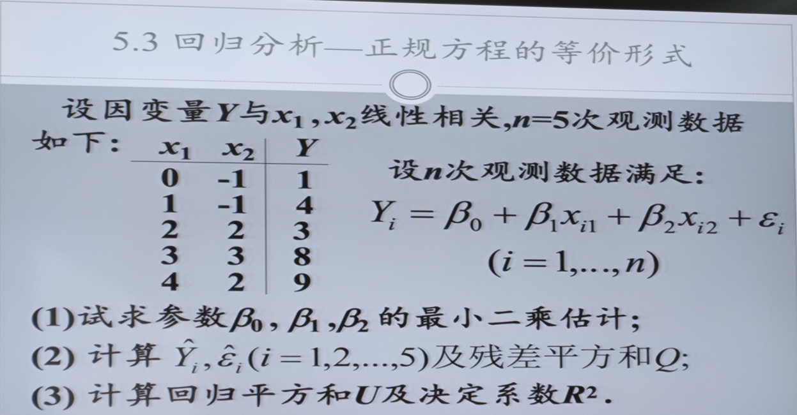

#### 关键词：正规方程，残差平方和，总离差平方和，回归平方和，决定系数

我们需要根据给定的数据，建立回归模型 $Y = \beta_0 + \beta_1 x_1 + \beta_2 x_2 + \varepsilon$。

以下是详细的解题步骤：

### 第一步：整理数据与构建矩阵

首先列出数据矩阵 $X$（注意第一列全为1，对应截距项 $\beta_0$）和观测向量 $Y$。

$$
X = \begin{bmatrix}
1 & 0 & -1 \\
1 & 1 & -1 \\
1 & 2 & 2 \\
1 & 3 & 3 \\
1 & 4 & 2
\end{bmatrix}, \quad
Y = \begin{bmatrix}
1 \\
4 \\
3 \\
8 \\
9
\end{bmatrix}
$$

计算必要的求和统计量：
*   $n = 5$
*   $\sum x_1 = 0+1+2+3+4 = 10$
*   $\sum x_2 = -1-1+2+3+2 = 5$
*   $\sum Y = 1+4+3+8+9 = 25$，则 $\bar{Y} = 5$

---

### (1) 试求参数 $\beta_0, \beta_1, \beta_2$ 的最小二乘估计

利用正规方程（Normal Equations）公式：$\hat{\beta} = (X^T X)^{-1} X^T Y$

**1. 计算 $X^T X$ 矩阵：**

$$
X^T X = \begin{bmatrix}
n & \sum x_1 & \sum x_2 \\
\sum x_1 & \sum x_1^2 & \sum x_1 x_2 \\
\sum x_2 & \sum x_1 x_2 & \sum x_2^2
\end{bmatrix}
$$

*   $\sum x_1^2 = 0 + 1 + 4 + 9 + 16 = 30$
*   $\sum x_2^2 = 1 + 1 + 4 + 9 + 4 = 19$
*   $\sum x_1 x_2 = 0(-1) + 1(-1) + 2(2) + 3(3) + 4(2) = 0 - 1 + 4 + 9 + 8 = 20$

$$
X^T X = \begin{bmatrix}
5 & 10 & 5 \\
10 & 30 & 20 \\
5 & 20 & 19
\end{bmatrix}
$$

**2. 计算 $X^T Y$ 向量：**

$$
X^T Y = \begin{bmatrix}
\sum Y \\
\sum x_1 Y \\
\sum x_2 Y
\end{bmatrix}
$$

*   $\sum Y = 25$
*   $\sum x_1 Y = 0(1) + 1(4) + 2(3) + 3(8) + 4(9) = 0 + 4 + 6 + 24 + 36 = 70$
*   $\sum x_2 Y = -1(1) - 1(4) + 2(3) + 3(8) + 2(9) = -1 - 4 + 6 + 24 + 18 = 43$

$$
X^T Y = \begin{bmatrix}
25 \\
70 \\
43
\end{bmatrix}
$$

**3. 解线性方程组：**
$$
\begin{cases}
5\hat{\beta}_0 + 10\hat{\beta}_1 + 5\hat{\beta}_2 = 25 \quad \cdots(1) \\
10\hat{\beta}_0 + 30\hat{\beta}_1 + 20\hat{\beta}_2 = 70 \quad \cdots(2) \\
5\hat{\beta}_0 + 20\hat{\beta}_1 + 19\hat{\beta}_2 = 43 \quad \cdots(3)
\end{cases}
$$

*   由 (1) 式化简除以 5：$\hat{\beta}_0 + 2\hat{\beta}_1 + \hat{\beta}_2 = 5 \Rightarrow \hat{\beta}_0 = 5 - 2\hat{\beta}_1 - \hat{\beta}_2 \quad \cdots(4)$
*   将 (2) 式减去 2倍的 (1) 式：
    $(10\hat{\beta}_0 + 30\hat{\beta}_1 + 20\hat{\beta}_2) - 2(5\hat{\beta}_0 + 10\hat{\beta}_1 + 5\hat{\beta}_2) = 70 - 50$
    $10\hat{\beta}_1 + 10\hat{\beta}_2 = 20 \Rightarrow \hat{\beta}_1 + \hat{\beta}_2 = 2 \Rightarrow \hat{\beta}_1 = 2 - \hat{\beta}_2 \quad \cdots(5)$
*   将 (3) 式减去 (1) 式：
    $10\hat{\beta}_1 + 14\hat{\beta}_2 = 18 \Rightarrow 5\hat{\beta}_1 + 7\hat{\beta}_2 = 9 \quad \cdots(6)$

将 (5) 代入 (6)：
$5(2 - \hat{\beta}_2) + 7\hat{\beta}_2 = 9$
$10 - 5\hat{\beta}_2 + 7\hat{\beta}_2 = 9$
$2\hat{\beta}_2 = -1 \Rightarrow \mathbf{\hat{\beta}_2 = -0.5}$

求 $\hat{\beta}_1$：
$\hat{\beta}_1 = 2 - (-0.5) \Rightarrow \mathbf{\hat{\beta}_1 = 2.5}$

求 $\hat{\beta}_0$：
$\hat{\beta}_0 = 5 - 2(2.5) - (-0.5) = 5 - 5 + 0.5 \Rightarrow \mathbf{\hat{\beta}_0 = 0.5}$

**结论 (1)：**
参数的最小二乘估计为：
**$\hat{\beta}_0 = 0.5, \quad \hat{\beta}_1 = 2.5, \quad \hat{\beta}_2 = -0.5$**
回归方程为：$\hat{Y} = 0.5 + 2.5x_1 - 0.5x_2$

---

### (2) 计算 $\hat{Y}_i, \hat{\varepsilon}_i$ 及残差平方和 $Q$

利用回归方程 $\hat{Y}_i = 0.5 + 2.5x_{i1} - 0.5x_{i2}$ 进行计算。
残差 $\hat{\varepsilon}_i = Y_i - \hat{Y}_i$。

| $i$  | $x_1$ | $x_2$ | $Y$  | $\hat{Y}$ (计算过程)                   | $\hat{Y}$ (拟合值) | $\hat{\varepsilon}$ (残差) | $\hat{\varepsilon}^2$ |
| :--: | :---: | :---: | :--: | :------------------------------------- | :----------------: | :------------------------: | :-------------------: |
|  1   |   0   |  -1   |  1   | $0.5 + 2.5(0) - 0.5(-1) = 0.5+0+0.5$   |       **1**        |           **0**            |           0           |
|  2   |   1   |  -1   |  4   | $0.5 + 2.5(1) - 0.5(-1) = 0.5+2.5+0.5$ |      **3.5**       |          **0.5**           |         0.25          |
|  3   |   2   |   2   |  3   | $0.5 + 2.5(2) - 0.5(2) = 0.5+5-1$      |      **4.5**       |          **-1.5**          |         2.25          |
|  4   |   3   |   3   |  8   | $0.5 + 2.5(3) - 0.5(3) = 0.5+7.5-1.5$  |      **6.5**       |          **1.5**           |         2.25          |
|  5   |   4   |   2   |  9   | $0.5 + 2.5(4) - 0.5(2) = 0.5+10-1$     |      **9.5**       |          **-0.5**          |         0.25          |

**残差平方和 $Q$：**
$Q = \sum \hat{\varepsilon}_i^2 = 0 + 0.25 + 2.25 + 2.25 + 0.25 = 5$

**结论 (2)：**
*   拟合值 $\hat{Y}$ 为：**1, 3.5, 4.5, 6.5, 9.5**
*   残差 $\hat{\varepsilon}$ 为：**0, 0.5, -1.5, 1.5, -0.5**
*   残差平方和 $Q = 5$

---

### (3) 计算回归平方和 $U$ 及决定系数 $R^2$

**第一步：计算“样本和均值的差值平方和”（即总离差平方和 $SST$）**
已知样本均值 $\bar{Y} = 5$，原始数据 $Y = [1, 4, 3, 8, 9]$。
$$
\begin{aligned}
SST &= (1-5)^2 + (4-5)^2 + (3-5)^2 + (8-5)^2 + (9-5)^2 \\
&= (-4)^2 + (-1)^2 + (-2)^2 + 3^2 + 4^2 \\
&= 16 + 1 + 4 + 9 + 16 \\
&= \mathbf{46}
\end{aligned}
$$

**第二步：获取“样本和预测的差值平方和”（即残差平方和 $Q$）**
根据第(2)问的计算结果，预测值与真实值的误差平方总和为：
$$ Q = \mathbf{5} $$

**第三步：计算决定系数 $R^2$**
利用公式：$R^2 = 1 - \frac{\text{样本和预测的差值平方和}}{\text{样本和均值的差值平方和}}$

$$
\begin{aligned}
R^2 &= 1 - \frac{Q}{SST} \\
&= 1 - \frac{5}{46} \\
&= 1 - 0.1087 \\
&\approx \mathbf{0.8913}
\end{aligned}
$$

**第四步：计算回归平方和 $U$**
回归平方和 $U$ 代表被模型解释的部分（即 $SST$ 中扣除 $Q$ 的部分，也是分子）：
$$
U = SST - Q = 46 - 5 = \mathbf{41}
$$

**(3) 问最终结果：**

*   回归平方和 $U = \mathbf{41}$
*   决定系数 $R^2 \approx \mathbf{0.8913}$

### 决定系数：衡量拟合的好坏

为什么“波动大”的时候，哪怕预测有误差，我们也认为“还行”？

假设我们要预测两个东西：
*   **场景A（波动极大）：** 预测某支股票的价格，它在 10元 到 1000元 之间剧烈波动（$SST$ 也就是分母非常大）。
    *   如果你的模型预测它也是几百块，哪怕误差有个几十块（$Q$ 分子较大），相对于那个几百块的巨大波动范围，这点误差微不足道。
    *   **结果：** $\frac{Q}{SST}$ 很小，$R^2$ 很高（接近1）。
    *   **含义：** 虽然不准，但你的模型成功捕捉到了“大趋势”。

*   **场景B（波动极小）：** 预测一包标准食盐的重量，它就在 499克 到 501克 之间波动（$SST$ 也就是分母非常小）。
    *   如果你的模型预测误差有 10克（$Q$ 分子和场景A一样大），这简直是灾难性的错误，因为连平均值的波动都没这么大。
    *   **结果：** $\frac{Q}{SST}$ 会变得巨大（甚至超过1），$R^2$ 会变得很差（甚至变成负数）。
    *   **含义：** 在这种精细的场景下，同样的绝对误差是不可接受的。

---
## 题解：题型：判别样本分到哪一类

### 题型：判别样本属于哪一个类别

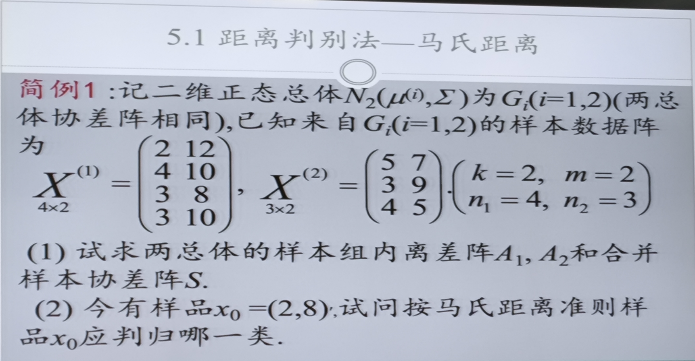

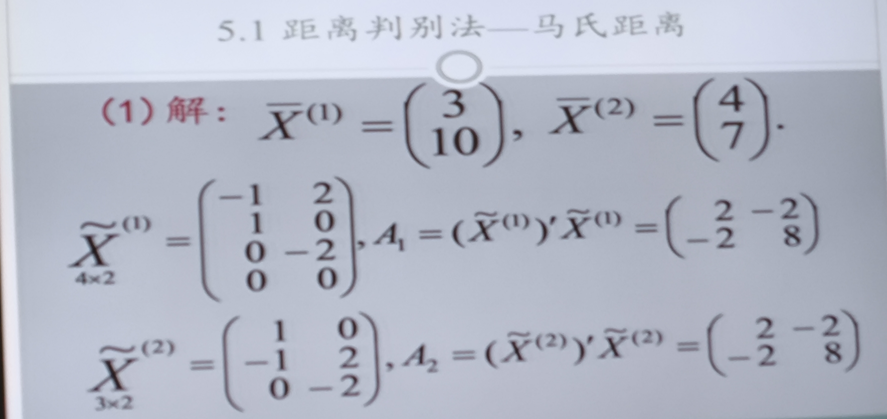

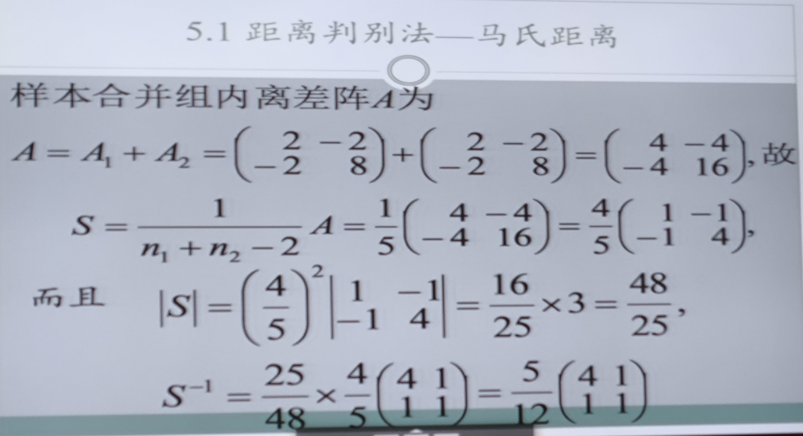

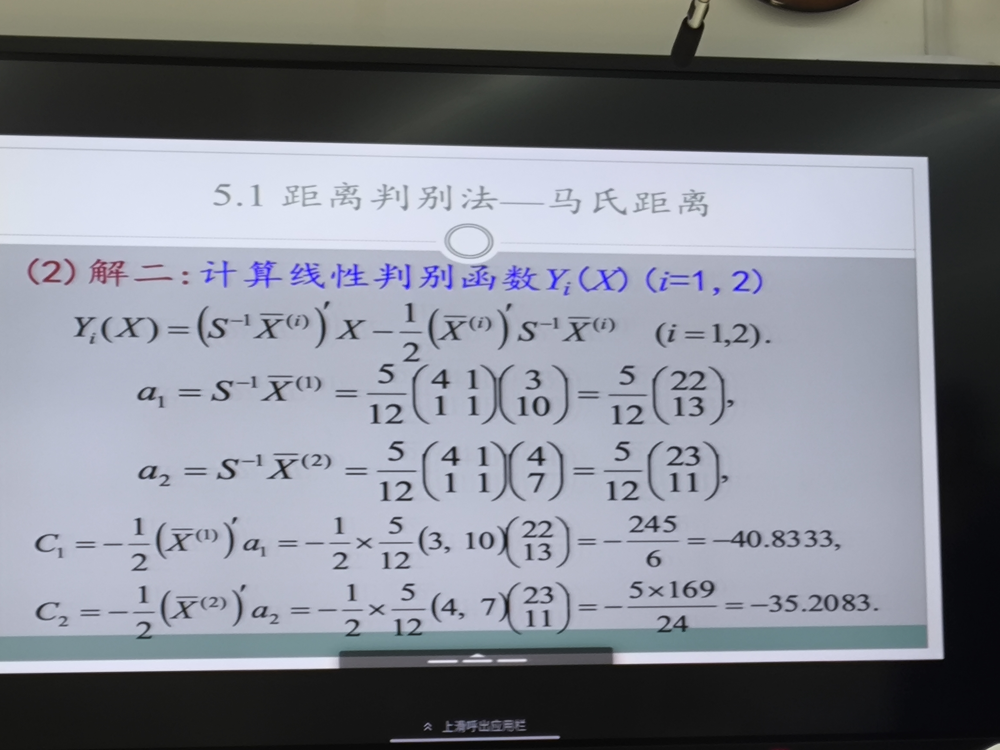

这道题目是关于**两个正态总体（协方差矩阵相等）的距离判别法（马氏距离）**。

#### 关键词：离差阵，协方差阵，合并协方差阵，马氏距离，样本判别

“二维正态总体”指的就是：我们要研究的每一个样本点，都包含两个特征指标（比如身高和体重），这两个指标构成的**向量**服从**二元正态分布**（Bivariate Normal Distribution）。

离差 (Deviation)就是单个数据与均值的差，怎么算，之前说过。

| 概念                                                         | 均值（中心位置）      | 协方差阵（形状胖瘦） |
  | :----------------------------------------------------------- | :-------------------- | :------------------- |
  | **总体参数 (Population)** 上帝视角，客观存在但通常未知的真值 | **$\mu$** (Mu)        | **$\Sigma$** (Sigma) |
  | **样本统计量 (Sample)** 人类视角，通过手中的数据算出来的估计值 | **$\bar{x}$** (x bar) | **$S$**              |

---
*   **协方差阵 ($S$)**：决定了**山的形状**（是圆山还是长山）。我们把数据合并，是为了**把这个形状看得更清楚**。
*   **均值向量 ($\bar{x}$) / 峰值**：决定了**山在哪里**。这是两座山**唯一的区别**。

---

马氏距离的几何理解：马氏距离就是把那个**底面是椭圆**的山峰，在数学上强行**“拉伸/压缩”成一个底面是正圆**的山峰，然后再用尺子去量 x-y 平面上的距离。

---
1.  **马氏距离：理论公式**（如果我们有上帝视角）：
    真正的马氏距离应该用 $\Sigma$ 和 $\mu$ 来算：
    $$ D^2 = (x - \mu)' \Sigma^{-1} (x - \mu) $$

2.  **实际操作**（我们只有几行数据）：
    因为 $\mu$ 和 $\Sigma$ 未知，我们只能用样本统计量去**替代**它们：
    
    *   用 $\bar{x}$ 替代 $\mu$
    *   用 $S$ 替代 $\Sigma$
    
    于是公式变成了样本马氏距离：
    $$ D^2 = (x - \bar{x})' S^{-1} (x - \bar{x}) $$
    
---
| 符号      | 数学术语           | 平方是一个动作还是名字的一部分？ | 也就是...                    |
  | :-------- | :----------------- | :------------------------------- | :--------------------------- |
  | **$R^2$** | **决定系数**       | **是名字的一部分**               | $R^2$ 这个整体就是系数本身。 |
  | **$D^2$** | **马氏距离的平方** | **是一个动作**                   | 它确实是把“距离”给平方了。   |

---

**多元正态分布的概率密度函数 (PDF):**
  $$ f(x) = \underbrace{\frac{1}{(2\pi)^{p/2}|\Sigma|^{1/2}}}_{\text{常数项 } C} \cdot \exp\left( \color{red}{-\frac{1}{2} (x-\mu)'\Sigma^{-1}(x-\mu)} \right) $$

  **马氏距离的平方:**
  $$ D^2 = \color{red}{(x-\mu)'\Sigma^{-1}(x-\mu)} $$

  所以，多元正态分布完全可以写成：
  $$ f(x) = C \cdot e^{-\frac{1}{2} D^2} $$

  **这意味着什么？**
  1.  **概率只取决于距离**：一个样本点 $x$ 出现的概率密度大小，**完全取决于**它到中心 $\mu$ 的马氏距离 $D$。
  2.  **等高线**：如果你把所有 $D^2$ 相同的点连起来，它们的概率密度 $f(x)$ 也是相等的。这就是为什么二维正态分布的等高线是**椭圆**（因为 $D^2 = \text{常数}$ 就是椭圆方程）。

用马氏距离的概念去理解多元正态分布，公式的物理意义瞬间就清晰了，不再是一堆可怕的矩阵运算。

  我们可以把它看作是 **“一维标准正态分布的推广”**：

  *   **一维情况**：
      $$ f(x) \propto e^{-\frac{1}{2} (\frac{x-\mu}{\sigma})^2} = e^{-\frac{1}{2} z^2} $$
      这里的 $z$ 是 z-score（标准分数），也就是**标准化的欧氏距离**。
  *   **多维情况**：
      $$ f(x) \propto e^{-\frac{1}{2} D^2} $$
      这里的 $D$ 是马氏距离，它其实就是**多维空间下的 z-score**。

---

马氏距离判别的一种比喻

*   **两个总体 ($G_1, G_2$)**：就是平原上的两座**山峰**。
    
    *   因为题目说“协方差阵相同”，所以这两座山是**“双胞胎山”**——胖瘦、高矮、坡度完全一模一样，只是坐落在不同的位置。
*   **新样本 ($x_0$)**：就是一个站在平原上的**登山者**。
*   **马氏距离**：登山者到达山顶需要跨越的**“等高线圈数”**。

---

1. 普通（单组）样本协方差阵 ($S_i$)
针对每一个单独的类别 $i$ 计算。只利用该类别下的 $n_i$ 个样本。

*   **公式**：
    $$ S_i = \frac{1}{n_i - 1} A_i $$
    *(其中 $A_i$ 是第 $i$ 组的组内离差阵)*
*   **意义**：只描述**第 $i$ 类**数据自己长什么样（胖瘦、倾斜方向）。

2. 合并样本协方差阵 ($S_{pooled}$)
当假设两组协方差矩阵相等时，我们将两组的离差阵“加起来”，共同估计那个统一的协方差矩阵。

*   **公式**：
    $$ S = \frac{A_1 + A_2}{(n_1 - 1) + (n_2 - 1)} = \frac{A_1 + A_2}{n_1 + n_2 - 2} $$
*   **直观理解**：它其实是两个单组协方差阵的**加权平均**（权重是自由度）：
    $$ S = \frac{(n_1-1)S_1 + (n_2-1)S_2}{(n_1-1) + (n_2-1)} $$

---

为什么可以用合并样本协方差阵？

我们在算马氏距离的时候均值是不一样的，所以我们认为两座山的位置不一样。

然而，山的形状是一样的，相当于用了一个更加准确的山的形状估计（由协方差阵描述）

---

### 一、 题目描述 

**已知：**
有两个二维正态总体 $G_1, G_2$，即 $N_2(\mu^{(i)}, \Sigma), (i=1,2)$。两总体的协方差矩阵相同。
已知来自 $G_1, G_2$ 的样本数据阵分别为：
$$
X^{(1)} = \begin{pmatrix} 2 & 12 \\ 4 & 10 \\ 3 & 8 \\ 3 & 10 \end{pmatrix}, \quad
X^{(2)} = \begin{pmatrix} 5 & 7 \\ 3 & 9 \\ 4 & 5 \end{pmatrix}
$$

其中 $k=2$ (类别数), $m=2$ (维数), $n_1=4, n_2=3$。

**问题：**
1.  试求两总体的样本组内离差阵 $A_1, A_2$ 和合并样本协方差阵 $S$。
2.  今有样品 $x_0 = (2, 8)'$，试问按马氏距离准则，样品 $x_0$ 应判归哪一类？

---

### 二、 计算离差阵和(合并)协方差阵

**1. 样本均值向量：**
$$ \bar{X}^{(1)} = \begin{pmatrix} 3 \\ 10 \end{pmatrix}, \quad \bar{X}^{(2)} = \begin{pmatrix} 4 \\ 7 \end{pmatrix} $$

**2. 组内离差阵：**
$$ A_1 = \begin{pmatrix} 2 & -2 \\ -2 & 8 \end{pmatrix}, \quad A_2 = \begin{pmatrix} 2 & -2 \\ -2 & 8 \end{pmatrix} $$
$$ A = A_1 + A_2 = \begin{pmatrix} 4 & -4 \\ -4 & 16 \end{pmatrix} $$

**3. 合并协方差阵 $S$ 及其逆矩阵 $S^{-1}$：**
$$ S = \frac{1}{n_1+n_2-2}A = \frac{1}{5}\begin{pmatrix} 4 & -4 \\ -4 & 16 \end{pmatrix} = \frac{4}{5}\begin{pmatrix} 1 & -1 \\ -1 & 4 \end{pmatrix} $$

$$ S^{-1} = \frac{5}{12} \begin{pmatrix} 4 & 1 \\ 1 & 1 \end{pmatrix} $$

---

### 三、 判别过程详解 

题目要求判断 $x_0 = \begin{pmatrix} 2 \\ 8 \end{pmatrix}$ 的归属。这里提供两种解法。

#### 解法一：直接计算马氏距离 (Mahalanobis Distance)

**判别准则：** 计算样品 $x_0$ 到两个总体中心的马氏距离平方 $D^2(x_0, G_i)$，**距离哪个小就属于哪一类**。
公式：$D^2(x_0, G_i) = (x_0 - \bar{X}^{(i)})' S^{-1} (x_0 - \bar{X}^{(i)})$

**1. 计算到 $G_1$ 的距离平方：**
$$ x_0 - \bar{X}^{(1)} = \begin{pmatrix} 2 \\ 8 \end{pmatrix} - \begin{pmatrix} 3 \\ 10 \end{pmatrix} = \begin{pmatrix} -1 \\ -2 \end{pmatrix} $$

$$
\begin{aligned}
D^2(x_0, G_1) &= \begin{pmatrix} -1 & -2 \end{pmatrix} \left[ \frac{5}{12} \begin{pmatrix} 4 & 1 \\ 1 & 1 \end{pmatrix} \right] \begin{pmatrix} -1 \\ -2 \end{pmatrix} \\
&= \frac{5}{12} \begin{pmatrix} -1 & -2 \end{pmatrix} \begin{pmatrix} 4(-1)+1(-2) \\ 1(-1)+1(-2) \end{pmatrix} \\
&= \frac{5}{12} \begin{pmatrix} -1 & -2 \end{pmatrix} \begin{pmatrix} -6 \\ -3 \end{pmatrix} \\
&= \frac{5}{12} ( (-1)(-6) + (-2)(-3) ) \\
&= \frac{5}{12} (6 + 6) = \frac{60}{12} = \mathbf{5}
\end{aligned}
$$

**2. 计算到 $G_2$ 的距离平方：**
$$ x_0 - \bar{X}^{(2)} = \begin{pmatrix} 2 \\ 8 \end{pmatrix} - \begin{pmatrix} 4 \\ 7 \end{pmatrix} = \begin{pmatrix} -2 \\ 1 \end{pmatrix} $$
$$
\begin{aligned}
D^2(x_0, G_2) &= \begin{pmatrix} -2 & 1 \end{pmatrix} \left[ \frac{5}{12} \begin{pmatrix} 4 & 1 \\ 1 & 1 \end{pmatrix} \right] \begin{pmatrix} -2 \\ 1 \end{pmatrix} \\
&= \frac{5}{12} \begin{pmatrix} -2 & 1 \end{pmatrix} \begin{pmatrix} -7 \\ -1 \end{pmatrix} \\
&= \frac{5}{12} (14 - 1) \\
&= \frac{5}{12} \times 13 = \frac{65}{12} \approx \mathbf{5.417}
\end{aligned}
$$

**3. 结论：**
因为 $D^2(x_0, G_1) = 5 < D^2(x_0, G_2) = 5.417$，即样品到 $G_1$ 的距离更近。
**故判 $x_0$ 属于第一类 $G_1$。**

---

#### 解法二：线性判别函数

**判别准则：** 比较线性判别函数值 $Y_i(x_0)$ 的大小，**数值大的属于该类**（注：$Y$值反映了对数似然比，值越大可能性越大）。

系数 $a_i$ 和常数 $C_i$：
*   $a_1 = S^{-1}\bar{X}^{(1)} = \frac{5}{12}\begin{pmatrix} 22 \\ 13 \end{pmatrix}$
*   $a_2 = S^{-1}\bar{X}^{(2)} = \frac{5}{12}\begin{pmatrix} 23 \\ 11 \end{pmatrix}$
*   $C_1 \approx -40.8333$
*   $C_2 \approx -35.2083$

判别函数公式：$Y_i(x) = a_i' x + C_i$

**1. 计算 $Y_1(x_0)$：**
$$
\begin{aligned}
a_1' x_0 &= \frac{5}{12} \begin{pmatrix} 22 & 13 \end{pmatrix} \begin{pmatrix} 2 \\ 8 \end{pmatrix} \\
&= \frac{5}{12} (44 + 104) = \frac{5 \times 148}{12} = \frac{740}{12} \approx 61.6667
\end{aligned}
$$
$$
Y_1(x_0) = 61.6667 + (-40.8333) = \mathbf{20.8334}
$$

**2. 计算 $Y_2(x_0)$：**
$$
\begin{aligned}
a_2' x_0 &= \frac{5}{12} \begin{pmatrix} 23 & 11 \end{pmatrix} \begin{pmatrix} 2 \\ 8 \end{pmatrix} \\
&= \frac{5}{12} (46 + 88) = \frac{5 \times 134}{12} = \frac{670}{12} \approx 55.8333
\end{aligned}
$$
$$
Y_2(x_0) = 55.8333 + (-35.2083) = \mathbf{20.625}
$$

**3. 结论：**
因为 $Y_1(x_0) = 20.8334 > Y_2(x_0) = 20.625$。
**故判 $x_0$ 属于第一类 $G_1$。**

*(两种方法得出的结论是一致的)*

---
## 题解：题型：用施密特进行QR分解

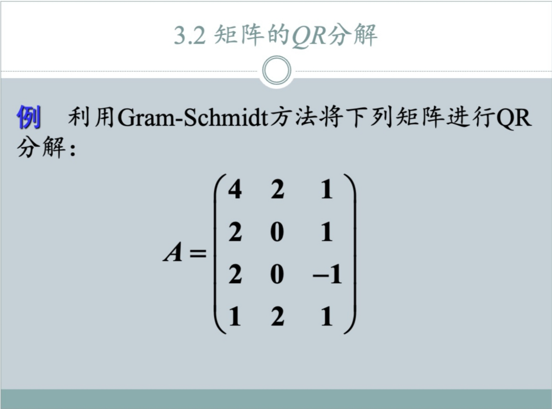

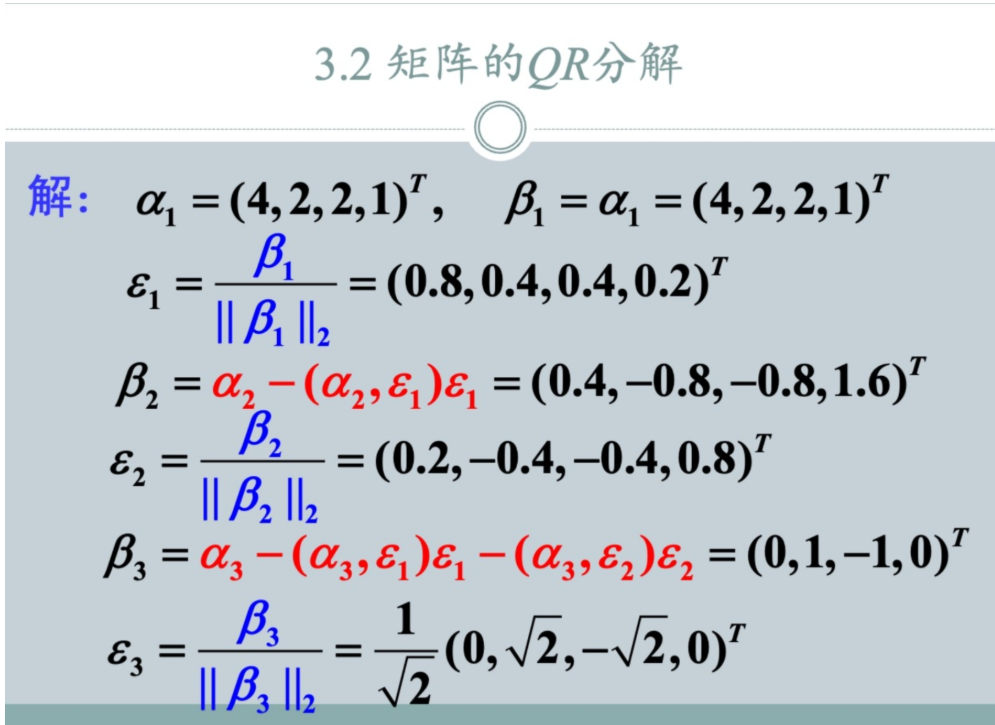

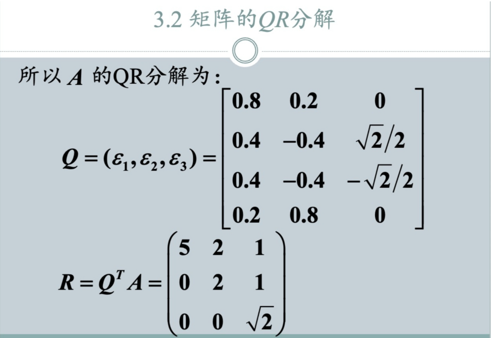

---

### 1. 题目 (Problem Statement)

利用 Gram-Schmidt 正交化方法（格拉姆-施密特方法）将下列矩阵 $A$ 进行 QR 分解：

$$
A = \begin{pmatrix} 
4 & 2 & 1 \\ 
2 & 0 & 1 \\ 
2 & 0 & -1 \\ 
1 & 2 & 1 
\end{pmatrix}
$$

---

### 2. 通用方法 (General Method)

**QR 分解** 的目标是将一个线性无关的实矩阵 $A$ 分解为两个矩阵的乘积：$A = QR$。
*   **$Q$ (正交矩阵):** 其列向量是标准正交向量组（即向量长度为1且两两正交）。
*   **$R$ (上三角矩阵):** 对角线元素为正，且为上三角形式。

**核心步骤（施密特正交化 Gram-Schmidt Process）：**

设矩阵 $A$ 的列向量为 $\alpha_1, \alpha_2, \alpha_3, \dots, \alpha_n$。

1.  **正交化 (Orthogonalization):** 构造一组两两正交的向量 $\beta_1, \beta_2, \dots$
    *   $\beta_1 = \alpha_1$
    *   $\beta_2 = \alpha_2 - \frac{\langle \alpha_2, \beta_1 \rangle}{\langle \beta_1, \beta_1 \rangle}\beta_1$ （或者写成投影形式 $\beta_2 = \alpha_2 - \langle \alpha_2, \epsilon_1 \rangle \epsilon_1$）
    *   $\beta_k = \alpha_k - \sum_{j=1}^{k-1} \langle \alpha_k, \epsilon_j \rangle \epsilon_j$

2.  **单位化 (Normalization):** 将正交向量转化为单位向量 $\epsilon$。
    *   $\epsilon_k = \frac{\beta_k}{\|\beta_k\|_2}$

3.  **构造矩阵:**
    *   **$Q$ 矩阵**：由 $\epsilon_1, \epsilon_2, \dots, \epsilon_n$ 作为列向量组成。
    *   **$R$ 矩阵**：
        *   对角线元素 $r_{kk} = \|\beta_k\|_2$。
        *   上三角元素 $r_{jk} = \langle \alpha_k, \epsilon_j \rangle$ ($j < k$)。
        *   或者直接通过 $R = Q^T A$ 计算。

---

### 3. 详细题解 (Detailed Solution)

记矩阵 $A$ 的三个列向量分别为 $\alpha_1, \alpha_2, \alpha_3$。

$$
\alpha_1 = (4, 2, 2, 1)^T, \quad \alpha_2 = (2, 0, 0, 2)^T, \quad \alpha_3 = (1, 1, -1, 1)^T
$$

#### 第一步：处理第一个向量 $\alpha_1$

1.  **确定 $\beta_1$:**
    $$ \beta_1 = \alpha_1 = (4, 2, 2, 1)^T $$
2.  **计算模长 $\|\beta_1\|_2$:**
    $$ \|\beta_1\|_2 = \sqrt{4^2 + 2^2 + 2^2 + 1^2} = \sqrt{16+4+4+1} = \sqrt{25} = 5 $$
3.  **单位化得到 $\epsilon_1$:**
    $$ \epsilon_1 = \frac{\beta_1}{5} = (0.8, 0.4, 0.4, 0.2)^T $$

#### 第二步：处理第二个向量 $\alpha_2$

1.  **计算投影系数:**
    $$ \langle \alpha_2, \epsilon_1 \rangle = 2\times0.8 + 0\times0.4 + 0\times0.4 + 2\times0.2 = 1.6 + 0.4 = 2 $$
2.  **正交化得到 $\beta_2$:**
    $$ \beta_2 = \alpha_2 - \langle \alpha_2, \epsilon_1 \rangle \epsilon_1 $$
    $$ \beta_2 = (2, 0, 0, 2)^T - 2 \times (0.8, 0.4, 0.4, 0.2)^T $$
    $$ \beta_2 = (2, 0, 0, 2)^T - (1.6, 0.8, 0.8, 0.4)^T $$
    $$ \beta_2 = (0.4, -0.8, -0.8, 1.6)^T $$
3.  **计算模长 $\|\beta_2\|_2$:**
    $$ \|\beta_2\|_2 = \sqrt{0.4^2 + (-0.8)^2 + (-0.8)^2 + 1.6^2} = \sqrt{0.16 + 0.64 + 0.64 + 2.56} = \sqrt{4} = 2 $$
4.  **单位化得到 $\epsilon_2$:**
    $$ \epsilon_2 = \frac{\beta_2}{2} = (0.2, -0.4, -0.4, 0.8)^T $$

#### 第三步：处理第三个向量 $\alpha_3$

1.  **计算投影系数:**
    *   对 $\epsilon_1$ 的投影：$\langle \alpha_3, \epsilon_1 \rangle = 1(0.8) + 1(0.4) + (-1)(0.4) + 1(0.2) = 1$
    *   对 $\epsilon_2$ 的投影：$\langle \alpha_3, \epsilon_2 \rangle = 1(0.2) + 1(-0.4) + (-1)(-0.4) + 1(0.8) = 0.2 - 0.4 + 0.4 + 0.8 = 1$
2.  **正交化得到 $\beta_3$:**
    $$ \beta_3 = \alpha_3 - \langle \alpha_3, \epsilon_1 \rangle \epsilon_1 - \langle \alpha_3, \epsilon_2 \rangle \epsilon_2 $$
    $$ \beta_3 = (1, 1, -1, 1)^T - 1 \cdot \epsilon_1 - 1 \cdot \epsilon_2 $$
    $$ \beta_3 = (1, 1, -1, 1)^T - (0.8, 0.4, 0.4, 0.2)^T - (0.2, -0.4, -0.4, 0.8)^T $$
    计算分量：
    *   第1分量: $1 - 0.8 - 0.2 = 0$
    *   第2分量: $1 - 0.4 - (-0.4) = 1$
    *   第3分量: $-1 - 0.4 - (-0.4) = -1$
    *   第4分量: $1 - 0.2 - 0.8 = 0$
    $$ \beta_3 = (0, 1, -1, 0)^T $$
3.  **计算模长 $\|\beta_3\|_2$:**
    $$ \|\beta_3\|_2 = \sqrt{0^2 + 1^2 + (-1)^2 + 0^2} = \sqrt{2} $$
4.  **单位化得到 $\epsilon_3$:**
    $$ \epsilon_3 = \frac{\beta_3}{\sqrt{2}} = \left(0, \frac{1}{\sqrt{2}}, -\frac{1}{\sqrt{2}}, 0\right)^T = \left(0, \frac{\sqrt{2}}{2}, -\frac{\sqrt{2}}{2}, 0\right)^T $$

#### 第四步：组装 Q 和 R 矩阵

**$Q$ 矩阵：** 由 $\epsilon_1, \epsilon_2, \epsilon_3$ 组成。
$$
Q = (\epsilon_1, \epsilon_2, \epsilon_3) = \begin{bmatrix} 
0.8 & 0.2 & 0 \\ 
0.4 & -0.4 & \frac{\sqrt{2}}{2} \\ 
0.4 & -0.4 & -\frac{\sqrt{2}}{2} \\ 
0.2 & 0.8 & 0 
\end{bmatrix}
$$

**$R$ 矩阵：** 通过 $R = Q^T A$ 计算，或直接利用之前的计算结果（对角线为模长，上三角为投影系数）。
*   $r_{11} = \|\beta_1\| = 5$
*   $r_{22} = \|\beta_2\| = 2$
*   $r_{33} = \|\beta_3\| = \sqrt{2}$
*   $r_{12} = \langle \alpha_2, \epsilon_1 \rangle = 2$
*   $r_{13} = \langle \alpha_3, \epsilon_1 \rangle = 1$
*   $r_{23} = \langle \alpha_3, \epsilon_2 \rangle = 1$

$$
R = \begin{pmatrix} 
5 & 2 & 1 \\ 
0 & 2 & 1 \\ 
0 & 0 & \sqrt{2} 
\end{pmatrix}
$$

### 最终结果
$$ A = QR $$
即：
$$
\begin{pmatrix} 4 & 2 & 1 \\ 2 & 0 & 1 \\ 2 & 0 & -1 \\ 1 & 2 & 1 \end{pmatrix} = 
\begin{bmatrix} 0.8 & 0.2 & 0 \\ 0.4 & -0.4 & \frac{\sqrt{2}}{2} \\ 0.4 & -0.4 & -\frac{\sqrt{2}}{2} \\ 0.2 & 0.8 & 0 \end{bmatrix}
\begin{pmatrix} 5 & 2 & 1 \\ 0 & 2 & 1 \\ 0 & 0 & \sqrt{2} \end{pmatrix}
$$

---
## 题解：题型：单纯形法求解线性规划

### 线性规划通用算法流程（大M / 单纯形法）

#### 步骤 1：化为标准型（四要素）

在动笔画表之前，必须确保题目满足以下标准形式：

1.  **目标函数极小化**：若原题为 $\max z$，则令 $f = -z$，求 $\min f$。
2.  **变量非负化**：
    *   若 $x_i \leq 0$，令 $x_i = -x_i'$ ($x_i' \geq 0$)。
    *   若 $x_i$ 无约束（可正可负），令 $x_i = x_i' - x_i''$ ($x_i', x_i'' \geq 0$)。
3.  **约束方程等式化**：
    *   若为 $\leq$，左边加上松弛变量 $x_s \geq 0$。
    *   若为 $\geq$，左边减去剩余变量 $x_e \geq 0$。
4.  **右端项非负化**：检查所有 $b_i$，若有负数，整行同时乘以 $-1$。

---

#### 步骤 2：写出单纯形表并定义核心要素

将标准型系数填入单纯形表。此时，我们需要定义后续操作的**判定准则**与**合法工具**：

**【核心概念定义】**

*   **松弛变量 ($x_s$)**：在 $\leq$ 约束中加入，使之变成等式，代表资源剩余量。
*   **剩余变量 ($x_e$)**：在 $\geq$ 约束中减去，使之变成等式，代表超出定额的量。
*   **人工变量 ($x_a$)**：在构造单位阵时，若变量凑不足，人为添加的辅助变量。其目标是最终必须被挤出基组（变为 $0$）。
*   **基变量**：在单纯形表中对应单位向量列的变量，其取值由 $b$ 列决定。
*   **进基 (Entering)**：判别数不满足要求时，选择某一非基变量进入基组。
*   **离基 (Leaving)**：通过 $\theta$ 试验，选择某一基变量退出基组，变回非基变量。

**【四个退出条件（单纯形表的四个特点）】**

*   **① 存在单位矩阵 $I$**：系数矩阵中包含完整的单位向量列（位置可不连续）。
*   **② 右侧非负**：即 $b \geq 0$。
*   **③ 零位对齐**：单位矩阵 $I$ 对应的各列，其底行元素（判别数）必须为 $0$。
*   **④ 判别数非负**：底行所有元素均 $\geq 0$（标志着找到最优解）。

**【两个允许的变换操作】**

*   **操作一**：对方程部分（除底行外的行）进行初等行变换（整行缩放、行相加减）。
*   **操作二**：将方程行的某个倍数乘加到“底行”上，用于修正判别数。

---

#### 步骤 3：环境检查与“大M”初始化

观察初始表是否满足条件 ①、②、③：

*   **若满足**：跳过本步，直接进入标准单纯形法迭代。
*   **若不满足**：说明题目中原本的变量无法凑齐单位矩阵 $I$。
    *   **人工补齐**：在缺位的方程中引入人工变量 $x$，强行凑齐单位矩阵 $I$（满足条件 ①）。
    *   **惩罚注入**：在底行人工变量对应的位置填入**巨大的正数** $M$。
    *   **抹平底行**：利用**操作二**，将人工变量所在行乘以 $-M$ 后加到底行，使底行在 $I$ 对应的位置变为 $0$（满足条件 ③）。

---

#### 步骤 4：循环迭代与最终判定

当表满足 ①②③ 后，开始冲击条件 ④（最优性）：

1.  **判定条件 ④**：
    *   若底行所有元素 $\geq 0$，则迭代结束，退出。
    *   若底行仍有负数，则选择最负的一列作为**入基列**。
2.  **确定主元**：利用 $\theta$ 试验（$b$ 列除以入基列的正元素，选最小商者）确定**出基行**。
3.  **执行变换（核心旋转）**：
    *   利用**操作一**，通过初等行变换将入基列洗成新的单位向量。
    *   **【关键优化】人工变量离基的时候，就可以直接从表中删掉该列，不再参与后续计算。**
    *   利用**操作二**，将新基变量在底行对应的位置抹平为 $0$。
4.  **重复循环**：回到本步第 1 点，直到满足条件 ④。

#### **【退出后的最终结果解读】**

- 找到单位向量，顺着 $1$ 所在的行向右看，在 $b$ 列（常数项列）中读到的数值，就是该基变量的当前取值。

- 所有非基变量的取值一律为 **$0$**。
- 把$x$带入$z$可以求出最小值，表格最右下角对应$-z$

### 题目复述：用单纯形法求解
$$
\begin{aligned}
\min \quad & z = -2x_1 - 3x_2 \\
\text{s.t.} \quad & \begin{cases} -x_1 + x_2 \leq 2 \\ x_1 + 2x_2 \leq 10 \\ 3x_1 + x_2 \leq 15 \\ x_1, x_2 \geq 0 \end{cases}
\end{aligned}
$$

---

### 步骤 1：化为标准型

1.  **目标函数极小化**：已经是 $\min z = -2x_1 - 3x_2$。
2.  **变量非负化**：已经是 $x_1, x_2 \geq 0$。
3.  **约束方程等式化**：三个约束均为 $\leq$ 型，分别加入松弛变量 $x_3, x_4, x_5 \geq 0$。
4.  **右端项非负化**：所有 $b_i$ 均为正数（$2, 10, 15$），满足要求。

**标准型如下：**
$$
\begin{aligned}
\min \quad & z = -2x_1 - 3x_2 + 0x_3 + 0x_4 + 0x_5 \\
\text{s.t.} \quad & \begin{cases} -x_1 + x_2 + x_3 = 2 \\ x_1 + 2x_2 + x_4 = 10 \\ 3x_1 + x_2 + x_5 = 15 \\ x_i \geq 0 \quad (i=1, \dots, 5) \end{cases}
\end{aligned}
$$

---

### 步骤 2：写出初始单纯形表并环境检查

我们将标准型的系数填入单纯形表中。

| 基变量     | $x_1$ | $x_2$ | $x_3$ | $x_4$ | $x_5$ | $b$  |
| :--------- | :---- | :---- | :---- | :---- | :---- | :--- |
| $x_3$      | -1    | 1     | 1     | 0     | 0     | 2    |
| $x_4$      | 1     | 2     | 0     | 1     | 0     | 10   |
| $x_5$      | 3     | 1     | 0     | 0     | 1     | 15   |
| $\sigma_j$ | -2    | -3    | 0     | 0     | 0     | 0    |

**环境检查：**
*   **① 存在单位矩阵 $I$**：松弛变量 $x_3, x_4, x_5$ 的系数列构成了完整的 $3 \times 3$ 单位阵。
*   **② 右侧非负**：$b = [2, 10, 15]^T \geq 0$。
*   **③ 零位对齐**：基变量 $x_3, x_4, x_5$ 在底行对应的判别数 $\sigma_j$ 已经是 $0$。

**【重要说明】为什么不需要大M法？**
大M法是为了解决约束条件为 $\geq$ 或 $=$ 时，变量凑不齐单位矩阵 $I$ 的问题。而本题所有约束都是 $\leq$ 型，通过加入松弛变量，**自动凑齐了单位矩阵 $I$**，且初始解就是可行的。因此，**直接跳过步骤 3（大M初始化）**，进入步骤 4。

---

### 步骤 4：循环迭代

#### 4.1 第一次迭代
*   **入基判定**：底行判别数中，$-3$ 为最小（最负），故 **$x_2$** 入基。
*   **出基判定 ($\theta$ 试验)**：用 $b$ 列除以 $x_2$ 列的正元素：
    *   第 1 行：$2 / 1 = 2$
    *   第 2 行：$10 / 2 = 5$
    *   第 3 行：$15 / 1 = 15$
    *   最小商为 $2$，故 **$x_3$** 出基。
*   **执行变换**：主元为第 1 行第 2 列的 $1$。保持第 1 行不变，通过行变换消除第 2、3 行及底行的 $x_2$ 项。

#### 4.2 第二次迭代
（变换后的表状态）：
| 基变量     | $x_1$ | $x_2$ | $x_3$ | $x_4$ | $x_5$ | $b$  | $\theta$    |
| :--------- | :---- | :---- | :---- | :---- | :---- | :--- | :---------- |
| $x_2$      | -1    | 1     | 1     | 0     | 0     | 2    | -           |
| $x_4$      | 3     | 0     | -2    | 1     | 0     | 6    | $6/3=2$     |
| $x_5$      | 4     | 0     | -1    | 0     | 1     | 13   | $13/4=3.25$ |
| $\sigma_j$ | -5    | 0     | 3     | 0     | 0     | 6    |             |

*   **入基判定**：底行中 $\sigma_1 = -5$ 为负数，故 **$x_1$** 入基。
*   **出基判定**：
    *   第 2 行：$6 / 3 = 2$
    *   第 3 行：$13 / 4 = 3.25$
    *   最小商为 $2$，故 **$x_4$** 出基。
*   **执行变换**：主元为第 2 行第 1 列的 $3$。将第 2 行除以 $3$，消除其他行的 $x_1$ 项。

#### 4.3 第三次迭代（最终表）
（再次变换后的表状态）：
| 基变量     | $x_1$ | $x_2$ | $x_3$  | $x_4$  | $x_5$ | $b$  |
| :--------- | :---- | :---- | :----- | :----- | :---- | :--- |
| $x_2$      | 0     | 1     | $1/3$  | $1/3$  | 0     | 4    |
| $x_1$      | 1     | 0     | $-2/3$ | $1/3$  | 0     | 2    |
| $x_5$      | 0     | 0     | $5/3$  | $-4/3$ | 1     | 5    |
| $\sigma_j$ | 0     | 0     | $-1/3$ | $5/3$  | 0     | 16   |

*   **注意**：此时底行仍有 $\sigma_3 = -1/3 < 0$，说明还没达到最优解，需要继续迭代。
*   **入基判定**：选 **$x_3$** 入基。
*   **出基判定**：
    *   第 1 行：$4 / (1/3) = 12$
    *   第 3 行：$5 / (5/3) = 3$
    *   最小商为 $3$，故 **$x_5$** 出基。
*   **执行变换**：主元为第 3 行第 3 列的 $5/3$。

#### 4.4 第四次迭代（结果读取）
经过变换，底行所有 $\sigma_j$ 将会 $\geq 0$。

---

### 5. 最终判定与结果读取

1.  **判定条件 ④ 满足**：底行所有非基变量的判别数均 $\geq 0$，迭代停止。
2.  **读取变量值**：
    *   由表可得最优解为：$x_1 = 4, x_2 = 3$。
3.  **计算最小值**：
    *   $z = -2(4) - 3(3) = -8 - 9 = -17$。

**最终结论：**
本题通过单纯形法，历经三次旋转变换，在不需要引入大M的情况下，求得最小值 $\min z = -17$。

---
## 题解：证明：协方差矩阵是对角阵的性质

### 证明题（往年考过）：

设 $\mathbf{X} = (X_1, X_2, \ldots, X_n)^T$ 是一个 $n$ 维正态随机向量，记为 $\mathbf{X} \sim N_n(\boldsymbol{\mu}, \boldsymbol{\Sigma})$，其中：
*   $\boldsymbol{\mu} = E[\mathbf{X}] = (\mu_1, \mu_2, \ldots, \mu_n)^T$ 是均值向量。
*   $\boldsymbol{\Sigma}$ 是 $n \times n$ 的协方差矩阵，其中元素 $\Sigma_{ij} = \text{Cov}(X_i, X_j)$。

**命题：**
如果协方差矩阵 $\boldsymbol{\Sigma}$ 是一个对角矩阵，即：
$$
\boldsymbol{\Sigma} = \begin{pmatrix}
\sigma_1^2 & 0 & \cdots & 0 \\
0 & \sigma_2^2 & \cdots & 0 \\
\vdots & \vdots & \ddots & \vdots \\
0 & 0 & \cdots & \sigma_n^2
\end{pmatrix}
$$
其中 $\sigma_i^2 = \text{Var}(X_i)$，并且对于所有 $i \neq j$，有 $\Sigma_{ij} = \text{Cov}(X_i, X_j) = 0$。

那么，随机变量 $X_1, X_2, \ldots, X_n$ 是相互独立的。

---

### 2. 意义与说明

这个命题的意义非常深远，它揭示了正态分布一个独一无二的优美特性。

**核心思想：对于正态分布而言，不相关等价于独立。**

1.  **“不相关”与“独立”的区别：**
    *   **不相关 (Uncorrelated)**：两个随机变量 $X_i$ 和 $X_j$ 不相关，指的是它们之间没有**线性**关系，数学上表示为 $\text{Cov}(X_i, X_j) = 0$。
    *   **独立 (Independent)**：两个随机变量 $X_i$ 和 $X_j$ 独立，指的是一个变量的取值信息完全不影响另一个变量的概率分布。这是一个比“不相关”强得多的条件。

    在一般情况下，**独立一定不相关**，但**不相关不一定独立**。例如，设 $X \sim U(-1, 1)$ （均匀分布），令 $Y=X^2$。可以计算出 $\text{Cov}(X, Y) = 0$，所以它们不相关。但它们显然不是独立的，因为知道 $X$ 的值就完全确定了 $Y$ 的值。

2.  **正态分布的特殊性：**
    这个命题的惊人之处在于，它为“正态随机变量”这个特殊群体架起了一座桥梁，将“不相关”这个较弱的、更容易计算的条件，直接提升到了“独立”这个更强的、在理论和应用中都更有用的性质。

3.  **实践意义：**
    *   **简化分析**：在处理多元正态数据时（例如，在金融领域分析多种股票收益率，在工程领域分析多个测量误差），我们只需要计算变量两两之间的协方差。如果发现协方差为零，就可以直接断定它们是相互独立的。这极大地简化了模型的建立和推断过程，因为处理独立变量比处理相依变量要容易得多。
    *   **模型降维**：如果一个高维正态向量的协方差矩阵是对角的，我们就可以把它分解成多个独立的一维正态分布问题来研究，大大降低了问题的复杂性。

---

### 3. 证明

证明的关键在于利用多元正态分布的概率密度函数（PDF）。我们将展示，当协方差矩阵为对角阵时，其联合概率密度函数可以分解为各个分量边际概率密度函数的乘积。

**1. 准备工作：**
*   **多元正态分布的PDF**：对于一个非退化的正态随机向量 $\mathbf{X} \sim N_n(\boldsymbol{\mu}, \boldsymbol{\Sigma})$，其联合PDF为：
    $$
    f_{\mathbf{X}}(\mathbf{x}) = \frac{1}{(2\pi)^{n/2} |\boldsymbol{\Sigma}|^{1/2}} \exp\left(-\frac{1}{2}(\mathbf{x} - \boldsymbol{\mu})^T \boldsymbol{\Sigma}^{-1} (\mathbf{x} - \boldsymbol{\mu})\right)
    $$
    其中 $\mathbf{x} = (x_1, \ldots, x_n)^T$ 是变量的取值。

*   **独立性的定义**：随机变量 $X_1, \ldots, X_n$ 相互独立的充要条件是它们的联合PDF等于它们各自边际PDF的乘积：
    $$
    f_{\mathbf{X}}(x_1, \ldots, x_n) = f_{X_1}(x_1) f_{X_2}(x_2) \cdots f_{X_n}(x_n)
    $$

**2. 证明过程：**

假设协方差矩阵 $\boldsymbol{\Sigma}$ 是对角阵：$\boldsymbol{\Sigma} = \text{diag}(\sigma_1^2, \sigma_2^2, \ldots, \sigma_n^2)$。

我们需要计算PDF中的两个关键部分：$|\boldsymbol{\Sigma}|$ 和 $\boldsymbol{\Sigma}^{-1}$。

*   **计算行列式 $|\boldsymbol{\Sigma}|$**：
    对角矩阵的行列式等于其对角元素的乘积。
    $$
    |\boldsymbol{\Sigma}| = \sigma_1^2 \sigma_2^2 \cdots \sigma_n^2 = \prod_{i=1}^n \sigma_i^2
    $$
    因此，$|\boldsymbol{\Sigma}|^{1/2} = \sqrt{\prod_{i=1}^n \sigma_i^2} = \prod_{i=1}^n \sigma_i$。

*   **计算逆矩阵 $\boldsymbol{\Sigma}^{-1}$**：
    对角矩阵的逆矩阵是其对角元素取倒数后形成的新对角矩阵。
    $$
    \boldsymbol{\Sigma}^{-1} = \text{diag}\left(\frac{1}{\sigma_1^2}, \frac{1}{\sigma_2^2}, \ldots, \frac{1}{\sigma_n^2}\right)
    $$

*   **计算指数部分**：
    我们来计算二次型 $(\mathbf{x} - \boldsymbol{\mu})^T \boldsymbol{\Sigma}^{-1} (\mathbf{x} - \boldsymbol{\mu})$：
    $$\begin{align*}
    (\mathbf{x} - \boldsymbol{\mu})^T \boldsymbol{\Sigma}^{-1} (\mathbf{x} - \boldsymbol{\mu}) &= \begin{pmatrix} x_1-\mu_1 & \cdots & x_n-\mu_n \end{pmatrix} \begin{pmatrix} 1/\sigma_1^2 & & 0 \\ & \ddots & \\ 0 & & 1/\sigma_n^2 \end{pmatrix} \begin{pmatrix} x_1-\mu_1 \\ \vdots \\ x_n-\mu_n \end{pmatrix} \\
    &= \sum_{i=1}^n \frac{(x_i - \mu_i)^2}{\sigma_i^2}
    \end{align*}$$

*   **代回联合PDF**：
    将上述结果代入多元正态分布的PDF公式中：
    $$
    f_{\mathbf{X}}(\mathbf{x}) = \frac{1}{(2\pi)^{n/2} \prod_{i=1}^n \sigma_i} \exp\left(-\frac{1}{2} \sum_{i=1}^n \frac{(x_i - \mu_i)^2}{\sigma_i^2}\right)
    $$

*   **分解PDF**：
    现在，我们可以利用指数函数的性质 $\exp(a+b) = \exp(a)\exp(b)$ 和乘法法则，将上式分解：
    $$\begin{align*}
    f_{\mathbf{X}}(\mathbf{x}) &= \frac{1}{\prod_{i=1}^n (2\pi)^{1/2} \sigma_i} \prod_{i=1}^n \exp\left(-\frac{(x_i - \mu_i)^2}{2\sigma_i^2}\right) \\
    &= \prod_{i=1}^n \left[ \frac{1}{(2\pi)^{1/2} \sigma_i} \exp\left(-\frac{(x_i - \mu_i)^2}{2\sigma_i^2}\right) \right]
    \end{align*}$$

*   **得出结论**：
    我们观察到，乘积中的每一项
    $$
    f_{X_i}(x_i) = \frac{1}{\sqrt{2\pi}\sigma_i} \exp\left(-\frac{(x_i - \mu_i)^2}{2\sigma_i^2}\right)
    $$
    正是一个均值为 $\mu_i$、方差为 $\sigma_i^2$ 的一维正态分布 $N(\mu_i, \sigma_i^2)$ 的概率密度函数。

    因此，我们证明了：
    $$
    f_{\mathbf{X}}(x_1, \ldots, x_n) = \prod_{i=1}^n f_{X_i}(x_i)
    $$
    根据相互独立的定义，这表明随机变量 $X_1, X_2, \ldots, X_n$ 是相互独立的。

**证毕。**

---
## 题解：题型：线性空间经典题+交空间和补空间

### 题型：线性表示

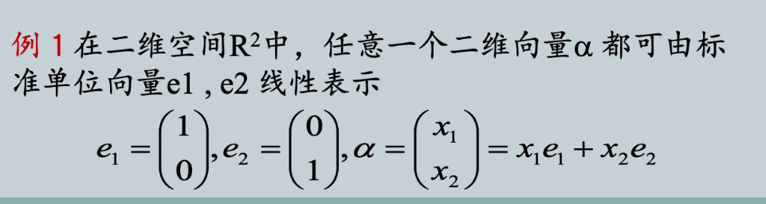

### 题型：线性相关性

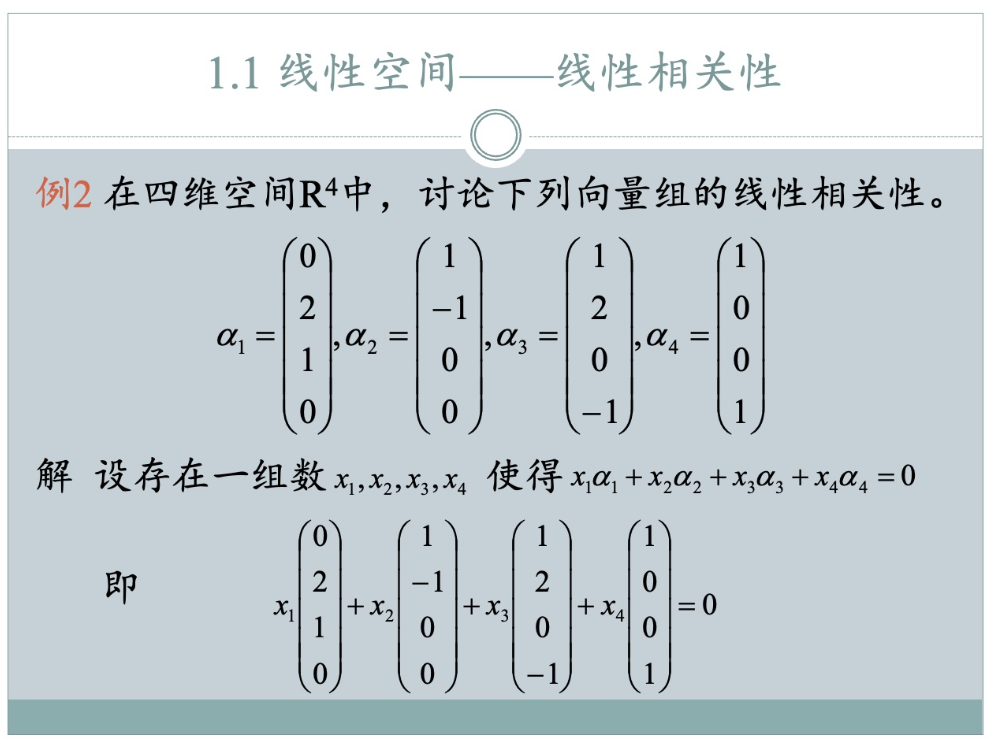

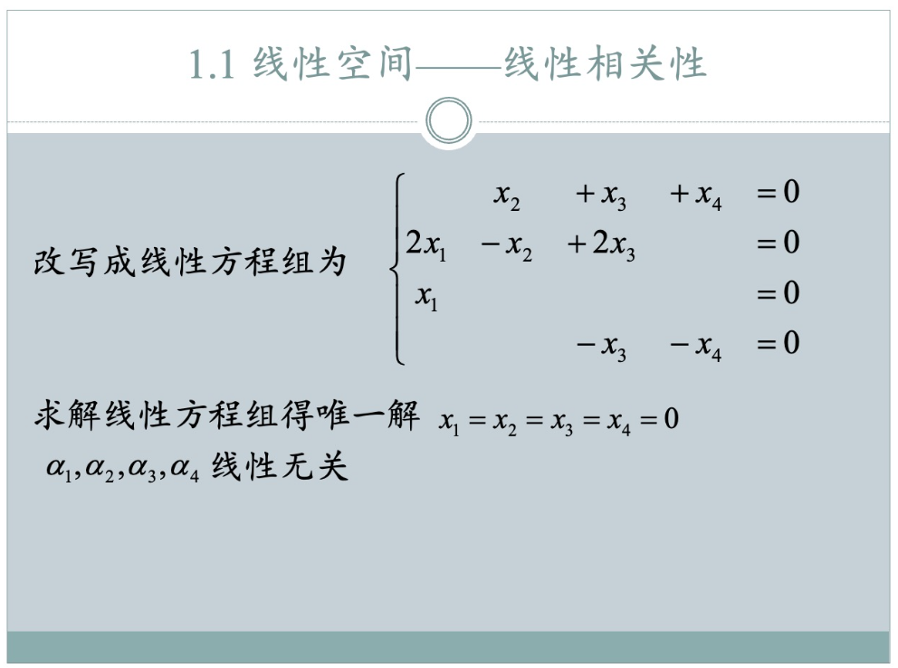

#### 问题复述

在四维空间 `R⁴` 中，给定以下四个向量：

$$
\alpha_1 = \begin{pmatrix} 0 \\ 2 \\ 1 \\ 0 \end{pmatrix}, \quad \alpha_2 = \begin{pmatrix} 1 \\ -1 \\ 0 \\ 0 \end{pmatrix}, \quad \alpha_3 = \begin{pmatrix} 1 \\ 2 \\ 0 \\ -1 \end{pmatrix}, \quad \alpha_4 = \begin{pmatrix} 1 \\ 0 \\ 0 \\ 1 \end{pmatrix}
$$

请求讨论这组向量的线性相关性。

#### 题解

为了讨论向量组 `α₁, α₂, α₃, α₄` 的线性相关性，我们可以将这些向量作为列向量构成一个矩阵 `A`，然后通过求该矩阵的秩来判断。

**方法：**
如果矩阵 `A` 的秩 `r(A)` 小于向量的个数（即 `r(A) < 4`），则向量组线性相关。
如果矩阵 `A` 的秩 `r(A)` 等于向量的个数（即 `r(A) = 4`），则向量组线性无关。

**步骤如下：**

1.  **构建矩阵 A**
    将向量 `α₁, α₂, α₃, α₄` 作为列向量，构成矩阵 `A`：
    $$
    A = (\alpha_1, \alpha_2, \alpha_3, \alpha_4) = \begin{pmatrix} 0 & 1 & 1 & 1 \\ 2 & -1 & 2 & 0 \\ 1 & 0 & 0 & 0 \\ 0 & 0 & -1 & 1 \end{pmatrix}
    $$

2.  **进行初等行变换**
    我们的目标是将矩阵 `A` 化为阶梯形矩阵，以确定其秩。

    将第1行与第3行互换 (`r₁ ↔ r₃`)：
    $$
    \begin{pmatrix} 1 & 0 & 0 & 0 \\ 2 & -1 & 2 & 0 \\ 0 & 1 & 1 & 1 \\ 0 & 0 & -1 & 1 \end{pmatrix}
    $$

    将第2行减去2倍的第1行 (`r₂ - 2r₁`)：
    $$
    \begin{pmatrix} 1 & 0 & 0 & 0 \\ 0 & -1 & 2 & 0 \\ 0 & 1 & 1 & 1 \\ 0 & 0 & -1 & 1 \end{pmatrix}
    $$

    将第3行加上第2行 (`r₃ + r₂`)：
    $$
    \begin{pmatrix} 1 & 0 & 0 & 0 \\ 0 & -1 & 2 & 0 \\ 0 & 0 & 3 & 1 \\ 0 & 0 & -1 & 1 \end{pmatrix}
    $$

    将第4行乘以3，再加上第3行 (`3r₄ + r₃`)：
    $$
    \begin{pmatrix} 1 & 0 & 0 & 0 \\ 0 & -1 & 2 & 0 \\ 0 & 0 & 3 & 1 \\ 0 & 0 & 0 & 4 \end{pmatrix}
    $$

3.  **确定秩并得出结论**
    经过初等行变换，我们得到了一个阶梯形矩阵。该矩阵有4个非零行。因此，矩阵 `A` 的秩为4。
    $$
    r(A) = 4
    $$

    由于矩阵的秩等于向量的个数（`r(A) = 4`），所以该向量组线性无关。

**结论：** 向量组 `α₁, α₂, α₃, α₄` 是线性无关的。

###  题型：线性空间的基

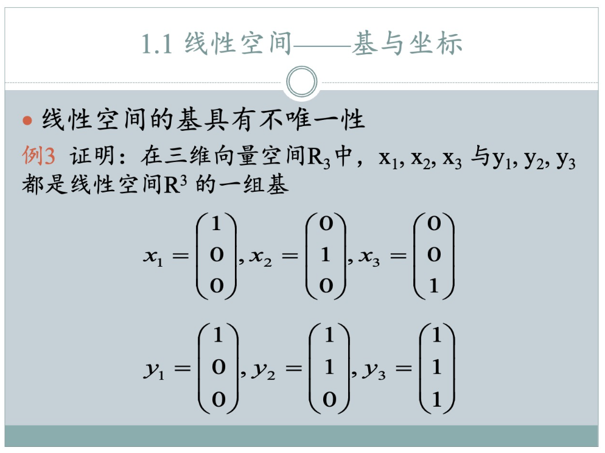

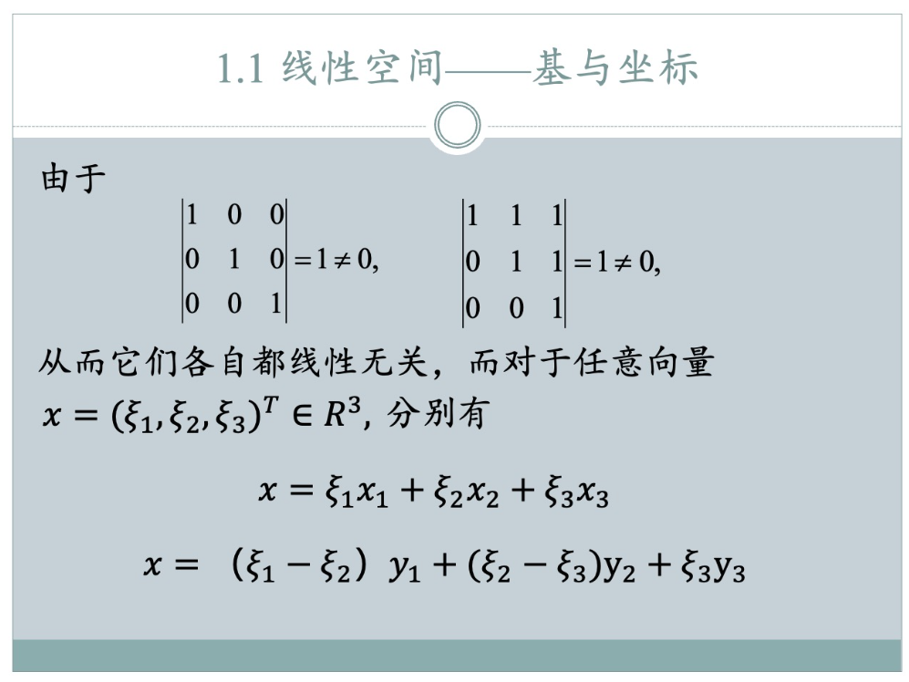

#### 问题复述

**例3** 证明：在三维向量空间 `R³` 中，向量组 `x₁, x₂, x₃` 与向量组 `y₁, y₂, y₃` 都是线性空间 `R³` 的一组基。

其中，向量组 `x` 为：
$$
x_1 = \begin{pmatrix} 1 \\ 0 \\ 0 \end{pmatrix}, \quad x_2 = \begin{pmatrix} 0 \\ 1 \\ 0 \end{pmatrix}, \quad x_3 = \begin{pmatrix} 0 \\ 0 \\ 1 \end{pmatrix}
$$

向量组 `y` 为：
$$
y_1 = \begin{pmatrix} 1 \\ 0 \\ 0 \end{pmatrix}, \quad y_2 = \begin{pmatrix} 1 \\ 1 \\ 0 \end{pmatrix}, \quad y_3 = \begin{pmatrix} 1 \\ 1 \\ 1 \end{pmatrix}
$$

#### 题解

根据线性空间基的定义，要证明一个向量组是 `n` 维空间 `Rⁿ` 的基，需要证明这个向量组由 `n` 个线性无关的向量构成。本题是在 `R³` 空间中，因此我们需要证明这两个向量组分别由3个线性无关的向量构成。

判断 `n` 个 `n` 维向量是否线性无关，可以把它们构成一个 `n x n` 的矩阵，如果该矩阵的秩等于 `n` (即满秩)，则向量组线性无关。我们将使用初等行变换求秩的方法来证明。

1. **证明向量组 `x₁, x₂, x₃` 是 `R³` 的一组基**

首先，将向量 `x₁, x₂, x₃` 作为列向量构成矩阵 `A`：
$$
A = (x_1, x_2, x_3) = \begin{pmatrix} 1 & 0 & 0 \\ 0 & 1 & 0 \\ 0 & 0 & 1 \end{pmatrix}
$$
这个矩阵是三阶单位矩阵，其本身就是一个最简阶梯形矩阵。矩阵中非零行的数量为3，因此矩阵 `A` 的秩为3。
$$
r(A) = 3
$$
由于矩阵 `A` 的秩等于向量的个数 (3)，也等于空间的维数 (3)，所以向量组 `x₁, x₂, x₃` 线性无关。

因此，向量组 `{x₁, x₂, x₃}` 是 `R³` 的一组基。

**2. 证明向量组 `y₁, y₂, y₃` 是 `R³` 的一组基**

接着，将向量 `y₁, y₂, y₃` 作为列向量构成矩阵 `B`：
$$
B = (y_1, y_2, y_3) = \begin{pmatrix} 1 & 1 & 1 \\ 0 & 1 & 1 \\ 0 & 0 & 1 \end{pmatrix}
$$
这个矩阵已经是一个上三角矩阵，也是一个阶梯形矩阵。我们可以清楚地看到，矩阵中非零行的数量为3。因此，矩阵 `B` 的秩为3。
$$
r(B) = 3
$$
由于矩阵 `B` 的秩等于向量的个数 (3)，也等于空间的维数 (3)，所以向量组 `y₁, y₂, y₃` 线性无关。

因此，向量组 `{y₁, y₂, y₃}` 也是 `R³` 的一组基。

**结论：**
通过初等行变换求秩的方法，我们证明了矩阵 `A` 和矩阵 `B` 都是满秩的，从而说明了向量组 `{x₁, x₂, x₃}` 和 `{y₁, y₂, y₃}` 都是线性无关的。因此，它们都是三维向量空间 `R³` 的基。这也验证了线性空间的基不唯一。

好的，我们来详细解答这道关于子空间运算的题目，并按照要求使用初等行变换的方法求解。

### 交空间、和空间

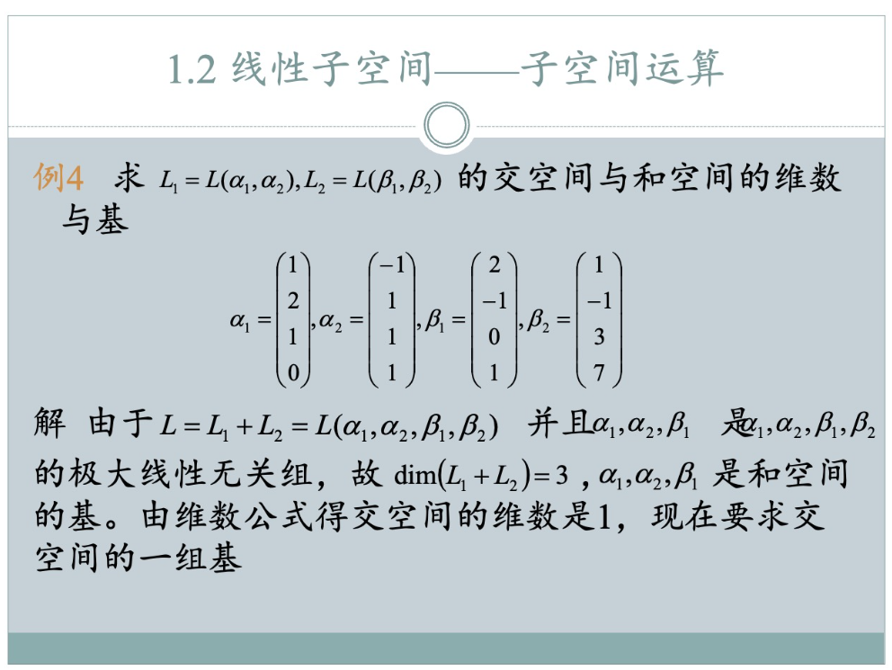

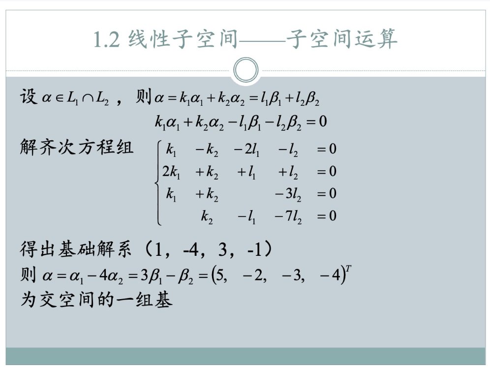

#### 问题复述

**例4** 已知四维空间 `R⁴` 中的两个子空间：
`L₁` 是由向量 `α₁, α₂` 生成的子空间，记为 `L₁ = L(α₁, α₂)`.
`L₂` 是由向量 `β₁, β₂` 生成的 " " " " ，记为 `L₂ = L(β₁, β₂)`.

其中向量为：
$$
\alpha_1 = \begin{pmatrix} 1 \\ 2 \\ 1 \\ 0 \end{pmatrix}, \quad \alpha_2 = \begin{pmatrix} -1 \\ 1 \\ 1 \\ 1 \end{pmatrix}, \quad \beta_1 = \begin{pmatrix} 2 \\ -1 \\ 0 \\ 1 \end{pmatrix}, \quad \beta_2 = \begin{pmatrix} 1 \\ -1 \\ 3 \\ 7 \end{pmatrix}
$$

请求出它们的**和空间** `L₁ + L₂` 与**交空间** `L₁ ∩ L₂` 的维数与一组基。

#### 题解

#### 1. 求解和空间 `L₁ + L₂` 的维数与基

和空间 `L₁ + L₂`是由 `L₁` 和 `L₂` 的所有生成向量 `α₁, α₂, β₁, β₂` 共同生成的线性空间。即：
$$
L_1 + L_2 = L(\alpha_1, \alpha_2, \beta_1, \beta_2)
$$
为了求其维数和基，我们需要从这四个向量中找出一个极大线性无关组。我们采用初等行变换求秩的方法。

**步骤：**
将向量 `α₁, α₂, β₁, β₂` 作为**列向量**构成矩阵A，然后对其进行初等行变换，化为阶梯形矩阵。

$$
A = (\alpha_1, \alpha_2, \beta_1, \beta_2) = \begin{pmatrix} 1 & -1 & 2 & 1 \\ 2 & 1 & -1 & -1 \\ 1 & 1 & 0 & 3 \\ 0 & 1 & 1 & 7 \end{pmatrix}
$$

进行初等行变换：
$$
\begin{pmatrix} 1 & -1 & 2 & 1 \\ 2 & 1 & -1 & -1 \\ 1 & 1 & 0 & 3 \\ 0 & 1 & 1 & 7 \end{pmatrix} \xrightarrow[r_3-r_1]{r_2-2r_1} \begin{pmatrix} 1 & -1 & 2 & 1 \\ 0 & 3 & -5 & -3 \\ 0 & 2 & -2 & 2 \\ 0 & 1 & 1 & 7 \end{pmatrix} \xrightarrow{r_2 \leftrightarrow r_4} \begin{pmatrix} 1 & -1 & 2 & 1 \\ 0 & 1 & 1 & 7 \\ 0 & 2 & -2 & 2 \\ 0 & 3 & -5 & -3 \end{pmatrix}
$$
$$
\xrightarrow[r_4-3r_2]{r_3-2r_2} \begin{pmatrix} 1 & -1 & 2 & 1 \\ 0 & 1 & 1 & 7 \\ 0 & 0 & -4 & -12 \\ 0 & 0 & -8 & -24 \end{pmatrix} \xrightarrow[r_4-2r_3]{r_3 \div (-4)} \begin{pmatrix} 1 & -1 & 2 & 1 \\ 0 & 1 & 1 & 7 \\ 0 & 0 & 1 & 3 \\ 0 & 0 & 0 & 0 \end{pmatrix}
$$
矩阵 `A` 的秩 `r(A) = 3`，因为阶梯形矩阵有3个非零行。
这说明向量组 `α₁, α₂, β₁, β₂` 的极大线性无关组包含3个向量。阶梯形矩阵的主元（首个非零元）分别位于第1、2、3列，因此原矩阵的前三个向量 `α₁, α₂, β₁` 构成一个极大线性无关组。

**结论 (和空间):**
*   和空间 `L₁ + L₂` 的维数是 `dim(L₁ + L₂) = r(A) = 3`。
*   和空间 `L₁ + L₂` 的一组基是 `{α₁, α₂, β₁}`。

#### 2. 求解交空间 `L₁ ∩ L₂` 的维数与基

首先，利用维数公式计算交空间的维数：
$$
\dim(L_1 \cap L_2) = \dim(L_1) + \dim(L_2) - \dim(L_1 + L_2)
$$
`L₁` 由两个线性无关的向量 `α₁, α₂` 生成，`L₂` 由两个线性无关的向量 `β₁, β₂` 生成，所以 `dim(L₁) = 2`，`dim(L₂) = 2`。
$$
\dim(L_1 \cap L_2) = 2 + 2 - 3 = 1
$$
交空间的维数是1，因此其基只包含一个非零向量。

**步骤：**
设任意一个向量 `α ∈ L₁ ∩ L₂`。
因为 `α ∈ L₁`，所以 `α` 可以表示为 `α = k₁α₁ + k₂α₂`。
因为 `α ∈ L₂`，所以 `α` 可以表示为 `α = l₁β₁ + l₂β₂`。
因此，我们有：
$$
k_1\alpha_1 + k_2\alpha_2 = l_1\beta_1 + l_2\beta_2
$$
$$
k_1\alpha_1 + k_2\alpha_2 - l_1\beta_1 - l_2\beta_2 = 0
$$
这是一个关于 `k₁, k₂, l₁, l₂` 的齐次线性方程组。将向量坐标代入，得到：
$$
\begin{cases} k_1 - k_2 - 2l_1 - l_2 = 0 \\ 2k_1 + k_2 + l_1 + l_2 = 0 \\ k_1 + k_2 - 3l_2 = 0 \\ k_2 - l_1 - 7l_2 = 0 \end{cases}
$$
其系数矩阵正是我们在第一步中进行行变换的矩阵 `A` 的转置（或者说，如果我们对行向量组成的矩阵进行变换，会得到相同的结果）。我们可以直接解这个方程组（解法与对矩阵A的行变换过程一致）。将系数矩阵化为阶梯形：
$$
\begin{pmatrix} 1 & -1 & -2 & -1 \\ 2 & 1 & 1 & 1 \\ 1 & 1 & 0 & -3 \\ 0 & 1 & -1 & -7 \end{pmatrix} \rightarrow \begin{pmatrix} 1 & -1 & -2 & -1 \\ 0 & 1 & -1 & -7 \\ 0 & 0 & 1 & 3 \\ 0 & 0 & 0 & 0 \end{pmatrix}
$$
由此得到方程组：
$$
\begin{cases} k_1 - k_2 - 2l_1 - l_2 = 0 \\ k_2 - l_1 - 7l_2 = 0 \\ l_1 + 3l_2 = 0 \end{cases}
$$
取自由变量 `l₂ = -1` (为方便计算，也可以取1)，则：
*   `l₁ = -3l₂ = 3`
*   `k₂ = l₁ + 7l₂ = 3 + 7(-1) = -4`
*   `k₁ = k₂ + 2l₁ + l₂ = -4 + 2(3) + (-1) = 1`

我们得到了方程组的一组非零解 `(k₁, k₂, l₁, l₂) = (1, -4, 3, -1)`。
将 `k₁`, `k₂` 的值代入 `α = k₁α₁ + k₂α₂`：
$$
\alpha = 1 \cdot \alpha_1 - 4 \cdot \alpha_2 = 1 \begin{pmatrix} 1 \\ 2 \\ 1 \\ 0 \end{pmatrix} - 4 \begin{pmatrix} -1 \\ 1 \\ 1 \\ 1 \end{pmatrix} = \begin{pmatrix} 1+4 \\ 2-4 \\ 1-4 \\ 0-4 \end{pmatrix} = \begin{pmatrix} 5 \\ -2 \\ -3 \\ -4 \end{pmatrix}
$$
这个向量 `α` 就是交空间 `L₁ ∩ L₂` 的一个基。

**结论 (交空间):**

*   交空间 `L₁ ∩ L₂` 的维数是 `1`。
*   交空间 `L₁ ∩ L₂` 的一组基是$ \left\{ \begin{pmatrix} 5 \\ -2 \\ -3 \\ -4 \end{pmatrix} \right\}$。

---
## 题解：题型：线性映射例题

### 例题：用定义证明是一个线性映射

好的，我们来根据PPT中提供的定义，为这两个例子写出详细的题解。

PPT的核心定义是：
一个映射 `T: V → W` 是**线性映射**，如果对于任意向量 `x₁, x₂ ∈ V` 和任意标量 `λ, μ`，都满足：
$$
T(\lambda x_1 + \mu x_2) = \lambda T(x_1) + \mu T(x_2)
$$
特别地，当 `V = W` 时，这个线性映射也称为**线性变换**。

#### 例3 题解

**问题**：证明求导运算 `T = d/dx` 是多项式空间 `Cₙ[x]` 上的线性变换。

**证明**：

1.  **明确定义域和到达域**
    
    *   **线性空间 `V`**：`Cₙ[x]`，即所有次数不超过 `n` 的复系数多项式的集合。
    *   **映射 `T`**：`T(p(x)) = p'(x)`，即对多项式 `p(x)` 进行求导。
    *   一个次数不超过 `n` 的多项式，其导数是一个次数不超过 `n-1` 的多项式。这个结果仍然属于 `Cₙ[x]` 空间。因此，映射 `T` 是从 `Cₙ[x]` 到 `Cₙ[x]` 的，即 `T: Cₙ[x] → Cₙ[x]`。由于定义域和到达域是同一个空间，我们只需证明 `T` 是线性映射，即可得出它是线性变换的结论。
    
2.  **验证线性性质**
    设 `p₁(x)` 和 `p₂(x)` 是空间 `Cₙ[x]` 中的任意两个多项式，并设 `λ` 和 `μ` 是数域 `C` (复数) 中的任意两个标量。

    根据线性映射的定义，我们需要验证 `T(λp₁(x) + μp₂(x)) = λT(p₁(x)) + μT(p₂(x))` 是否成立。

    *   **计算等式左边**：
        $$
        T(\lambda p_1(x) + \mu p_2(x))
        $$
        根据映射 `T` 的定义（求导），上式等于：
        $$
        = \frac{d}{dx} (\lambda p_1(x) + \mu p_2(x))
        $$
        根据高等数学中导数的基本运算法则（和的导数等于导数的和，常数因子可以提出），我们得到：
        $$
        = \lambda \frac{d}{dx}p_1(x) + \mu \frac{d}{dx}p_2(x)
        $$
        这等于：
        $$
        = \lambda p_1'(x) + \mu p_2'(x)
        $$

    *   **计算等式右边**：
        $$
        \lambda T(p_1(x)) + \mu T(p_2(x))
        $$
        根据映射 `T` 的定义，`T(p₁(x)) = p₁'(x)` 且 `T(p₂(x)) = p₂'(x)`，所以上式等于：
        $$
        = \lambda p_1'(x) + \mu p_2'(x)
        $$

    *   **比较结果**：
        等式左边与右边相等。

3.  **得出结论**
    由于 `T(λp₁(x) + μp₂(x)) = λT(p₁(x)) + μT(p₂(x))` 恒成立，所以 `T` 是一个线性映射。又因为该映射的定义域和到达域都是 `Cₙ[x]`，所以 `T` 是 `Cₙ[x]` 上的一个**线性变换**。

#### 例4 题解

**问题**：证明在闭区间 `[a,b]` 上的所有连续函数的集合 `C[a,b]` 中，积分运算 `T(f(x)) = ∫[a,b] f(x) dx` 是线性映射。

**证明**：

1. **明确定义域和到达域**
   *   **线性空间 `V`**：`C[a,b]`，即所有在闭区间 `[a,b]` 上连续的实函数构成的集合。
   *   **映射 `T`**：`T(f(x)) = ∫[a,b] f(x) dx`，即对函数 `f(x)` 进行定积分。
   *   对于 `C[a,b]` 中的任意函数 `f(x)`，其在 `[a,b]` 上的定积分是一个确定的实数。因此，该映射是从函数空间 `C[a,b]` 映射到实数域 `R`（`R` 本身也是一个一维线性空间）。即 `T: C[a,b] → R`。由于定义域和到达域是不同的空间，我们只需证明其为线性映射。

2. **验证线性性质**
   设 `f(x)` 和 `g(x)` 是空间 `C[a,b]` 中的任意两个函数，并设 `λ` 和 `μ` 是数域 `R` (实数) 中的任意两个标量。

   根据线性映射的定义，我们需要验证 `T(λf(x) + μg(x)) = λT(f(x)) + μT(g(x))` 是否成立。

   *   **计算等式左边**：
       $$
       T(\lambda f(x) + \mu g(x))
       $$
       根据映射 `T` 的定义（定积分），上式等于：
       $$
       = \int_a^b [\lambda f(x) + \mu g(x)] dx
       $$
       根据定积分的基本性质（被积函数的线性组合的积分等于积分的线性组合），我们得到：
       $$
       = \lambda \int_a^b f(x) dx + \mu \int_a^b g(x) dx
       $$

   *   **计算等式右边**：
       $$
       \lambda T(f(x)) + \mu T(g(x))
       $$
       根据映射 `T` 的定义，`T(f(x)) = ∫[a,b] f(x) dx` 且 `T(g(x)) = ∫[a,b] g(x) dx`，所以上式等于：
       $$
       = \lambda \int_a^b f(x) dx + \mu \int_a^b g(x) dx
       $$

   *   **比较结果**：
       等式左边与右边相等。

3. **得出结论**
   由于 `T(λf(x) + μg(x)) = λT(f(x)) + μT(g(x))` 恒成立，所以 `T` 是一个**线性映射**。因为它将一个函数空间映射到了一个数域空间，定义域与到达域不同，所以它不是线性变换。

### 题型：求线性映射的矩阵

#### 基本概念：什么叫做线性映射的矩阵

“T 关于基B和基C的矩阵”（我们称之为 `A`）就是一个**翻译器**或**转换规则**。它的作用是：

> 你给我一个向量 `v` 在**起点基B**下的坐标，我用这个矩阵 `A` 乘以你的坐标，就能得到 `v` 经过 `T` 映射后的结果 `T(v)` 在**终点基C**下的坐标。

#### 求线性映射矩阵的一般方法

设 `T: V → W` 是一个线性映射，`B = {v₁, v₂, ..., vₙ}` 是起点空间 `V` 的一组基，`C = {w₁, w₂, ..., wₘ}` 是终点空间 `W` 的一组基。求 `T` 关于基 `B` 和 `C` 的矩阵 `A` 的步骤如下：

1.  **取**：依次取出起点基 `B` 中的每一个向量 `vⱼ` (其中 `j` 从 1 到 `n`)。
2.  **映射**：对每一个 `vⱼ`，计算它在映射 `T` 下的像 `T(vⱼ)`。
3.  **分解**：将得到的像 `T(vⱼ)` 表示为终点基 `C` 的唯一线性组合，从而得到其在基 `C` 下的坐标向量。
4.  **放置**：将这个坐标向量作为矩阵 `A` 的**第 `j` 列**。

重复以上步骤，直到起点基 `B` 中的所有向量都被处理完毕，即可得到完整的矩阵 `A`。

#### 问题复述与概念解释

**例 3.33** 设 `T ∈ L(F², F³)` 定义如下：
$$
T(x, y) = (x + 3y, 2x + 5y, 7x + 9y)
$$
求 `T` 关于 `F²` 和 `F³` 的标准基的矩阵。

---

**概念解释:**

1.  **`F²` 和 `F³` 是什么？**
    *   `F` 代表一个**数域 (Field)**，你可以把它想象成一个数的集合，在其中可以进行加、减、乘、除运算（除数不为零）。最常见的数域是实数域 `R` 和复数域 `C`。
    *   `F²` 是指数域 `F` 上的**二维向量空间**。空间中的每一个向量都是一个有序对 `(x, y)`，其中 `x` 和 `y` 都是数域 `F` 中的数。
    *   `F³` 类似地是数域 `F` 上的**三维向量空间**，其中的向量是有序三元组 `(a, b, c)`。

2.  **符号 `L(F², F³)` 是什么？**
    *   这个符号读作 "L of F-squared, F-cubed"。
    *   `L(V, W)` 表示从向量空间 `V` 到向量空间 `W` 的**所有线性映射 (Linear maps) 的集合**。
    *   因此，`T ∈ L(F², F³)` 的意思是：`T` 是一个从二维空间 `F²` 映射到三维空间 `F³` 的线性映射。

#### 题解

**目标**：求线性映射 `T` 在 `F²` 和 `F³` 的标准基下的矩阵表示。

**核心思想**：
一个线性映射的矩阵表示，是通过观察这个映射如何作用于**定义域**的基向量，然后将结果用**到达域**的基向量来表示，最后将这些表示结果的坐标作为矩阵的**列**来构建的。

**步骤 1：写出定义域和到达域的标准基**

*   **定义域 `F²` 的标准基** 是 `{e₁, e₂}`，其中：
    $$
    e_1 = (1, 0), \quad e_2 = (0, 1)
    $$
*   **到达域 `F³` 的标准基** 是 `{f₁, f₂, f₃}`，其中：
    $$
    f_1 = (1, 0, 0), \quad f_2 = (0, 1, 0), \quad f_3 = (0, 0, 1)
    $$

**步骤 2：计算定义域的基向量经过映射 `T` 后的像**

*   **将第一个基向量 `e₁ = (1, 0)` 代入 `T`：**
    （令 `x=1`, `y=0`）
    $$
    T(e_1) = T(1, 0) = (1 + 3(0), 2(1) + 5(0), 7(1) + 9(0)) = (1, 2, 7)
    $$

*   **将第二个基向量 `e₂ = (0, 1)` 代入 `T`：**
    （令 `x=0`, `y=1`）
    $$
    T(e_2) = T(0, 1) = (0 + 3(1), 2(0) + 5(1), 7(0) + 9(1)) = (3, 5, 9)
    $$

**步骤 3：构建矩阵**

矩阵的**第 `i` 列**是 `T(eᵢ)` 在到达域标准基下的坐标向量。

*   `T(e₁) = (1, 2, 7)`。这个向量在 `F³` 标准基下的坐标就是 `(1, 2, 7)`。这个坐标向量成为矩阵的**第一列**。

*   `T(e₂) = (3, 5, 9)`。这个向量在 `F³` 标准基下的坐标就是 `(3, 5, 9)`。这个坐标向量成为矩阵的**第二列**。

将这两列组合起来，我们得到 `T` 的矩阵表示 `M(T)`：
$$
M(T) = \begin{pmatrix} 1 & 3 \\ 2 & 5 \\ 7 & 9 \end{pmatrix}
$$

**结论：**
线性映射 `T` 关于 `F²` 和 `F³` 的标准基的矩阵是一个 `3 × 2` 矩阵，其形式为：
$$
M(T) = \begin{pmatrix} 1 & 3 \\ 2 & 5 \\ 7 & 9 \end{pmatrix}
$$

### 题型：求线性映射的矩阵。通用版：普通基

**让我们用上一题的线性映射 `T` 来举一个例子。**

*   **线性映射 T**: `T(x, y) = (x + 3y, 2x + 5y, 7x + 9y)`
*   **起点空间 `F²` 的基B**: 我们不用标准基，而是用 `B = { v₁, v₂ } = { (1, 1), (1, -1) }`。
*   **终点空间 `F³` 的基C**: 我们也不用标准基，而是用 `C = { w₁, w₂, w₃ } = { (1, 0, 0), (1, 1, 0), (1, 1, 1) }`。

**目标**：求 `T` 关于新基 `B` 和 `C` 的矩阵 `A`。

**求解步骤：**

**第1步：计算 `T(v₁)` 并求其在基 `C` 下的坐标。**
*   `v₁ = (1, 1)`
*   `T(v₁) = T(1, 1) = (1+3, 2+5, 7+9) = (4, 7, 16)`
*   **现在是关键**：我们要把 `(4, 7, 16)` 表示成基 `C` 的线性组合，即求 `a, b, c` 使得：
    `a*w₁ + b*w₂ + c*w₃ = (4, 7, 16)`
    `a(1,0,0) + b(1,1,0) + c(1,1,1) = (4, 7, 16)`
    `(a+b+c, b+c, c) = (4, 7, 16)`
*   这给了我们一个方程组：
    1.  `a + b + c = 4`
    2.  `b + c = 7`
    3.  `c = 16`
*   从下往上解得：`c = 16`, `b = 7 - 16 = -9`, `a = 4 - 7 = -3`。
*   所以，`T(v₁)` 在基 `C` 下的坐标是 `(-3, -9, 16)`。这就是矩阵 `A` 的**第一列**。

**第2步：计算 `T(v₂)` 并求其在基 `C` 下的坐标。**
*   `v₂ = (1, -1)`
*   `T(v₂) = T(1, -1) = (1-3, 2-5, 7-9) = (-2, -3, -2)`
*   同样，我们要把 `(-2, -3, -2)` 表示成基 `C` 的线性组合：
    `a*w₁ + b*w₂ + c*w₃ = (-2, -3, -2)`
    `(a+b+c, b+c, c) = (-2, -3, -2)`
*   解方程组：
    1.  `a + b + c = -2`
    2.  `b + c = -3`
    3.  `c = -2`
*   从下往上解得：`c = -2`, `b = -3 - (-2) = -1`, `a = -2 - (-3) = 1`。
*   所以，`T(v₂)` 在基 `C` 下的坐标是 `(1, -1, -2)`。这就是矩阵 `A` 的**第二列**。

**第3步：组合成最终的矩阵。**
将找到的两列坐标组合起来，得到最终的矩阵 `A`：
$$
A = \begin{pmatrix} -3 & 1 \\ -9 & -1 \\ 16 & -2 \end{pmatrix}
$$
这个矩阵就是 `T` 关于基 `B` 和 `C` 的矩阵表示。它看起来和标准基下的矩阵完全不同，但描述的是同一个线性映射

---
## 题解：证明：零空间的性质

### 题目

**问题**：
设 `V` 和 `W` 是两个向量空间，并设 `T₁: V → W` 和 `T₂: V → W` 是两个线性映射。
证明：`null(T₁) ⊆ null(T₂)` 当且仅当 存在一个线性映射 `S: W → W` 使得 `T₂ = S T₁`。

**符号解释**：

*   `null(T₁)`：`T₁` 的零空间，即 `V` 中所有被 `T₁` 映射到 `W` 中零向量的向量集合。
*   `⊆`：子集符号。`A ⊆ B` 意味着集合 `A` 中的每一个元素也都在集合 `B` 中。
*   `T₂ = S T₁`：这是映射的复合。它的意思是对于 `V` 中的任意向量 `v`，都有 `T₂(v) = S(T₁(v))`。即先对 `v` 应用 `T₁`，再对结果应用 `S`。

---

### 题解

这是一个“当且仅当”的证明，所以我们需要证明两个方向：

**第一部分 (⇐): 证明如果存在 `S` 使得 `T₂ = S T₁`，那么 `null(T₁) ⊆ null(T₂)`。**

这个方向比较直接，我们只需要使用定义即可。

**证明**：
1.  **假设**：存在一个线性映射 `S: W → W` 使得 `T₂ = S T₁`。
2.  **目标**：证明 `null(T₁) ⊆ null(T₂)`。为此，我们任取一个向量 `v ∈ null(T₁)`，并证明它也必须属于 `null(T₂)`。
3.  设 `v ∈ null(T₁)`。根据零空间的定义（如你的第二张PPT所示），这意味着 `T₁(v) = 0`。（这里的 `0` 是 `W` 空间中的零向量）。
4.  现在我们来计算 `T₂(v)`：
    $$
    T_2(v) = (S T_1)(v) = S(T_1(v))
    $$
5.  将 `T₁(v) = 0` 代入上式：
    $$
    T_2(v) = S(0)
    $$
6.  因为 `S` 是一个**线性映射**，它必须将零向量映射到零向量。所以 `S(0) = 0`。
7.  因此，`T₂(v) = 0`。
8.  根据零空间的定义，`T₂(v) = 0` 意味着 `v ∈ null(T₂)`。
9.  由于我们从任一 `v ∈ null(T₁)` 出发，都得到了 `v ∈ null(T₂)`，所以我们证明了 `null(T₁) ⊆ null(T₂)`。

**第二部分 (⇒): 证明如果 `null(T₁) ⊆ null(T₂)`，那么存在 `S` 使得 `T₂ = S T₁`。**

这个方向是证明的关键，需要我们**构造**出所需要的线性映射 `S`。

**证明**：
1.  **假设**：`null(T₁) ⊆ null(T₂)`。
2.  **目标**：构造一个线性映射 `S: W → W`，并证明它满足 `T₂ = S T₁`。

3.  **构造 `S` 的思路**：
    `S` 的作用是把 `T₁(v)` 变成 `T₂(v)`。所以，一个很自然的想法是，对于 `W` 空间中任何一个形如 `T₁(v)` 的向量 `w`，我们就定义 `S(w) = T₂(v)`。
    但是，`S` 必须被定义在整个 `W` 空间上，而不仅仅是 `T₁` 的像空间（值域）`Im(T₁)` 上。并且，这个定义必须是**明确的（well-defined）**。

4.  **证明定义的明确性（Well-definedness）**：
    我们需要处理一个问题：如果 `W` 中有一个向量 `w`，它既可以写成 `T₁(v₁)`，又可以写成 `T₁(v₂)`，我们定义的 `S(w)` 到底是 `T₂(v₁)`还是 `T₂(v₂)`？我们必须证明 `T₂(v₁) = T₂(v₂)`，否则我们的定义就是矛盾的。
    *   假设 `w = T₁(v₁) = T₁(v₂)`。
    *   那么 `T₁(v₁) - T₁(v₂) = 0`。由于 `T₁` 是线性的，所以 `T₁(v₁ - v₂) = 0`。
    *   根据零空间的定义，这意味着 `(v₁ - v₂) ∈ null(T₁)`。
    *   现在，使用我们的核心**假设**：`null(T₁) ⊆ null(T₂)`。因此，`(v₁ - v₂) ∈ null(T₂)`。
    *   再次根据零空间的定义，`T₂(v₁ - v₂) = 0`。
    *   由于 `T₂` 是线性的，所以 `T₂(v₁) - T₂(v₂) = 0`，即 `T₂(v₁) = T₂(v₂)`。
    *   **这就证明了我们的定义是明确的**。对于 `Im(T₁)` 中的任何一个向量 `w`，无论它是由哪个 `v` 通过 `T₁` 映射而来，我们定义的 `S(w)` 的结果都是唯一的。

5.  **定义 `S`**：
    *   **第一步**：在子空间 `Im(T₁)` 上定义 `S`。对于任何 `w ∈ Im(T₁)`，存在 `v ∈ V` 使得 `w = T₁(v)`。我们定义 `S(w) = T₂(v)`。
    *   **第二步**：将 `S` 的定义域扩展到整个 `W` 空间。
        取 `Im(T₁)` 的一组基 `{b₁, b₂, ..., bₖ}`。
        将这组基扩展为整个 `W` 空间的一组基 `{b₁, ..., bₖ, c₁, ..., cⱼ}`。
        我们已经定义了 `S` 在 `{bᵢ}` 上的作用。对于新增的基向量 `{cᵢ}`，我们可以任意定义 `S` 的作用。最简单的方式是定义 `S(cᵢ) = 0`。
    *   **第三步**：根据线性映射的基本定理，一个映射在基上的定义可以唯一地线性扩展到整个空间。因此，我们已经成功地在整个 `W` 空间上定义了一个线性映射 `S`。

6.  **验证 `T₂ = S T₁`**：
    我们需要验证对于任意 `v ∈ V`，`T₂(v) = S(T₁(v))` 都成立。
    *   取任意 `v ∈ V`。
    *   令 `w = T₁(v)`。显然 `w ∈ Im(T₁)`。
    *   根据我们在 `Im(T₁)` 上对 `S` 的定义，我们有 `S(w) = T₂(v)`。
    *   将 `w = T₁(v)` 代入，得到 `S(T₁(v)) = T₂(v)`。
    *   这正是 `T₂ = S T₁` 的定义。

**结论**：我们已经证明了两个方向，因此原命题成立。

---
## 题解：题型：完全和约化SVD分解

### 题型：求完全和约化SVD分解

注意：不同教材对于**约化**的定义可能不同，按照ppt上的来。

### SVD分解考场解法 

**目标：** 将矩阵 A (m x n) 分解为 `A = UΣVᵀ`，关键：$AV=U \Sigma$，$VV^T=I$

#### 第0步：如果A是横着的，可以求Aᵀ的SVD分解

如果矩阵 $A$ 的SVD分解是：
$$ A = U \Sigma V^T $$
那么它的转置矩阵 $A^T$ 的SVD分解就是：
$$ A^T = (U \Sigma V^T)^T = (V^T)^T \Sigma^T U^T = V \Sigma^T U^T $$

所以，求出Aᵀ的SVD分解，然后**U、V互换，Σ取转置**，就可以得到A的U、V、Σ。

#### **第一步：求 V 和 Σ₁**

1.  **计算 `B = AᵀA`**。(提示：**AᵀA和AAᵀ的**非零特征值是相同的，所以可以先把**AᵀA和AAᵀ**都求出来放着)
2.  **求 `B` 的特征值 `λ`**，并**从大到小**排列：`λ₁ ≥ λ₂ ≥ ... ≥ λᵣ > 0`，以及 `r` 个之后的零特征值。
3.  **求非零奇异值 `σᵢ = √λᵢ`**。
4.  **构造核心的 $Σ_1$ 矩阵**：
    *   这是一个 `r x r` 的**对角方阵**，对角线元素为 `σ₁`, `σ₂`, ...$σ_r$。
    *   计算它的逆 $Σ_1^{⁻¹}$ (这很简单，只需将对角线元素取倒数即可)。
5.  **求 `V` 矩阵**：
    *   求出所有特征值 `λᵢ` 对应的**单位化**特征向量 `vᵢ`。
    *   将这些 `vᵢ` **按 `λ` 的顺序**作为**列向量**，组成正交矩阵 `V`。
    *   **切分 `V`**：将 `V` 分为两部分，`V = [V₁ | V₂]`。
        *   `V₁` (n x r): 对应**非零**特征值的前 `r` 个列向量。
        *   `V₂` (n x (n-r)): 对应**零**特征值的后 `n-r` 个列向量。

#### **第二步：求 U₁ 和 U₂**

1.  **计算 `U₁` (对应非零奇异值的部分)**：
    *   使用矩阵公式： **`U₁ = AV₁Σ₁⁻¹`**
    *   `U₁` 是一个 `m x r` 的矩阵，它的列向量是标准正交的。

2.  **计算 `U₂` **：
    *   `U₂` 的列向量构成了 `Aᵀ` 的零空间 (`Null(Aᵀ)`) 的一组标准正交基。
    *   **求解方程组 `AAᵀy = 0`**，得到其基础解系。
    *   将这组基础解系**单位正交化** (Gram-Schmidt)，得到的列向量就组成了 `U₂`(**AAᵀ零空间的标准正交基**)。
    *   `U₂` 是一个 `m x (m-r)` 的矩阵。

#### **第三步：组装最终结果**

1.  **组合 `U` 矩阵**：
    *   将 `U₁` 和 `U₂` 按列合并：**`U = [U₁ | U₂]`**。
    *   `U` 是一个 `m x m` 的正交矩阵。

2.  **构造最终的 `Σ` 矩阵**：
    *   创建一个 `m x n` 的全零矩阵 (与A同型)。
    *   将奇异值从大到小填在对角线上。

3.  **写出最终答案**：
    *   **完全SVD**：`A = UΣVᵀ`，`A(m x n) = U(m x m) Σ(m x n) Vᵀ(n x n)`。其中U和V都是方阵，Σ和A同形。
    *   **约化SVD** ：移除 $\Sigma$ 中比方阵多出的为0的行或列，并同时移除 $U$ 或 $V$ 中对应的列，具体移除哪一个取决于如何让矩阵乘法可以正常进行。 对于竖矩阵：`A(m x n) = U(m x n) Σ(n x n) Vᵀ(n x n)`。
    *   **截断SVD(k=r)**：`A = U₁Σ₁V₁ᵀ`，等价于约化SVD基础上移除为0的$\sigma_i$，以及对应的$u_i$和$v_i$。`A(m x n) = U(m x r) Σ(r x r) Vᵀ(r x n)`。

### 完全和约化SVD分解的区别

**给定矩阵：**
$$ A = \begin{pmatrix} 1 & 0 & 1 \\ 0 & 1 & 1 \\ 0 & 0 & 0 \end{pmatrix} $$
这是一个 3x3 矩阵，所以 m=3, n=3。

---

### **第一步：求 V 和 Σ₁**

1.  **计算 `B = AᵀA`**
    $$ A^T = \begin{pmatrix} 1 & 0 & 0 \\ 0 & 1 & 0 \\ 1 & 1 & 0 \end{pmatrix} $$
    $$ B = A^T A = \begin{pmatrix} 1 & 0 & 0 \\ 0 & 1 & 0 \\ 1 & 1 & 0 \end{pmatrix} \begin{pmatrix} 1 & 0 & 1 \\ 0 & 1 & 1 \\ 0 & 0 & 0 \end{pmatrix} = \begin{pmatrix} 1 & 0 & 1 \\ 0 & 1 & 1 \\ 1 & 1 & 2 \end{pmatrix} $$
    这与PPT中的结果一致。

2.  **求 `B` 的特征值 `λ`**
    求解 `det(B - λI) = 0`:
    $$ \begin{vmatrix} 1-\lambda & 0 & 1 \\ 0 & 1-\lambda & 1 \\ 1 & 1 & 2-\lambda \end{vmatrix} = (1-\lambda)((1-\lambda)(2-\lambda)-1) - 0 + 1(0 - (1-\lambda)) = 0 $$
    $$ (1-\lambda)(\lambda^2 - 3\lambda + 1) - (1-\lambda) = 0 $$
    $$ (1-\lambda)(\lambda^2 - 3\lambda + 1 - 1) = 0 $$
    $$ (1-\lambda)(\lambda^2 - 3\lambda) = 0 $$
    $$ \lambda(1-\lambda)(\lambda-3) = 0 $$
    特征值为 `λ = 3, 1, 0`。
    从大到小排列：`λ₁ = 3`, `λ₂ = 1`, `λ₃ = 0`。非零特征值的个数 `r = 2`。

3.  **求非零奇异值 `σᵢ = √λᵢ`**
    *   `σ₁ = √λ₁ = √3`
    *   `σ₂ = √λ₂ = √1 = 1`

4.  **构造核心的 `Σ₁` 及其逆矩阵**
    `Σ₁` 是 `r x r` (2x2) 的对角方阵：
    $$ \Sigma_1 = \begin{pmatrix} \sqrt{3} & 0 \\ 0 & 1 \end{pmatrix}, \quad \Sigma_1^{-1} = \begin{pmatrix} \frac{1}{\sqrt{3}} & 0 \\ 0 & 1 \end{pmatrix} $$

5.  **求 `V` 矩阵（单位化的特征向量）**
    *   **对于 `λ₁ = 3`**: 解 `(B - 3I)x = 0`
        $$ \begin{pmatrix} -2 & 0 & 1 \\ 0 & -2 & 1 \\ 1 & 1 & -1 \end{pmatrix} \begin{pmatrix} x_1 \\ x_2 \\ x_3 \end{pmatrix} = \begin{pmatrix} 0 \\ 0 \\ 0 \end{pmatrix} \implies \text{特征向量 } \beta_1 = \begin{pmatrix} 1 \\ 1 \\ 2 \end{pmatrix} $$
        单位化：$v_1 = \frac{1}{\sqrt{1^2+1^2+2^2}} \beta_1 = \frac{1}{\sqrt{6}} \begin{pmatrix} 1 \\ 1 \\ 2 \end{pmatrix}$

    *   **对于 `λ₂ = 1`**: 解 `(B - 1I)x = 0`
        $$ \begin{pmatrix} 0 & 0 & 1 \\ 0 & 0 & 1 \\ 1 & 1 & 1 \end{pmatrix} \begin{pmatrix} x_1 \\ x_2 \\ x_3 \end{pmatrix} = \begin{pmatrix} 0 \\ 0 \\ 0 \end{pmatrix} \implies \text{特征向量 } \beta_2 = \begin{pmatrix} 1 \\ -1 \\ 0 \end{pmatrix} $$
        单位化：$v_2 = \frac{1}{\sqrt{1^2+(-1)^2+0^2}} \beta_2 = \frac{1}{\sqrt{2}} \begin{pmatrix} 1 \\ -1 \\ 0 \end{pmatrix}$

    *   **对于 `λ₃ = 0`**: 解 `Bx = 0`
        $$ \begin{pmatrix} 1 & 0 & 1 \\ 0 & 1 & 1 \\ 1 & 1 & 2 \end{pmatrix} \begin{pmatrix} x_1 \\ x_2 \\ x_3 \end{pmatrix} = \begin{pmatrix} 0 \\ 0 \\ 0 \end{pmatrix} \implies \text{特征向量 } \beta_3 = \begin{pmatrix} 1 \\ 1 \\ -1 \end{pmatrix} $$
        单位化：$v_3 = \frac{1}{\sqrt{1^2+1^2+(-1)^2}} \beta_3 = \frac{1}{\sqrt{3}} \begin{pmatrix} 1 \\ 1 \\ -1 \end{pmatrix}$

    将 `v₁`, `v₂`, `v₃` 按顺序作为列向量，组成 `V`：
    $$ V = \begin{pmatrix} \frac{1}{\sqrt{6}} & \frac{1}{\sqrt{2}} & \frac{1}{\sqrt{3}} \\ \frac{1}{\sqrt{6}} & \frac{-1}{\sqrt{2}} & \frac{1}{\sqrt{3}} \\ \frac{2}{\sqrt{6}} & 0 & \frac{-1}{\sqrt{3}} \end{pmatrix} $$
    **切分 `V`**:
    *   `V₁` (对应非零特征值): $V_1 = \begin{pmatrix} \frac{1}{\sqrt{6}} & \frac{1}{\sqrt{2}} \\ \frac{1}{\sqrt{6}} & \frac{-1}{\sqrt{2}} \\ \frac{2}{\sqrt{6}} & 0 \end{pmatrix}$
    *   `V₂` (对应零特征值): $V_2 = \begin{pmatrix} \frac{1}{\sqrt{3}} \\ \frac{1}{\sqrt{3}} \\ \frac{-1}{\sqrt{3}} \end{pmatrix}$

---

### **第二步：求 U₁ 和 U₂**

1.  **计算 `U₁ = AV₁Σ₁⁻¹`**
    $$ U_1 = \underbrace{\begin{pmatrix} 1 & 0 & 1 \\ 0 & 1 & 1 \\ 0 & 0 & 0 \end{pmatrix}}_{A} \underbrace{\begin{pmatrix} \frac{1}{\sqrt{6}} & \frac{1}{\sqrt{2}} \\ \frac{1}{\sqrt{6}} & \frac{-1}{\sqrt{2}} \\ \frac{2}{\sqrt{6}} & 0 \end{pmatrix}}_{V_1} \underbrace{\begin{pmatrix} \frac{1}{\sqrt{3}} & 0 \\ 0 & 1 \end{pmatrix}}_{\Sigma_1^{-1}} $$
    $$ = \begin{pmatrix} \frac{3}{\sqrt{6}} & \frac{1}{\sqrt{2}} \\ \frac{3}{\sqrt{6}} & \frac{-1}{\sqrt{2}} \\ 0 & 0 \end{pmatrix} \begin{pmatrix} \frac{1}{\sqrt{3}} & 0 \\ 0 & 1 \end{pmatrix} = \begin{pmatrix} \frac{3}{\sqrt{18}} & \frac{1}{\sqrt{2}} \\ \frac{3}{\sqrt{18}} & \frac{-1}{\sqrt{2}} \\ 0 & 0 \end{pmatrix} = \begin{pmatrix} \frac{3}{3\sqrt{2}} & \frac{1}{\sqrt{2}} \\ \frac{3}{3\sqrt{2}} & \frac{-1}{\sqrt{2}} \\ 0 & 0 \end{pmatrix} $$
    $$ U_1 = \begin{pmatrix} \frac{1}{\sqrt{2}} & \frac{1}{\sqrt{2}} \\ \frac{1}{\sqrt{2}} & \frac{-1}{\sqrt{2}} \\ 0 & 0 \end{pmatrix} $$
    这与PPT中的结果一致。

2.  **计算 `U₂`**
    求解方程组 `AAᵀy = 0`。
    $$ AA^T = \begin{pmatrix} 1 & 0 & 1 \\ 0 & 1 & 1 \\ 0 & 0 & 0 \end{pmatrix} \begin{pmatrix} 1 & 0 & 0 \\ 0 & 1 & 0 \\ 1 & 1 & 0 \end{pmatrix} = \begin{pmatrix} 2 & 1 & 0 \\ 1 & 2 & 0 \\ 0 & 0 & 0 \end{pmatrix} $$
    解方程 `AAᵀy = 0`:
    $$ \begin{pmatrix} 2 & 1 & 0 \\ 1 & 2 & 0 \\ 0 & 0 & 0 \end{pmatrix} \begin{pmatrix} y_1 \\ y_2 \\ y_3 \end{pmatrix} = \begin{pmatrix} 0 \\ 0 \\ 0 \end{pmatrix} \implies \begin{cases} 2y_1 + y_2 = 0 \\ y_1 + 2y_2 = 0 \end{cases} $$
    这个方程组的唯一解是 `y₁ = 0`, `y₂ = 0`。`y₃` 是自由变量。
    基础解系为 $\beta_3 = (0, 0, 1)^T$。
    这个向量已经是单位向量，所以不需要再单位化。
    $$ U_2 = \begin{pmatrix} 0 \\ 0 \\ 1 \end{pmatrix} $$
    这与PPT中的结果一致。

---

### **第三步：组装最终结果**

1.  **组合 `U` 矩阵**
    `U = [U₁ | U₂]`
    $$ U = \begin{pmatrix} \frac{1}{\sqrt{2}} & \frac{1}{\sqrt{2}} & 0 \\ \frac{1}{\sqrt{2}} & \frac{-1}{\sqrt{2}} & 0 \\ 0 & 0 & 1 \end{pmatrix} $$

2.  **构造最终的 `Σ` 矩阵**
    `Σ` 与 `A` 同型 (3x3)，将奇异值 `σ₁=√3`, `σ₂=1` 填入对角线。
    $$ \Sigma = \begin{pmatrix} \sqrt{3} & 0 & 0 \\ 0 & 1 & 0 \\ 0 & 0 & 0 \end{pmatrix} $$

3.  **写出最终答案**

    #### **完全 SVD (Full SVD)**
    `A = UΣVᵀ`，其中 `U` 是 `3x3`，`Σ` 是 `3x3`，`Vᵀ` 是 `3x3`。
    $$ A = \underbrace{\begin{pmatrix} \frac{1}{\sqrt{2}} & \frac{1}{\sqrt{2}} & 0 \\ \frac{1}{\sqrt{2}} & \frac{-1}{\sqrt{2}} & 0 \\ 0 & 0 & 1 \end{pmatrix}}_{U} \underbrace{\begin{pmatrix} \sqrt{3} & 0 & 0 \\ 0 & 1 & 0 \\ 0 & 0 & 0 \end{pmatrix}}_{\Sigma} \underbrace{\begin{pmatrix} \frac{1}{\sqrt{6}} & \frac{1}{\sqrt{6}} & \frac{2}{\sqrt{6}} \\ \frac{1}{\sqrt{2}} & \frac{-1}{\sqrt{2}} & 0 \\ \frac{1}{\sqrt{3}} & \frac{1}{\sqrt{3}} & \frac{-1}{\sqrt{3}} \end{pmatrix}}_{V^T} $$

    #### **约化 SVD (Reduced SVD)**
    由于原矩阵 `A` 是方阵 (m=n)，约化SVD与完全SVD的结果是**一样**的。
    （注：如果矩阵是 `m x n` 且 `m > n`，约化SVD会使得 `U` 变为 `m x n`，`Σ` 变为 `n x n`；如果 `m < n` 则 `U` 是 `m x m`，`Σ` 是 `m x m`，`Vᵀ` 是 `m x n`。对于方阵，尺寸不变。）

    #### **截断 SVD (Truncated SVD, k=r)**
    这里 `r = 2`，我们只保留前 `r` 个奇异值和对应的 `U` 和 `V` 的列。
    `A = U₁Σ₁V₁ᵀ`，其中 `U₁` 是 `3x2`，`Σ₁` 是 `2x2`，`V₁ᵀ` 是 `2x3`。
    $$ A \approx \underbrace{\begin{pmatrix} \frac{1}{\sqrt{2}} & \frac{1}{\sqrt{2}} \\ \frac{1}{\sqrt{2}} & \frac{-1}{\sqrt{2}} \\ 0 & 0 \end{pmatrix}}_{U_1} \underbrace{\begin{pmatrix} \sqrt{3} & 0 \\ 0 & 1 \end{pmatrix}}_{\Sigma_1} \underbrace{\begin{pmatrix} \frac{1}{\sqrt{6}} & \frac{1}{\sqrt{6}} & \frac{2}{\sqrt{6}} \\ \frac{1}{\sqrt{2}} & \frac{-1}{\sqrt{2}} & 0 \end{pmatrix}}_{V_1^T} $$
    (注意：对于这个特殊的矩阵A，由于第三个奇异值为0，这个“近似”实际上是精确相等的。)

**给定矩阵：**
$$ A = \begin{pmatrix} 1 & 0 \\ 0 & 1 \\ 1 & 0 \end{pmatrix} $$
这是一个 3x2 矩阵，所以 m=3, n=2。这是一个“竖着的”矩阵。

---

### **第一步：求 V 和 Σ₁**

1.  **计算 `B = AᵀA`**
    $$ A^T = \begin{pmatrix} 1 & 0 & 1 \\ 0 & 1 & 0 \end{pmatrix} $$
    $$ B = A^T A = \begin{pmatrix} 1 & 0 & 1 \\ 0 & 1 & 0 \end{pmatrix} \begin{pmatrix} 1 & 0 \\ 0 & 1 \\ 1 & 0 \end{pmatrix} = \begin{pmatrix} 2 & 0 \\ 0 & 1 \end{pmatrix} $$
    这与PPT中的结果一致。

2.  **求 `B` 的特征值 `λ`**
    `B` 是一个对角矩阵，其特征值就是对角线上的元素。
    特征值为 `λ = 2, 1`。
    从大到小排列：`λ₁ = 2`, `λ₂ = 1`。所有特征值都是非零的，所以秩 `r = 2`。

3.  **求非零奇异值 `σᵢ = √λᵢ`**
    *   `σ₁ = √λ₁ = √2`
    *   `σ₂ = √λ₂ = √1 = 1`

4.  **构造核心的 `Σ₁` 及其逆矩阵**
    `Σ₁` 是 `r x r` (2x2) 的对角方阵：
    $$ \Sigma_1 = \begin{pmatrix} \sqrt{2} & 0 \\ 0 & 1 \end{pmatrix}, \quad \Sigma_1^{-1} = \begin{pmatrix} \frac{1}{\sqrt{2}} & 0 \\ 0 & 1 \end{pmatrix} $$

5.  **求 `V` 矩阵（单位化的特征向量）**
    *   **对于 `λ₁ = 2`**: 解 `(B - 2I)x = 0`
        $$ \begin{pmatrix} 0 & 0 \\ 0 & -1 \end{pmatrix} \begin{pmatrix} x_1 \\ x_2 \end{pmatrix} = \begin{pmatrix} 0 \\ 0 \end{pmatrix} \implies -x_2=0 $$
        特征向量为 $\beta_1 = (1, 0)^T$。它已经是单位向量。
        所以 $v_1 = \begin{pmatrix} 1 \\ 0 \end{pmatrix}$。

    *   **对于 `λ₂ = 1`**: 解 `(B - 1I)x = 0`
        $$ \begin{pmatrix} 1 & 0 \\ 0 & 0 \end{pmatrix} \begin{pmatrix} x_1 \\ x_2 \end{pmatrix} = \begin{pmatrix} 0 \\ 0 \end{pmatrix} \implies x_1=0 $$
        特征向量为 $\beta_2 = (0, 1)^T$。它已经是单位向量。
        所以 $v_2 = \begin{pmatrix} 0 \\ 1 \end{pmatrix}$。

    将 `v₁`, `v₂` 按顺序作为列向量，组成 `V`：
    $$ V = \begin{pmatrix} 1 & 0 \\ 0 & 1 \end{pmatrix} $$
    **切分 `V`**:
    *   `V₁` (对应非零特征值): 由于所有特征值都非零 (`n-r = 2-2=0`)，`V₁` 就是 `V` 本身。
        $V_1 = V = \begin{pmatrix} 1 & 0 \\ 0 & 1 \end{pmatrix}$
    *   `V₂` (对应零特征值): 不存在零特征值，所以 `V₂` 是空矩阵。

---

### **第二步：求 U₁ 和 U₂**

1.  **计算 `U₁ = AV₁Σ₁⁻¹`**
    $$ U_1 = \underbrace{\begin{pmatrix} 1 & 0 \\ 0 & 1 \\ 1 & 0 \end{pmatrix}}_{A} \underbrace{\begin{pmatrix} 1 & 0 \\ 0 & 1 \end{pmatrix}}_{V_1} \underbrace{\begin{pmatrix} \frac{1}{\sqrt{2}} & 0 \\ 0 & 1 \end{pmatrix}}_{\Sigma_1^{-1}} $$
    $$ = \begin{pmatrix} 1 & 0 \\ 0 & 1 \\ 1 & 0 \end{pmatrix} \begin{pmatrix} \frac{1}{\sqrt{2}} & 0 \\ 0 & 1 \end{pmatrix} = \begin{pmatrix} \frac{1}{\sqrt{2}} & 0 \\ 0 & 1 \\ \frac{1}{\sqrt{2}} & 0 \end{pmatrix} $$
    这与PPT中的结果一致。`U₁` 是一个 `3 x 2` 的矩阵。

2.  **计算 `U₂`**
    求解方程组 `AAᵀy = 0`。
    $$ AA^T = \begin{pmatrix} 1 & 0 \\ 0 & 1 \\ 1 & 0 \end{pmatrix} \begin{pmatrix} 1 & 0 & 1 \\ 0 & 1 & 0 \end{pmatrix} = \begin{pmatrix} 1 & 0 & 1 \\ 0 & 1 & 0 \\ 1 & 0 & 1 \end{pmatrix} $$
    解方程 `AAᵀy = 0`:
    $$ \begin{pmatrix} 1 & 0 & 1 \\ 0 & 1 & 0 \\ 1 & 0 & 1 \end{pmatrix} \begin{pmatrix} y_1 \\ y_2 \\ y_3 \end{pmatrix} = \begin{pmatrix} 0 \\ 0 \\ 0 \end{pmatrix} \implies \begin{cases} y_1 + y_3 = 0 \\ y_2 = 0 \end{cases} $$
    令 $y_3=1$，则 $y_1=-1, y_2=0$。基础解系为 $\beta_3 = (-1, 0, 1)^T$。
    将这组基础解系**单位正交化**：
    $$ u_3 = \frac{\beta_3}{||\beta_3||} = \frac{1}{\sqrt{(-1)^2+0^2+1^2}} \begin{pmatrix} -1 \\ 0 \\ 1 \end{pmatrix} = \frac{1}{\sqrt{2}} \begin{pmatrix} -1 \\ 0 \\ 1 \end{pmatrix} = \begin{pmatrix} \frac{-1}{\sqrt{2}} \\ 0 \\ \frac{1}{\sqrt{2}} \end{pmatrix} $$
    `U₂` 是由 `u₃` 组成的矩阵：
    $$ U_2 = \begin{pmatrix} \frac{-1}{\sqrt{2}} \\ 0 \\ \frac{1}{\sqrt{2}} \end{pmatrix} $$
    这与PPT中的单位化结果一致。

---

### **第三步：组装最终结果**

1.  **组合 `U` 矩阵**
    `U = [U₁ | U₂]`
    $$ U = \begin{pmatrix} \frac{1}{\sqrt{2}} & 0 & \frac{-1}{\sqrt{2}} \\ 0 & 1 & 0 \\ \frac{1}{\sqrt{2}} & 0 & \frac{1}{\sqrt{2}} \end{pmatrix} $$

2.  **构造最终的 `Σ` 矩阵**
    `Σ` 与 `A` 同型 (3x2)，将奇异值 `σ₁=√2`, `σ₂=1` 填入对角线。
    $$ \Sigma = \begin{pmatrix} \sqrt{2} & 0 \\ 0 & 1 \\ \hline 0 & 0 \end{pmatrix} $$

3.  **写出最终答案**

    #### **完全 SVD (Full SVD)**
    `A = UΣVᵀ`，其中 `U` 是 `3x3`，`Σ` 是 `3x2`，`Vᵀ` 是 `2x2`。
    $$ A = \underbrace{\begin{pmatrix} \frac{1}{\sqrt{2}} & 0 & \frac{-1}{\sqrt{2}} \\ 0 & 1 & 0 \\ \frac{1}{\sqrt{2}} & 0 & \frac{1}{\sqrt{2}} \end{pmatrix}}_{U} \underbrace{\begin{pmatrix} \sqrt{2} & 0 \\ 0 & 1 \\ 0 & 0 \end{pmatrix}}_{\Sigma} \underbrace{\begin{pmatrix} 1 & 0 \\ 0 & 1 \end{pmatrix}}_{V^T} $$

    #### **约化 SVD (Reduced SVD)**
    移除 `Σ` 中全为0的行，并移除 `U` 中对应的列（即 `U₂`）。
    `A(m x n) = U(m x n) Σ(n x n) Vᵀ(n x n)`
    在这里就是 `A(3 x 2) = U(3 x 2) Σ(2 x 2) Vᵀ(2 x 2)`。
    这个 `U(3x2)` 就是 `U₁`，`Σ(2x2)` 就是 `Σ₁`。
    $$ A = \underbrace{\begin{pmatrix} \frac{1}{\sqrt{2}} & 0 \\ 0 & 1 \\ \frac{1}{\sqrt{2}} & 0 \end{pmatrix}}_{U_1} \underbrace{\begin{pmatrix} \sqrt{2} & 0 \\ 0 & 1 \end{pmatrix}}_{\Sigma_1} \underbrace{\begin{pmatrix} 1 & 0 \\ 0 & 1 \end{pmatrix}}_{V^T} $$

    #### **截断 SVD (Truncated SVD, k=r)**
    由于秩 `r=2` 等于列数 `n=2`，截断SVD (`k=r`) 的结果与**约化SVD**完全相同。
    `A(m x n) = U(m x r) Σ(r x r) Vᵀ(r x n)`
    `A(3 x 2) = U(3 x 2) Σ(2 x 2) Vᵀ(2 x 2)`
    $$ A = \underbrace{\begin{pmatrix} \frac{1}{\sqrt{2}} & 0 \\ 0 & 1 \\ \frac{1}{\sqrt{2}} & 0 \end{pmatrix}}_{U_1} \underbrace{\begin{pmatrix} \sqrt{2} & 0 \\ 0 & 1 \end{pmatrix}}_{\Sigma_1} \underbrace{\begin{pmatrix} 1 & 0 \\ 0 & 1 \end{pmatrix}}_{V_1^T} $$

---
## 题解：期末：完全和约化SVD分解(竖矩阵)

## 考题

给定矩阵 A：
$$ A = \begin{bmatrix} 1 & 1 \\ 1 & 1 \\ 0 & 0 \end{bmatrix} $$

SVD 的基本形式是 **A = UΣVᵀ**，其中：
*   **U** 是一个 m x m 的正交矩阵 (左奇异向量)。
*   **Σ** 是一个 m x n 的对角矩阵，对角线上的元素是奇异值 σ。
*   **V** 是一个 n x n 的正交矩阵 (右奇异向量)。

这里 m=3, n=2。

### SVD分解考场解法 

**目标：** 将矩阵 A (m x n) 分解为 `A = UΣVᵀ`，关键：$AV=U \Sigma$，$VV^T=I$

#### 第0步：如果A是横着的，可以求Aᵀ的SVD分解

如果矩阵 $A$ 的SVD分解是：
$$ A = U \Sigma V^T $$
那么它的转置矩阵 $A^T$ 的SVD分解就是：
$$ A^T = (U \Sigma V^T)^T = (V^T)^T \Sigma^T U^T = V \Sigma^T U^T $$

所以，求出Aᵀ的SVD分解，然后**U、V互换，Σ取转置**，就可以得到A的U、V、Σ。

#### **第一步：求 V 和 Σ₁**

1.  **计算 `B = AᵀA`**。(提示：**AᵀA和AAᵀ的**非零特征值是相同的，所以可以先把**AᵀA和AAᵀ**都求出来放着)
2.  **求 `B` 的特征值 `λ`**，并**从大到小**排列：`λ₁ ≥ λ₂ ≥ ... ≥ λᵣ > 0`，以及 `r` 个之后的零特征值。
3.  **求非零奇异值 `σᵢ = √λᵢ`**。
4.  **构造核心的 $Σ_1$ 矩阵**：
    *   这是一个 `r x r` 的**对角方阵**，对角线元素为 `σ₁`, `σ₂`, ...$σ_r$。
    *   计算它的逆 $Σ_1^{⁻¹}$ (这很简单，只需将对角线元素取倒数即可)。
5.  **求 `V` 矩阵**：
    *   求出所有特征值 `λᵢ` 对应的**单位化**特征向量 `vᵢ`。
    *   将这些 `vᵢ` **按 `λ` 的顺序**作为**列向量**，组成正交矩阵 `V`。
    *   **切分 `V`**：将 `V` 分为两部分，`V = [V₁ | V₂]`。
        *   `V₁` (n x r): 对应**非零**特征值的前 `r` 个列向量。
        *   `V₂` (n x (n-r)): 对应**零**特征值的后 `n-r` 个列向量。

#### **第二步：求 U₁ 和 U₂**

1.  **计算 `U₁` (对应非零奇异值的部分)**：
    *   使用矩阵公式： **`U₁ = AV₁Σ₁⁻¹`**
    *   `U₁` 是一个 `m x r` 的矩阵，它的列向量是标准正交的。

2.  **计算 `U₂` (有多少个0奇异值，U2就含有多少个向量。如果所有奇异值非0，就不需要求U2了)**：
    *   `U₂` 的列向量构成了 `Aᵀ` 的零空间 (`Null(Aᵀ)`) 的一组标准正交基。
    *   **求解方程组 `AAᵀy = 0`**，得到其基础解系。
    *   将这组基础解系**单位正交化** (Gram-Schmidt)，得到的列向量就组成了 `U₂`。
    *   `U₂` 是一个 `m x (m-r)` 的矩阵。

#### **第三步：组装最终结果**

1.  **组合 `U` 矩阵**：
    *   将 `U₁` 和 `U₂` 按列合并：**`U = [U₁ | U₂]`**。
    *   `U` 是一个 `m x m` 的正交矩阵。

2.  **构造最终的 `Σ` 矩阵**：
    *   创建一个 `m x n` 的全零矩阵 (与A同型)。
    *   将奇异值从大到小填在对角线上。

3.  **写出最终答案**：
    *   **完全SVD**：`A = UΣVᵀ`，`A(m x n) = U(m x m) Σ(m x n) Vᵀ(n x n)`。其中U和V都是方阵，Σ和A同形。
    *   **约化SVD** ：移除 $\Sigma$ 中比方阵多出的为0的行或列，并同时移除 $U$ 或 $V$ 中对应的列，具体移除哪一个取决于如何让矩阵乘法可以正常进行。 对于竖矩阵：`A(m x n) = U(m x n) Σ(n x n) Vᵀ(n x n)`。
    *   **截断SVD(k=r)**：`A = U₁Σ₁V₁ᵀ`，等价于约化SVD基础上移除为0的$\sigma_i$，以及对应的$u_i$和$v_i$。`A(m x n) = U(m x r) Σ(r x r) Vᵀ(r x n)`。

### 分解步骤

#### 第 1 步：计算 V 和 Σ

我们首先计算 `AᵀA`：
$$ A^T A = \begin{bmatrix} 1 & 1 & 0 \\ 1 & 1 & 0 \end{bmatrix} \begin{bmatrix} 1 & 1 \\ 1 & 1 \\ 0 & 0 \end{bmatrix} = \begin{bmatrix} 2 & 2 \\ 2 & 2 \end{bmatrix} $$

接下来，我们求 `AᵀA` 的特征值 (λ) 和特征向量 (v)。
特征方程为 `det(AᵀA - λI) = 0`：
$$ \det \begin{pmatrix} 2-\lambda & 2 \\ 2 & 2-\lambda \end{pmatrix} = (2-\lambda)^2 - 4 = \lambda^2 - 4\lambda + 4 - 4 = \lambda(\lambda - 4) = 0 $$
解得特征值为 `λ₁ = 4`, `λ₂ = 0`。

奇异值 σ 是特征值的平方根，按降序排列：
*   `σ₁ = √λ₁ = √4 = 2`
*   `σ₂ = √λ₂ = √0 = 0`

现在我们求对应的特征向量：
*   **对于 λ₁ = 4**:
    `(AᵀA - 4I)v = 0`
    $$ \begin{bmatrix} -2 & 2 \\ 2 & -2 \end{bmatrix} \begin{bmatrix} x \\ y \end{bmatrix} = \begin{bmatrix} 0 \\ 0 \end{bmatrix} $$
    得到 `-2x + 2y = 0`，即 `x = y`。单位化的特征向量为 **v₁ = [1/√2, 1/√2]ᵀ**。

*   **对于 λ₂ = 0**:
    `(AᵀA - 0I)v = 0`
    $$ \begin{bmatrix} 2 & 2 \\ 2 & 2 \end{bmatrix} \begin{bmatrix} x \\ y \end{bmatrix} = \begin{bmatrix} 0 \\ 0 \end{bmatrix} $$
    得到 `2x + 2y = 0`，即 `x = -y`。单位化的特征向量为 **v₂ = [1/√2, -1/√2]ᵀ**。

矩阵 **V** 由这些特征向量构成：
$$ V = \begin{bmatrix} v_1 & v_2 \end{bmatrix} = \begin{bmatrix} 1/\sqrt{2} & 1/\sqrt{2} \\ 1/\sqrt{2} & -1/\sqrt{2} \end{bmatrix} $$

#### 第 2 步：计算 U

矩阵 **U** 的列向量 uᵢ 可以通过公式 `uᵢ = (1/σᵢ) * A * vᵢ` (对于 σᵢ > 0) 计算。

*   **对于 σ₁ = 2**:
    $$ u_1 = \frac{1}{2} A v_1 = \frac{1}{2} \begin{bmatrix} 1 & 1 \\ 1 & 1 \\ 0 & 0 \end{bmatrix} \begin{bmatrix} 1/\sqrt{2} \\ 1/\sqrt{2} \end{bmatrix} = \frac{1}{2} \begin{bmatrix} 2/\sqrt{2} \\ 2/\sqrt{2} \\ 0 \end{bmatrix} = \begin{bmatrix} 1/\sqrt{2} \\ 1/\sqrt{2} \\ 0 \end{bmatrix} $$

*   由于 σ₂ = 0，我们不能用上述公式。U 的剩余列向量 `u₂`, `u₃` 需要构成一个与 `u₁` 正交的标准正交基。
    我们需要找到两个与 `u₁` 正交的单位向量。
    *   一个简单的选择是 **u₂ = [1/√2, -1/√2, 0]ᵀ**，它与 `u₁` 正交 (`u₁ᵀu₂ = 0`) 且是单位向量。
    *   第三个向量 `u₃` 需要与 `u₁` 和 `u₂` 都正交。通过观察或计算可以发现 **u₃ = [0, 0, 1]ᵀ** 满足条件。

所以，矩阵 **U** 为：
$$ U = \begin{bmatrix} u_1 & u_2 & u_3 \end{bmatrix} = \begin{bmatrix} 1/\sqrt{2} & 1/\sqrt{2} & 0 \\ 1/\sqrt{2} & -1/\sqrt{2} & 0 \\ 0 & 0 & 1 \end{bmatrix} $$

---

### 三种 SVD 分解结果

现在我们来组装这三种 SVD 分解。

#### 1. 完全 SVD (Full SVD)

在完全 SVD 中，U 是 m x m 矩阵，Σ 是 m x n 矩阵，Vᵀ 是 n x n 矩阵。

*   **U (3x3)**:
    $$ U = \begin{bmatrix} 1/\sqrt{2} & 1/\sqrt{2} & 0 \\ 1/\sqrt{2} & -1/\sqrt{2} & 0 \\ 0 & 0 & 1 \end{bmatrix} $$
*   **Σ (3x2)**:
    $$ \Sigma = \begin{bmatrix} \sigma_1 & 0 \\ 0 & \sigma_2 \\ 0 & 0 \end{bmatrix} = \begin{bmatrix} 2 & 0 \\ 0 & 0 \\ 0 & 0 \end{bmatrix} $$
*   **Vᵀ (2x2)**:
    $$ V^T = \begin{bmatrix} 1/\sqrt{2} & 1/\sqrt{2} \\ 1/\sqrt{2} & -1/\sqrt{2} \end{bmatrix} $$

分解形式为：
$$ A = \begin{bmatrix} 1/\sqrt{2} & 1/\sqrt{2} & 0 \\ 1/\sqrt{2} & -1/\sqrt{2} & 0 \\ 0 & 0 & 1 \end{bmatrix} \begin{bmatrix} 2 & 0 \\ 0 & 0 \\ 0 & 0 \end{bmatrix} \begin{bmatrix} 1/\sqrt{2} & 1/\sqrt{2} \\ 1/\sqrt{2} & -1/\sqrt{2} \end{bmatrix} $$

#### 2. 约化 SVD (Reduced SVD / Thin SVD)

在约化 SVD 中，我们移除 Σ 矩阵中多余的全零行或列，并相应地调整 U 和 V 的维度，使得 Σ 成为一个方阵。
对于 m > n 的情况，U 变为 m x n，Σ 变为 n x n，Vᵀ 保持 n x n。

*   **U_reduced (3x2)**: (取 U 的前 n 列)
    $$ U_{reduced} = \begin{bmatrix} 1/\sqrt{2} & 1/\sqrt{2} \\ 1/\sqrt{2} & -1/\sqrt{2} \\ 0 & 0 \end{bmatrix} $$
*   **Σ_reduced (2x2)**: (取 Σ 的前 n 行)
    $$ \Sigma_{reduced} = \begin{bmatrix} 2 & 0 \\ 0 & 0 \end{bmatrix} $$
*   **Vᵀ (2x2)**: (保持不变)
    $$ V^T = \begin{bmatrix} 1/\sqrt{2} & 1/\sqrt{2} \\ 1/\sqrt{2} & -1/\sqrt{2} \end{bmatrix} $$

分解形式为：
$$ A = \begin{bmatrix} 1/\sqrt{2} & 1/\sqrt{2} \\ 1/\sqrt{2} & -1/\sqrt{2} \\ 0 & 0 \end{bmatrix} \begin{bmatrix} 2 & 0 \\ 0 & 0 \end{bmatrix} \begin{bmatrix} 1/\sqrt{2} & 1/\sqrt{2} \\ 1/\sqrt{2} & -1/\sqrt{2} \end{bmatrix} $$

#### 3. 截断 SVD (Truncated SVD)

截断 SVD 用于数据降维和矩阵近似。我们只保留前 k 个最大的奇异值，其中 `k < rank(A)`。
原矩阵 A 的秩 (rank) 是 1 (因为只有一个非零奇异值)。因此，唯一有意义的截断是 `k=1`。当 `k=1` 时，我们得到对原矩阵的最佳秩-1 近似。在这种特殊情况下，这个近似是完美的，因为它本身就是秩-1 矩阵。

我们取前 k=1 个奇异值、奇异向量：
*   **U₁ (3x1)**: (取 U 的第 1 列)
    $$ U_1 = \begin{bmatrix} 1/\sqrt{2} \\ 1/\sqrt{2} \\ 0 \end{bmatrix} $$
*   **Σ₁ (1x1)**: (取 Σ 的左上角 1x1 部分)
    $$ \Sigma_1 = \begin{bmatrix} 2 \end{bmatrix} $$
*   **V₁ᵀ (1x2)**: (取 Vᵀ 的第 1 行)
    $$ V_1^T = \begin{bmatrix} 1/\sqrt{2} & 1/\sqrt{2} \end{bmatrix} $$

分解形式为 (A₁ 是 A 的秩-1 近似)：
$$ A \approx A_1 = U_1 \Sigma_1 V_1^T = \begin{bmatrix} 1/\sqrt{2} \\ 1/\sqrt{2} \\ 0 \end{bmatrix} \begin{bmatrix} 2 \end{bmatrix} \begin{bmatrix} 1/\sqrt{2} & 1/\sqrt{2} \end{bmatrix} $$
如果我们将其乘开，会发现它精确地重构了原始矩阵 A：
$$ A_1 = \begin{bmatrix} 2/\sqrt{2} \\ 2/\sqrt{2} \\ 0 \end{bmatrix} \begin{bmatrix} 1/\sqrt{2} & 1/\sqrt{2} \end{bmatrix} = \begin{bmatrix} (2/\sqrt{2})(1/\sqrt{2}) & (2/\sqrt{2})(1/\sqrt{2}) \\ (2/\sqrt{2})(1/\sqrt{2}) & (2/\sqrt{2})(1/\sqrt{2}) \\ 0 & 0 \end{bmatrix} = \begin{bmatrix} 1 & 1 \\ 1 & 1 \\ 0 & 0 \end{bmatrix} = A $$
这说明当 k 等于矩阵的秩时，截断SVD可以精确地重构原矩阵。

## 考题，改版：矩阵横着放

好的，我们来处理横着放的矩阵。

令新矩阵为 $A_{new}$：
$$ A_{new} = \begin{bmatrix} 1 & 1 & 0 \\ 1 & 1 & 0 \end{bmatrix} $$
我们可以观察到，这个新矩阵 $A_{new}$ 正是原始矩阵 $A$ 的转置，即 $A_{new} = A^T$。

### 利用已有结果直接推导

根据SVD分解的性质，如果原始矩阵 $A$ 的分解是：
$$ A = U \Sigma V^T $$
那么其转置矩阵 $A^T$ 的分解就是：
$$ A^T = (U \Sigma V^T)^T = V \Sigma^T U^T $$

这意味着，我们不需要重新计算特征值和特征向量。我们只需要将原始分解中的 **U 和 V 互换**，并**将 Σ 矩阵转置**即可。

设 $A_{new}$ 的分解为 $A_{new} = U_{new} \Sigma_{new} V_{new}^T$，则：

*   **$U_{new} = V_{old}$**
*   **$\Sigma_{new} = \Sigma_{old}^T$**
*   **$V_{new} = U_{old}$**

我们从上一题中拿到原始的 U, Σ, V 矩阵：

*   $U_{old} = \begin{bmatrix} 1/\sqrt{2} & 1/\sqrt{2} & 0 \\ 1/\sqrt{2} & -1/\sqrt{2} & 0 \\ 0 & 0 & 1 \end{bmatrix}$
*   $\Sigma_{old} = \begin{bmatrix} 2 & 0 \\ 0 & 0 \\ 0 & 0 \end{bmatrix}$
*   $V_{old} = \begin{bmatrix} 1/\sqrt{2} & 1/\sqrt{2} \\ 1/\sqrt{2} & -1/\sqrt{2} \end{bmatrix}$

现在，我们直接写出新矩阵 $A_{new}$ 的SVD组件：

*   **$U_{new}$ (2x2)**:
    $$ U_{new} = V_{old} = \begin{bmatrix} 1/\sqrt{2} & 1/\sqrt{2} \\ 1/\sqrt{2} & -1/\sqrt{2} \end{bmatrix} $$
*   **$\Sigma_{new}$ (2x3)**:
    $$ \Sigma_{new} = \Sigma_{old}^T = \begin{bmatrix} 2 & 0 & 0 \\ 0 & 0 & 0 \end{bmatrix} $$
*   **$V_{new}$ (3x3)**:
    $$ V_{new} = U_{old} = \begin{bmatrix} 1/\sqrt{2} & 1/\sqrt{2} & 0 \\ 1/\sqrt{2} & -1/\sqrt{2} & 0 \\ 0 & 0 & 1 \end{bmatrix} $$
    其转置为：
    $$ V_{new}^T = U_{old}^T = \begin{bmatrix} 1/\sqrt{2} & 1/\sqrt{2} & 0 \\ 1/\sqrt{2} & -1/\sqrt{2} & 0 \\ 0 & 0 & 1 \end{bmatrix} $$

---

### 三种 SVD 分解结果

#### 1. 完全 SVD (Full SVD)

$A_{new}$ 是一个 2x3 矩阵 (m=2, n=3)。完全SVD的形式是 `A(2x3) = U(2x2) Σ(2x3) Vᵀ(3x3)`。

$$ A_{new} = \begin{bmatrix} 1/\sqrt{2} & 1/\sqrt{2} \\ 1/\sqrt{2} & -1/\sqrt{2} \end{bmatrix} \begin{bmatrix} 2 & 0 & 0 \\ 0 & 0 & 0 \end{bmatrix} \begin{bmatrix} 1/\sqrt{2} & 1/\sqrt{2} & 0 \\ 1/\sqrt{2} & -1/\sqrt{2} & 0 \\ 0 & 0 & 1 \end{bmatrix} $$

#### 2. 约化 SVD (Reduced SVD / Thin SVD)

对于 m < n 的情况，我们移除 Σ 矩阵多余的全零列，并相应地调整 V 的维度，使得 Σ 成为一个方阵。
U 变为 m x m，Σ 变为 m x m，Vᵀ 变为 m x n。

*   **U_reduced (2x2)**: (保持不变)
    $$ U_{reduced} = \begin{bmatrix} 1/\sqrt{2} & 1/\sqrt{2} \\ 1/\sqrt{2} & -1/\sqrt{2} \end{bmatrix} $$
*   **Σ_reduced (2x2)**: (取 Σ 的前 m 列)
    $$ \Sigma_{reduced} = \begin{bmatrix} 2 & 0 \\ 0 & 0 \end{bmatrix} $$
*   **Vᵀ_reduced (2x3)**: (取 Vᵀ 的前 m 行)
    $$ V_{reduced}^T = \begin{bmatrix} 1/\sqrt{2} & 1/\sqrt{2} & 0 \\ 1/\sqrt{2} & -1/\sqrt{2} & 0 \end{bmatrix} $$

分解形式为：
$$ A_{new} = \begin{bmatrix} 1/\sqrt{2} & 1/\sqrt{2} \\ 1/\sqrt{2} & -1/\sqrt{2} \end{bmatrix} \begin{bmatrix} 2 & 0 \\ 0 & 0 \end{bmatrix} \begin{bmatrix} 1/\sqrt{2} & 1/\sqrt{2} & 0 \\ 1/\sqrt{2} & -1/\sqrt{2} & 0 \end{bmatrix} $$

#### 3. 截断 SVD (Truncated SVD)

矩阵的秩仍然是 1 (只有一个非零奇异值 σ₁ = 2)，所以我们取 k=1 进行截断。
这会得到对原矩阵的最佳秩-1 近似，也就是它本身。

我们取 k=1 对应的部分：

*   **U₁ (2x1)**: (取 $U_{new}$ 的第 1 列)
    $$ U_1 = \begin{bmatrix} 1/\sqrt{2} \\ 1/\sqrt{2} \end{bmatrix} $$
*   **Σ₁ (1x1)**: (取 $\Sigma_{new}$ 的左上角 1x1 部分)
    $$ \Sigma_1 = \begin{bmatrix} 2 \end{bmatrix} $$
*   **V₁ᵀ (1x3)**: (取 $V_{new}^T$ 的第 1 行)
    $$ V_1^T = \begin{bmatrix} 1/\sqrt{2} & 1/\sqrt{2} & 0 \end{bmatrix} $$

分解形式为：
$$ A_{new} = U_1 \Sigma_1 V_1^T = \begin{bmatrix} 1/\sqrt{2} \\ 1/\sqrt{2} \end{bmatrix} \begin{bmatrix} 2 \end{bmatrix} \begin{bmatrix} 1/\sqrt{2} & 1/\sqrt{2} & 0 \end{bmatrix} $$

通过利用矩阵转置的性质，我们无需任何额外计算，直接通过交换和转置就得到了新矩阵的完整SVD分解。

---
## 题解：期末：求样本均值、离差阵、协差阵、相关阵

### 题目复述

**题目内容：**现有书籍价格 $x_1$ 和数量 $x_2$ 的数据样本。请计算样本均值、样本离差阵、样本协差阵、相关阵。

**已知数据矩阵：**
矩阵中每一行代表一个样本，第一列为价格 $x_1$，第二列为数量 $x_2$。
$$
X = \begin{bmatrix}
42 & 4 \\
45 & 2 \\
43 & 3 \\
38 & 4 \\
50 & 5 \\
52 & 6 \\
45 & 4
\end{bmatrix}
$$

样本量 $n=7$。

---

### 详细题解

#### 1. 计算样本均值 (Sample Mean)

样本均值向量定义为：$\bar{x} = [\bar{x}_1, \bar{x}_2]$

*   **价格均值 $\bar{x}_1$:**
    $$ \bar{x}_1 = \frac{42+45+43+38+50+52+45}{7} = \frac{315}{7} = 45 $$

*   **数量均值 $\bar{x}_2$:**
    $$ \bar{x}_2 = \frac{4+2+3+4+5+6+4}{7} = \frac{28}{7} = 4 $$

**样本均值结果：**
$$ \bar{x} = [45, 4] $$

---

#### 2. 计算中间数据：中心化矩阵 (Centered Matrix)

为了计算离差阵和协差阵，我们先计算每个数据点与均值的差值 $(x_{ij} - \bar{x}_j)$：

$$
X_c = X - \mathbf{1}\bar{x} = \begin{bmatrix}
42-45 & 4-4 \\
45-45 & 2-4 \\
43-45 & 3-4 \\
38-45 & 4-4 \\
50-45 & 5-4 \\
52-45 & 6-4 \\
45-45 & 4-4
\end{bmatrix} = \begin{bmatrix}
-3 & 0 \\
0 & -2 \\
-2 & -1 \\
-7 & 0 \\
5 & 1 \\
7 & 2 \\
0 & 0
\end{bmatrix}
$$

---

#### 3. 计算样本离差阵 (Sample Deviation Matrix / Scatter Matrix)

在多元统计分析中，“样本离差阵”通常指**离差平方和与交叉积矩阵** (Sum of Squares and Cross Products Matrix)，记为 $A$ 或 $S_{XX}$。
公式：$A = X_c^T X_c$

*   **计算 $l_{11}$ (价格的离差平方和):**
    $$ (-3)^2 + 0^2 + (-2)^2 + (-7)^2 + 5^2 + 7^2 + 0^2 = 9 + 0 + 4 + 49 + 25 + 49 + 0 = 136 $$

*   **计算 $l_{22}$ (数量的离差平方和):**
    $$ 0^2 + (-2)^2 + (-1)^2 + 0^2 + 1^2 + 2^2 + 0^2 = 0 + 4 + 1 + 0 + 1 + 4 + 0 = 10 $$

*   **计算 $l_{12} = l_{21}$ (价格与数量的离差交叉积):**
    $$ (-3)(0) + (0)(-2) + (-2)(-1) + (-7)(0) + (5)(1) + (7)(2) + (0)(0) $$
    $$ = 0 + 0 + 2 + 0 + 5 + 14 + 0 = 21 $$

**样本离差阵结果：**
$$
A = \begin{bmatrix}
136 & 21 \\
21 & 10
\end{bmatrix}
$$

---

#### 4. 计算样本协差阵 (Sample Covariance Matrix)

样本协方差阵 $S$ 是离差阵除以自由度 $(n-1)$。这里 $n=7$，所以 $n-1=6$。

$$ S = \frac{1}{n-1} A = \frac{1}{6} \begin{bmatrix} 136 & 21 \\ 21 & 10 \end{bmatrix} $$

*   $s_{11} = 136 / 6 \approx 22.67$
*   $s_{12} = 21 / 6 = 3.5$
*   $s_{22} = 10 / 6 \approx 1.67$

**样本协差阵结果：**
$$
S = \begin{bmatrix}
\frac{68}{3} & \frac{7}{2} \\
\frac{7}{2} & \frac{5}{3}
\end{bmatrix} \approx \begin{bmatrix}
22.67 & 3.5 \\
3.5 & 1.67
\end{bmatrix}
$$

---

#### 5. 计算相关阵 (Correlation Matrix)

相关系数矩阵 $R$ 由协方差计算得出，公式为 $r_{ij} = \frac{s_{ij}}{\sqrt{s_{ii}s_{jj}}}$。

*   $r_{11} = 1$
*   $r_{22} = 1$
*   $r_{12} = r_{21} = \frac{s_{12}}{\sqrt{s_{11} \cdot s_{22}}} = \frac{21/6}{\sqrt{(136/6) \cdot (10/6)}} = \frac{21}{\sqrt{136 \times 10}} = \frac{21}{\sqrt{1360}}$

计算数值：
$\sqrt{1360} \approx 36.878$
$r_{12} = 21 / 36.878 \approx 0.5694$

**相关阵结果：**
$$
R = \begin{bmatrix}
1 & 0.569 \\
0.569 & 1
\end{bmatrix}
$$

---

### 最终答案汇总

1.  **样本均值 (Mean Vector):**
    $$ [45, 4] $$

2.  **样本离差阵 (Scatter Matrix):**
    $$ \begin{bmatrix} 136 & 21 \\ 21 & 10 \end{bmatrix} $$

3.  **样本协差阵 (Covariance Matrix):**
    $$ \begin{bmatrix} 22.67 & 3.5 \\ 3.5 & 1.67 \end{bmatrix} $$

4.  **相关阵 (Correlation Matrix):**
    $$ \begin{bmatrix} 1 & 0.569 \\ 0.569 & 1 \end{bmatrix} $$

---
## 题解：期末：Householder进行完全和约化QR分解

### 题目复述

**1. 用 Householder 变换将矩阵 $A = \begin{bmatrix} 1 & -4 \\ 2 & 3 \\ 2 & 2 \end{bmatrix}$ 进行完全 QR 分解和约化 QR 分解。（20分）**

### 注意：

| 分解类型          |  原矩阵 $A$  |      矩阵 $Q$ (正交部分)       |   矩阵 $R$ (上三角部分)   |
| :---------------- | :----------: | :----------------------------: | :-----------------------: |
| **方阵**          | $n \times n$ |          $n \times n$          |       $n \times n$        |
| **非方阵 (完全)** | $m \times n$ |   **$m \times m$** (大方阵)    | **$m \times n$** (带零行) |
| **非方阵 (约化)** | $m \times n$ | **$m \times n$** (同 $A$ 大小) | **$n \times n$** (小方阵) |

---

### 题解

我们需要找到正交矩阵 $Q$ 和上三角矩阵 $R$，使得 $A = QR$。

#### 第一步：构建第一个 Householder 矩阵 $H_1$

目标是将矩阵 $A$ 的第一列 $[1, 2, 2]^T$ 变换为 $[*, 0, 0]^T$ 的形式。

1.  **选取向量 $x$**：
    $x = \begin{bmatrix} 1 \\ 2 \\ 2 \end{bmatrix}$

2.  **计算范数 $\|x\|_2$**：
    $\|x\|_2 = \sqrt{1^2 + 2^2 + 2^2} = \sqrt{9} = 3$

3.  **构造 Householder 向量 $v$**：
    为了数值稳定性（避免对消），我们选择 $v = x - \alpha e_1$，其中 $\alpha = -sign(x_1)\|x\|_2$。
    这里 $x_1 = 1 > 0$，所以 $\alpha = -3$。
    $v = x - (-3)e_1 = \begin{bmatrix} 1 \\ 2 \\ 2 \end{bmatrix} + \begin{bmatrix} 3 \\ 0 \\ 0 \end{bmatrix} = \begin{bmatrix} 4 \\ 2 \\ 2 \end{bmatrix}$
    为简化计算，提取公因子（不影响 Householder 矩阵），令 $u = \begin{bmatrix} 2 \\ 1 \\ 1 \end{bmatrix}$。

4.  **计算 $H_1$**：
    $H_1 = I - 2 \frac{uu^T}{u^Tu}$
    $u^Tu = 2^2 + 1^2 + 1^2 = 6$
    $H_1 = I - \frac{2}{6} \begin{bmatrix} 2 \\ 1 \\ 1 \end{bmatrix} \begin{bmatrix} 2 & 1 & 1 \end{bmatrix} = I - \frac{1}{3} \begin{bmatrix} 4 & 2 & 2 \\ 2 & 1 & 1 \\ 2 & 1 & 1 \end{bmatrix}$
    $H_1 = \begin{bmatrix} 1 & 0 & 0 \\ 0 & 1 & 0 \\ 0 & 0 & 1 \end{bmatrix} - \begin{bmatrix} 4/3 & 2/3 & 2/3 \\ 2/3 & 1/3 & 1/3 \\ 2/3 & 1/3 & 1/3 \end{bmatrix} = \begin{bmatrix} -1/3 & -2/3 & -2/3 \\ -2/3 & 2/3 & -1/3 \\ -2/3 & -1/3 & 2/3 \end{bmatrix}$

5.  **计算 $A^{(1)} = H_1 A$**：
    $A^{(1)} = \begin{bmatrix} -1/3 & -2/3 & -2/3 \\ -2/3 & 2/3 & -1/3 \\ -2/3 & -1/3 & 2/3 \end{bmatrix} \begin{bmatrix} 1 & -4 \\ 2 & 3 \\ 2 & 2 \end{bmatrix} = \begin{bmatrix} -3 & -2 \\ 0 & 4 \\ 0 & 3 \end{bmatrix}$
    *(注：第一列变为 $[-3, 0, 0]^T$，第二列计算：$Row1: (-1/3)(-4)+(-2/3)(3)+(-2/3)(2) = -2$; $Row2: (-2/3)(-4)+(2/3)(3)+(-1/3)(2) = 4$; $Row3: (-2/3)(-4)+(-1/3)(3)+(2/3)(2) = 3$)*

#### 第二步：构建第二个 Householder 矩阵 $H_2$

目标是将 $A^{(1)}$ 第二列对角线以下的元素归零。也就是处理子向量 $[4, 3]^T$。

1.  **选取子向量 $x'$**：
    $x' = \begin{bmatrix} 4 \\ 3 \end{bmatrix}$

2.  **计算范数 $\|x'\|_2$**：
    $\|x'\|_2 = \sqrt{4^2 + 3^2} = 5$

3.  **构造 Householder 向量 $v'$**：
    取 $\alpha = -sign(4) \times 5 = -5$。
    $v' = \begin{bmatrix} 4 \\ 3 \end{bmatrix} - \begin{bmatrix} -5 \\ 0 \end{bmatrix} = \begin{bmatrix} 9 \\ 3 \end{bmatrix}$
    简化向量 $u' = \begin{bmatrix} 3 \\ 1 \end{bmatrix}$。

4.  **构造 $\tilde{H}_2$ 和 $H_2$**：
    $u'^T u' = 3^2 + 1^2 = 10$
    $\tilde{H}_2 = I_2 - \frac{2}{10} \begin{bmatrix} 3 \\ 1 \end{bmatrix} \begin{bmatrix} 3 & 1 \end{bmatrix} = I_2 - \frac{1}{5} \begin{bmatrix} 9 & 3 \\ 3 & 1 \end{bmatrix} = \begin{bmatrix} 1-1.8 & -0.6 \\ -0.6 & 1-0.2 \end{bmatrix} = \begin{bmatrix} -4/5 & -3/5 \\ -3/5 & 4/5 \end{bmatrix}$
    扩充为 $3 \times 3$ 矩阵：
    $H_2 = \begin{bmatrix} 1 & 0 & 0 \\ 0 & -4/5 & -3/5 \\ 0 & -3/5 & 4/5 \end{bmatrix}$

5.  **计算 $R = H_2 A^{(1)}$**：
    $R = \begin{bmatrix} 1 & 0 & 0 \\ 0 & -4/5 & -3/5 \\ 0 & -3/5 & 4/5 \end{bmatrix} \begin{bmatrix} -3 & -2 \\ 0 & 4 \\ 0 & 3 \end{bmatrix} = \begin{bmatrix} -3 & -2 \\ 0 & -5 \\ 0 & 0 \end{bmatrix}$

#### 第三步：计算 $Q$

$Q = H_1^T H_2^T = H_1 H_2$ （因为 Householder 矩阵是对称且正交的）。

$Q = \begin{bmatrix} -1/3 & -2/3 & -2/3 \\ -2/3 & 2/3 & -1/3 \\ -2/3 & -1/3 & 2/3 \end{bmatrix} \begin{bmatrix} 1 & 0 & 0 \\ 0 & -4/5 & -3/5 \\ 0 & -3/5 & 4/5 \end{bmatrix}$

进行矩阵乘法：
- 第一列：保持 $H_1$ 第一列不变 $\to \begin{bmatrix} -1/3 \\ -2/3 \\ -2/3 \end{bmatrix}$
- 第二列：$(-4/5) \cdot (H_1 \text{第2列}) + (-3/5) \cdot (H_1 \text{第3列}) \to \begin{bmatrix} 14/15 \\ -1/3 \\ -2/15 \end{bmatrix}$
- 第三列：$(-3/5) \cdot (H_1 \text{第2列}) + (4/5) \cdot (H_1 \text{第3列}) \to \begin{bmatrix} -2/15 \\ -2/3 \\ 11/15 \end{bmatrix}$

即：
$Q = \begin{bmatrix} -1/3 & 14/15 & -2/15 \\ -2/3 & -1/3 & -2/3 \\ -2/3 & -2/15 & 11/15 \end{bmatrix}$

---

### 最终结果

#### 1. 完全 QR 分解
$$A = QR$$
$$Q = \begin{bmatrix} -1/3 & 14/15 & -2/15 \\ -2/3 & -1/3 & -2/3 \\ -2/3 & -2/15 & 11/15 \end{bmatrix}, \quad R = \begin{bmatrix} -3 & -2 \\ 0 & -5 \\ 0 & 0 \end{bmatrix}$$

#### 2. 约化 QR 分解 (Thin QR)
取 $Q$ 的前 2 列和 $R$ 的前 2 行：
$$A = Q_1 R_1$$
$$Q_1 = \begin{bmatrix} -1/3 & 14/15 \\ -2/3 & -1/3 \\ -2/3 & -2/15 \end{bmatrix}, \quad R_1 = \begin{bmatrix} -3 & -2 \\ 0 & -5 \end{bmatrix}$$

---
## 题解：题型：背诵多元正态分布的4种等价定义

### 题型：多元正态分布四种定义

这道题在往年考试中出现过，要求我们完整写出这四种定义。

在往年的期末考题当中，曾经考过“多元正态分布的四种定义”，这是一个核心的考点。

---

### **第一种：构造性定义**

**【对应PPT 4.2.1】**
首先看第一种，我们可以称之为“构造性定义”。
它的准确表述是：设 $U = (U_1, \cdots, U_q)^T$ 为随机向量，其中 $U_1, \cdots, U_q$ 相互独立且都服从标准正态分布 $N(0, 1)$。设 $\mu$ 是 $p$ 维常数向量，$A$ 是 $p \times q$ 的常数矩阵。
如果随机向量 $X$ 可以表示为：
$$X = AU + \mu$$
那么我们就称 $X$ 的分布为 $p$ 维正态分布，记作 $X \sim N_p(\mu, AA^T)$。

**【提示】**
简单来说，只要一个随机向量能表示成一堆“**独立标准正态随机变量**”的线性组合，它就是多元正态的。这里的均值向量是 $\mu$，协方差矩阵就是 $\Sigma = AA^T$。

---

### **第二种：特征函数定义**

**【对应PPT 4.2.2】**
第二种是利用“特征函数”来定义的，这是最数学化、也最严谨的定义。
准确表述是：若 $p$ 维随机向量 $X$ 的特征函数具有以下形式：
$$\Phi_X(t) = \exp \left[ it^T \mu - \frac{t^T \Sigma t}{2} \right]$$
其中 $\Sigma \ge 0$（即 $\Sigma$ 是半正定矩阵），我们就称 $X$ 服从 $p$ 维正态分布，记为 $X \sim N_p(\mu, \Sigma)$。

**【提示】**
这个定义的好处在于它不仅涵盖了普通情况，还涵盖了“退化”的情况（即 $\Sigma$ 不可逆的情况）。在概率论中，特征函数和分布是一一对应的，所以只要特征函数长这样，它就一定是多元正态。

---

### **第三种：线性组合定义**

**【对应PPT 4.2.3】**
第三种定义在做证明题时非常常用，我们称之为“线性组合定义”。
准确表述是：若 $p$ 维随机向量 $X$ 的**任意**线性组合 $a^T X$（其中 $a$ 是常数向量）都服从一元正态分布，则称 $X$ 为 $p$ 维正态随机向量。

---

### **第四种：密度函数定义**

**【对应PPT 4.2.4】**
最后一种是我们最熟悉的，利用“联合概率密度函数”来定义。
准确表述是：若 $p$ 维随机向量 $X = (X_1, X_2, \cdots, X_p)^T$ 的联合密度函数为：
$$f(x) = \frac{1}{(2\pi)^{p/2} |\Sigma|^{1/2}} \exp \left[ -\frac{1}{2} (x-\mu)^T \Sigma^{-1} (x-\mu) \right]$$
其中 $\mu$ 是 $p$ 维实向量，$\Sigma$ 是 $p$ 阶**正定矩阵**，则称 $X$ 服从（非退化的）$p$ 元正态分布。

**【提示】**
**注意！** 这个定义是有局限性的。它要求 $\Sigma$ 必须是正定的（即 $|\Sigma| \neq 0$），这意味着 $\Sigma$ 必须可逆。如果 $\Sigma$ 是奇异矩阵（退化情况），密度函数就不存在了，但前三种定义依然成立。所以，密度函数定义只是前三种定义在非奇异情况下的具体表现。

好的，模仿你之前的风格，我们来编写**“从0到1：概率密度定义”**的讲解模块。这个模块旨在帮助学生通过“直观类比”快速记住那个复杂的密度函数公式。

---

### **从0到1：概率密度函数定义**

这是大家最熟悉的定义，但由于公式里既有矩阵求逆、又有行列式，很多同学容易记混。其实，它只是对一元正态密度公式的一次“华丽升级”。

#### **1. “升级换代”：从一元到多元**

我们先复习一元正态分布 $N(\mu, \sigma^2)$ 的密度函数：
$$f(x) = \frac{1}{\sqrt{2\pi} \sigma} \exp \left[ -\frac{(x-\mu)^2}{2\sigma^2} \right]$$

现在，我们要把里面的每一个零件都“升级”成矩阵版本：

*   **均值与变量**：$x - \mu \implies \mathbf{x} - \boldsymbol{\mu}$ （变为向量差）。
*   **方差倒数**：$\frac{1}{\sigma^2} \implies \boldsymbol{\Sigma}^{-1}$ （变为协方差矩阵的逆）。
*   **平方项**：$\frac{(x-\mu)^2}{\sigma^2}$ 这种“变量与方差倒数的乘积”升级为**二次型**：$(\mathbf{x}-\boldsymbol{\mu})^T \boldsymbol{\Sigma}^{-1} (\mathbf{x}-\boldsymbol{\mu})$。
*   **标准差项**：$\sigma = \sqrt{\sigma^2} \implies |\boldsymbol{\Sigma}|^{1/2}$ （方差升级为协方差矩阵的行列式，再开方）。
*   **归一化常数**：每一个维度都会产生一个 $\sqrt{2\pi}$，所以 $p$ 个维度就是 $(\sqrt{2\pi})^p$，即 $(2\pi)^{p/2}$。

**拼装结果：**
$$f(x) = \frac{1}{(2\pi)^{p/2} |\boldsymbol{\Sigma}|^{1/2}} \exp \left[ -\frac{1}{2} (\mathbf{x}-\boldsymbol{\mu})^T \boldsymbol{\Sigma}^{-1} (\mathbf{x}-\boldsymbol{\mu}) \right]$$

---

#### **2. 降维打击：当 $p=1$ 时反向验证**

为了确保你背的公式没错，我们把 $p=1$ 代入看看：

1.  **前面部分**：$\frac{1}{(2\pi)^{1/2} |\sigma^2|^{1/2}} = \frac{1}{\sqrt{2\pi} \sigma}$。（完全吻合！）
2.  **指数部分**：$-\frac{1}{2} (x-\mu) \cdot (\sigma^2)^{-1} \cdot (x-\mu) = -\frac{(x-\mu)^2}{2\sigma^2}$。（完全吻合！）

**关键提示（考试避坑）：**
为什么第四种定义要求 $\boldsymbol{\Sigma}$ **正定**（可逆）？
看公式就明白了：
*   公式里有 $\boldsymbol{\Sigma}^{-1}$，如果矩阵不可逆（退化），求不出逆矩阵。
*   公式里有 $|\boldsymbol{\Sigma}|$ 在分母，如果矩阵奇异，行列式为 0，分母就炸了。
所以，**概率密度定义只适用于非退化的情况**。而前三种定义（构造、特征函数、线性组合）则更加通用。

### **从0到1：特征函数定义**

#### 0. n阶矩

1.  **$n$ 阶矩**：$E[X^n]$，分布形状的“度量衡”。
2.  **一阶矩**：$E[X]$，即均值，位置重心。
3.  **二阶矩**：$E[X^2]$，和方差直接相关。
4.  **关系**：$Var(X) = E[X^2] - (E[X])^2$。方差 = 二阶矩 - 均值的平方

#### **1. 为什么要设计特征函数？（打包均值和方差）**

“想象一下，如果一个随机变量 $X$ 的均值是 $E(X)$，方差是 $Var(X)$，还有三阶矩、四阶矩……我们要描述一个分布，难道要把这些数字一个一个列出来吗？

有一个聪明的办法：**把这些数字全部‘打包’进一个函数里。** 这个函数就是特征函数。”

#### **2. 利用泰勒展开进行“打包”**
我们定义特征函数为 $\Phi_X(t) = E[e^{itX}]$。
（$i$ 是虚数单位，$t$ 只是一个辅助变量。）

**神奇的泰勒展开：**
根据 $e^z = 1 + z + \frac{z^2}{2!} + \frac{z^3}{3!} + \dots$
我们将 $e^{itX}$ 展开：
$$e^{itX} = 1 + (it)X + \frac{(it)^2}{2!}X^2 + \frac{(it)^3}{3!}X^3 + \dots$$

对两边求期望 $E[\cdot]$：
$$\Phi_X(t) = 1 + (it) \color{red}{E[X]} + \frac{(it)^2}{2!} \color{red}{E[X^2]} + \frac{(it)^3}{3!} \color{red}{E[X^3]} + \dots$$

**结论：**
你看，特征函数 $\Phi_X(t)$ 就像一个**压缩包（ZIP文件）**：
*   $t$ 的一次项系数里藏着**均值**。
*   $t$ 的二次项系数里藏着**二阶矩**（进而算出方差）。
*   只要知道了这个函数，你就知道了这个分布的所有秘密！

---

#### **3. 标准正态分布 $N(0,1)$ 的压缩包长什么样？**

经过微积分计算（这里不展示复杂的积分过程，直接给结论）：
如果 $U \sim N(0,1)$，它的特征函数极其简洁：
$$\Phi_U(t) = e^{-\frac{1}{2}t^2}$$

**为什么长这样？用泰勒展开反推一下：**
把 $e^{-\frac{1}{2}t^2}$ 也做泰勒展开：
$$e^{-\frac{1}{2}t^2} = 1 + (-\frac{1}{2}t^2) + \dots = 1 + 0 \cdot t + \frac{1}{2!}(-1)t^2 + \dots$$

*   **均值项：** $t$ 的系数是 0，说明 $E[U] = 0$。
*   **方差项：** 对应 $t^2$ 的系数，可以推导出 $Var(U) = 1$。
*   这完美符合标准正态分布的特征！

#### **4. 普通一元正态分布 $N(\mu, \sigma^2)$ 的“压缩包”**

如果随机变量 $X \sim N(\mu, \sigma^2)$，它的特征函数公式为：
$$\Phi_X(t) = \exp \left( it\mu - \frac{1}{2}\sigma^2 t^2 \right)$$

**我们通过泰勒展开，拆开这个“压缩包”看里面的均值和方差：**

利用公式 $e^z \approx 1 + z + \frac{z^2}{2}$，当 $t$ 很小时：
$$\Phi_X(t) \approx 1 + \left( it\mu - \frac{1}{2}\sigma^2 t^2 \right) + \frac{1}{2} \left( it\mu - \frac{1}{2}\sigma^2 t^2 \right)^2 + \dots$$

为了提取 $t$ 的各阶项，我们整理一下：
1.  **常数项**：$1$
2.  **$t$ 的一次项**：$(it) \cdot \mu$
3.  **$t$ 的二次项**：我们将上面的平方项展开，只保留 $t^2$ 部分，得到 $\frac{(it)^2}{2}\mu^2$。再结合前面的 $-\frac{1}{2}\sigma^2 t^2$（即 $\frac{(it)^2}{2}\sigma^2$），合并得：
    $$\frac{(it)^2}{2!} (\mu^2 + \sigma^2)$$

**对比特征函数的定义式：**
$$\Phi_X(t) = 1 + (it) \color{blue}{E[X]} + \frac{(it)^2}{2!} \color{blue}{E[X^2]} + \dots$$

*   **均值项**：$E[X] = \mu$。
*   **二阶矩项**：$E[X^2] = \mu^2 + \sigma^2$。
*   **计算方差**：$Var(X) = E[X^2] - [E(X)]^2 = (\mu^2 + \sigma^2) - \mu^2 = \sigma^2$。

**结论**：特征函数里的指数部分，**$it$ 的系数就是均值，$-t^2/2$ 的系数就是方差**。

#### **5. 升维：多元正态分布 $N_p(\mu, \Sigma)$ 的“全息图像”**

当我们把一元的 $t, \mu, \sigma^2$ 升级成向量和矩阵时，特征函数就变成了第二种定义中的样子：
$$\Phi_X(t) = \exp \left[ it^T \mu - \frac{1}{2}t^T \Sigma t \right]$$

这里 $t$ 和 $\mu$ 是 $p$ 维列向量，$\Sigma$ 是 $p \times p$ 协方差矩阵。

---

### **从1到100：构造性定义**

#### **1. 生产流水线：从“标准件”到“定制品”**

想象你是一家工厂的老板，你要生产各种各样的多元正态分布。你不需要为每一种分布都准备一套模具，你只需要一种“原材料”：**独立标准正态分布 $U \sim N(0,1)$**。

*   **第一步：准备原材料（$U$）**
    你手头有一堆相互独立的 $U_1, U_2, \dots, U_q$，它们整齐划一，均值为0，方差为1。
*   **第二步：塑形与关联（乘以矩阵 $A$）**
    原本独立的变量，通过矩阵 $A$ 混合在一起。$A$ 决定了新变量之间的**相关性**（协方差）和**拉伸程度**（方差）。
*   **第三步：平移重心（加上向量 $\mu$）**
    把整团分布移动到指定的位置 $\mu$。

**产品出厂：$X = AU + \mu$**
这个定义之所以叫“构造性定义”，因为它直接告诉了你：多元正态分布是怎么“造”出来的。

---

#### **2. 核心关联：为什么 $\Sigma = AA^T$？**

我们通过两个层面来深度理解它：

**（1）方差公式的“高维进化”**
你可能还记得一元随机变量的性质：$Var(aX + b) = a^2 Var(X)$。
在多元世界里，由于 $A$ 是矩阵，我们不能简单地写成 $A^2$。为了保持矩阵运算的维数匹配（矩阵乘以它的转置），这个平方关系“进化”成了**对称的夹心结构**：
$$Var(AU + \mu) = A \cdot Var(U) \cdot A^T$$

*   **对比记忆：**
    *   一元：$a \to Var \to a$ （结果是 $a^2$）
    *   多元：$A \to Var \to A^T$ （结果是 $AA^T$）
*   **结论：** 这里的 $AA^T$ 扮演的角色，本质上就是一元正态分布里方差 $\sigma^2$ 的高维推广。

**（2）均值 $\mu$ 的物理意义：重心的平移**
为什么 $E(X) = \mu$？这源于**期望的线性性质**（即：和的期望等于期望的和，常数矩阵可以提出来）：

1.  已知原材料 $U$ 是标准正态分布，它的均值 $E(U) = \mathbf{0}$（每一个分量都是0）。
2.  计算 $X$ 的期望：
    $$E(X) = E(AU + \mu) = A E(U) + \mu$$
3.  代入 $E(U) = \mathbf{0}$：
    $$E(X) = A \cdot \mathbf{0} + \mu = \mu$$

*   **直观理解：** 矩阵 $A$ 负责旋转和拉伸，但这不会移动分布的中心（中心依然在原点）；最后的加法 $\mu$ 才是真正的“搬运工”，它把整个分布的重心从原点搬到了 $\mu$ 的位置。

---

#### **3. 纵向联结(选看)：从“构造”到“特征函数”**

这是证明“构造性定义”和“特征函数定义”等价的最快路径：

1.  我们知道原材料 $U$ 的特征函数是 $e^{-\frac{1}{2}t^T t}$（见上一模块）。
2.  利用性质：若 $X = AU + \mu$，则 $\Phi_X(t) = e^{it^T \mu} \cdot \Phi_U(A^T t)$。
3.  代入：$\Phi_X(t) = e^{it^T \mu} \cdot e^{-\frac{1}{2}(A^T t)^T (A^T t)} = e^{it^T \mu - \frac{1}{2}t^T (AA^T) t}$。
4.  **看！** 后面这一串 $AA^T$ 正好就是 $\Sigma$。这和特征函数的定义一模一样！

### **从1到100：线性组合定义（投影定义）**

---

#### **1. 定义核心：化繁为简**
对于 $p$ 维随机向量 $X$，我们不直接研究其联合分布，而是研究它的**任意线性组合**：
$$Y = a^T X = a_1 X_1 + a_2 X_2 + \dots + a_p X_p$$
其中 $a = (a_1, \dots, a_p)^T$ 是任意常数向量。
**定义：** 如果对任意的 $a$，标量 $Y$ 都服从一元正态分布，则 $X$ 服从 $p$ 维正态分布。

---

#### **2. 纵向联结：为什么它等价于特征函数定义？**

我们要证明：如果所有 $a^T X$ 都是一元正态的，那么 $X$ 的特征函数一定符合定义二的形式。

1.  **确定一元正态的参数：**
    若 $a^T X$ 是正态分布，其均值和方差分别为：
    *   均值：$E[a^T X] = a^T \mu$
    *   方差：$Var(a^T X) = a^T \Sigma a$
    故 $a^T X \sim N(a^T \mu, a^T \Sigma a)$。

2.  **利用一元正态的特征函数：**
    设一元随机变量 $Y = a^T X$，其特征函数在 $s=1$ 处的值为：
    $$\Phi_Y(1) = E[e^{i \cdot 1 \cdot Y}] = E[e^{i a^T X}]$$
    根据一元正态分布特征函数公式 $\exp(is\mu_Y - \frac{1}{2}s^2\sigma_Y^2)$，代入 $s=1, \mu_Y, \sigma_Y^2$ 得：
    $$E[e^{i a^T X}] = \exp \left( i a^T \mu - \frac{1}{2} a^T \Sigma a \right)$$

3.  **还原多元特征函数：**
    观察上式左侧，$E[e^{i a^T X}]$ 正是多元随机向量 $X$ 在 $t=a$ 处的特征函数 $\Phi_X(a)$。
    由于 $a$ 是任意的，我们可以把 $a$ 换回 $t$：
    $$\Phi_X(t) = \exp \left( i t^T \mu - \frac{1}{2} t^T \Sigma t \right)$$
    **结论：** 这与“定义二（特征函数定义）”完全一致。

---
## 题解：期末：背诵多元正态的四种定义（背+验证）

### **期末：背诵多元正态分布 ($N_p(\mu, \Sigma)$)的4种定义（10分） **

#### **1. 构造性定义 (Constructive)**
*   **定义描述**：设 $U \sim N_q(0, I_q)$ 为独立标准正态向量。若 $X$ 可表示为：
    $$X = AU + \mu$$
    其中 $A_{p \times q}$，$\mu$ 为常数，则 $X \sim N_p(\mu, AA^T)$。
*   **简单验证**：
    *   $E(X) = E(AU + \mu) = A \cdot \mathbf{0} + \mu = \mu$
    *   $Var(X) = Var(AU + \mu) = A \cdot I \cdot A^T = AA^T$

#### **2. 线性组合定义 (Projection)**
*   **定义描述**：若对于任意 $p$ 维常向量 $a$，标量随机变量 $a^T X$ 都服从一元正态分布，则 $X$ 服从 $p$ 维正态分布。
*   **关键点**：任意投影皆正态。常用于证明题。

#### **3. 概率密度定义 (Density)**
*   **定义描述**：若 $\Sigma > 0$（正定），$X$ 的密度函数为：
    $$f(x) = \frac{1}{(2\pi)^{p/2} |\Sigma|^{1/2}} \exp \left[ -\frac{1}{2} (x-\mu)^T \Sigma^{-1} (x-\mu) \right]$$
*   **简单验证**：
    *   **降维 $p=1$**：$\frac{1}{\sqrt{2\pi}\sigma} e^{-\frac{(x-\mu)^2}{2\sigma^2}}$（一元正态）。
    *   **标准 $p=1, \mu=0, \sigma=1$**：$\frac{1}{\sqrt{2\pi}} e^{-x^2/2}$（标准正态）。

#### **4. 特征函数定义 (Characteristic)**
*   **定义描述**：若 $X$ 的特征函数为：
    $$\Phi_X(t) = \exp \left( it^T \mu - \frac{1}{2}t^T \Sigma t \right)$$
    则称 $X \sim N_p(\mu, \Sigma)$。这是**最严谨**的定义（涵盖退化情况）。
*   **简单验证**：
    *   **降维 $p=1$**：$\Phi_X(t) = \exp(it\mu - \frac{1}{2}\sigma^2 t^2)$。
    *   **泰勒展开验证**：$\Phi_X(t) \approx 1 + (it)\mu + \frac{(it)^2}{2!}(\mu^2 + \sigma^2) + \dots$
        *   $t$ 的一次项系数 $\implies E(X) = \mu$。
        *   $t^2$ 的二次项系数 $\implies E(X^2) = \mu^2 + \sigma^2 \implies Var(X) = \sigma^2$。

---

### **💡 考前必记口诀：**
1.  **造出来**：$AU+\mu$（线性变换）。
2.  **压扁了**：$a^T X$（投影是一元正态）。
3.  **写出来**：$f(x)$ 像一元，方差变行列式，平方变二次型。
4.  **包起来**：特征函数是均值与方差的“指数压缩包”。

---
## 题解：期末：大M法求解线性规划

## 线性规划问题求解：大M法

#### 1. 题目复述：用**大M法**求线性规划问题：

$$
\begin{aligned}
\min \quad & z = 4x_1 + 3x_2 \\
\text{s.t.} \quad & \begin{cases} 2x_1 + x_2 \geq 3 \\ -3x_1 + 2x_2 \leq 6 \\ x_1 + x_2 \geq 6 \\ x_1, x_2 \geq 0 \end{cases}
\end{aligned}
$$

### 线性规划通用算法流程（大M / 单纯形法）

#### 步骤 1：化为标准型（四要素）

在动笔画表之前，必须确保题目满足以下标准形式：

1.  **目标函数极小化**：若原题为 $\max z$，则令 $f = -z$，求 $\min f$。
2.  **变量非负化**：
    *   若 $x_i \leq 0$，令 $x_i = -x_i'$ ($x_i' \geq 0$)。
    *   若 $x_i$ 无约束（可正可负），令 $x_i = x_i' - x_i''$ ($x_i', x_i'' \geq 0$)。
3.  **约束方程等式化**：
    *   若为 $\leq$，左边加上松弛变量 $x_s \geq 0$。
    *   若为 $\geq$，左边减去剩余变量 $x_e \geq 0$。
4.  **右端项非负化**：检查所有 $b_i$，若有负数，整行同时乘以 $-1$。

---

#### 步骤 2：写出单纯形表并定义核心要素

将标准型系数填入单纯形表。此时，我们需要定义后续操作的**判定准则**与**合法工具**：

**【核心概念定义】**

*   **松弛变量 ($x_s$)**：在 $\leq$ 约束中加入，使之变成等式，代表资源剩余量。
*   **剩余变量 ($x_e$)**：在 $\geq$ 约束中减去，使之变成等式，代表超出定额的量。
*   **人工变量 ($x_a$)**：在构造单位阵时，若变量凑不足，人为添加的辅助变量。其目标是最终必须被挤出基组（变为 $0$）。
*   **基变量**：在单纯形表中对应单位向量列的变量，其取值由 $b$ 列决定。
*   **进基 (Entering)**：判别数不满足要求时，选择某一非基变量进入基组。
*   **离基 (Leaving)**：通过 $\theta$ 试验，选择某一基变量退出基组，变回非基变量。

**【四个退出条件（单纯形表的四个特点）】**

*   **① 存在单位矩阵 $I$**：系数矩阵中包含完整的单位向量列（位置可不连续）。
*   **② 右侧非负**：即 $b \geq 0$。
*   **③ 零位对齐**：单位矩阵 $I$ 对应的各列，其底行元素（判别数）必须为 $0$。
*   **④ 判别数非负**：底行所有元素均 $\geq 0$（标志着找到最优解）。

**【两个允许的变换操作】**

*   **操作一**：对方程部分（除底行外的行）进行初等行变换（整行缩放、行相加减）。
*   **操作二**：将方程行的某个倍数乘加到“底行”上，用于修正判别数。

---

#### 步骤 3：环境检查与“大M”初始化

观察初始表是否满足条件 ①、②、③：

*   **若满足**：跳过本步，直接进入标准单纯形法迭代。
*   **若不满足**：说明题目中原本的变量无法凑齐单位矩阵 $I$。
    *   **人工补齐**：在缺位的方程中引入人工变量 $x$，强行凑齐单位矩阵 $I$（满足条件 ①）。
    *   **惩罚注入**：在底行人工变量对应的位置填入**巨大的正数** $M$。
    *   **抹平底行**：利用**操作二**，将人工变量所在行乘以 $-M$ 后加到底行，使底行在 $I$ 对应的位置变为 $0$（满足条件 ③）。

---

#### 步骤 4：循环迭代与最终判定

当表满足 ①②③ 后，开始冲击条件 ④（最优性）：

1.  **判定条件 ④**：
    *   若底行所有元素 $\geq 0$，则迭代结束，退出。
    *   若底行仍有负数，则选择最负的一列作为**入基列**。
2.  **确定主元**：利用 $\theta$ 试验（$b$ 列除以入基列的正元素，选最小商者）确定**出基行**。
3.  **执行变换（核心旋转）**：
    *   利用**操作一**，通过初等行变换将入基列洗成新的单位向量。
    *   **【关键优化】人工变量离基的时候，就可以直接从表中删掉该列，不再参与后续计算。**
    *   利用**操作二**，将新基变量在底行对应的位置抹平为 $0$。
4.  **重复循环**：回到本步第 1 点，直到满足条件 ④。

#### **【退出后的最终结果解读】**

- 找到单位向量，顺着 $1$ 所在的行向右看，在 $b$ 列（常数项列）中读到的数值，就是该基变量的当前取值。

- 所有非基变量的取值一律为 **$0$**。
- 把$x$带入$z$可以求出最小值，表格最右下角对应$-z$

---

## 大M法题解

### 步骤 1：化为标准型

原问题为极小化问题，约束条件包含 $\geq$ 和 $\leq$。
1. **目标函数**：已经是 $\min z = 4x_1 + 3x_2$。
2. **约束方程等式化**：
   - 第一个约束 $2x_1 + x_2 \geq 3$：减去剩余变量 $x_3 \geq 0$，得到 $2x_1 + x_2 - x_3 = 3$。
   - 第二个约束 $-3x_1 + 2x_2 \leq 6$：加上松弛变量 $x_4 \geq 0$，得到 $-3x_1 + 2x_2 + x_4 = 6$。
   - 第三个约束 $x_1 + x_2 \geq 6$：减去剩余变量 $x_5 \geq 0$，得到 $x_1 + x_2 - x_5 = 6$。

**标准型如下：**
$$
\begin{aligned}
\min \quad & z = 4x_1 + 3x_2 + 0x_3 + 0x_4 + 0x_5 \\
\text{s.t.} \quad & \begin{cases} 2x_1 + x_2 - x_3 = 3 \\ -3x_1 + 2x_2 + x_4 = 6 \\ x_1 + x_2 - x_5 = 6 \\ x_i \geq 0 \quad (i=1, \dots, 5) \end{cases}
\end{aligned}
$$

---

### 步骤 2：列出初始系数表（观察单位阵）

我们将标准型的系数填入表中。此时观察发现，只有 $x_4$ 对应的列是单位向量 $\begin{pmatrix} 0 \\ 1 \\ 0 \end{pmatrix}$，缺少另外两个单位向量来构成 $3 \times 3$ 的单位矩阵 $I$。
观察发现，单位向量列对应x4，所以基变量是$x_4$

| $x_1$ | $x_2$ | $x_3$ | $x_4$ | $x_5$ | $b$  |
| :---- | :---- | :---- | :---- | :---- | :--- |
| 2     | 1     | -1    | 0     | 0     | 3    |
| -3    | 2     | 0     | 1     | 0     | 6    |
| 1     | 1     | 0     | 0     | -1    | 6    |
| 4     | 3     | 0     | 0     | 0    | 0    |

---

### 步骤 3：大M初始化

#### 步骤 3.1 加入大M构造 $I$
在第 1 和第 3 个方程中分别加入人工变量 $x_6, x_7 \geq 0$，并在目标函数中赋予极大的正惩罚系数 $M$。
此时基变量为 $\{x_6, x_4, x_7\}$。

| 4     | 3     | 0     | 0     | 0     | $M$   | $M$   |       |
| :---- | :---- | :---- | :---- | :---- | :---- | :---- | :---- |
| $x_1$ | $x_2$ | $x_3$ | $x_4$ | $x_5$ | $x_6$ | $x_7$ | $b$   |
| 2     | 1     | -1    | 0     | 0     | 1     | 0     | 3     |
| -3    | 2     | 0     | 1     | 0     | 0     | 0     | 6     |
| 1     | 1     | 0     | 0     | -1    | 0     | 1     | 6     |
| 4     | 3     | 0     | 0     | 0     | $M$   | $M$   | $z=0$ |

#### 步骤 3.2 把 $I$ 底部归为 0
为了满足判定条件 ③（零位对齐），人工变量 $x_6, x_7$ 在底行（判别数行 $\sigma_j = c_j - z_j$）的系数必须为 $0$。
执行操作：$\text{新底行} = \text{旧底行} - M \times (\text{第1行}) - M \times (\text{第3行})$。

| 4      | 3      | 0     | 0     | 0     | $M$   | $M$   |       |
| :----- | :----- | :---- | :---- | :---- | :---- | :---- | :---- |
| $x_1$  | $x_2$  | $x_3$ | $x_4$ | $x_5$ | $x_6$ | $x_7$ | $b$   |
| 2      | 1      | -1    | 0     | 0     | 1     | 0     | 3     |
| -3     | 2      | 0     | 1     | 0     | 0     | 0     | 6     |
| 1      | 1      | 0     | 0     | -1    | 0     | 1     | 6     |
| $4-3M$ | $3-2M$ | $M$   | 0     | $M$   | 0     | 0     | $-9M$ |

---

### 4. 循环迭代

#### 4.1 第一次迭代

**当前表状态（初始化后的表）：**

| 基变量     | $x_1$  | $x_2$  | $x_3$ | $x_4$ | $x_5$ | $x_6$ | $x_7$ | $b$   | $\theta$  |
| :--------- | :----- | :----- | :---- | :---- | :---- | :---- | :---- | :---- | :-------- |
| $x_6$      | 2      | 1      | -1    | 0     | 0     | 1     | 0     | 3     | $3/2=1.5$ |
| $x_4$      | -3     | 2      | 0     | 1     | 0     | 0     | 0     | 6     | -         |
| $x_7$      | 1      | 1      | 0     | 0     | -1    | 0     | 1     | 6     | $6/1=6$   |
| $\sigma_j$ | $4-3M$ | $3-2M$ | $M$   | 0     | $M$   | 0     | 0     | $-9M$ |           |

*   **入基判定**：比较底行判别数。由于 $M$ 是极大的正数，$4-3M$ 为最小（最负）的元素，故选 **$x_1$** 入基。
*   **出基判定 ($\theta$ 试验)**：$b$ 列除以 $x_1$ 列的正元素。
    *   第 1 行：$3 / 2 = 1.5$
    *   第 3 行：$6 / 1 = 6$
    *   最小商为 $1.5$，故 **$x_6$** 出基。
*   **执行变换**：主元为 $2$（第 1 行第 1 列）。将第 1 行除以 $2$，再通过行变换将第 1 列其他位置化为 $0$。**由于人工变量 $x_6$ 已经离基，直接删去 $x_6$ 列。**

---

#### 4.2 第二次迭代

| 基变量     | $x_1$ | $x_2$            | $x_3$            | $x_4$ | $x_5$ | $x_7$ | $b$               | $\theta$         |
| :--------- | :---- | :--------------- | :--------------- | :---- | :---- | :---- | :---------------- | :--------------- |
| $x_1$      | 1     | $1/2$            | $-1/2$           | 0     | 0     | 0     | $3/2$             | $(3/2)/(1/2)=3$  |
| $x_4$      | 0     | $7/2$            | $-3/2$           | 1     | 0     | 0     | $21/2$            | $(21/2)/(7/2)=3$ |
| $x_7$      | 0     | $1/2$            | $1/2$            | 0     | -1    | 1     | $9/2$             | $(9/2)/(1/2)=9$  |
| $\sigma_j$ | 0     | $1-\frac{1}{2}M$ | $2-\frac{1}{2}M$ | 0     | $M$   | 0     | $-6-\frac{9}{2}M$ |                  |

*   **入基判定**：底行中 $1-\frac{1}{2}M$ 与 $2-\frac{1}{2}M$ 均为负数。因为 $1-\frac{1}{2}M$ 更小（更负），故选 **$x_2$** 入基。
*   **出基判定**：
    *   第 1 行：$(3/2) / (1/2) = 3$
    *   第 2 行：$(21/2) / (7/2) = 3$
    *   出现退化情况，任选一个。为了保留决策变量，我们让松弛变量 **$x_4$** 出基。
*   **执行变换**：主元为 $7/2$（第 2 行第 2 列）。

---

#### 4.3 第三次迭代

| 基变量     | $x_1$ | $x_2$ | $x_3$                       | $x_4$                       | $x_5$ | $x_7$ | $b$     | $\theta$       |
| :--------- | :---- | :---- | :-------------------------- | :-------------------------- | :---- | :---- | :------ | :------------- |
| $x_1$      | 1     | 0     | $-2/7$                      | $-1/7$                      | 0     | 0     | 0       | -              |
| $x_2$      | 0     | 1     | $-3/7$                      | $2/7$                       | 0     | 0     | 3       | -              |
| $x_7$      | 0     | 0     | $5/7$                       | $-1/7$                      | -1    | 1     | 3       | $3/(5/7)=21/5$ |
| $\sigma_j$ | 0     | 0     | $\frac{17}{7}-\frac{5}{7}M$ | $-\frac{2}{7}+\frac{1}{7}M$ | $M$   | 0     | $-9-3M$ |                |

*   **入基判定**：底行中 $\frac{17}{7}-\frac{5}{7}M$ 为负，选 **$x_3$** 入基。
*   **出基判定**：只有第 3 行对应的 $x_3$ 系数为正。$3 / (5/7) = 21/5 = 4.2$。故 **$x_7$** 出基。
*   **执行变换**：主元为 $5/7$（第 3 行第 3 列）。**由于人工变量 $x_7$ 已经离基，直接删去 $x_7$ 列。**

---

#### 4.4 第四次迭代（最终表）

| 基变量     | $x_1$ | $x_2$ | $x_3$ | $x_4$  | $x_5$  | $b$     |
| :--------- | :---- | :---- | :---- | :----- | :----- | :------ |
| $x_1$      | 1     | 0     | 0     | $-1/5$ | $-2/5$ | $6/5$   |
| $x_2$      | 0     | 1     | 0     | $1/5$  | $-3/5$ | $24/5$  |
| $x_3$      | 0     | 0     | 1     | $-1/5$ | $-7/5$ | $21/5$  |
| $\sigma_j$ | 0     | 0     | 0     | $1/5$  | $17/5$ | $-19.2$ |

---

### 5. 结果解读

1.  **最优性判定**：观察最终表的底行（判别数行 $\sigma_j$），所有非基变量的系数均满足 $\sigma_j \geq 0$：
    *   $\sigma_4 = 1/5 \geq 0$
    *   $\sigma_5 = 17/5 \geq 0$
    因此，当前解已是最优解。
2.  **读出变量值**：
    *   $x_1 = 6/5 = 1.2$
    *   $x_2 = 24/5 = 4.8$
    *   $x_3 = 21/5 = 4.2$（剩余变量）
    *   $x_4, x_5 = 0$（非基变量）
3.  **计算目标函数值**：
    表格右下角的值为 $-z = -19.2$，即 $z = 19.2$。
    校验：$z = 4(1.2) + 3(4.8) = 4.8 + 14.4 = 19.2$。

**最终结论：**
当 $x_1 = 1.2, x_2 = 4.8$ 时，线性规划问题取得最小值 $\min z = 19.2$。该结果与图解法完全一致。

---

#### 高中图解法校验

我们将约束条件绘制在直角坐标系中：
1. **$2x_1 + x_2 \geq 3$**：直线经过 $(1.5, 0)$ 和 $(0, 3)$，可行域在右上方。
2. **$-3x_1 + 2x_2 \leq 6$**：直线经过 $(0, 3)$ 和 $(2, 6)$，可行域在该线右下方。
3. **$x_1 + x_2 \geq 6$**：直线经过 $(6, 0)$ 和 $(0, 6)$，可行域在右上方。

**分析可行域：**
- 观察发现，如果满足 $x_1 + x_2 \geq 6$ 且 $x_1 \geq 0$，则 $2x_1 + x_2 = (x_1 + x_2) + x_1 \geq 6 + 0 = 6$，故第一个约束条件 $2x_1 + x_2 \geq 3$ 是**冗余**的。
- 可行域由 $x_1 + x_2 = 6$ 和 $-3x_1 + 2x_2 = 6$ 的交点开始向右延伸。
- **求交点：**
  联立 $\begin{cases} x_1 + x_2 = 6 \\ -3x_1 + 2x_2 = 6 \end{cases}$
  解得：$x_1 = 1.2, \quad x_2 = 4.8$。
- **目标函数 $z = 4x_1 + 3x_2$：**
  这是一组斜率为 $-\frac{4}{3}$ 的平行线。在可行域内移动该直线，由于其斜率（$-1.33$）比边界线 $x_1+x_2=6$ 的斜率（$-1$）更陡，因此直线向左下方平移时，最先触碰到的可行域顶点即为 $(1.2, 4.8)$。

**校验计算：**
$z(1.2, 4.8) = 4 \times 1.2 + 3 \times 4.8 = 19.2$
$z(6, 0) = 4 \times 6 + 3 \times 0 = 24$ （另一个边界点）
显然，$19.2$ 为最小值。

**结论：** 大M法推导结果与画图法完全一致，答案正确。

---
## 题解：题型：将线性规划化为标准型

### 一、 线性规划标准型的“考试向”定义

在考试和单纯形法预处理中，线性规划的**标准型 (Standard Form)** 必须严格满足以下四个特征：

1.  **目标函数极小化**：$\min f = \sum c_j x_j$（若原题为 $\max{z}$，需转化为$\min(-z)$）。
2.  **约束条件等式化**：所有的约束方程必须是等式 $Ax = b$。（如果原题是$\geq$或$\leq$，需要变成$=$，一般不会出现$\lt$或$\gt$）
3.  **变量非负性**：所有变量必须满足 $x_j \geq 0$。（如果原题不满足，可以通过变量代换让它满足）
4.  **右端项非负性**：常数列必须满足 $b_i \geq 0$。(**注意**：PPT上似乎没有强调这一点，但是**建议**额外变换一次)

---

### 二、 标准型转化流程（实战操作指南）

当你在考场上拿到一个线性规划问题时，请按以下“流水线”操作：

1.  **目标转换**：若为 $\max z$，令 $f = -z$，求 $\min f$。
2.  **变量“洗白”**：
    *   若 $x_j \leq 0$，令 $x_j = -x_j'$。
    *   若 $x_j$ 无约束（自由变量），令 $x_j = x_j' - x_j''$，其中 $x_j', x_j'' \geq 0$。
3.  **约束“整容”**：
    *   遇到 $\leq$：左端**加上**一个松弛变量 $x_s \geq 0$。
    *   遇到 $\geq$：左端**减去**一个剩余变量 $x_e \geq 0$。
4.  **常数项检查**：观察等式右边的 $b$。若有负数，整行乘以 $-1$（**注意：这一步最后做，避免处理不等号变号**）。

---

### 三、 例题 2.1 详解

#### 1. 原问题分析
$$
\begin{aligned}
\max \quad & z = x_1 + x_2 \\
\text{s.t.} \quad & \begin{cases} 2x_1 + 3x_2 \leq 6 \\ x_1 + 7x_2 \geq 4 \\ 2x_1 - x_2 = 3 \\ x_1 \geq 0, \quad x_2 \text{ 无约束} \end{cases}
\end{aligned}
$$

#### 2. 标准化步骤
*   **Step 1：目标函数转化**
    令 $f = -z = -x_1 - x_2$，目标变为 $\min f$。
*   **Step 2：处理自由变量 $x_2$**
    令 $x_2 = x_3 - x_4$，其中 $x_3, x_4 \geq 0$。
    代入目标函数：$f = -x_1 - (x_3 - x_4) = -x_1 - x_3 + x_4$。
*   **Step 3：转化约束条件**
    *   对于约束(1) ($\leq 6$)：引入松弛变量 $x_5 \geq 0$，变为 $2x_1 + 3(x_3 - x_4) + x_5 = 6$。
    *   对于约束(2) ($\geq 4$)：引入剩余变量 $x_6 \geq 0$，变为 $x_1 + 7(x_3 - x_4) - x_6 = 4$。
    *   对于约束(3) ($= 3$)：直接代入变量替换，$2x_1 - (x_3 - x_4) = 3$。

#### 3. 最终标准型结果
$$
\begin{aligned}
\min \quad & f = -x_1 - x_3 + x_4 \\
\text{s.t.} \quad & \begin{cases} 2x_1 + 3x_3 - 3x_4 + x_5 = 6 \\ x_1 + 7x_3 - 7x_4 - x_6 = 4 \\ 2x_1 - x_3 + x_4 = 3 \\ x_j \geq 0 \quad (j=1,3,4,5,6) \end{cases}
\end{aligned}
$$

---

### 四、 考场特别提示

**关于 $b \geq 0$ 的习惯**：虽然本题化简后的右端项 $b = [6, 4, 3]^T$ 天然满足非负性，但在实战中，**最后要检查 $b$ **。如果最后一步发现某个 $b_i$ 是负数，就多写一步，通过整行乘以 $-1$ 来纠正，反正一定不错。因为后面的**单纯形法和大M法**都需要这一步。

比如试卷上可以写：通过乘以-1，得到一个更规范的标准型xxx。

---
## 题解：题解：大M法求解线性规划

### 线性规划通用算法流程（大M / 单纯形法）

#### 步骤 1：化为标准型（四要素）

在动笔画表之前，必须确保题目满足以下标准形式：

1.  **目标函数极小化**：若原题为 $\max z$，则令 $f = -z$，求 $\min f$。
2.  **变量非负化**：
    *   若 $x_i \leq 0$，令 $x_i = -x_i'$ ($x_i' \geq 0$)。
    *   若 $x_i$ 无约束（可正可负），令 $x_i = x_i' - x_i''$ ($x_i', x_i'' \geq 0$)。
3.  **约束方程等式化**：
    *   若为 $\leq$，左边加上松弛变量 $x_s \geq 0$。
    *   若为 $\geq$，左边减去剩余变量 $x_e \geq 0$。
4.  **右端项非负化**：检查所有 $b_i$，若有负数，整行同时乘以 $-1$。

---

#### 步骤 2：写出单纯形表并定义核心要素

将标准型系数填入单纯形表。此时，我们需要定义后续操作的**判定准则**与**合法工具**：

**【核心概念定义】**

*   **松弛变量 ($x_s$)**：在 $\leq$ 约束中加入，使之变成等式，代表资源剩余量。
*   **剩余变量 ($x_e$)**：在 $\geq$ 约束中减去，使之变成等式，代表超出定额的量。
*   **人工变量 ($x_a$)**：在构造单位阵时，若变量凑不足，人为添加的辅助变量。其目标是最终必须被挤出基组（变为 $0$）。
*   **基变量**：在单纯形表中对应单位向量列的变量，其取值由 $b$ 列决定。
*   **进基 (Entering)**：判别数不满足要求时，选择某一非基变量进入基组。
*   **离基 (Leaving)**：通过 $\theta$ 试验，选择某一基变量退出基组，变回非基变量。

**【四个退出条件（单纯形表的四个特点）】**

*   **① 存在单位矩阵 $I$**：系数矩阵中包含完整的单位向量列（位置可不连续）。
*   **② 右侧非负**：即 $b \geq 0$。
*   **③ 零位对齐**：单位矩阵 $I$ 对应的各列，其底行元素（判别数）必须为 $0$。
*   **④ 判别数非负**：底行所有元素均 $\geq 0$（标志着找到最优解）。

**【两个允许的变换操作】**

*   **操作一**：对方程部分（除底行外的行）进行初等行变换（整行缩放、行相加减）。
*   **操作二**：将方程行的某个倍数乘加到“底行”上，用于修正判别数。

---

#### 步骤 3：环境检查与“大M”初始化

观察初始表是否满足条件 ①、②、③：

*   **若满足**：跳过本步，直接进入标准单纯形法迭代。
*   **若不满足**：说明题目中原本的变量无法凑齐单位矩阵 $I$。
    *   **人工补齐**：在缺位的方程中引入人工变量 $x$，强行凑齐单位矩阵 $I$（满足条件 ①）。
    *   **惩罚注入**：在底行人工变量对应的位置填入**巨大的正数** $M$。
    *   **抹平底行**：利用**操作二**，将人工变量所在行乘以 $-M$ 后加到底行，使底行在 $I$ 对应的位置变为 $0$（满足条件 ③）。

---

#### 步骤 4：循环迭代与最终判定

当表满足 ①②③ 后，开始冲击条件 ④（最优性）：

1.  **判定条件 ④**：
    *   若底行所有元素 $\geq 0$，则迭代结束，退出。
    *   若底行仍有负数，则选择最负的一列作为**入基列**。
2.  **确定主元**：利用 $\theta$ 试验（$b$ 列除以入基列的正元素，选最小商者）确定**出基行**。
3.  **执行变换（核心旋转）**：
    *   利用**操作一**，通过初等行变换将入基列洗成新的单位向量。
    *   **【关键优化】人工变量离基的时候，就可以直接从表中删掉该列，不再参与后续计算。**
    *   利用**操作二**，将新基变量在底行对应的位置抹平为 $0$。
4.  **重复循环**：回到本步第 1 点，直到满足条件 ④。

#### **【退出后的最终结果解读】**

- 找到单位向量，顺着 $1$ 所在的行向右看，在 $b$ 列（常数项列）中读到的数值，就是该基变量的当前取值。

- 所有非基变量的取值一律为 **$0$**。
- 把$x$带入$z$可以求出最小值，表格最右下角对应$-z$

好的，严格按照您提供的解题流程和格式要求，针对图中给出的线性规划问题进行大M法求解。

### 题目复述：用大M法求解

$$
\begin{aligned}
\min \quad & z = -3x_1 + x_2 + 2x_3 \\
\text{s.t.} \quad & \begin{cases} 3x_1 + 2x_2 - 3x_3 = 6 \\ -x_1 + 2x_2 - x_3 = -4 \\ x_1, x_2, x_3 \geq 0 \end{cases}
\end{aligned}
$$

---

### 步骤 1：化为标准型

1.  **目标函数极小化**：已经是 $\min z = -3x_1 + x_2 + 2x_3$。
2.  **变量非负化**：已经是 $x_1, x_2, x_3 \geq 0$。
3.  **约束方程等式化**：已经是等式，无需加入松弛或剩余变量。
4.  **右端项非负化**：检查发现第二个约束的右端项 $b_2 = -4$ 为负数。
    *   将该行两边同时乘以 $-1$，得：$x_1 - 2x_2 + x_3 = 4$。

**得到标准型：**
$$
\begin{aligned}
\min \quad & z = -3x_1 + x_2 + 2x_3 \\
\text{s.t.} \quad & \begin{cases} 3x_1 + 2x_2 - 3x_3 = 6 \\ x_1 - 2x_2 + x_3 = 4 \\ x_1, x_2, x_3 \geq 0 \end{cases}
\end{aligned}
$$

---

### 步骤 2：写出初始单纯形表并环境检查

我们将标准型系数填入初始表。

| $x_1$ | $x_2$ | $x_3$ | $b$  |
| :---- | :---- | :---- | :--- |
| 3     | 2     | -3    | 6    |
| 1     | -2    | 1     | 4    |
| -3    | 1     | 2     | 0    |

**环境检查：**
*   **条件 ② 满足**：右侧 $b = [6, 4]^T \geq 0$。
*   **条件 ① 不满足**：系数矩阵中不存在完整的 $2 \times 2$ 单位矩阵 $I$。
*   **条件 ③ 不满足**：由于没有单位矩阵，无法谈及底行零位对齐。
*   **结论**：因此需要进行 **步骤 3（大M初始化）**。

---

### 步骤 3：大M初始化

#### 步骤 3.1 加入人工变量构造 $I$
在两个方程中分别加入人工变量 $x_4, x_5 \geq 0$，目标函数中赋予大M惩罚。

| $-3$       | 1     | 2     | $M$   | $M$   |       |
| :--------- | :---- | :---- | :---- | :---- | :---- |
| **基变量** | $x_1$ | $x_2$ | $x_3$ | $x_4$ | $x_5$ |
| $x_4$      | 3     | 2     | -3    | 1     | 0     |
| $x_5$      | 1     | -2    | 1     | 0     | 1     |
| $\sigma_j$ | -3    | 1     | 2     | $M$   | $M$   |

#### 步骤 3.2 抹平底行（满足条件 ③）
执行操作：$\text{新底行} = \text{旧底行} - M \times (\text{第1行}) - M \times (\text{第2行})$。

| $-3$       | 1       | 2     | $M$    | $M$   |       |
| :--------- | :------ | :---- | :----- | :---- | :---- |
| **基变量** | $x_1$   | $x_2$ | $x_3$  | $x_4$ | $x_5$ |
| $x_4$      | 3       | 2     | -3     | 1     | 0     |
| $x_5$      | 1       | -2    | 1      | 0     | 1     |
| $\sigma_j$ | $-3-4M$ | 1     | $2+2M$ | 0     | 0     |

此时，条件 ①②③ 均已满足，进入 **步骤 4** 开始迭代。

---

### 步骤 4：循环迭代

#### 4.1 第一次迭代
*   **入基判定**：$\sigma_1 = -3-4M$ 是最负的元素，故 **$x_1$** 入基。
*   **出基判定 ($\theta$ 试验)**：
    *   第 1 行：$6 / 3 = 2$
    *   第 2 行：$4 / 1 = 4$
    *   最小商为 $2$，故 **$x_4$** 出基。
*   **执行变换**：主元为 $3$。将第 1 行除以 $3$，并利用行变换消除其他行的 $x_1$ 项。**人工变量 $x_4$ 离基，删去 $x_4$ 列。**

| **基变量** | $x_1$ | $x_2$    | $x_3$   | $x_5$ | $b$    | $\theta$  |
| :--------- | :---- | :------- | :------ | :---- | :----- | :-------- |
| $x_1$      | 1     | $2/3$    | -1      | 0     | 2      | -         |
| $x_5$      | 0     | $-8/3$   | 2       | 1     | 2      | $2/2 = 1$ |
| $\sigma_j$ | 0     | $3+8/3M$ | $-1-2M$ | 0     | $6-2M$ |           |

#### 4.2 第二次迭代
*   **入基判定**：底行 $\sigma_3 = -1-2M$ 为负数，故 **$x_3$** 入基。
*   **出基判定**：
    *   第 1 行：主元项为 $-1 \leq 0$，跳过。
    *   第 2 行：$2 / 2 = 1$。
    *   故 **$x_5$** 出基。
*   **执行变换**：主元为 $2$。将第 2 行除以 $2$，消除第 1 行和底行的 $x_3$ 项。**人工变量 $x_5$ 离基，删去 $x_5$ 列。**

| **基变量** | $x_1$ | $x_2$  | $x_3$ | $b$  |
| :--------- | :---- | :----- | :---- | :--- |
| $x_1$      | 1     | $-2/3$ | 0     | 3    |
| $x_3$      | 0     | $-4/3$ | 1     | 1    |
| $\sigma_j$ | 0     | $5/3$  | 0     | 7    |

---

### 5. 最终判定与结论

*   **条件 ④ 满足**：观察最终表的底行，$\sigma_1=0, \sigma_2=5/3, \sigma_3=0$，所有元素均 $\geq 0$，迭代结束。
*   **读出变量值**：
    *   $x_1 = 3$
    *   $x_2 = 0$（非基变量）
    *   $x_3 = 1$
*   **计算最小值**：
    *   表格右下角对应 $-z = 7$，则 $z = -7$。
    *   校验：$z = -3(3) + 0 + 2(1) = -9 + 2 = -7$。

**最终结论：**
当 $x_1 = 3, x_2 = 0, x_3 = 1$ 时，该线性规划问题取得最小值 $\min z = -7$。

## --- 我的题解结束 ---
