# 南开大学 计算机研究生 专业数学基础A 分题型速成

## 考试形式：闭卷，6道计算大题(4道20分的，2道10分的)，可以带计算器

### 背景

- **起因**：因为南开大学 计算机 研究生 专业数学基础A这门课，讲概念居多，而PPT也不太好复习，所以我分成多种题型，每种都做了一遍。

- **速成视频**：我录了一个分题型速成视频，初衷是：即使没有来上课，看完视频就能过，见：https://www.bilibili.com/video/BV157yGBvEqS

- **PPT**：这门课的PPT还有我写的题解都在文件夹里面了。

[TOC]

- [南开大学 计算机研究生 专业数学基础A 分题型速成](#南开大学-计算机研究生-专业数学基础a-分题型速成)
  - [考试形式：闭卷，6道计算大题(4道20分的，2道10分的)，可以带计算器](#考试形式闭卷6道计算大题4道20分的2道10分的可以带计算器)
    - [背景](#背景)
    - [考试大纲](#考试大纲)
  - [2022年真题(学长精确回忆)](#2022年真题学长精确回忆)
    - [第一题（20分）householder完全和约化QR分解](#第一题20分householder完全和约化qr分解)
    - [第二题（20分）求竖长矩阵的完全和约化SVD分解](#第二题20分求竖长矩阵的完全和约化svd分解)
    - [第三题（20分）样本均值、离差阵、协方差阵、相关阵](#第三题20分样本均值离差阵协方差阵相关阵)
    - [第四题（10分）背诵多元正态分布的定义](#第四题10分背诵多元正态分布的定义)
    - [第五题（20分）大M法求线性规划](#第五题20分大m法求线性规划)
    - [第六题（10分）证明凸函数的充要条件](#第六题10分证明凸函数的充要条件)
  - [2023年真题(学长粗糙回忆，我把细节补全了)](#2023年真题学长粗糙回忆我把细节补全了)
    - [第一题（10分）线性映射的构造证明题](#第一题10分线性映射的构造证明题)
    - [第二题（20分）求方阵的完全和约化SVD分解]
    - [第三题（20分）求线性回归、回归平方和、决定系数](#第三题20分求线性回归回归平方和决定系数)
    - [第四题（10分）证明多元正态分布不相关等价于独立](#第四题10分证明多元正态分布不相关等价于独立)
    - [第五题（20分）大M法求解线性规划](#第五题20分大m法求解线性规划)
    - [第六题（20分）最速梯度下降法求极值](#第六题20分最速梯度下降法求极值)
  - [2024年模拟真题（我自制的， 把没考过的知识点补全）](#2024年模拟真题我自制的-把没考过的知识点补全)
    - [第一题（10分）证明可逆等价于单射且满射](#第一题10分证明可逆等价于单射且满射)
    - [第二题（20分）施密特方法求QR分解](#第二题20分施密特方法求qr分解)
    - [第四题（20分）根据马氏距离判别样本类别](#第四题20分根据马氏距离判别样本类别)
    - [第六题（20分）牛顿法求极值](#第六题20分牛顿法求极值)

### 考试大纲

标上红星的部分很重要。

---

## 2022年真题(学长精确回忆)

### 第一题（20分）householder完全和约化QR分解

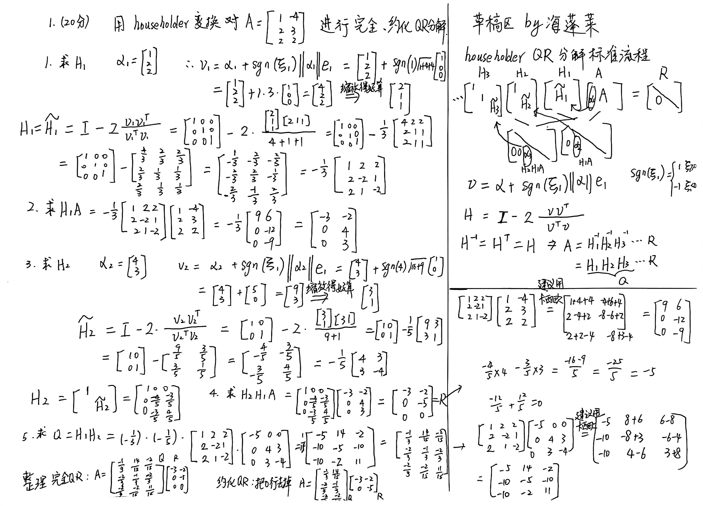

### 第二题（20分）求竖长矩阵的完全和约化SVD分解

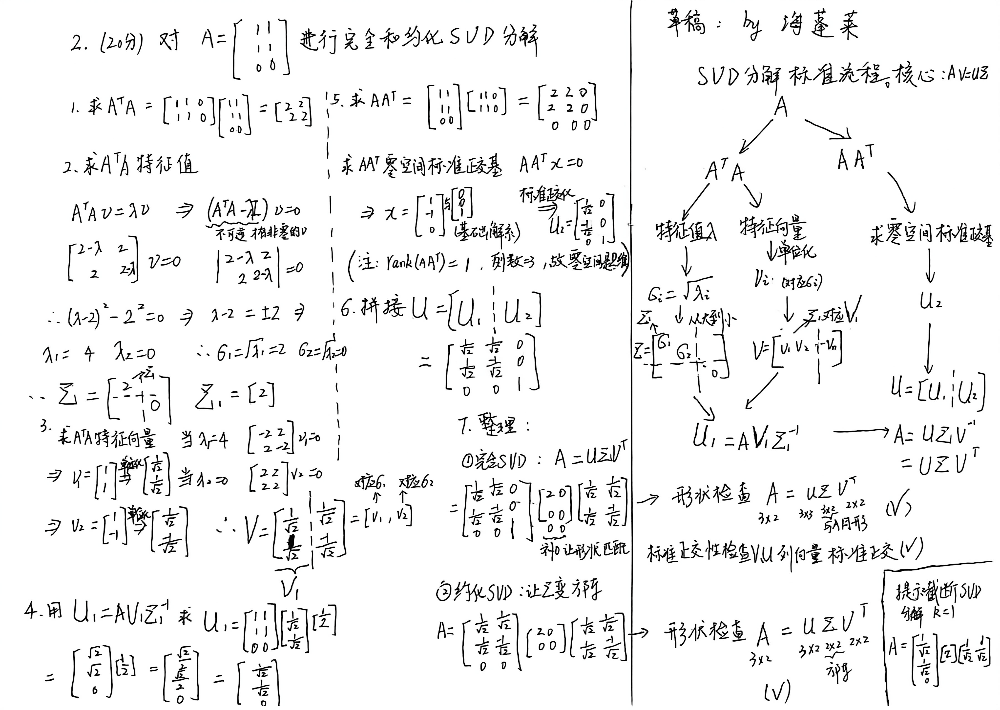

### 第三题（20分）样本均值、离差阵、协方差阵、相关阵

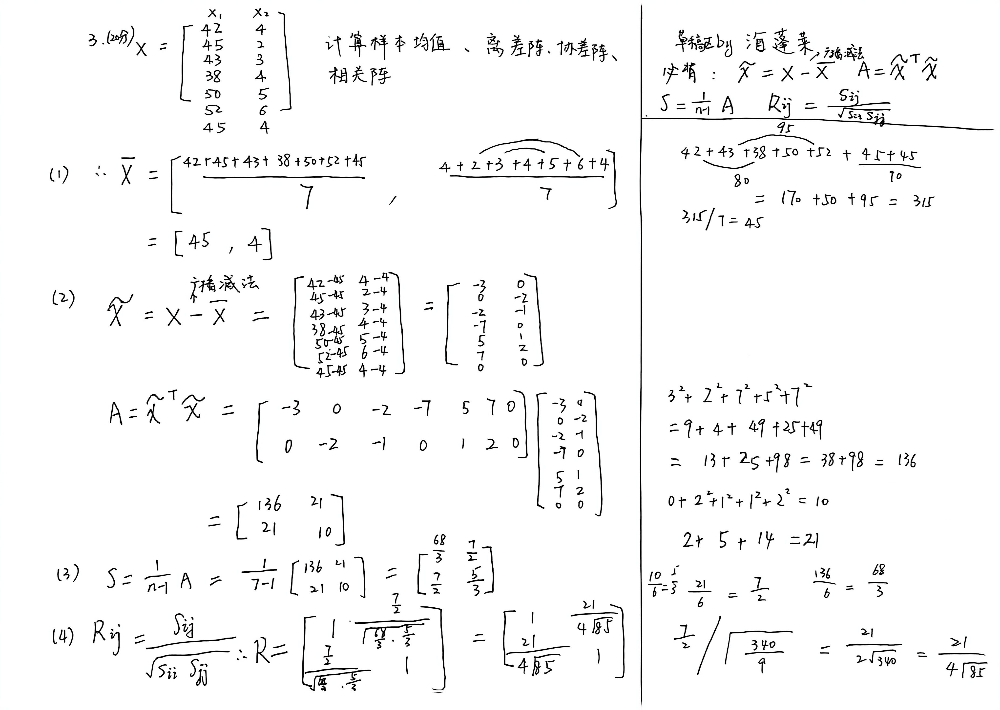

### 第四题（10分）背诵多元正态分布的定义

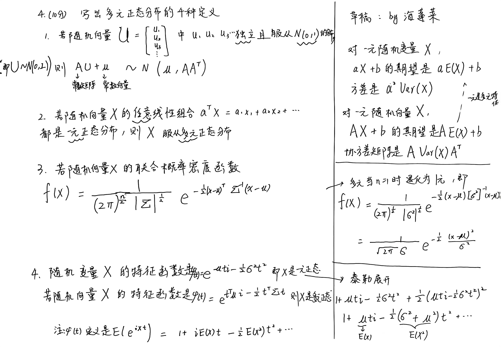

### 第五题（20分）大M法求线性规划

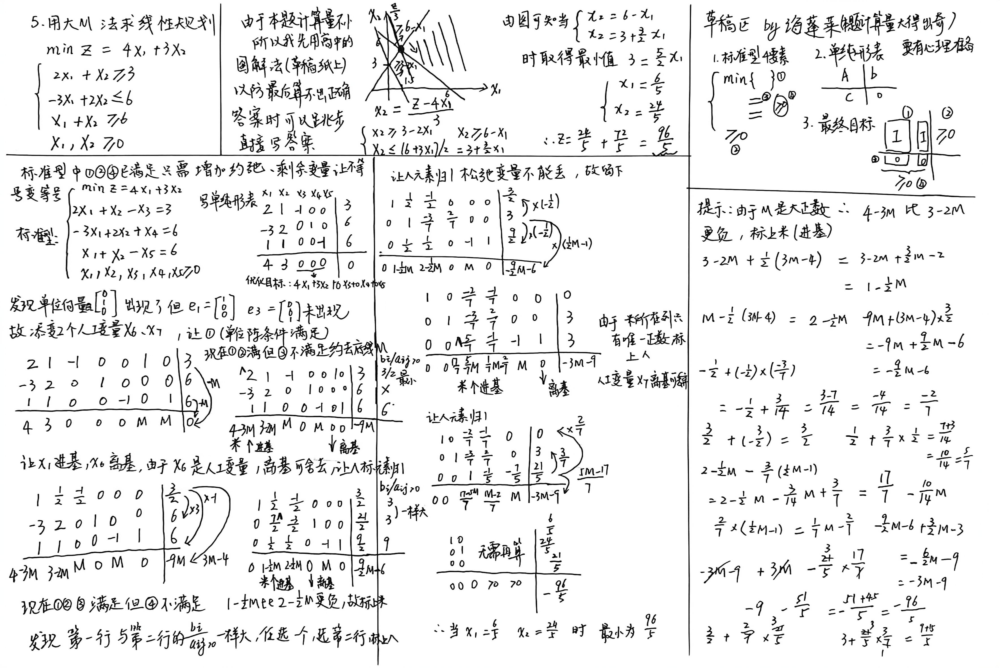

### 第六题（10分）证明凸函数的充要条件

## 2023年真题(学长粗糙回忆，我把细节补全了)

### 第一题（10分）线性映射的构造证明题

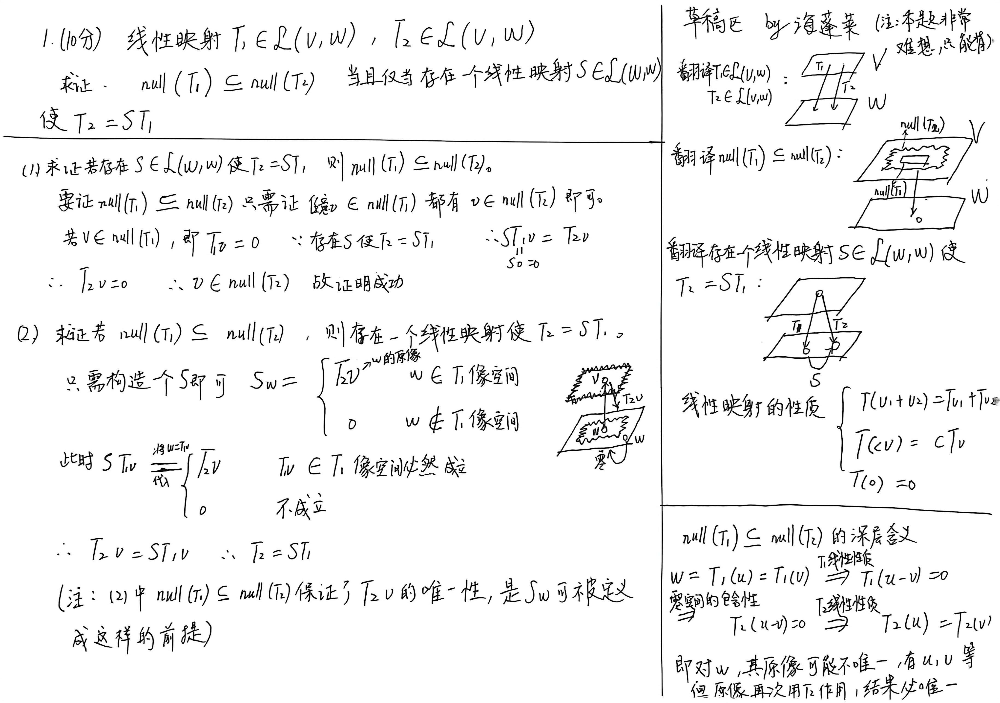

### 第二题（20分）求方阵的完全和约化SVD分解

### 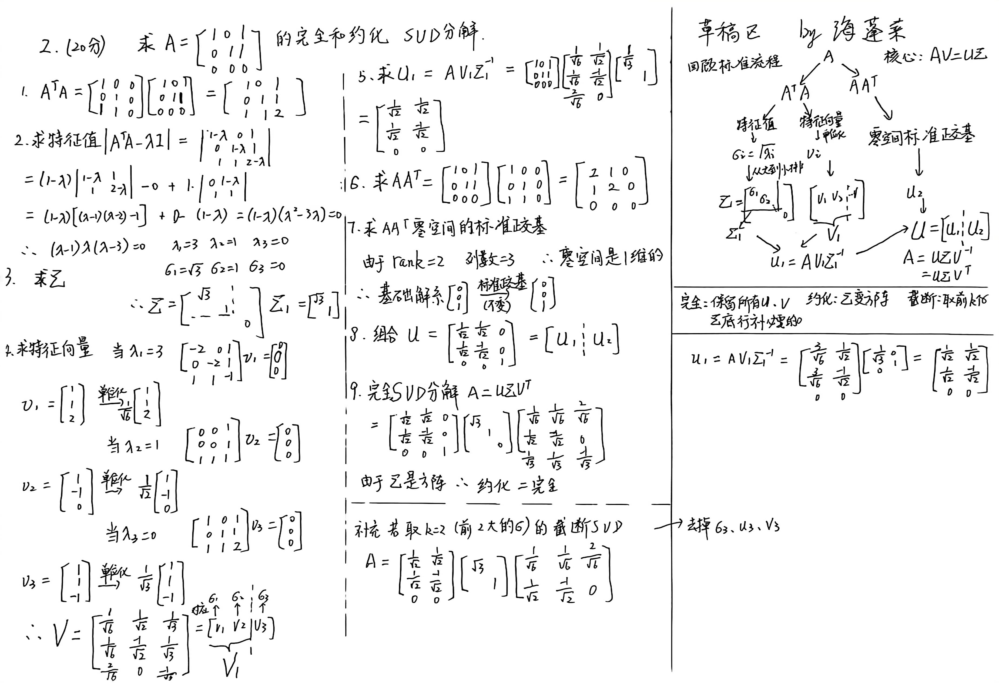

### 第三题（20分）求线性回归、回归平方和、决定系数

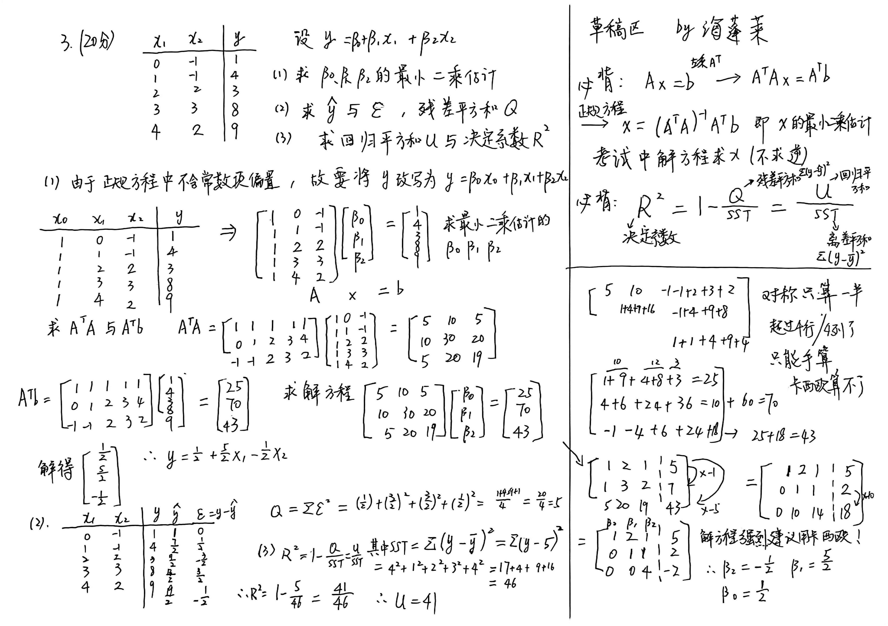

### 第四题（10分）证明多元正态分布不相关等价于独立

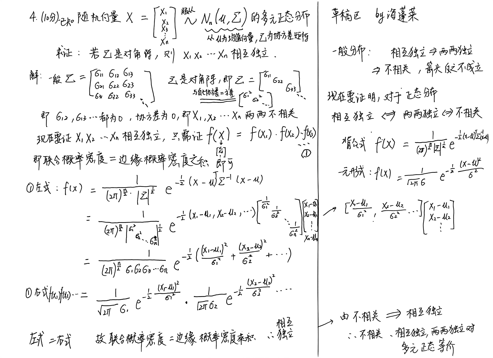

### 第五题（20分）大M法求解线性规划

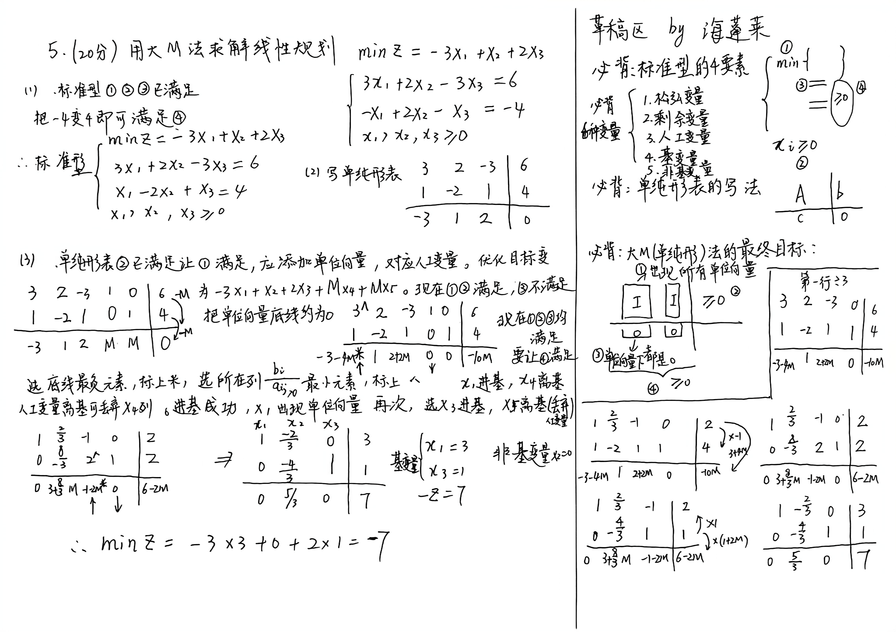

### 第六题（20分）最速梯度下降法求极值

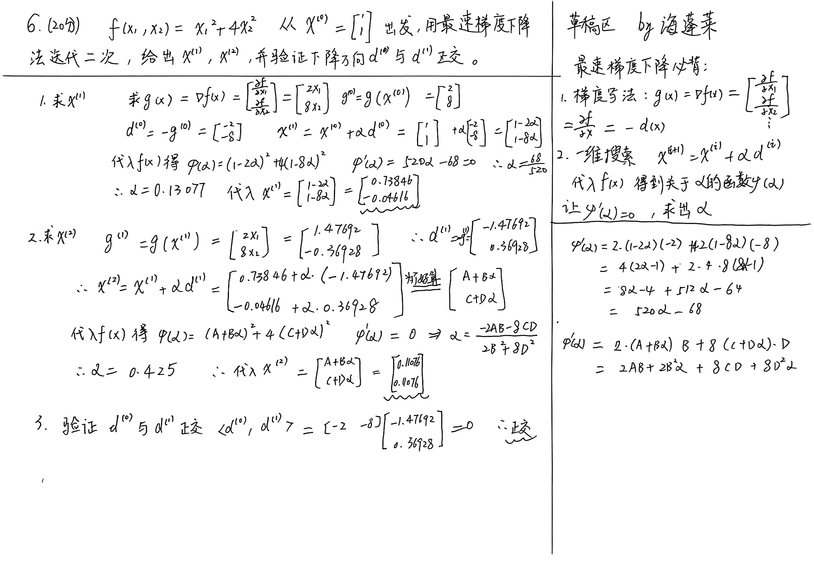

## 2024年模拟真题（我自制的， 把没考过的知识点补全）

### 第一题（10分）证明可逆等价于单射且满射

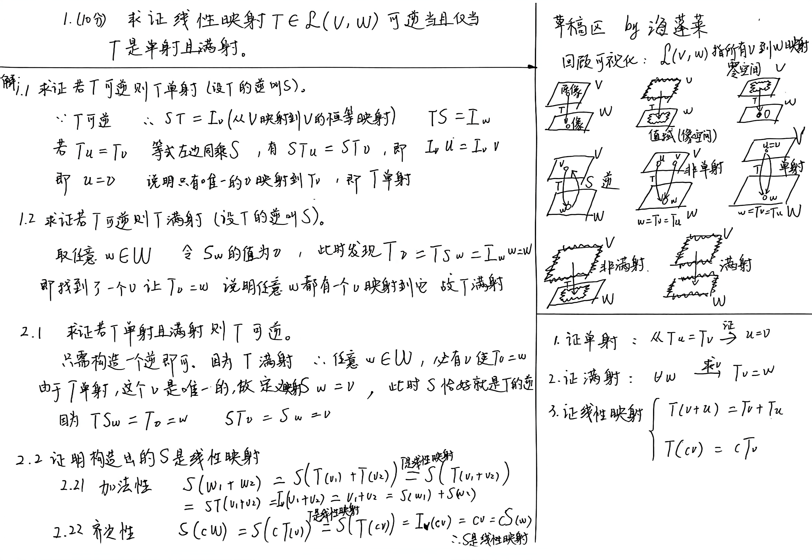

### 第二题（20分）施密特方法求QR分解

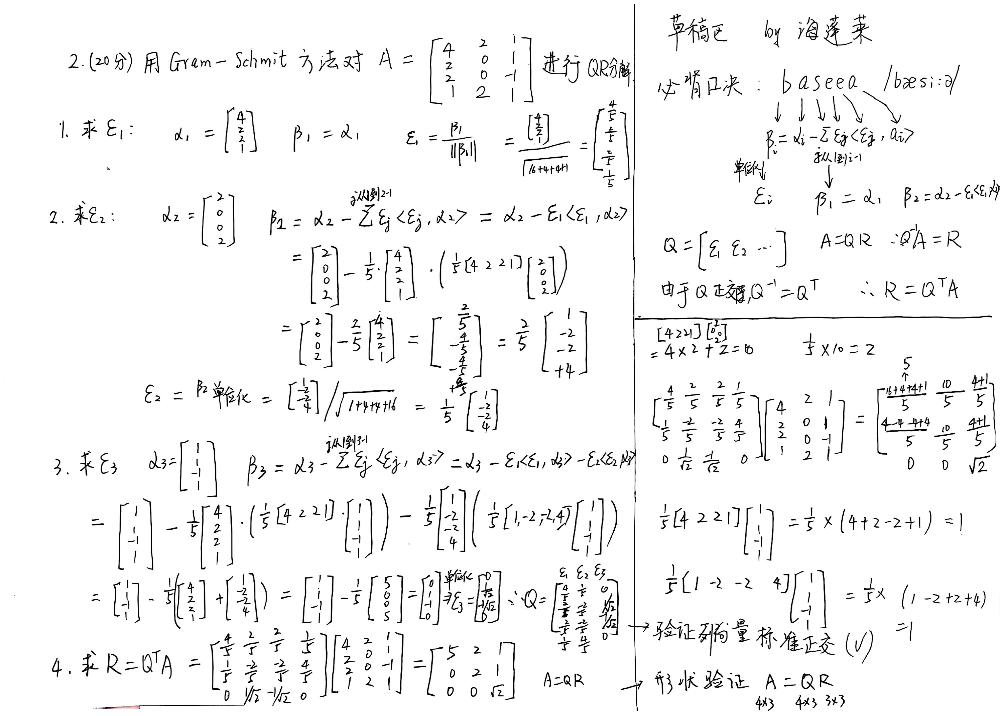

### 第四题（20分）根据马氏距离判别样本类别

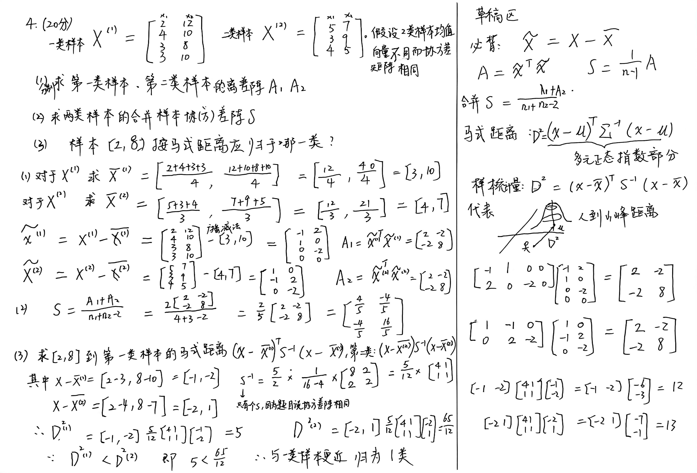

### 第六题（20分）牛顿法求极值

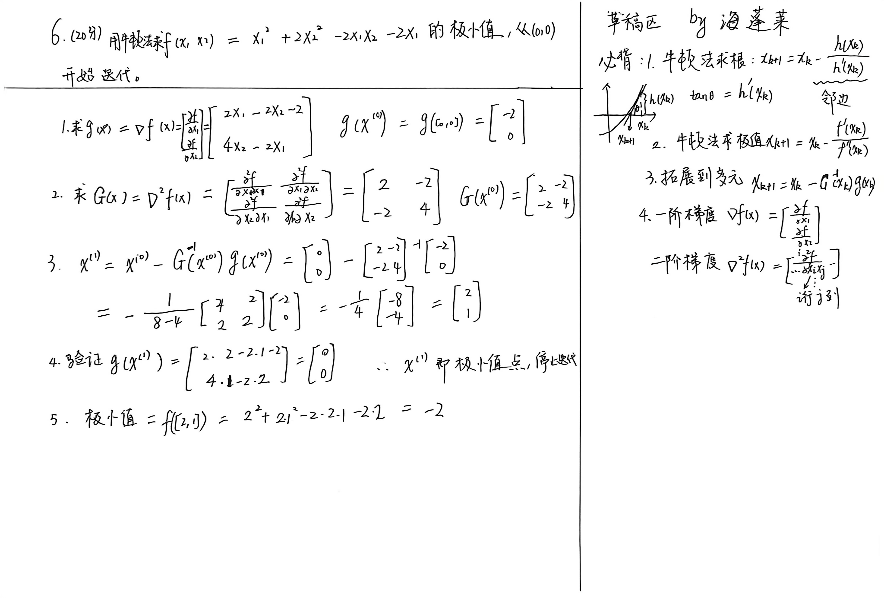
