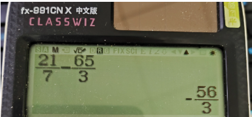
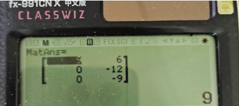
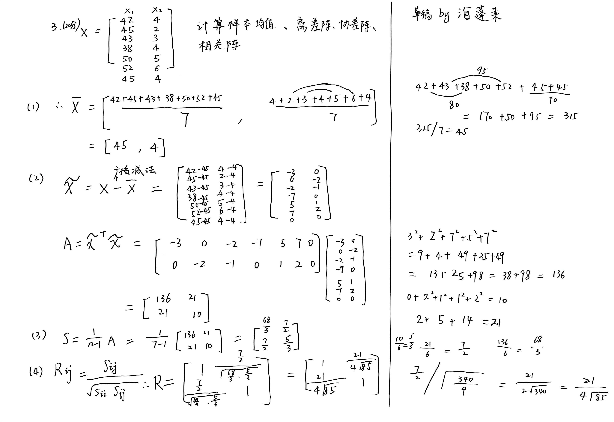

# 南开大学 计算机研究生 专业数学基础A 分题型速成

## 考试形式：闭卷，6道计算大题(4道20分的，2道10分的)，可以带计算器

### 背景

- **起因**：因为南开大学 计算机 研究生 专业数学基础A这门课，讲概念居多，而PPT也不太好复习，所以我分成多种题型，每种都做了一遍。

- **速成视频**：我录了一个分题型速成视频，初衷是：即使没有来上课，看完视频就能过，见：https://www.bilibili.com/video/BV157yGBvEqS

- **PPT**：这门课的PPT还有我写的题解都在文件夹里面了。

### 卡西欧计算器

由于老师考前明确说可以带计算器，所以建议带**卡西欧991CN**(高中物理竞赛专用计算器)。

可以进行分数计算和矩阵计算，但是不能进行含分数的矩阵计算。所以在以下场景建议使用卡西欧计算器而非手算：

- **复杂的分数计算**
- **整数矩阵乘法**
- **大概率算错了，但是硬要算一个奇怪的结果作为答案**

卡西欧991CN的**使用教程**见b站上的**速成视频**。

[TOC]

### 考试大纲

标上红星的部分很重要。

---

## 2022年真题(学长精确回忆)

### 第一题（20分）

### 第二题（20分）

### 第三题（20分）

### 第四题（10分）

### 第六题（10分）

## 2023年真题(学长粗糙回忆，我把细节补全了)

### 第4题（10分）

## 2024年模拟真题（我自制的， 把没考过的知识点补全）

