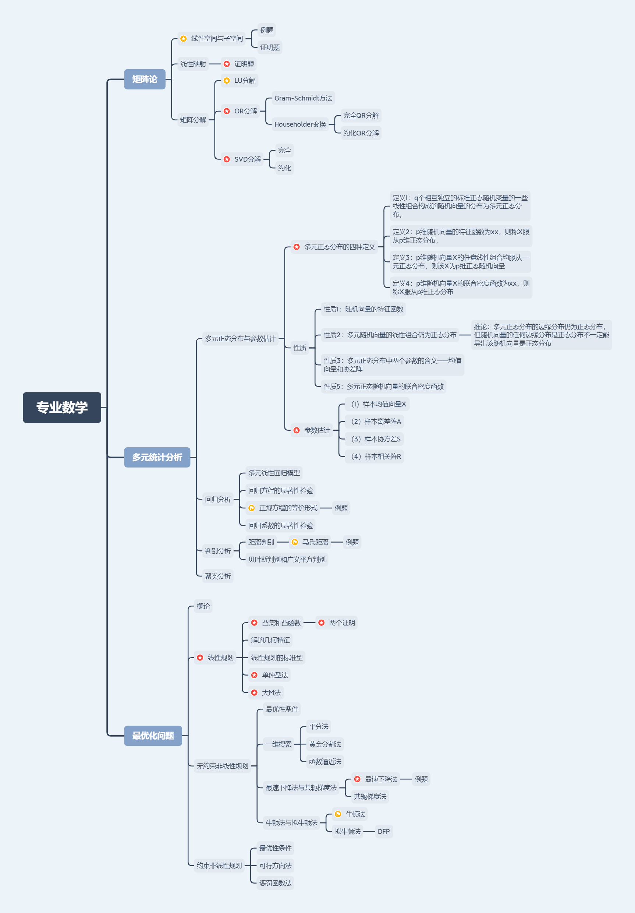
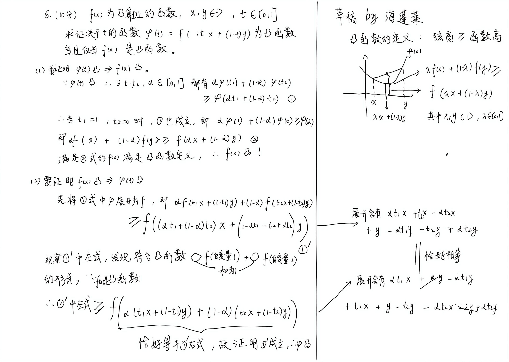

# 南开大学 计算机研究生 专业数学基础A 分题型速成

### 考试形式：闭卷，6道计算大题(4道20分的，2道10分的)，可以带计算器

#### 背景

因为南开大学 计算机 研究生 专业数学基础A这门课，讲得杂而考得精，PPT也不太好复习，所以我分成多种题型，每种都做了一遍。

分题型速成视频见：https://www.bilibili.com/video/BV157yGBvEqS

速成视频尽量做到：即使没有上课，速成视频全部看懂就安全。

这门课的PPT还有我写的题解都在文件夹里面了。

考试大纲：见标上红星的部分。

---

## 第一套往年真题

