### 题型：求完全和约化SVD分解

注意：不同教材对于**约化**的定义可能不同，按照ppt上的来。

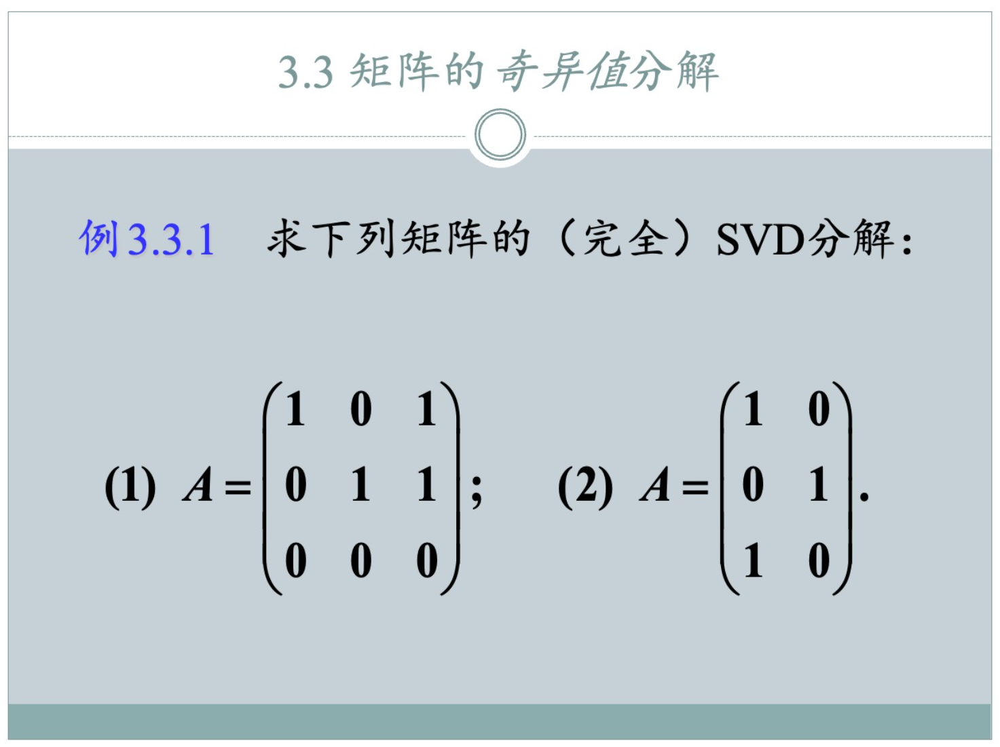

### SVD分解考场解法 

**目标：** 将矩阵 A (m x n) 分解为 `A = UΣVᵀ`，关键：$AV=U \Sigma$，$VV^T=I$

#### 第0步：如果A是横着的，可以求Aᵀ的SVD分解

如果矩阵 $A$ 的SVD分解是：
$$ A = U \Sigma V^T $$
那么它的转置矩阵 $A^T$ 的SVD分解就是：
$$ A^T = (U \Sigma V^T)^T = (V^T)^T \Sigma^T U^T = V \Sigma^T U^T $$

所以，求出Aᵀ的SVD分解，然后**U、V互换，Σ取转置**，就可以得到A的U、V、Σ。

#### **第一步：求 V 和 Σ₁**

1.  **计算 `B = AᵀA`**。(提示：**AᵀA和AAᵀ的**非零特征值是相同的，所以可以先把**AᵀA和AAᵀ**都求出来放着)
2.  **求 `B` 的特征值 `λ`**，并**从大到小**排列：`λ₁ ≥ λ₂ ≥ ... ≥ λᵣ > 0`，以及 `r` 个之后的零特征值。
3.  **求非零奇异值 `σᵢ = √λᵢ`**。
4.  **构造核心的 $Σ_1$ 矩阵**：
    *   这是一个 `r x r` 的**对角方阵**，对角线元素为 `σ₁`, `σ₂`, ...$σ_r$。
    *   计算它的逆 $Σ_1^{⁻¹}$ (这很简单，只需将对角线元素取倒数即可)。
5.  **求 `V` 矩阵**：
    *   求出所有特征值 `λᵢ` 对应的**单位化**特征向量 `vᵢ`。
    *   将这些 `vᵢ` **按 `λ` 的顺序**作为**列向量**，组成正交矩阵 `V`。
    *   **切分 `V`**：将 `V` 分为两部分，`V = [V₁ | V₂]`。
        *   `V₁` (n x r): 对应**非零**特征值的前 `r` 个列向量。
        *   `V₂` (n x (n-r)): 对应**零**特征值的后 `n-r` 个列向量。

#### **第二步：求 U₁ 和 U₂**

1.  **计算 `U₁` (对应非零奇异值的部分)**：
    *   使用矩阵公式： **`U₁ = AV₁Σ₁⁻¹`**
    *   `U₁` 是一个 `m x r` 的矩阵，它的列向量是标准正交的。

2.  **计算 `U₂` **：
    *   `U₂` 的列向量构成了 `Aᵀ` 的零空间 (`Null(Aᵀ)`) 的一组标准正交基。
    *   **求解方程组 `AAᵀy = 0`**，得到其基础解系。
    *   将这组基础解系**单位正交化** (Gram-Schmidt)，得到的列向量就组成了 `U₂`(**AAᵀ零空间的标准正交基**)。
    *   `U₂` 是一个 `m x (m-r)` 的矩阵。

#### **第三步：组装最终结果**

1.  **组合 `U` 矩阵**：
    *   将 `U₁` 和 `U₂` 按列合并：**`U = [U₁ | U₂]`**。
    *   `U` 是一个 `m x m` 的正交矩阵。

2.  **构造最终的 `Σ` 矩阵**：
    *   创建一个 `m x n` 的全零矩阵 (与A同型)。
    *   将奇异值从大到小填在对角线上。

3.  **写出最终答案**：
    *   **完全SVD**：`A = UΣVᵀ`，`A(m x n) = U(m x m) Σ(m x n) Vᵀ(n x n)`。其中U和V都是方阵，Σ和A同形。
    *   **约化SVD** ：移除 $\Sigma$ 中比方阵多出的为0的行或列，并同时移除 $U$ 或 $V$ 中对应的列，具体移除哪一个取决于如何让矩阵乘法可以正常进行。 对于竖矩阵：`A(m x n) = U(m x n) Σ(n x n) Vᵀ(n x n)`。
    *   **截断SVD(k=r)**：`A = U₁Σ₁V₁ᵀ`，等价于约化SVD基础上移除为0的$\sigma_i$，以及对应的$u_i$和$v_i$。`A(m x n) = U(m x r) Σ(r x r) Vᵀ(r x n)`。

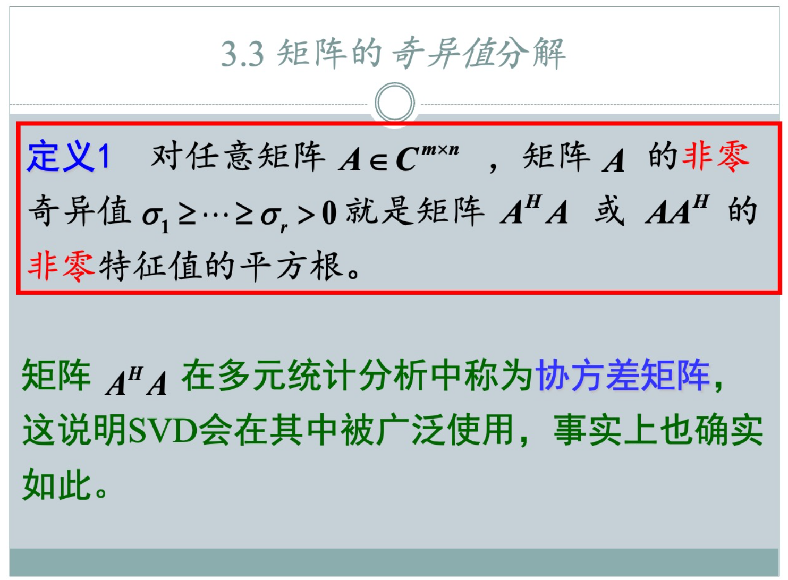

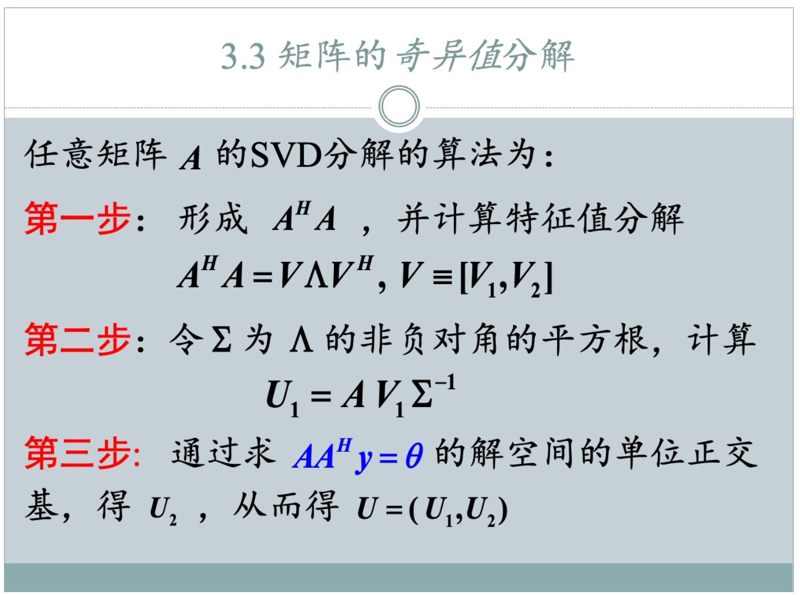

### 完全和约化SVD分解的区别

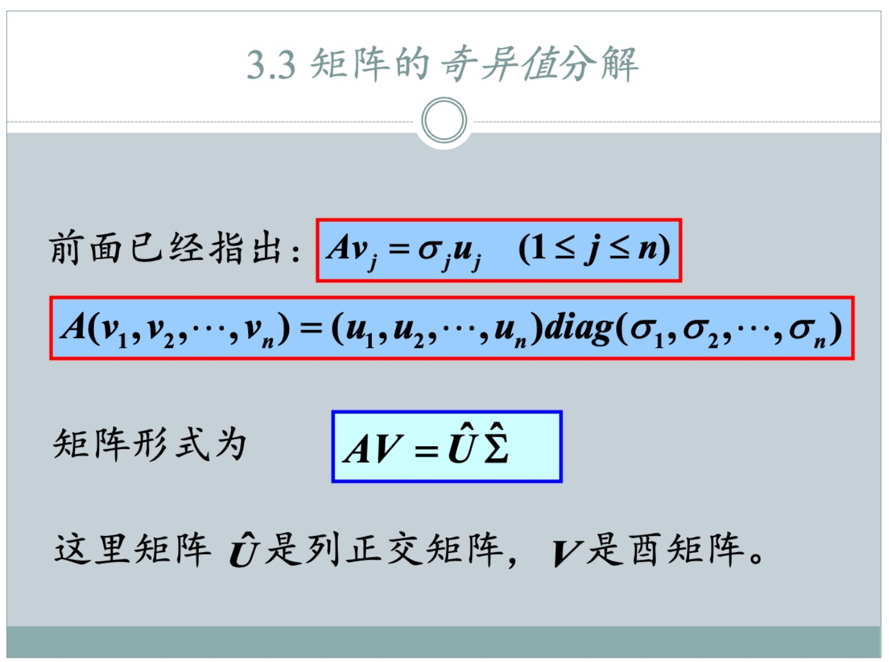

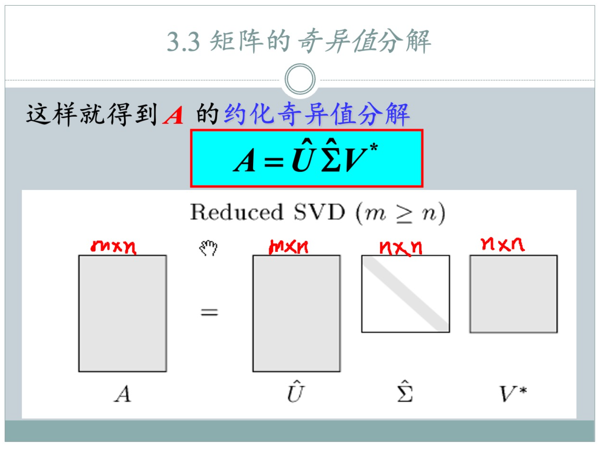

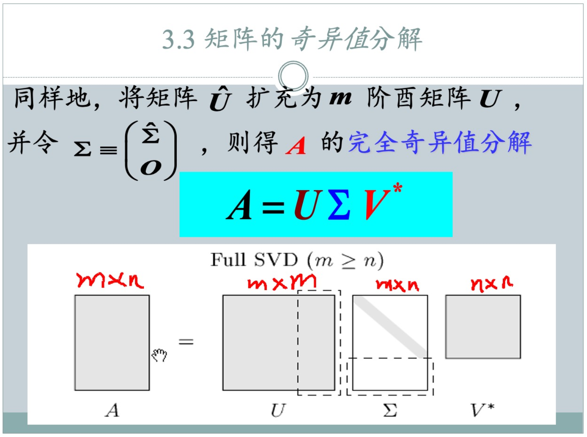

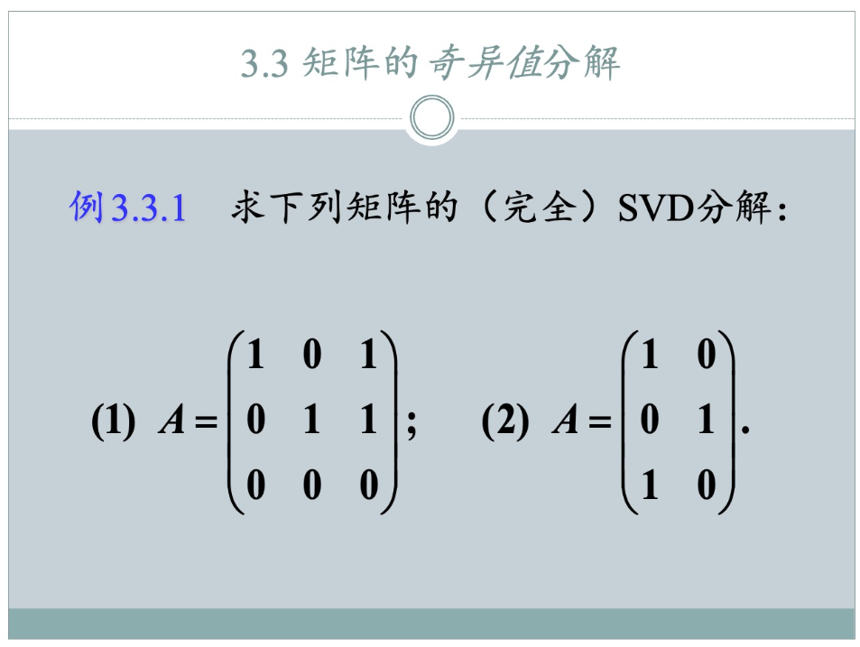

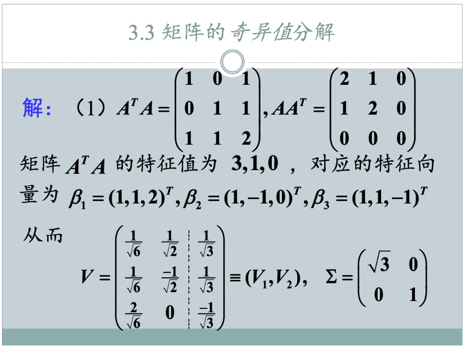

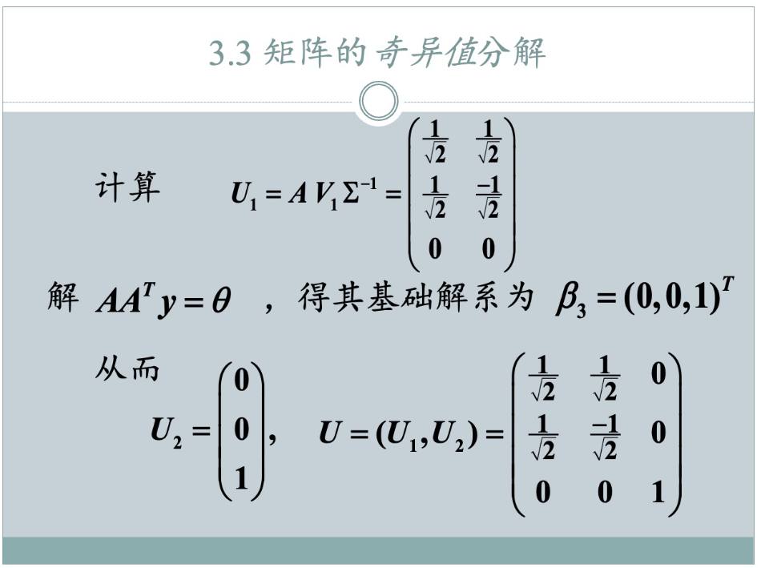

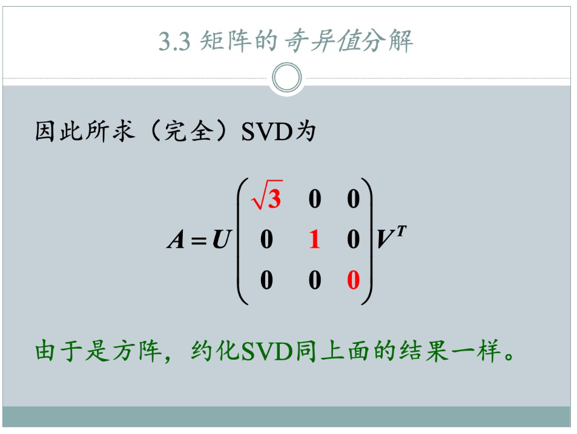

**给定矩阵：**
$$ A = \begin{pmatrix} 1 & 0 & 1 \\ 0 & 1 & 1 \\ 0 & 0 & 0 \end{pmatrix} $$
这是一个 3x3 矩阵，所以 m=3, n=3。

---

### **第一步：求 V 和 Σ₁**

1.  **计算 `B = AᵀA`**
    $$ A^T = \begin{pmatrix} 1 & 0 & 0 \\ 0 & 1 & 0 \\ 1 & 1 & 0 \end{pmatrix} $$
    $$ B = A^T A = \begin{pmatrix} 1 & 0 & 0 \\ 0 & 1 & 0 \\ 1 & 1 & 0 \end{pmatrix} \begin{pmatrix} 1 & 0 & 1 \\ 0 & 1 & 1 \\ 0 & 0 & 0 \end{pmatrix} = \begin{pmatrix} 1 & 0 & 1 \\ 0 & 1 & 1 \\ 1 & 1 & 2 \end{pmatrix} $$
    这与PPT中的结果一致。

2.  **求 `B` 的特征值 `λ`**
    求解 `det(B - λI) = 0`:
    $$ \begin{vmatrix} 1-\lambda & 0 & 1 \\ 0 & 1-\lambda & 1 \\ 1 & 1 & 2-\lambda \end{vmatrix} = (1-\lambda)((1-\lambda)(2-\lambda)-1) - 0 + 1(0 - (1-\lambda)) = 0 $$
    $$ (1-\lambda)(\lambda^2 - 3\lambda + 1) - (1-\lambda) = 0 $$
    $$ (1-\lambda)(\lambda^2 - 3\lambda + 1 - 1) = 0 $$
    $$ (1-\lambda)(\lambda^2 - 3\lambda) = 0 $$
    $$ \lambda(1-\lambda)(\lambda-3) = 0 $$
    特征值为 `λ = 3, 1, 0`。
    从大到小排列：`λ₁ = 3`, `λ₂ = 1`, `λ₃ = 0`。非零特征值的个数 `r = 2`。

3.  **求非零奇异值 `σᵢ = √λᵢ`**
    *   `σ₁ = √λ₁ = √3`
    *   `σ₂ = √λ₂ = √1 = 1`

4.  **构造核心的 `Σ₁` 及其逆矩阵**
    `Σ₁` 是 `r x r` (2x2) 的对角方阵：
    $$ \Sigma_1 = \begin{pmatrix} \sqrt{3} & 0 \\ 0 & 1 \end{pmatrix}, \quad \Sigma_1^{-1} = \begin{pmatrix} \frac{1}{\sqrt{3}} & 0 \\ 0 & 1 \end{pmatrix} $$

5.  **求 `V` 矩阵（单位化的特征向量）**
    *   **对于 `λ₁ = 3`**: 解 `(B - 3I)x = 0`
        $$ \begin{pmatrix} -2 & 0 & 1 \\ 0 & -2 & 1 \\ 1 & 1 & -1 \end{pmatrix} \begin{pmatrix} x_1 \\ x_2 \\ x_3 \end{pmatrix} = \begin{pmatrix} 0 \\ 0 \\ 0 \end{pmatrix} \implies \text{特征向量 } \beta_1 = \begin{pmatrix} 1 \\ 1 \\ 2 \end{pmatrix} $$
        单位化：$v_1 = \frac{1}{\sqrt{1^2+1^2+2^2}} \beta_1 = \frac{1}{\sqrt{6}} \begin{pmatrix} 1 \\ 1 \\ 2 \end{pmatrix}$

    *   **对于 `λ₂ = 1`**: 解 `(B - 1I)x = 0`
        $$ \begin{pmatrix} 0 & 0 & 1 \\ 0 & 0 & 1 \\ 1 & 1 & 1 \end{pmatrix} \begin{pmatrix} x_1 \\ x_2 \\ x_3 \end{pmatrix} = \begin{pmatrix} 0 \\ 0 \\ 0 \end{pmatrix} \implies \text{特征向量 } \beta_2 = \begin{pmatrix} 1 \\ -1 \\ 0 \end{pmatrix} $$
        单位化：$v_2 = \frac{1}{\sqrt{1^2+(-1)^2+0^2}} \beta_2 = \frac{1}{\sqrt{2}} \begin{pmatrix} 1 \\ -1 \\ 0 \end{pmatrix}$

    *   **对于 `λ₃ = 0`**: 解 `Bx = 0`
        $$ \begin{pmatrix} 1 & 0 & 1 \\ 0 & 1 & 1 \\ 1 & 1 & 2 \end{pmatrix} \begin{pmatrix} x_1 \\ x_2 \\ x_3 \end{pmatrix} = \begin{pmatrix} 0 \\ 0 \\ 0 \end{pmatrix} \implies \text{特征向量 } \beta_3 = \begin{pmatrix} 1 \\ 1 \\ -1 \end{pmatrix} $$
        单位化：$v_3 = \frac{1}{\sqrt{1^2+1^2+(-1)^2}} \beta_3 = \frac{1}{\sqrt{3}} \begin{pmatrix} 1 \\ 1 \\ -1 \end{pmatrix}$

    将 `v₁`, `v₂`, `v₃` 按顺序作为列向量，组成 `V`：
    $$ V = \begin{pmatrix} \frac{1}{\sqrt{6}} & \frac{1}{\sqrt{2}} & \frac{1}{\sqrt{3}} \\ \frac{1}{\sqrt{6}} & \frac{-1}{\sqrt{2}} & \frac{1}{\sqrt{3}} \\ \frac{2}{\sqrt{6}} & 0 & \frac{-1}{\sqrt{3}} \end{pmatrix} $$
    **切分 `V`**:
    *   `V₁` (对应非零特征值): $V_1 = \begin{pmatrix} \frac{1}{\sqrt{6}} & \frac{1}{\sqrt{2}} \\ \frac{1}{\sqrt{6}} & \frac{-1}{\sqrt{2}} \\ \frac{2}{\sqrt{6}} & 0 \end{pmatrix}$
    *   `V₂` (对应零特征值): $V_2 = \begin{pmatrix} \frac{1}{\sqrt{3}} \\ \frac{1}{\sqrt{3}} \\ \frac{-1}{\sqrt{3}} \end{pmatrix}$

---

### **第二步：求 U₁ 和 U₂**

1.  **计算 `U₁ = AV₁Σ₁⁻¹`**
    $$ U_1 = \underbrace{\begin{pmatrix} 1 & 0 & 1 \\ 0 & 1 & 1 \\ 0 & 0 & 0 \end{pmatrix}}_{A} \underbrace{\begin{pmatrix} \frac{1}{\sqrt{6}} & \frac{1}{\sqrt{2}} \\ \frac{1}{\sqrt{6}} & \frac{-1}{\sqrt{2}} \\ \frac{2}{\sqrt{6}} & 0 \end{pmatrix}}_{V_1} \underbrace{\begin{pmatrix} \frac{1}{\sqrt{3}} & 0 \\ 0 & 1 \end{pmatrix}}_{\Sigma_1^{-1}} $$
    $$ = \begin{pmatrix} \frac{3}{\sqrt{6}} & \frac{1}{\sqrt{2}} \\ \frac{3}{\sqrt{6}} & \frac{-1}{\sqrt{2}} \\ 0 & 0 \end{pmatrix} \begin{pmatrix} \frac{1}{\sqrt{3}} & 0 \\ 0 & 1 \end{pmatrix} = \begin{pmatrix} \frac{3}{\sqrt{18}} & \frac{1}{\sqrt{2}} \\ \frac{3}{\sqrt{18}} & \frac{-1}{\sqrt{2}} \\ 0 & 0 \end{pmatrix} = \begin{pmatrix} \frac{3}{3\sqrt{2}} & \frac{1}{\sqrt{2}} \\ \frac{3}{3\sqrt{2}} & \frac{-1}{\sqrt{2}} \\ 0 & 0 \end{pmatrix} $$
    $$ U_1 = \begin{pmatrix} \frac{1}{\sqrt{2}} & \frac{1}{\sqrt{2}} \\ \frac{1}{\sqrt{2}} & \frac{-1}{\sqrt{2}} \\ 0 & 0 \end{pmatrix} $$
    这与PPT中的结果一致。

2.  **计算 `U₂`**
    求解方程组 `AAᵀy = 0`。
    $$ AA^T = \begin{pmatrix} 1 & 0 & 1 \\ 0 & 1 & 1 \\ 0 & 0 & 0 \end{pmatrix} \begin{pmatrix} 1 & 0 & 0 \\ 0 & 1 & 0 \\ 1 & 1 & 0 \end{pmatrix} = \begin{pmatrix} 2 & 1 & 0 \\ 1 & 2 & 0 \\ 0 & 0 & 0 \end{pmatrix} $$
    解方程 `AAᵀy = 0`:
    $$ \begin{pmatrix} 2 & 1 & 0 \\ 1 & 2 & 0 \\ 0 & 0 & 0 \end{pmatrix} \begin{pmatrix} y_1 \\ y_2 \\ y_3 \end{pmatrix} = \begin{pmatrix} 0 \\ 0 \\ 0 \end{pmatrix} \implies \begin{cases} 2y_1 + y_2 = 0 \\ y_1 + 2y_2 = 0 \end{cases} $$
    这个方程组的唯一解是 `y₁ = 0`, `y₂ = 0`。`y₃` 是自由变量。
    基础解系为 $\beta_3 = (0, 0, 1)^T$。
    这个向量已经是单位向量，所以不需要再单位化。
    $$ U_2 = \begin{pmatrix} 0 \\ 0 \\ 1 \end{pmatrix} $$
    这与PPT中的结果一致。

---

### **第三步：组装最终结果**

1.  **组合 `U` 矩阵**
    `U = [U₁ | U₂]`
    $$ U = \begin{pmatrix} \frac{1}{\sqrt{2}} & \frac{1}{\sqrt{2}} & 0 \\ \frac{1}{\sqrt{2}} & \frac{-1}{\sqrt{2}} & 0 \\ 0 & 0 & 1 \end{pmatrix} $$

2.  **构造最终的 `Σ` 矩阵**
    `Σ` 与 `A` 同型 (3x3)，将奇异值 `σ₁=√3`, `σ₂=1` 填入对角线。
    $$ \Sigma = \begin{pmatrix} \sqrt{3} & 0 & 0 \\ 0 & 1 & 0 \\ 0 & 0 & 0 \end{pmatrix} $$

3.  **写出最终答案**

    #### **完全 SVD (Full SVD)**
    `A = UΣVᵀ`，其中 `U` 是 `3x3`，`Σ` 是 `3x3`，`Vᵀ` 是 `3x3`。
    $$ A = \underbrace{\begin{pmatrix} \frac{1}{\sqrt{2}} & \frac{1}{\sqrt{2}} & 0 \\ \frac{1}{\sqrt{2}} & \frac{-1}{\sqrt{2}} & 0 \\ 0 & 0 & 1 \end{pmatrix}}_{U} \underbrace{\begin{pmatrix} \sqrt{3} & 0 & 0 \\ 0 & 1 & 0 \\ 0 & 0 & 0 \end{pmatrix}}_{\Sigma} \underbrace{\begin{pmatrix} \frac{1}{\sqrt{6}} & \frac{1}{\sqrt{6}} & \frac{2}{\sqrt{6}} \\ \frac{1}{\sqrt{2}} & \frac{-1}{\sqrt{2}} & 0 \\ \frac{1}{\sqrt{3}} & \frac{1}{\sqrt{3}} & \frac{-1}{\sqrt{3}} \end{pmatrix}}_{V^T} $$

    #### **约化 SVD (Reduced SVD)**
    由于原矩阵 `A` 是方阵 (m=n)，约化SVD与完全SVD的结果是**一样**的。
    （注：如果矩阵是 `m x n` 且 `m > n`，约化SVD会使得 `U` 变为 `m x n`，`Σ` 变为 `n x n`；如果 `m < n` 则 `U` 是 `m x m`，`Σ` 是 `m x m`，`Vᵀ` 是 `m x n`。对于方阵，尺寸不变。）

    #### **截断 SVD (Truncated SVD, k=r)**
    这里 `r = 2`，我们只保留前 `r` 个奇异值和对应的 `U` 和 `V` 的列。
    `A = U₁Σ₁V₁ᵀ`，其中 `U₁` 是 `3x2`，`Σ₁` 是 `2x2`，`V₁ᵀ` 是 `2x3`。
    $$ A \approx \underbrace{\begin{pmatrix} \frac{1}{\sqrt{2}} & \frac{1}{\sqrt{2}} \\ \frac{1}{\sqrt{2}} & \frac{-1}{\sqrt{2}} \\ 0 & 0 \end{pmatrix}}_{U_1} \underbrace{\begin{pmatrix} \sqrt{3} & 0 \\ 0 & 1 \end{pmatrix}}_{\Sigma_1} \underbrace{\begin{pmatrix} \frac{1}{\sqrt{6}} & \frac{1}{\sqrt{6}} & \frac{2}{\sqrt{6}} \\ \frac{1}{\sqrt{2}} & \frac{-1}{\sqrt{2}} & 0 \end{pmatrix}}_{V_1^T} $$
    (注意：对于这个特殊的矩阵A，由于第三个奇异值为0，这个“近似”实际上是精确相等的。)

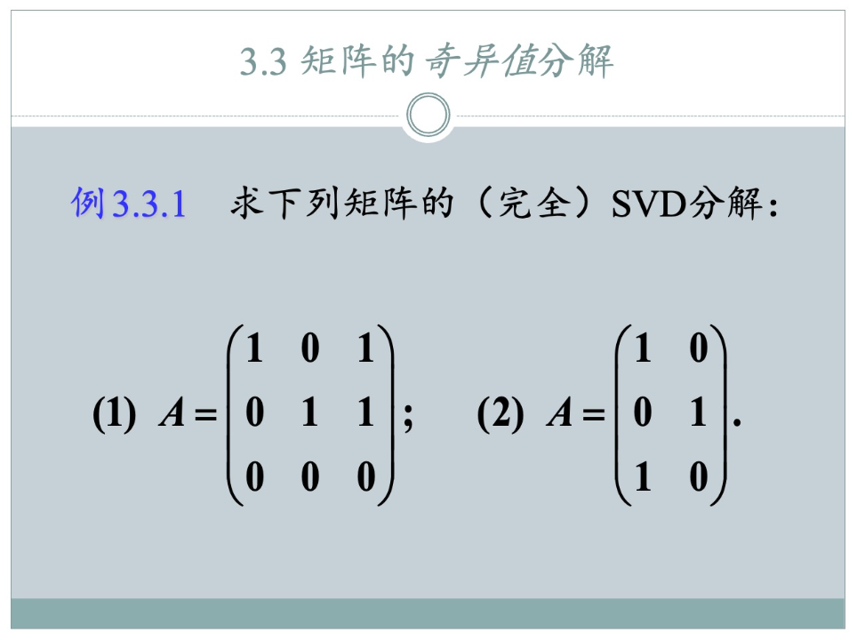

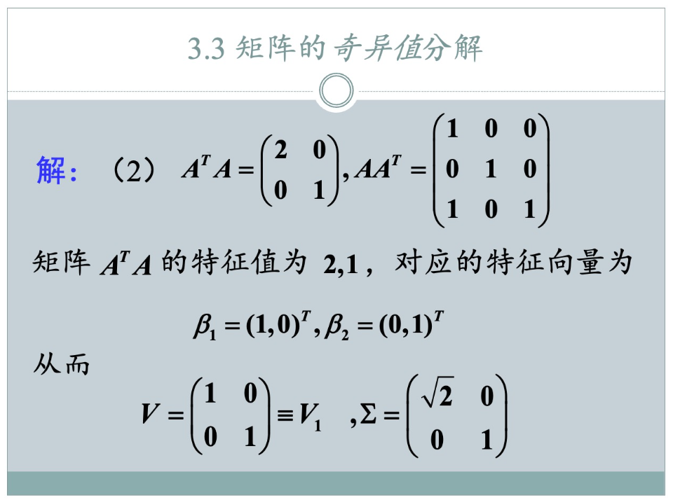

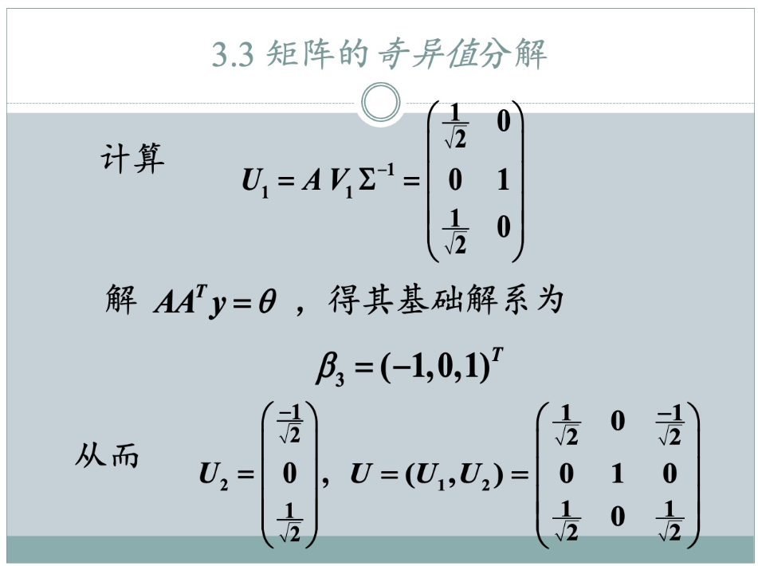

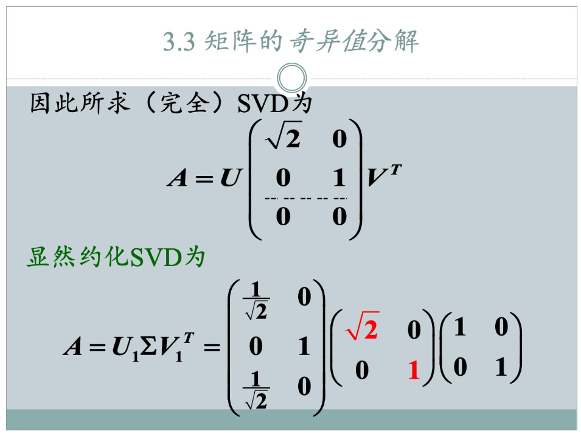

**给定矩阵：**
$$ A = \begin{pmatrix} 1 & 0 \\ 0 & 1 \\ 1 & 0 \end{pmatrix} $$
这是一个 3x2 矩阵，所以 m=3, n=2。这是一个“竖着的”矩阵。

---

### **第一步：求 V 和 Σ₁**

1.  **计算 `B = AᵀA`**
    $$ A^T = \begin{pmatrix} 1 & 0 & 1 \\ 0 & 1 & 0 \end{pmatrix} $$
    $$ B = A^T A = \begin{pmatrix} 1 & 0 & 1 \\ 0 & 1 & 0 \end{pmatrix} \begin{pmatrix} 1 & 0 \\ 0 & 1 \\ 1 & 0 \end{pmatrix} = \begin{pmatrix} 2 & 0 \\ 0 & 1 \end{pmatrix} $$
    这与PPT中的结果一致。

2.  **求 `B` 的特征值 `λ`**
    `B` 是一个对角矩阵，其特征值就是对角线上的元素。
    特征值为 `λ = 2, 1`。
    从大到小排列：`λ₁ = 2`, `λ₂ = 1`。所有特征值都是非零的，所以秩 `r = 2`。

3.  **求非零奇异值 `σᵢ = √λᵢ`**
    *   `σ₁ = √λ₁ = √2`
    *   `σ₂ = √λ₂ = √1 = 1`

4.  **构造核心的 `Σ₁` 及其逆矩阵**
    `Σ₁` 是 `r x r` (2x2) 的对角方阵：
    $$ \Sigma_1 = \begin{pmatrix} \sqrt{2} & 0 \\ 0 & 1 \end{pmatrix}, \quad \Sigma_1^{-1} = \begin{pmatrix} \frac{1}{\sqrt{2}} & 0 \\ 0 & 1 \end{pmatrix} $$

5.  **求 `V` 矩阵（单位化的特征向量）**
    *   **对于 `λ₁ = 2`**: 解 `(B - 2I)x = 0`
        $$ \begin{pmatrix} 0 & 0 \\ 0 & -1 \end{pmatrix} \begin{pmatrix} x_1 \\ x_2 \end{pmatrix} = \begin{pmatrix} 0 \\ 0 \end{pmatrix} \implies -x_2=0 $$
        特征向量为 $\beta_1 = (1, 0)^T$。它已经是单位向量。
        所以 $v_1 = \begin{pmatrix} 1 \\ 0 \end{pmatrix}$。

    *   **对于 `λ₂ = 1`**: 解 `(B - 1I)x = 0`
        $$ \begin{pmatrix} 1 & 0 \\ 0 & 0 \end{pmatrix} \begin{pmatrix} x_1 \\ x_2 \end{pmatrix} = \begin{pmatrix} 0 \\ 0 \end{pmatrix} \implies x_1=0 $$
        特征向量为 $\beta_2 = (0, 1)^T$。它已经是单位向量。
        所以 $v_2 = \begin{pmatrix} 0 \\ 1 \end{pmatrix}$。

    将 `v₁`, `v₂` 按顺序作为列向量，组成 `V`：
    $$ V = \begin{pmatrix} 1 & 0 \\ 0 & 1 \end{pmatrix} $$
    **切分 `V`**:
    *   `V₁` (对应非零特征值): 由于所有特征值都非零 (`n-r = 2-2=0`)，`V₁` 就是 `V` 本身。
        $V_1 = V = \begin{pmatrix} 1 & 0 \\ 0 & 1 \end{pmatrix}$
    *   `V₂` (对应零特征值): 不存在零特征值，所以 `V₂` 是空矩阵。

---

### **第二步：求 U₁ 和 U₂**

1.  **计算 `U₁ = AV₁Σ₁⁻¹`**
    $$ U_1 = \underbrace{\begin{pmatrix} 1 & 0 \\ 0 & 1 \\ 1 & 0 \end{pmatrix}}_{A} \underbrace{\begin{pmatrix} 1 & 0 \\ 0 & 1 \end{pmatrix}}_{V_1} \underbrace{\begin{pmatrix} \frac{1}{\sqrt{2}} & 0 \\ 0 & 1 \end{pmatrix}}_{\Sigma_1^{-1}} $$
    $$ = \begin{pmatrix} 1 & 0 \\ 0 & 1 \\ 1 & 0 \end{pmatrix} \begin{pmatrix} \frac{1}{\sqrt{2}} & 0 \\ 0 & 1 \end{pmatrix} = \begin{pmatrix} \frac{1}{\sqrt{2}} & 0 \\ 0 & 1 \\ \frac{1}{\sqrt{2}} & 0 \end{pmatrix} $$
    这与PPT中的结果一致。`U₁` 是一个 `3 x 2` 的矩阵。

2.  **计算 `U₂`**
    求解方程组 `AAᵀy = 0`。
    $$ AA^T = \begin{pmatrix} 1 & 0 \\ 0 & 1 \\ 1 & 0 \end{pmatrix} \begin{pmatrix} 1 & 0 & 1 \\ 0 & 1 & 0 \end{pmatrix} = \begin{pmatrix} 1 & 0 & 1 \\ 0 & 1 & 0 \\ 1 & 0 & 1 \end{pmatrix} $$
    解方程 `AAᵀy = 0`:
    $$ \begin{pmatrix} 1 & 0 & 1 \\ 0 & 1 & 0 \\ 1 & 0 & 1 \end{pmatrix} \begin{pmatrix} y_1 \\ y_2 \\ y_3 \end{pmatrix} = \begin{pmatrix} 0 \\ 0 \\ 0 \end{pmatrix} \implies \begin{cases} y_1 + y_3 = 0 \\ y_2 = 0 \end{cases} $$
    令 $y_3=1$，则 $y_1=-1, y_2=0$。基础解系为 $\beta_3 = (-1, 0, 1)^T$。
    将这组基础解系**单位正交化**：
    $$ u_3 = \frac{\beta_3}{||\beta_3||} = \frac{1}{\sqrt{(-1)^2+0^2+1^2}} \begin{pmatrix} -1 \\ 0 \\ 1 \end{pmatrix} = \frac{1}{\sqrt{2}} \begin{pmatrix} -1 \\ 0 \\ 1 \end{pmatrix} = \begin{pmatrix} \frac{-1}{\sqrt{2}} \\ 0 \\ \frac{1}{\sqrt{2}} \end{pmatrix} $$
    `U₂` 是由 `u₃` 组成的矩阵：
    $$ U_2 = \begin{pmatrix} \frac{-1}{\sqrt{2}} \\ 0 \\ \frac{1}{\sqrt{2}} \end{pmatrix} $$
    这与PPT中的单位化结果一致。

---

### **第三步：组装最终结果**

1.  **组合 `U` 矩阵**
    `U = [U₁ | U₂]`
    $$ U = \begin{pmatrix} \frac{1}{\sqrt{2}} & 0 & \frac{-1}{\sqrt{2}} \\ 0 & 1 & 0 \\ \frac{1}{\sqrt{2}} & 0 & \frac{1}{\sqrt{2}} \end{pmatrix} $$

2.  **构造最终的 `Σ` 矩阵**
    `Σ` 与 `A` 同型 (3x2)，将奇异值 `σ₁=√2`, `σ₂=1` 填入对角线。
    $$ \Sigma = \begin{pmatrix} \sqrt{2} & 0 \\ 0 & 1 \\ \hline 0 & 0 \end{pmatrix} $$

3.  **写出最终答案**

    #### **完全 SVD (Full SVD)**
    `A = UΣVᵀ`，其中 `U` 是 `3x3`，`Σ` 是 `3x2`，`Vᵀ` 是 `2x2`。
    $$ A = \underbrace{\begin{pmatrix} \frac{1}{\sqrt{2}} & 0 & \frac{-1}{\sqrt{2}} \\ 0 & 1 & 0 \\ \frac{1}{\sqrt{2}} & 0 & \frac{1}{\sqrt{2}} \end{pmatrix}}_{U} \underbrace{\begin{pmatrix} \sqrt{2} & 0 \\ 0 & 1 \\ 0 & 0 \end{pmatrix}}_{\Sigma} \underbrace{\begin{pmatrix} 1 & 0 \\ 0 & 1 \end{pmatrix}}_{V^T} $$

    #### **约化 SVD (Reduced SVD)**
    移除 `Σ` 中全为0的行，并移除 `U` 中对应的列（即 `U₂`）。
    `A(m x n) = U(m x n) Σ(n x n) Vᵀ(n x n)`
    在这里就是 `A(3 x 2) = U(3 x 2) Σ(2 x 2) Vᵀ(2 x 2)`。
    这个 `U(3x2)` 就是 `U₁`，`Σ(2x2)` 就是 `Σ₁`。
    $$ A = \underbrace{\begin{pmatrix} \frac{1}{\sqrt{2}} & 0 \\ 0 & 1 \\ \frac{1}{\sqrt{2}} & 0 \end{pmatrix}}_{U_1} \underbrace{\begin{pmatrix} \sqrt{2} & 0 \\ 0 & 1 \end{pmatrix}}_{\Sigma_1} \underbrace{\begin{pmatrix} 1 & 0 \\ 0 & 1 \end{pmatrix}}_{V^T} $$

    #### **截断 SVD (Truncated SVD, k=r)**
    由于秩 `r=2` 等于列数 `n=2`，截断SVD (`k=r`) 的结果与**约化SVD**完全相同。
    `A(m x n) = U(m x r) Σ(r x r) Vᵀ(r x n)`
    `A(3 x 2) = U(3 x 2) Σ(2 x 2) Vᵀ(2 x 2)`
    $$ A = \underbrace{\begin{pmatrix} \frac{1}{\sqrt{2}} & 0 \\ 0 & 1 \\ \frac{1}{\sqrt{2}} & 0 \end{pmatrix}}_{U_1} \underbrace{\begin{pmatrix} \sqrt{2} & 0 \\ 0 & 1 \end{pmatrix}}_{\Sigma_1} \underbrace{\begin{pmatrix} 1 & 0 \\ 0 & 1 \end{pmatrix}}_{V_1^T} $$

