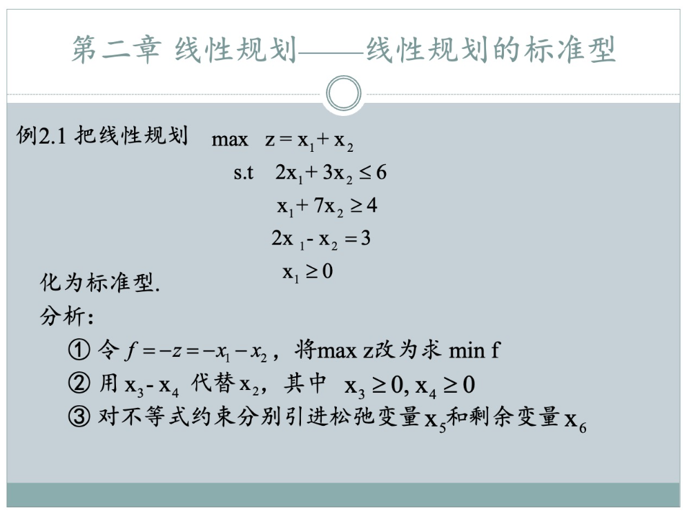
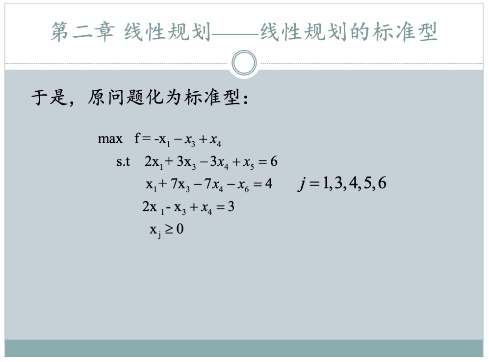

### 一、 线性规划标准型的“考试向”定义

在考试和单纯形法预处理中，线性规划的**标准型 (Standard Form)** 必须严格满足以下四个特征：

1.  **目标函数极小化**：$\min f = \sum c_j x_j$（若原题为 $\max{z}$，需转化为$\min(-z)$）。
2.  **约束条件等式化**：所有的约束方程必须是等式 $Ax = b$。（如果原题是$\geq$或$\leq$，需要变成$=$，一般不会出现$\lt$或$\gt$）
3.  **变量非负性**：所有变量必须满足 $x_j \geq 0$。（如果原题不满足，可以通过变量代换让它满足）
4.  **右端项非负性**：常数列必须满足 $b_i \geq 0$。(**注意**：PPT上似乎没有强调这一点，但是**建议**额外变换一次)

---

### 二、 标准型转化流程（实战操作指南）

当你在考场上拿到一个线性规划问题时，请按以下“流水线”操作：

1.  **目标转换**：若为 $\max z$，令 $f = -z$，求 $\min f$。
2.  **变量“洗白”**：
    *   若 $x_j \leq 0$，令 $x_j = -x_j'$。
    *   若 $x_j$ 无约束（自由变量），令 $x_j = x_j' - x_j''$，其中 $x_j', x_j'' \geq 0$。
3.  **约束“整容”**：
    *   遇到 $\leq$：左端**加上**一个松弛变量 $x_s \geq 0$。
    *   遇到 $\geq$：左端**减去**一个剩余变量 $x_e \geq 0$。
4.  **常数项检查**：观察等式右边的 $b$。若有负数，整行乘以 $-1$（**注意：这一步最后做，避免处理不等号变号**）。

---

### 三、 例题 2.1 详解

#### 1. 原问题分析
$$
\begin{aligned}
\max \quad & z = x_1 + x_2 \\
\text{s.t.} \quad & \begin{cases} 2x_1 + 3x_2 \leq 6 \\ x_1 + 7x_2 \geq 4 \\ 2x_1 - x_2 = 3 \\ x_1 \geq 0, \quad x_2 \text{ 无约束} \end{cases}
\end{aligned}
$$

#### 2. 标准化步骤
*   **Step 1：目标函数转化**
    令 $f = -z = -x_1 - x_2$，目标变为 $\min f$。
*   **Step 2：处理自由变量 $x_2$**
    令 $x_2 = x_3 - x_4$，其中 $x_3, x_4 \geq 0$。
    代入目标函数：$f = -x_1 - (x_3 - x_4) = -x_1 - x_3 + x_4$。
*   **Step 3：转化约束条件**
    *   对于约束(1) ($\leq 6$)：引入松弛变量 $x_5 \geq 0$，变为 $2x_1 + 3(x_3 - x_4) + x_5 = 6$。
    *   对于约束(2) ($\geq 4$)：引入剩余变量 $x_6 \geq 0$，变为 $x_1 + 7(x_3 - x_4) - x_6 = 4$。
    *   对于约束(3) ($= 3$)：直接代入变量替换，$2x_1 - (x_3 - x_4) = 3$。

#### 3. 最终标准型结果
$$
\begin{aligned}
\min \quad & f = -x_1 - x_3 + x_4 \\
\text{s.t.} \quad & \begin{cases} 2x_1 + 3x_3 - 3x_4 + x_5 = 6 \\ x_1 + 7x_3 - 7x_4 - x_6 = 4 \\ 2x_1 - x_3 + x_4 = 3 \\ x_j \geq 0 \quad (j=1,3,4,5,6) \end{cases}
\end{aligned}
$$

---

### 四、 考场特别提示

**关于 $b \geq 0$ 的习惯**：虽然本题化简后的右端项 $b = [6, 4, 3]^T$ 天然满足非负性，但在实战中，**最后要检查 $b$ **。如果最后一步发现某个 $b_i$ 是负数，就多写一步，通过整行乘以 $-1$ 来纠正，反正一定不错。因为后面的**单纯形法和大M法**都需要这一步。

比如试卷上可以写：通过乘以-1，得到一个更规范的标准型xxx。