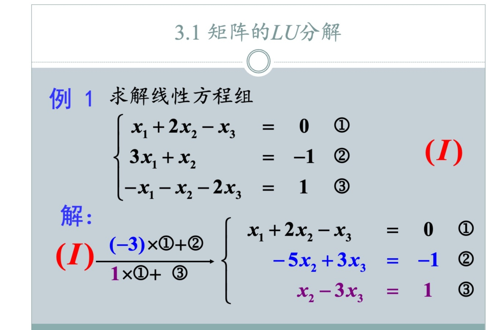
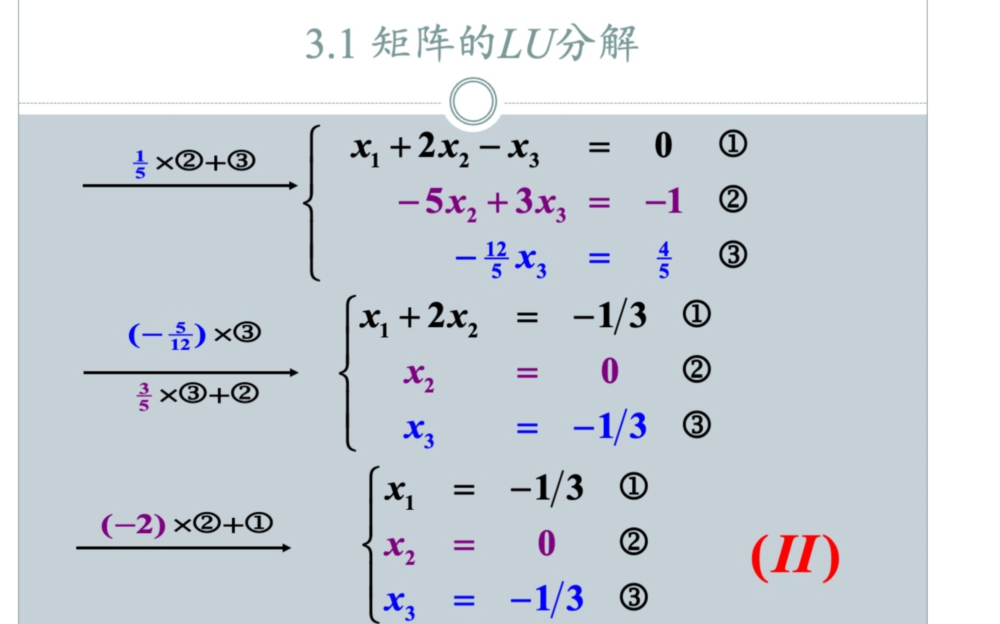
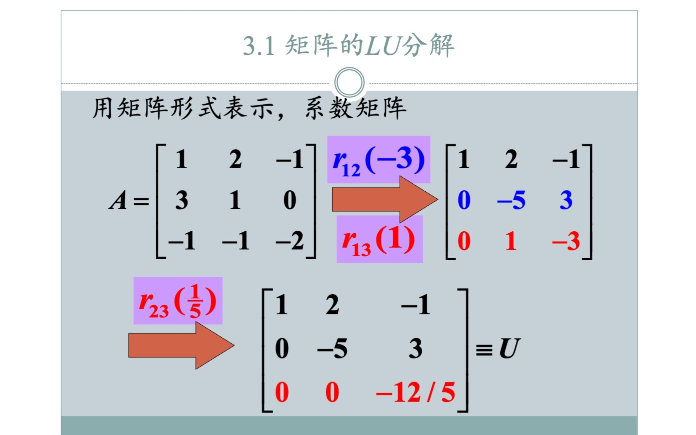
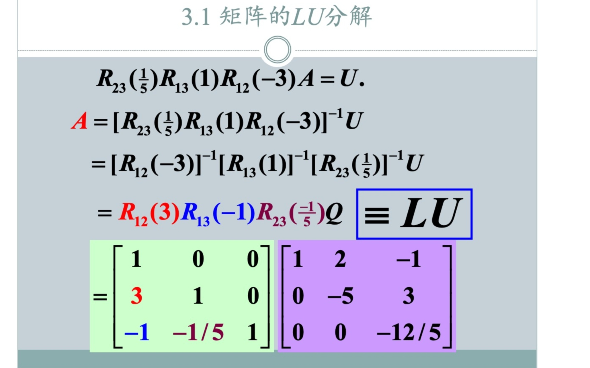

### 题型：求矩阵的LU分解来解方程

# 记乘数法求LU分解

## 一、 LU分解的目标与解题思路

### 1. 分解目标
将系数矩阵 $A$ 分解为一个**单位下三角矩阵 $L$**（对角线元素全为1）和一个**上三角矩阵 $U$** 的乘积：
$$A = LU$$
其中：
- $L$ (Lower)：对角线为1，其余非零项在左下方。
- $U$ (Upper)：非零项在右上方（即高斯消元后的结果）。

### 2. 解方程思路
将 $Ax = b$ 转化为 $LUx = b$。为了求解 $x$，我们分两步走：
1.  **前向替换**：令 $Ux = y$，先解方程组 $Ly = b$，求出中间变量 $y$。
2.  **后向替换**：得到 $y$ 后，再解方程组 $Ux = y$，求出最终解 $x$。

---

## 二、 “记乘数法”通用流程

“记乘数法”的核心思想是：**在利用高斯消元法将 $A$ 变为 $U$ 的过程中，顺便把消元时用到的“倍数”填入 $L$。**

### 通用步骤：
1.  **初始化**：准备一个空的 $L$ 矩阵（对角线设为1，其余位置暂空）和一个 $U$ 矩阵（初始为 $A$）。
2.  **消元与记录**：
    - 使用第1行消去第2、3行的首列元素。若执行 $R_2 = R_2 - (\mathbf{m_{21}})R_1$，则令 $L$ 矩阵的 $l_{21} = \mathbf{m_{21}}$。
    - 继续使用第2行消去第3行的第二列元素。若执行 $R_3 = R_3 - (\mathbf{m_{32}})R_2$，则令 $L$ 矩阵的 $l_{32} = \mathbf{m_{32}}$。
3.  **注意**：在基础 LU 分解课程中，题目通常经过特殊设计，消元过程中出现的**主元（对角线元素）均不为 0**。如果遇到 0，则说明该矩阵无法进行直接的 LU 分解（需要进行行交换，即 $PA=LU$），但在初级考试中极少出现这种情况。

---

## 三、 实战演练：求解线性方程组

**待求方程组：**
$$ \begin{cases} x_1 + 2x_2 - x_3 = 0 \\ 3x_1 + x_2 = -1 \\ -x_1 - x_2 - 2x_3 = 1 \end{cases} \implies A = \begin{bmatrix} 1 & 2 & -1 \\ 3 & 1 & 0 \\ -1 & -1 & -2 \end{bmatrix}, \quad b = \begin{bmatrix} 0 \\ -1 \\ 1 \end{bmatrix} $$

### 第一步：LU 分解（记乘数法）

我们要将 $A$ 变为上三角 $U$。

1.  **消去第一列：**
    - 针对第2行：$R_2 = R_2 - (\mathbf{3})R_1$。 记录乘数 $l_{21} = 3$。
    - 针对第3行：$R_3 = R_3 - (\mathbf{-1})R_1$。记录乘数 $l_{31} = -1$。
    - **此时矩阵变为：** $\begin{bmatrix} 1 & 2 & -1 \\ 0 & -5 & 3 \\ 0 & 1 & -3 \end{bmatrix}$

2.  **消去第二列：**
    - 目标是让 $a_{32}=1$ 变成 0。
    - 计算倍数：$1 - (\mathbf{k}) \times (-5) = 0 \implies k = \frac{1}{-5} = -0.2$。
    - 执行：$R_3 = R_3 - (\mathbf{-0.2})R_2$。记录乘数 $l_{32} = -0.2$。
    - **得到 $U$：** $\begin{bmatrix} 1 & 2 & -1 \\ 0 & -5 & 3 \\ 0 & 0 & -2.4 \end{bmatrix}$

3.  **写出结果：**
    $$ L = \begin{bmatrix} 1 & 0 & 0 \\ 3 & 1 & 0 \\ -1 & -0.2 & 1 \end{bmatrix}, \quad U = \begin{bmatrix} 1 & 2 & -1 \\ 0 & -5 & 3 \\ 0 & 0 & -2.4 \end{bmatrix} $$

---

### 第二步：解 $Ly = b$（从上往下算）

$$ \begin{bmatrix} 1 & 0 & 0 \\ 3 & 1 & 0 \\ -1 & -0.2 & 1 \end{bmatrix} \begin{bmatrix} y_1 \\ y_2 \\ y_3 \end{bmatrix} = \begin{bmatrix} 0 \\ -1 \\ 1 \end{bmatrix} $$
- $y_1 = 0$
- $3(0) + y_2 = -1 \implies y_2 = -1$
- $-1(0) - 0.2(-1) + y_3 = 1 \implies 0.2 + y_3 = 1 \implies y_3 = 0.8$

**得出 $y = [0, -1, 0.8]^T$。**

---

### 第三步：解 $Ux = y$（从下往上算）

$$ \begin{bmatrix} 1 & 2 & -1 \\ 0 & -5 & 3 \\ 0 & 0 & -2.4 \end{bmatrix} \begin{bmatrix} x_1 \\ x_2 \\ x_3 \end{bmatrix} = \begin{bmatrix} 0 \\ -1 \\ 0.8 \end{bmatrix} $$
- $-2.4x_3 = 0.8 \implies x_3 = -\frac{0.8}{2.4} = -\frac{1}{3}$
- $-5x_2 + 3(-\frac{1}{3}) = -1 \implies -5x_2 - 1 = -1 \implies -5x_2 = 0 \implies x_2 = 0$
- $x_1 + 2(0) - (-\frac{1}{3}) = 0 \implies x_1 + \frac{1}{3} = 0 \implies x_1 = -\frac{1}{3}$

---

### 最终结论
方程组的解为：
$$ \mathbf{x = \begin{bmatrix} -1/3 \\ 0 \\ -1/3 \end{bmatrix}} $$