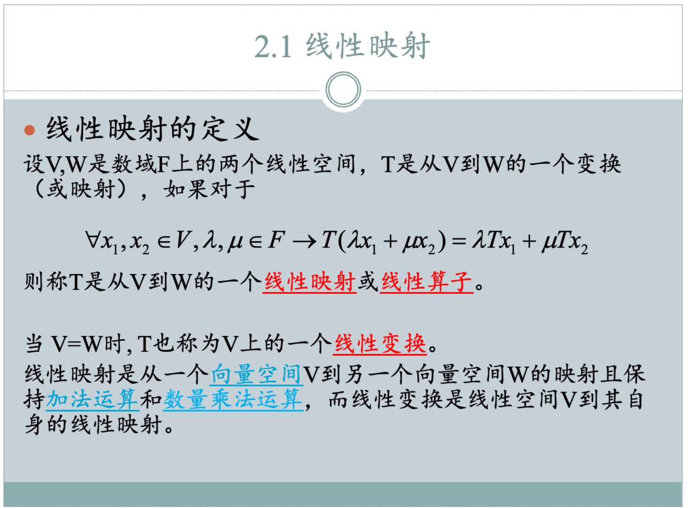
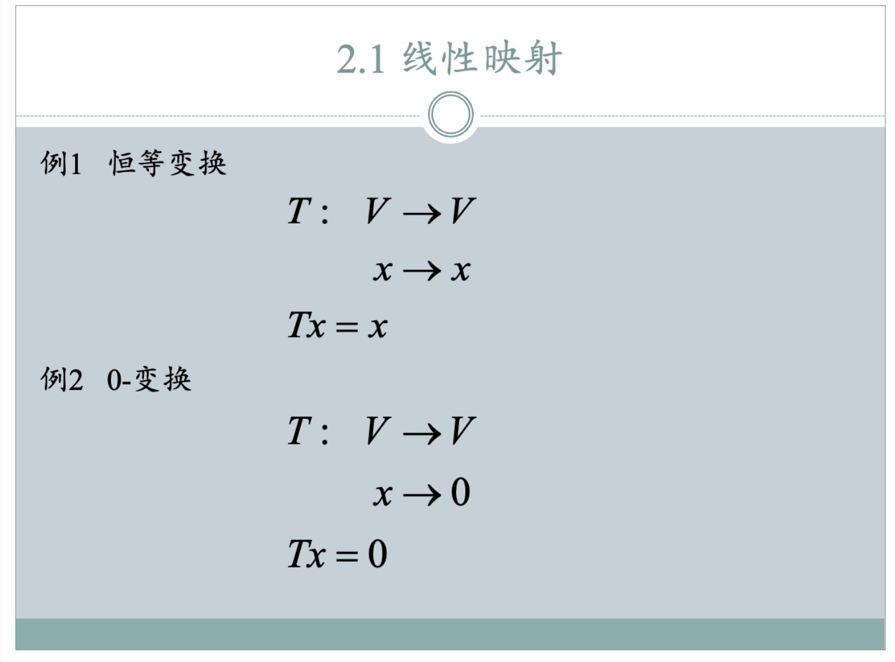
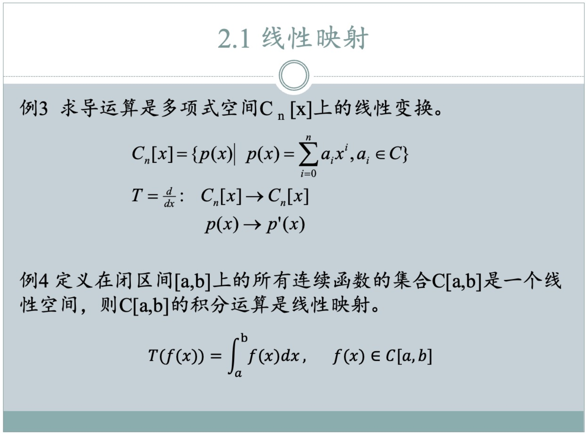
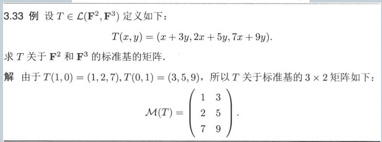

### 例题：用定义证明是一个线性映射

好的，我们来根据PPT中提供的定义，为这两个例子写出详细的题解。

PPT的核心定义是：
一个映射 `T: V → W` 是**线性映射**，如果对于任意向量 `x₁, x₂ ∈ V` 和任意标量 `λ, μ`，都满足：
$$
T(\lambda x_1 + \mu x_2) = \lambda T(x_1) + \mu T(x_2)
$$
特别地，当 `V = W` 时，这个线性映射也称为**线性变换**。

#### 例3 题解

**问题**：证明求导运算 `T = d/dx` 是多项式空间 `Cₙ[x]` 上的线性变换。

**证明**：

1.  **明确定义域和到达域**
    
    *   **线性空间 `V`**：`Cₙ[x]`，即所有次数不超过 `n` 的复系数多项式的集合。
    *   **映射 `T`**：`T(p(x)) = p'(x)`，即对多项式 `p(x)` 进行求导。
    *   一个次数不超过 `n` 的多项式，其导数是一个次数不超过 `n-1` 的多项式。这个结果仍然属于 `Cₙ[x]` 空间。因此，映射 `T` 是从 `Cₙ[x]` 到 `Cₙ[x]` 的，即 `T: Cₙ[x] → Cₙ[x]`。由于定义域和到达域是同一个空间，我们只需证明 `T` 是线性映射，即可得出它是线性变换的结论。
    
2.  **验证线性性质**
    设 `p₁(x)` 和 `p₂(x)` 是空间 `Cₙ[x]` 中的任意两个多项式，并设 `λ` 和 `μ` 是数域 `C` (复数) 中的任意两个标量。

    根据线性映射的定义，我们需要验证 `T(λp₁(x) + μp₂(x)) = λT(p₁(x)) + μT(p₂(x))` 是否成立。

    *   **计算等式左边**：
        $$
        T(\lambda p_1(x) + \mu p_2(x))
        $$
        根据映射 `T` 的定义（求导），上式等于：
        $$
        = \frac{d}{dx} (\lambda p_1(x) + \mu p_2(x))
        $$
        根据高等数学中导数的基本运算法则（和的导数等于导数的和，常数因子可以提出），我们得到：
        $$
        = \lambda \frac{d}{dx}p_1(x) + \mu \frac{d}{dx}p_2(x)
        $$
        这等于：
        $$
        = \lambda p_1'(x) + \mu p_2'(x)
        $$

    *   **计算等式右边**：
        $$
        \lambda T(p_1(x)) + \mu T(p_2(x))
        $$
        根据映射 `T` 的定义，`T(p₁(x)) = p₁'(x)` 且 `T(p₂(x)) = p₂'(x)`，所以上式等于：
        $$
        = \lambda p_1'(x) + \mu p_2'(x)
        $$

    *   **比较结果**：
        等式左边与右边相等。

3.  **得出结论**
    由于 `T(λp₁(x) + μp₂(x)) = λT(p₁(x)) + μT(p₂(x))` 恒成立，所以 `T` 是一个线性映射。又因为该映射的定义域和到达域都是 `Cₙ[x]`，所以 `T` 是 `Cₙ[x]` 上的一个**线性变换**。

#### 例4 题解

**问题**：证明在闭区间 `[a,b]` 上的所有连续函数的集合 `C[a,b]` 中，积分运算 `T(f(x)) = ∫[a,b] f(x) dx` 是线性映射。

**证明**：

1. **明确定义域和到达域**
   *   **线性空间 `V`**：`C[a,b]`，即所有在闭区间 `[a,b]` 上连续的实函数构成的集合。
   *   **映射 `T`**：`T(f(x)) = ∫[a,b] f(x) dx`，即对函数 `f(x)` 进行定积分。
   *   对于 `C[a,b]` 中的任意函数 `f(x)`，其在 `[a,b]` 上的定积分是一个确定的实数。因此，该映射是从函数空间 `C[a,b]` 映射到实数域 `R`（`R` 本身也是一个一维线性空间）。即 `T: C[a,b] → R`。由于定义域和到达域是不同的空间，我们只需证明其为线性映射。

2. **验证线性性质**
   设 `f(x)` 和 `g(x)` 是空间 `C[a,b]` 中的任意两个函数，并设 `λ` 和 `μ` 是数域 `R` (实数) 中的任意两个标量。

   根据线性映射的定义，我们需要验证 `T(λf(x) + μg(x)) = λT(f(x)) + μT(g(x))` 是否成立。

   *   **计算等式左边**：
       $$
       T(\lambda f(x) + \mu g(x))
       $$
       根据映射 `T` 的定义（定积分），上式等于：
       $$
       = \int_a^b [\lambda f(x) + \mu g(x)] dx
       $$
       根据定积分的基本性质（被积函数的线性组合的积分等于积分的线性组合），我们得到：
       $$
       = \lambda \int_a^b f(x) dx + \mu \int_a^b g(x) dx
       $$

   *   **计算等式右边**：
       $$
       \lambda T(f(x)) + \mu T(g(x))
       $$
       根据映射 `T` 的定义，`T(f(x)) = ∫[a,b] f(x) dx` 且 `T(g(x)) = ∫[a,b] g(x) dx`，所以上式等于：
       $$
       = \lambda \int_a^b f(x) dx + \mu \int_a^b g(x) dx
       $$

   *   **比较结果**：
       等式左边与右边相等。

3. **得出结论**
   由于 `T(λf(x) + μg(x)) = λT(f(x)) + μT(g(x))` 恒成立，所以 `T` 是一个**线性映射**。因为它将一个函数空间映射到了一个数域空间，定义域与到达域不同，所以它不是线性变换。

### 题型：求线性映射的矩阵

#### 基本概念：什么叫做线性映射的矩阵

“T 关于基B和基C的矩阵”（我们称之为 `A`）就是一个**翻译器**或**转换规则**。它的作用是：

> 你给我一个向量 `v` 在**起点基B**下的坐标，我用这个矩阵 `A` 乘以你的坐标，就能得到 `v` 经过 `T` 映射后的结果 `T(v)` 在**终点基C**下的坐标。

#### 求线性映射矩阵的一般方法

设 `T: V → W` 是一个线性映射，`B = {v₁, v₂, ..., vₙ}` 是起点空间 `V` 的一组基，`C = {w₁, w₂, ..., wₘ}` 是终点空间 `W` 的一组基。求 `T` 关于基 `B` 和 `C` 的矩阵 `A` 的步骤如下：

1.  **取**：依次取出起点基 `B` 中的每一个向量 `vⱼ` (其中 `j` 从 1 到 `n`)。
2.  **映射**：对每一个 `vⱼ`，计算它在映射 `T` 下的像 `T(vⱼ)`。
3.  **分解**：将得到的像 `T(vⱼ)` 表示为终点基 `C` 的唯一线性组合，从而得到其在基 `C` 下的坐标向量。
4.  **放置**：将这个坐标向量作为矩阵 `A` 的**第 `j` 列**。

重复以上步骤，直到起点基 `B` 中的所有向量都被处理完毕，即可得到完整的矩阵 `A`。

#### 问题复述与概念解释

**例 3.33** 设 `T ∈ L(F², F³)` 定义如下：
$$
T(x, y) = (x + 3y, 2x + 5y, 7x + 9y)
$$
求 `T` 关于 `F²` 和 `F³` 的标准基的矩阵。

---

**概念解释:**

1.  **`F²` 和 `F³` 是什么？**
    *   `F` 代表一个**数域 (Field)**，你可以把它想象成一个数的集合，在其中可以进行加、减、乘、除运算（除数不为零）。最常见的数域是实数域 `R` 和复数域 `C`。
    *   `F²` 是指数域 `F` 上的**二维向量空间**。空间中的每一个向量都是一个有序对 `(x, y)`，其中 `x` 和 `y` 都是数域 `F` 中的数。
    *   `F³` 类似地是数域 `F` 上的**三维向量空间**，其中的向量是有序三元组 `(a, b, c)`。

2.  **符号 `L(F², F³)` 是什么？**
    *   这个符号读作 "L of F-squared, F-cubed"。
    *   `L(V, W)` 表示从向量空间 `V` 到向量空间 `W` 的**所有线性映射 (Linear maps) 的集合**。
    *   因此，`T ∈ L(F², F³)` 的意思是：`T` 是一个从二维空间 `F²` 映射到三维空间 `F³` 的线性映射。

#### 题解

**目标**：求线性映射 `T` 在 `F²` 和 `F³` 的标准基下的矩阵表示。

**核心思想**：
一个线性映射的矩阵表示，是通过观察这个映射如何作用于**定义域**的基向量，然后将结果用**到达域**的基向量来表示，最后将这些表示结果的坐标作为矩阵的**列**来构建的。

**步骤 1：写出定义域和到达域的标准基**

*   **定义域 `F²` 的标准基** 是 `{e₁, e₂}`，其中：
    $$
    e_1 = (1, 0), \quad e_2 = (0, 1)
    $$
*   **到达域 `F³` 的标准基** 是 `{f₁, f₂, f₃}`，其中：
    $$
    f_1 = (1, 0, 0), \quad f_2 = (0, 1, 0), \quad f_3 = (0, 0, 1)
    $$

**步骤 2：计算定义域的基向量经过映射 `T` 后的像**

*   **将第一个基向量 `e₁ = (1, 0)` 代入 `T`：**
    （令 `x=1`, `y=0`）
    $$
    T(e_1) = T(1, 0) = (1 + 3(0), 2(1) + 5(0), 7(1) + 9(0)) = (1, 2, 7)
    $$

*   **将第二个基向量 `e₂ = (0, 1)` 代入 `T`：**
    （令 `x=0`, `y=1`）
    $$
    T(e_2) = T(0, 1) = (0 + 3(1), 2(0) + 5(1), 7(0) + 9(1)) = (3, 5, 9)
    $$

**步骤 3：构建矩阵**

矩阵的**第 `i` 列**是 `T(eᵢ)` 在到达域标准基下的坐标向量。

*   `T(e₁) = (1, 2, 7)`。这个向量在 `F³` 标准基下的坐标就是 `(1, 2, 7)`。这个坐标向量成为矩阵的**第一列**。

*   `T(e₂) = (3, 5, 9)`。这个向量在 `F³` 标准基下的坐标就是 `(3, 5, 9)`。这个坐标向量成为矩阵的**第二列**。

将这两列组合起来，我们得到 `T` 的矩阵表示 `M(T)`：
$$
M(T) = \begin{pmatrix} 1 & 3 \\ 2 & 5 \\ 7 & 9 \end{pmatrix}
$$

**结论：**
线性映射 `T` 关于 `F²` 和 `F³` 的标准基的矩阵是一个 `3 × 2` 矩阵，其形式为：
$$
M(T) = \begin{pmatrix} 1 & 3 \\ 2 & 5 \\ 7 & 9 \end{pmatrix}
$$

### 题型：求线性映射的矩阵。通用版：普通基

**让我们用上一题的线性映射 `T` 来举一个例子。**

*   **线性映射 T**: `T(x, y) = (x + 3y, 2x + 5y, 7x + 9y)`
*   **起点空间 `F²` 的基B**: 我们不用标准基，而是用 `B = { v₁, v₂ } = { (1, 1), (1, -1) }`。
*   **终点空间 `F³` 的基C**: 我们也不用标准基，而是用 `C = { w₁, w₂, w₃ } = { (1, 0, 0), (1, 1, 0), (1, 1, 1) }`。

**目标**：求 `T` 关于新基 `B` 和 `C` 的矩阵 `A`。

**求解步骤：**

**第1步：计算 `T(v₁)` 并求其在基 `C` 下的坐标。**
*   `v₁ = (1, 1)`
*   `T(v₁) = T(1, 1) = (1+3, 2+5, 7+9) = (4, 7, 16)`
*   **现在是关键**：我们要把 `(4, 7, 16)` 表示成基 `C` 的线性组合，即求 `a, b, c` 使得：
    `a*w₁ + b*w₂ + c*w₃ = (4, 7, 16)`
    `a(1,0,0) + b(1,1,0) + c(1,1,1) = (4, 7, 16)`
    `(a+b+c, b+c, c) = (4, 7, 16)`
*   这给了我们一个方程组：
    1.  `a + b + c = 4`
    2.  `b + c = 7`
    3.  `c = 16`
*   从下往上解得：`c = 16`, `b = 7 - 16 = -9`, `a = 4 - 7 = -3`。
*   所以，`T(v₁)` 在基 `C` 下的坐标是 `(-3, -9, 16)`。这就是矩阵 `A` 的**第一列**。

**第2步：计算 `T(v₂)` 并求其在基 `C` 下的坐标。**
*   `v₂ = (1, -1)`
*   `T(v₂) = T(1, -1) = (1-3, 2-5, 7-9) = (-2, -3, -2)`
*   同样，我们要把 `(-2, -3, -2)` 表示成基 `C` 的线性组合：
    `a*w₁ + b*w₂ + c*w₃ = (-2, -3, -2)`
    `(a+b+c, b+c, c) = (-2, -3, -2)`
*   解方程组：
    1.  `a + b + c = -2`
    2.  `b + c = -3`
    3.  `c = -2`
*   从下往上解得：`c = -2`, `b = -3 - (-2) = -1`, `a = -2 - (-3) = 1`。
*   所以，`T(v₂)` 在基 `C` 下的坐标是 `(1, -1, -2)`。这就是矩阵 `A` 的**第二列**。

**第3步：组合成最终的矩阵。**
将找到的两列坐标组合起来，得到最终的矩阵 `A`：
$$
A = \begin{pmatrix} -3 & 1 \\ -9 & -1 \\ 16 & -2 \end{pmatrix}
$$
这个矩阵就是 `T` 关于基 `B` 和 `C` 的矩阵表示。它看起来和标准基下的矩阵完全不同，但描述的是同一个线性映射