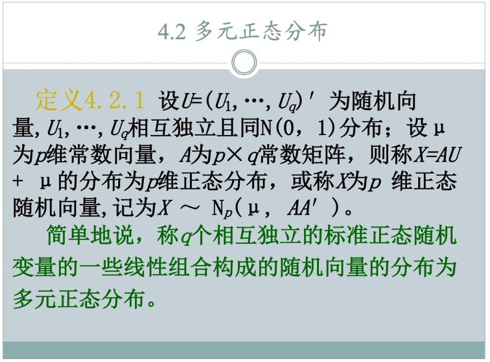
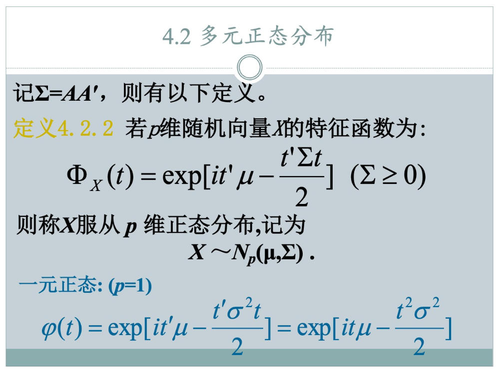
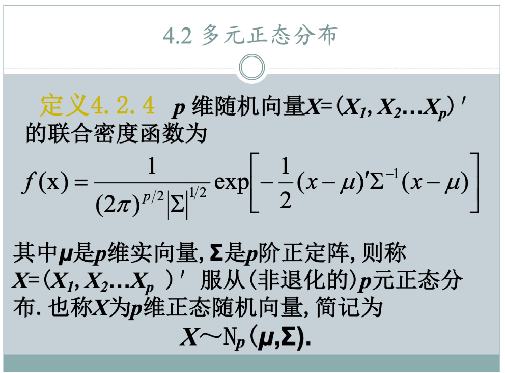

### 题型：多元正态分布四种定义

这道题在往年考试中出现过，要求我们完整写出这四种定义。

在往年的期末考题当中，曾经考过“多元正态分布的四种定义”，这是一个核心的考点。

---

### **第一种：构造性定义**

**【对应PPT 4.2.1】**
首先看第一种，我们可以称之为“构造性定义”。
它的准确表述是：设 $U = (U_1, \cdots, U_q)^T$ 为随机向量，其中 $U_1, \cdots, U_q$ 相互独立且都服从标准正态分布 $N(0, 1)$。设 $\mu$ 是 $p$ 维常数向量，$A$ 是 $p \times q$ 的常数矩阵。
如果随机向量 $X$ 可以表示为：
$$X = AU + \mu$$
那么我们就称 $X$ 的分布为 $p$ 维正态分布，记作 $X \sim N_p(\mu, AA^T)$。

**【提示】**
简单来说，只要一个随机向量能表示成一堆“**独立标准正态随机变量**”的线性组合，它就是多元正态的。这里的均值向量是 $\mu$，协方差矩阵就是 $\Sigma = AA^T$。

---

### **第二种：特征函数定义**

**【对应PPT 4.2.2】**
第二种是利用“特征函数”来定义的，这是最数学化、也最严谨的定义。
准确表述是：若 $p$ 维随机向量 $X$ 的特征函数具有以下形式：
$$\Phi_X(t) = \exp \left[ it^T \mu - \frac{t^T \Sigma t}{2} \right]$$
其中 $\Sigma \ge 0$（即 $\Sigma$ 是半正定矩阵），我们就称 $X$ 服从 $p$ 维正态分布，记为 $X \sim N_p(\mu, \Sigma)$。

**【提示】**
这个定义的好处在于它不仅涵盖了普通情况，还涵盖了“退化”的情况（即 $\Sigma$ 不可逆的情况）。在概率论中，特征函数和分布是一一对应的，所以只要特征函数长这样，它就一定是多元正态。

---

### **第三种：线性组合定义**

**【对应PPT 4.2.3】**
第三种定义在做证明题时非常常用，我们称之为“线性组合定义”。
准确表述是：若 $p$ 维随机向量 $X$ 的**任意**线性组合 $a^T X$（其中 $a$ 是常数向量）都服从一元正态分布，则称 $X$ 为 $p$ 维正态随机向量。

---

### **第四种：密度函数定义**

**【对应PPT 4.2.4】**
最后一种是我们最熟悉的，利用“联合概率密度函数”来定义。
准确表述是：若 $p$ 维随机向量 $X = (X_1, X_2, \cdots, X_p)^T$ 的联合密度函数为：
$$f(x) = \frac{1}{(2\pi)^{p/2} |\Sigma|^{1/2}} \exp \left[ -\frac{1}{2} (x-\mu)^T \Sigma^{-1} (x-\mu) \right]$$
其中 $\mu$ 是 $p$ 维实向量，$\Sigma$ 是 $p$ 阶**正定矩阵**，则称 $X$ 服从（非退化的）$p$ 元正态分布。

**【提示】**
**注意！** 这个定义是有局限性的。它要求 $\Sigma$ 必须是正定的（即 $|\Sigma| \neq 0$），这意味着 $\Sigma$ 必须可逆。如果 $\Sigma$ 是奇异矩阵（退化情况），密度函数就不存在了，但前三种定义依然成立。所以，密度函数定义只是前三种定义在非奇异情况下的具体表现。

好的，模仿你之前的风格，我们来编写**“从0到1：概率密度定义”**的讲解模块。这个模块旨在帮助学生通过“直观类比”快速记住那个复杂的密度函数公式。

---

### **从0到1：概率密度函数定义**

这是大家最熟悉的定义，但由于公式里既有矩阵求逆、又有行列式，很多同学容易记混。其实，它只是对一元正态密度公式的一次“华丽升级”。

#### **1. “升级换代”：从一元到多元**

我们先复习一元正态分布 $N(\mu, \sigma^2)$ 的密度函数：
$$f(x) = \frac{1}{\sqrt{2\pi} \sigma} \exp \left[ -\frac{(x-\mu)^2}{2\sigma^2} \right]$$

现在，我们要把里面的每一个零件都“升级”成矩阵版本：

*   **均值与变量**：$x - \mu \implies \mathbf{x} - \boldsymbol{\mu}$ （变为向量差）。
*   **方差倒数**：$\frac{1}{\sigma^2} \implies \boldsymbol{\Sigma}^{-1}$ （变为协方差矩阵的逆）。
*   **平方项**：$\frac{(x-\mu)^2}{\sigma^2}$ 这种“变量与方差倒数的乘积”升级为**二次型**：$(\mathbf{x}-\boldsymbol{\mu})^T \boldsymbol{\Sigma}^{-1} (\mathbf{x}-\boldsymbol{\mu})$。
*   **标准差项**：$\sigma = \sqrt{\sigma^2} \implies |\boldsymbol{\Sigma}|^{1/2}$ （方差升级为协方差矩阵的行列式，再开方）。
*   **归一化常数**：每一个维度都会产生一个 $\sqrt{2\pi}$，所以 $p$ 个维度就是 $(\sqrt{2\pi})^p$，即 $(2\pi)^{p/2}$。

**拼装结果：**
$$f(x) = \frac{1}{(2\pi)^{p/2} |\boldsymbol{\Sigma}|^{1/2}} \exp \left[ -\frac{1}{2} (\mathbf{x}-\boldsymbol{\mu})^T \boldsymbol{\Sigma}^{-1} (\mathbf{x}-\boldsymbol{\mu}) \right]$$

---

#### **2. 降维打击：当 $p=1$ 时反向验证**

为了确保你背的公式没错，我们把 $p=1$ 代入看看：

1.  **前面部分**：$\frac{1}{(2\pi)^{1/2} |\sigma^2|^{1/2}} = \frac{1}{\sqrt{2\pi} \sigma}$。（完全吻合！）
2.  **指数部分**：$-\frac{1}{2} (x-\mu) \cdot (\sigma^2)^{-1} \cdot (x-\mu) = -\frac{(x-\mu)^2}{2\sigma^2}$。（完全吻合！）

**关键提示（考试避坑）：**
为什么第四种定义要求 $\boldsymbol{\Sigma}$ **正定**（可逆）？
看公式就明白了：
*   公式里有 $\boldsymbol{\Sigma}^{-1}$，如果矩阵不可逆（退化），求不出逆矩阵。
*   公式里有 $|\boldsymbol{\Sigma}|$ 在分母，如果矩阵奇异，行列式为 0，分母就炸了。
所以，**概率密度定义只适用于非退化的情况**。而前三种定义（构造、特征函数、线性组合）则更加通用。

### **从0到1：特征函数定义**

#### 0. n阶矩

1.  **$n$ 阶矩**：$E[X^n]$，分布形状的“度量衡”。
2.  **一阶矩**：$E[X]$，即均值，位置重心。
3.  **二阶矩**：$E[X^2]$，和方差直接相关。
4.  **关系**：$Var(X) = E[X^2] - (E[X])^2$。方差 = 二阶矩 - 均值的平方

#### **1. 为什么要设计特征函数？（打包均值和方差）**

“想象一下，如果一个随机变量 $X$ 的均值是 $E(X)$，方差是 $Var(X)$，还有三阶矩、四阶矩……我们要描述一个分布，难道要把这些数字一个一个列出来吗？

有一个聪明的办法：**把这些数字全部‘打包’进一个函数里。** 这个函数就是特征函数。”

#### **2. 利用泰勒展开进行“打包”**
我们定义特征函数为 $\Phi_X(t) = E[e^{itX}]$。
（$i$ 是虚数单位，$t$ 只是一个辅助变量。）

**神奇的泰勒展开：**
根据 $e^z = 1 + z + \frac{z^2}{2!} + \frac{z^3}{3!} + \dots$
我们将 $e^{itX}$ 展开：
$$e^{itX} = 1 + (it)X + \frac{(it)^2}{2!}X^2 + \frac{(it)^3}{3!}X^3 + \dots$$

对两边求期望 $E[\cdot]$：
$$\Phi_X(t) = 1 + (it) \color{red}{E[X]} + \frac{(it)^2}{2!} \color{red}{E[X^2]} + \frac{(it)^3}{3!} \color{red}{E[X^3]} + \dots$$

**结论：**
你看，特征函数 $\Phi_X(t)$ 就像一个**压缩包（ZIP文件）**：
*   $t$ 的一次项系数里藏着**均值**。
*   $t$ 的二次项系数里藏着**二阶矩**（进而算出方差）。
*   只要知道了这个函数，你就知道了这个分布的所有秘密！

---

#### **3. 标准正态分布 $N(0,1)$ 的压缩包长什么样？**

经过微积分计算（这里不展示复杂的积分过程，直接给结论）：
如果 $U \sim N(0,1)$，它的特征函数极其简洁：
$$\Phi_U(t) = e^{-\frac{1}{2}t^2}$$

**为什么长这样？用泰勒展开反推一下：**
把 $e^{-\frac{1}{2}t^2}$ 也做泰勒展开：
$$e^{-\frac{1}{2}t^2} = 1 + (-\frac{1}{2}t^2) + \dots = 1 + 0 \cdot t + \frac{1}{2!}(-1)t^2 + \dots$$

*   **均值项：** $t$ 的系数是 0，说明 $E[U] = 0$。
*   **方差项：** 对应 $t^2$ 的系数，可以推导出 $Var(U) = 1$。
*   这完美符合标准正态分布的特征！

#### **4. 普通一元正态分布 $N(\mu, \sigma^2)$ 的“压缩包”**

如果随机变量 $X \sim N(\mu, \sigma^2)$，它的特征函数公式为：
$$\Phi_X(t) = \exp \left( it\mu - \frac{1}{2}\sigma^2 t^2 \right)$$

**我们通过泰勒展开，拆开这个“压缩包”看里面的均值和方差：**

利用公式 $e^z \approx 1 + z + \frac{z^2}{2}$，当 $t$ 很小时：
$$\Phi_X(t) \approx 1 + \left( it\mu - \frac{1}{2}\sigma^2 t^2 \right) + \frac{1}{2} \left( it\mu - \frac{1}{2}\sigma^2 t^2 \right)^2 + \dots$$

为了提取 $t$ 的各阶项，我们整理一下：
1.  **常数项**：$1$
2.  **$t$ 的一次项**：$(it) \cdot \mu$
3.  **$t$ 的二次项**：我们将上面的平方项展开，只保留 $t^2$ 部分，得到 $\frac{(it)^2}{2}\mu^2$。再结合前面的 $-\frac{1}{2}\sigma^2 t^2$（即 $\frac{(it)^2}{2}\sigma^2$），合并得：
    $$\frac{(it)^2}{2!} (\mu^2 + \sigma^2)$$

**对比特征函数的定义式：**
$$\Phi_X(t) = 1 + (it) \color{blue}{E[X]} + \frac{(it)^2}{2!} \color{blue}{E[X^2]} + \dots$$

*   **均值项**：$E[X] = \mu$。
*   **二阶矩项**：$E[X^2] = \mu^2 + \sigma^2$。
*   **计算方差**：$Var(X) = E[X^2] - [E(X)]^2 = (\mu^2 + \sigma^2) - \mu^2 = \sigma^2$。

**结论**：特征函数里的指数部分，**$it$ 的系数就是均值，$-t^2/2$ 的系数就是方差**。

#### **5. 升维：多元正态分布 $N_p(\mu, \Sigma)$ 的“全息图像”**

当我们把一元的 $t, \mu, \sigma^2$ 升级成向量和矩阵时，特征函数就变成了第二种定义中的样子：
$$\Phi_X(t) = \exp \left[ it^T \mu - \frac{1}{2}t^T \Sigma t \right]$$

这里 $t$ 和 $\mu$ 是 $p$ 维列向量，$\Sigma$ 是 $p \times p$ 协方差矩阵。

---

### **从1到100：构造性定义**

#### **1. 生产流水线：从“标准件”到“定制品”**

想象你是一家工厂的老板，你要生产各种各样的多元正态分布。你不需要为每一种分布都准备一套模具，你只需要一种“原材料”：**独立标准正态分布 $U \sim N(0,1)$**。

*   **第一步：准备原材料（$U$）**
    你手头有一堆相互独立的 $U_1, U_2, \dots, U_q$，它们整齐划一，均值为0，方差为1。
*   **第二步：塑形与关联（乘以矩阵 $A$）**
    原本独立的变量，通过矩阵 $A$ 混合在一起。$A$ 决定了新变量之间的**相关性**（协方差）和**拉伸程度**（方差）。
*   **第三步：平移重心（加上向量 $\mu$）**
    把整团分布移动到指定的位置 $\mu$。

**产品出厂：$X = AU + \mu$**
这个定义之所以叫“构造性定义”，因为它直接告诉了你：多元正态分布是怎么“造”出来的。

---

#### **2. 核心关联：为什么 $\Sigma = AA^T$？**

我们通过两个层面来深度理解它：

**（1）方差公式的“高维进化”**
你可能还记得一元随机变量的性质：$Var(aX + b) = a^2 Var(X)$。
在多元世界里，由于 $A$ 是矩阵，我们不能简单地写成 $A^2$。为了保持矩阵运算的维数匹配（矩阵乘以它的转置），这个平方关系“进化”成了**对称的夹心结构**：
$$Var(AU + \mu) = A \cdot Var(U) \cdot A^T$$

*   **对比记忆：**
    *   一元：$a \to Var \to a$ （结果是 $a^2$）
    *   多元：$A \to Var \to A^T$ （结果是 $AA^T$）
*   **结论：** 这里的 $AA^T$ 扮演的角色，本质上就是一元正态分布里方差 $\sigma^2$ 的高维推广。

**（2）均值 $\mu$ 的物理意义：重心的平移**
为什么 $E(X) = \mu$？这源于**期望的线性性质**（即：和的期望等于期望的和，常数矩阵可以提出来）：

1.  已知原材料 $U$ 是标准正态分布，它的均值 $E(U) = \mathbf{0}$（每一个分量都是0）。
2.  计算 $X$ 的期望：
    $$E(X) = E(AU + \mu) = A E(U) + \mu$$
3.  代入 $E(U) = \mathbf{0}$：
    $$E(X) = A \cdot \mathbf{0} + \mu = \mu$$

*   **直观理解：** 矩阵 $A$ 负责旋转和拉伸，但这不会移动分布的中心（中心依然在原点）；最后的加法 $\mu$ 才是真正的“搬运工”，它把整个分布的重心从原点搬到了 $\mu$ 的位置。

---

#### **3. 纵向联结(选看)：从“构造”到“特征函数”**

这是证明“构造性定义”和“特征函数定义”等价的最快路径：

1.  我们知道原材料 $U$ 的特征函数是 $e^{-\frac{1}{2}t^T t}$（见上一模块）。
2.  利用性质：若 $X = AU + \mu$，则 $\Phi_X(t) = e^{it^T \mu} \cdot \Phi_U(A^T t)$。
3.  代入：$\Phi_X(t) = e^{it^T \mu} \cdot e^{-\frac{1}{2}(A^T t)^T (A^T t)} = e^{it^T \mu - \frac{1}{2}t^T (AA^T) t}$。
4.  **看！** 后面这一串 $AA^T$ 正好就是 $\Sigma$。这和特征函数的定义一模一样！

### **从1到100：线性组合定义（投影定义）**

---

#### **1. 定义核心：化繁为简**
对于 $p$ 维随机向量 $X$，我们不直接研究其联合分布，而是研究它的**任意线性组合**：
$$Y = a^T X = a_1 X_1 + a_2 X_2 + \dots + a_p X_p$$
其中 $a = (a_1, \dots, a_p)^T$ 是任意常数向量。
**定义：** 如果对任意的 $a$，标量 $Y$ 都服从一元正态分布，则 $X$ 服从 $p$ 维正态分布。

---

#### **2. 纵向联结：为什么它等价于特征函数定义？**

我们要证明：如果所有 $a^T X$ 都是一元正态的，那么 $X$ 的特征函数一定符合定义二的形式。

1.  **确定一元正态的参数：**
    若 $a^T X$ 是正态分布，其均值和方差分别为：
    *   均值：$E[a^T X] = a^T \mu$
    *   方差：$Var(a^T X) = a^T \Sigma a$
    故 $a^T X \sim N(a^T \mu, a^T \Sigma a)$。

2.  **利用一元正态的特征函数：**
    设一元随机变量 $Y = a^T X$，其特征函数在 $s=1$ 处的值为：
    $$\Phi_Y(1) = E[e^{i \cdot 1 \cdot Y}] = E[e^{i a^T X}]$$
    根据一元正态分布特征函数公式 $\exp(is\mu_Y - \frac{1}{2}s^2\sigma_Y^2)$，代入 $s=1, \mu_Y, \sigma_Y^2$ 得：
    $$E[e^{i a^T X}] = \exp \left( i a^T \mu - \frac{1}{2} a^T \Sigma a \right)$$

3.  **还原多元特征函数：**
    观察上式左侧，$E[e^{i a^T X}]$ 正是多元随机向量 $X$ 在 $t=a$ 处的特征函数 $\Phi_X(a)$。
    由于 $a$ 是任意的，我们可以把 $a$ 换回 $t$：
    $$\Phi_X(t) = \exp \left( i t^T \mu - \frac{1}{2} t^T \Sigma t \right)$$
    **结论：** 这与“定义二（特征函数定义）”完全一致。

