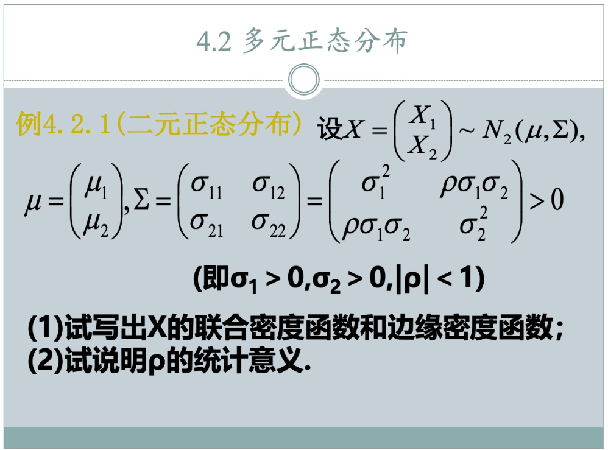
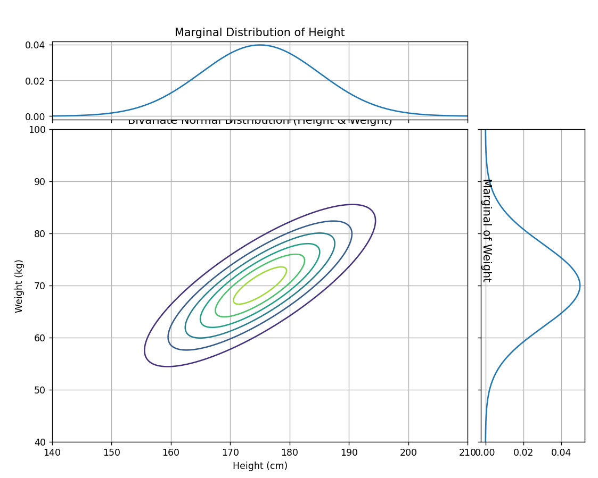
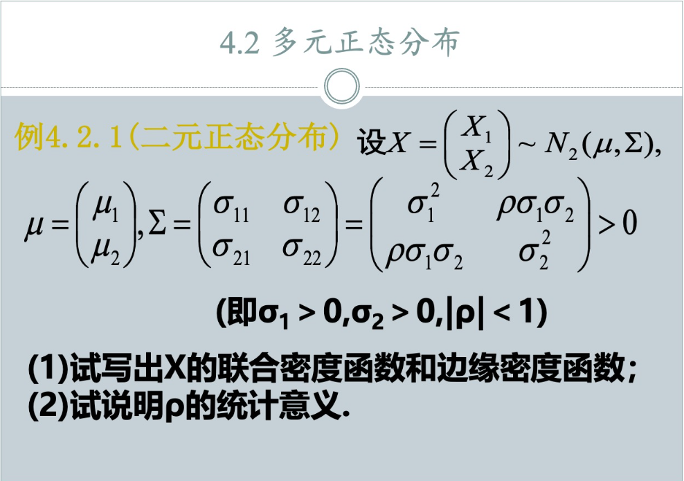

## 选看：多元正态分布的知识回顾

### 从身高和体重的角度，理解正态分布

想象一下，我们去测量全校同学的身高和体重。

#### 什么是一元正态分布 (Univariate Normal Distribution)？

我们先只看 **身高**。

*   我们会发现，大部分人的身高都集中在某个平均值附近（比如170cm）。
*   身高特别高（比如200cm）和特别矮（比如140cm）的人都非常少。
*   如果我们把不同身高的人数画成一个图，它会呈现一个中间高、两边低的“钟形曲线”，这就是**正态分布**。

在这个“钟形曲线”里，有两个非常重要的参数：

*   **μ (mu) - 均值**: 就是大家身高的**平均值**（比如170cm）。它决定了钟形曲线的中心位置在哪里。
*   **σ (sigma) - 标准差**: 它衡量了大家身高数据的**分散程度**。
    *   如果 **σ** 很小，说明大家身高都差不多，钟形曲线就会又高又瘦。
    *   如果 **σ** 很大，说明大家身高差异很大，有高有矮，钟形曲线就会又矮又胖。

所以，一个一元正态分布 `N(μ, σ²)` 就完整地描述了一个变量（比如身高）的分布情况。

#### 对于概率密度函数的理解

| 维度          | 变量示例         | 概率密度函数 (PDF)     | 如何计算概率                | 直观理解             |
| :------------ | :--------------- | :--------------------- | :-------------------------- | :------------------- |
| **一元 (1D)** | 身高             | `f(x)` (一条曲线)      | **面积** (在区间上积分)     | 曲线下的面积         |
| **二元 (2D)** | 身高、体重       | `f(x₁, x₂)` (一个曲面) | **体积** (在区域上二重积分) | 曲面下的体积         |
| **三元 (3D)** | 身高、体重、年龄 | `f(x₁, x₂, x₃)`        | **超体积** (在体上三重积分) | 数学推广，无法可视化 |
| **n元 (nD)**  | n个特征          | `f(x₁, ..., xₙ)`       | **超体积** (n重积分)        | 概率集中度的数学描述 |

#### 什么是二元正态分布 (Bivariate Normal Distribution)？

现在，我们不仅看身高，还把每个人的**体重**也记录下来。我们得到了一对对的数据 `(身高, 体重)`。

我们想研究这两个变量**联合起来**的分布规律。

*   直觉上，身高和体重是有关联的：**身高比较高的人，体重也倾向于比较重。**
*   二元正态分布就是用来描述这种两个变量联合情况的“钟形”分布。只不过，现在这个“钟”是三维的，像一座山。山顶最高的地方，就是平均身高和平均体重组成的点。

现在我们来解释题目中的符号 `N₂(μ, Σ)`：

*   **N**: 代表正态（Normal）分布。
*   **下标的 2**: 代表这是**二元**（2个变量）的分布。如果是三元就是 `N₃`。
*   **μ**: 不再是一个数，而是一个**均值向量** `μ = (μ₁, μ₂)`。
    *   `μ₁` 是第一个变量（身高）的平均值。
    *   `μ₂` 是第二个变量（体重）的平均值。
    *   这个向量 `(μ₁, μ₂)` 就是3D山峰的中心点坐标。
*   **Σ (Sigma)**: 这不再是标准差，而是一个 **协方差矩阵**。这是二元正态分布的灵魂，它描述了两个变量的“胖瘦”以及它们之间的“关系”。

让我们拆解一下这个矩阵 `Σ`:

`Σ = (σ₁₁  σ₁₂)`
`    (σ₂₁  σ₂₂)`

* **σ₁₁**: 是第一个变量（身高）的**方差**，也就是 `σ₁²`。它描述了身高这个维度的“胖瘦”。

* **σ₂₂**: 是第二个变量（体重）的**方差**，也就是 `σ₂²`。它描述了体重这个维度的“胖瘦”。

*   **σ₁₂ 和 σ₂₁**: 这是两个变量之间的**协方差**。它描述了身高和体重变化的**关联方向**。
    *   **σ₁₂ 一定等于 σ₂₁ 吗？** **是的，一定等于**。因为身高相对于体重的关联，和体重相对于身高的关联是一样的。所以这个矩阵是对称的。
    *   如果协方差是正数，意味着身高增加时，体重也倾向于增加（正相关）。
    *   如果协方差是负数，意味着一个变量增加时，另一个倾向于减少（负相关）。
    *   ρ (rho) 是什么意思？
        协方差（比如 `σ₁₂`）的大小很难直观解释，因为它受变量本身单位的影响。为了消除这种影响，我们用一个标准化的值来表示相关性，这就是 **相关系数 ρ**。
    
    *   `ρ = σ₁₂ / (σ₁ * σ₂)`
    *   ρ 的取值范围在 -1 到 1 之间。
    *   **ρ > 0**: 正相关。身高越高，体重越重。我们画出的数据点（散点图）会像一个从左下到右上的椭圆。
    *   **ρ < 0**: 负相关。例如“学习时间”和“游戏时间”，一个多另一个就少。数据点会像一个从左上到右下的椭圆。
    *   **ρ = 0**: 线性不相关。两个变量之间没有直线关系。
    *   题目中 `σ₁₂` 被写成 `ρσ₁σ₂` 就是基于这个定义。

### ρ = 0: 等高线是正圆吗？ (Is the contour a perfect circle?)

**答：不一定。** 当 `ρ = 0` 时，等高线是一个**轴对齐的椭圆**（an ellipse aligned with the coordinate axes）。它只有在一个**特殊情况**下才会是正圆。

*   **一般情况 (`ρ = 0`, 但 `σ₁ ≠ σ₂`)**:
    当 `ρ = 0` 时，两个变量**线性不相关**。在二维正态分布的图像上，这意味着代表概率山丘的椭圆的**主轴和次轴会与坐标轴X和Y平行**。但是，如果身高数据的分散程度 (`σ₁`) 和体重数据的分散程度 (`σ₂`) 不同，那么这个椭圆在X轴和Y轴方向上的“胖瘦”程度就不同。例如，如果 `σ₁` (身高标准差) 比 `σ₂` (体重标准差) 大，那么椭圆在身高（X）轴方向上会更长。

    

*   **特殊情况 (`ρ = 0` 并且 `σ₁ = σ₂`)**:
    **只有当**两个变量不仅不相关，而且它们各自的标准差（分散程度）也**完全相等**时，这个轴对齐的椭圆才会变成一个**正圆**。因为此时，数据在所有方向上的分散程度都是一样的。

**总结：`ρ = 0` 决定了椭圆的“朝向”（与坐标轴平行），而 `σ₁` 和 `σ₂` 的相对大小决定了椭圆的“形状”（是扁是圆）。**

---

### 如果是3元正态分布，`ρ` 怎么求？也是只有一个 `ρ`，还是有3个？

**答：对于3元正态分布，会有3个 `ρ`。**

当你有3个变量 `X₁`, `X₂`, `X₃` 时（比如身高、体重、年龄），你需要描述它们之间**两两配对**的关系。

可以形成的配对有：
1.  `X₁` 和 `X₂` 之间的关系 (身高 vs 体重)
2.  `X₁` 和 `X₃` 之间的关系 (身高 vs 年龄)
3.  `X₂` 和 `X₃` 之间的关系 (体重 vs 年龄)

因此，会有三个不同的相关系数，我们通常用下标来区分它们：

*   **`ρ₁₂`**: `X₁` 和 `X₂` 之间的相关系数。
*   **`ρ₁₃`**: `X₁` 和 `X₃` 之间的相关系数。
*   **`ρ₂₃`**: `X₂` 和 `X₃` 之间的相关系数。

此时，协方差矩阵 `Σ` 会变成一个 3x3 的对称矩阵：
$$
\Sigma = \begin{pmatrix}
\sigma_{11} & \sigma_{12} & \sigma_{13} \\
\sigma_{21} & \sigma_{22} & \sigma_{23} \\
\sigma_{31} & \sigma_{32} & \sigma_{33}
\end{pmatrix}
= \begin{pmatrix}
\sigma_1^2 & \rho_{12}\sigma_1\sigma_2 & \rho_{13}\sigma_1\sigma_3 \\
\rho_{12}\sigma_1\sigma_2 & \sigma_2^2 & \rho_{23}\sigma_2\sigma_3 \\
\rho_{13}\sigma_1\sigma_3 & \rho_{23}\sigma_2\sigma_3 & \sigma_3^2
\end{pmatrix}
$$
每个 `ρ` 的计算公式依然遵循其定义：
*   `ρ₁₂ = σ₁₂ / (σ₁ * σ₂)`
*   `ρ₁₃ = σ₁₃ / (σ₁ * σ₃)`
*   `ρ₂₃ = σ₂₃ / (σ₂ * σ₃)`

**推广**：对于一个n元正态分布，会有 `n * (n - 1) / 2` 个不同的相关系数需要考虑。

### 一个随机变量和它自己的相关系数永远等于1

我们回到相关系数 `ρ` 的根本定义：
$$
\rho_{ij} = \frac{\sigma_{ij}}{\sigma_i \sigma_j} = \frac{\text{Cov}(X_i, X_j)}{\sqrt{\text{Var}(X_i)} \sqrt{\text{Var}(X_j)}}
$$
现在，让我们看看当 `i` 和 `j` 相等时会发生什么，比如我们计算 `ρ₁₁`：
$$
\rho_{11} = \frac{\sigma_{11}}{\sigma_1 \sigma_1} = \frac{\text{Cov}(X_1, X_1)}{\sqrt{\text{Var}(X_1)} \sqrt{\text{Var}(X_1)}}
$$
我们知道两件事：
1.  一个变量与自身的协方差 `Cov(X₁, X₁)`，根据定义，就是它自身的**方差** `Var(X₁)`。
2.  方差 `Var(X₁)` 等于标准差的平方，即 `σ₁²`。

所以，我们把 `Cov(X₁, X₁)` 替换成 `Var(X₁)`：
$$
\rho_{11} = \frac{\text{Var}(X_1)}{\text{Var}(X_1)} = 1
$$
或者，用 `σ` 符号来写：
$$
\rho_{11} = \frac{\sigma_1^2}{\sigma_1 \cdot \sigma_1} = \frac{\sigma_1^2}{\sigma_1^2} = 1
$$
(前提是方差不为0，即变量不是一个常数)。

---

### 可视化身高和体重的二元正态分布

下面将生成一个符合我们直觉（身高和体重正相关）的二元正态分布图，以及它们各自的边缘分布图。

*   **中间的图 (联合分布)**: 这是身高和体重的二元正态分布的“俯视图”。每一圈等高线代表一个概率密度。圈是椭圆形的，并且向右上方倾斜，这完美地展示了身高和体重之间的**正相关关系(ρ > 0)**。
*   **上方的图 (边缘分布)**: 如果我们把中间那座“山”压扁，只看身高轴，就得到了这个图。它是一个标准的一元正态分布钟形曲线，描述了**只考虑身高时**的分布情况。
*   **右侧的图 (边缘分布)**: 同理，这是把“山”压扁到体重轴上得到的结果，描述了**只考虑体重时**的分布情况。

---

### 一元和二元正态分布的关系

**问题：两个一元正态分布的随机变量，它们的联合分布一定是二元正态分布吗？**

**答案：不一定！** 这是一个非常常见的误解。

我们可以构造出两个变量 `X` 和 `Y`，它们各自都完美服从一元正态分布，但它们的联合分布却不是二元正态分布。简单来说，二元正态分布不仅要求每个变量是正态的，还要求它们之间的**关系**（由协方差矩阵Σ定义）也必须符合特定的数学形式。

**反之：如果两个变量的联合分布是二元正态分布，那么它们各自的边缘分布一定是一元正态分布吗？**

**答案：是的，一定！**

这正是二元（或多元）正态分布的一个美妙特性。正如我们在上面的可视化中看到的，只要我们有一个二元正态分布的“山丘”，我们把它往任何一个坐标轴上“投影”或“压扁”，得到的边缘分布（Marginal Distribution）必然是一个完美的一元正态分布（钟形曲线）。

### 如何快速记忆正态分布公式 (更直观的推导记忆法)

要记住这个公式，可以遵循一个建立在基本原理上的三步推导过程：

#### 第一步：奠定基础 

我们从一个最基础的、总面积为1的“钟形”概率密度函数开始。基于关键结论 $\int_{-\infty}^{\infty} e^{-x^2} dx = \sqrt{\pi}$，我们得到归一化后的基础函数：
$$
g(x) = \frac{1}{\sqrt{\pi}}e^{-x^2}
$$
这个函数是所有正态分布的“原型”：它以0为中心，总面积为1。

#### 第二步：引入宽度 

现在，我们要控制这个钟形曲线的“胖瘦”。我们利用**面积守恒定律（积分很容易证明）**：如果 $g(x)$ 是一个概率密度函数，那么 $\frac{1}{a}g(\frac{x}{a})$ 也一定是，因为面积不变。

让缩放因子 $a = \sqrt{2}\sigma$。现在，将它应用到面积守恒定律中，得到一个新的、总面积仍为1的函数：
$$
h(x) = \frac{1}{a}g\left(\frac{x}{a}\right) = \frac{1}{\sqrt{2}\sigma} \cdot \frac{1}{\sqrt{\pi}}e^{-\left(\frac{x}{\sqrt{2}\sigma}\right)^2} = \frac{1}{\sigma\sqrt{2\pi}}e^{-\frac{x^2}{2\sigma^2}}
$$
至此，我们已经得到了一个以0为中心、标准差为 $\sigma$ 的正态分布。

#### 第三步：平移中心

最后一步最简单。我们知道，将一个函数图像沿x轴水平平移，其下方的总面积不会改变。为了将分布的中心从0移动到均值 $\mu$，我们只需将函数中的每一个 $x$ 替换为 $(x-\mu)$。
$$
f(x) = h(x-\mu) = \frac{1}{\sigma\sqrt{2\pi}}e^{-\frac{(x-\mu)^2}{2\sigma^2}}
$$
这样，我们就通过三个逻辑清晰且基于基本原理的步骤，完整地推导出并记住了标准正态分布的公式。

### 从多元到一元的推导

我们的起点是 p-维正态分布的通用概率密度函数：
$$
f(\mathbf{x}) = \frac{1}{(2\pi)^{p/2} |\Sigma|^{1/2}} \exp\left[ -\frac{1}{2} (\mathbf{x} - \boldsymbol{\mu})^T \Sigma^{-1} (\mathbf{x} - \boldsymbol{\mu}) \right]
$$

#### 第一步：设定维度 p = 1

当维度 $p=1$ 时，所有的向量和矩阵都会退化为标量（即普通的数值）：

*   随机向量 $\mathbf{x}$ 变为一个标量随机变量 $x$。
    $$ \mathbf{x} = [x_1] \rightarrow x $$
*   均值向量 $\boldsymbol{\mu}$ 变为一个标量均值 $\mu$。
    $$ \boldsymbol{\mu} = [\mu_1] \rightarrow \mu $$
*   协方差矩阵 $\Sigma$ 是一个 $1 \times 1$ 的矩阵，其唯一的元素是变量自身的方差，即 $\sigma^2$。
    $$ \Sigma = [\sigma_{11}] = [\sigma^2] $$

#### 第二步：分别简化公式的各个部分

现在，我们将这些标量代入通用公式的两个主要部分：系数部分和指数部分。

1.  **简化系数部分 $\frac{1}{(2\pi)^{p/2} |\Sigma|^{1/2}}$**:
    *   将 $p=1$ 代入，$(2\pi)^{p/2}$ 变为 $(2\pi)^{1/2} = \sqrt{2\pi}$。
    *   计算协方差矩阵的行列式 $|\Sigma|$。对于一个 $1 \times 1$ 矩阵 $[a]$，其行列式就是它本身 $a$。所以：
        $$ |\Sigma| = |[\sigma^2]| = \sigma^2 $$
    *   因此，`|\Sigma|`1/2 就是 $(\sigma^2)^{1/2} = \sigma$。
    *   将这两部分组合起来，系数部分变为：
        $$ \frac{1}{\sqrt{2\pi} \cdot \sigma} = \frac{1}{\sigma\sqrt{2\pi}} $$

2.  **简化指数部分 $-\frac{1}{2} (\mathbf{x} - \boldsymbol{\mu})^T \Sigma^{-1} (\mathbf{x} - \boldsymbol{\mu})$**:
    *   向量差 $(\mathbf{x} - \boldsymbol{\mu})$ 变为标量差 $(x - \mu)$。
    *   标量的转置 $(\mathbf{x} - \boldsymbol{\mu})^T$ 还是其本身 $(x - \mu)$。
    *   计算协方差矩阵的逆矩阵 $\Sigma^{-1}$。对于一个 $1 \times 1$ 矩阵 $[a]$，其逆矩阵是 $[1/a]$。所以：
        $$ \Sigma^{-1} = [\sigma^2]^{-1} = \left[\frac{1}{\sigma^2}\right] $$
    *   现在，我们将这些标量代入二次型。原本的矩阵乘法现在变成了普通的标量乘法：
        $$ (\mathbf{x} - \boldsymbol{\mu})^T \Sigma^{-1} (\mathbf{x} - \boldsymbol{\mu}) \rightarrow (x-\mu) \cdot \left(\frac{1}{\sigma^2}\right) \cdot (x-\mu) = \frac{(x-\mu)^2}{\sigma^2} $$
    *   最后，乘上系数 $-\frac{1}{2}$，整个指数部分变为：
        $$ -\frac{1}{2}\frac{(x-\mu)^2}{\sigma^2} = -\frac{(x-\mu)^2}{2\sigma^2} $$

#### 第三步：组合得到最终结果

我们将简化后的系数部分和指数部分重新组合起来，放入 $\exp[\dots]$ 中：
$$
f(x) = \frac{1}{\sigma\sqrt{2\pi}} \exp\left[ -\frac{(x-\mu)^2}{2\sigma^2} \right]
$$
这正是我们所熟知的一元正态分布的概率密度函数。这个推导过程完美地展示了多元公式的普适性，以及矩阵的行列式、逆和转置等运算是如何优雅地退化为标量的基本运算的。

## 题型：求多元正态分布

**题目**：
设 `X = (X₁, X₂) ~ N₂(μ, Σ)`，其中 `μ` 和 `Σ` 已给出。
(1) 试写出X的联合密度函数和边缘密度函数；
(2) 试说明ρ的统计意义。

---

| 特征                          | 联合分布 (Joint Distribution)                                | 边缘分布 (Marginal Distribution)                             | 条件分布 (Conditional Distribution)                          |
| :---------------------------- | :----------------------------------------------------------- | :----------------------------------------------------------- | :----------------------------------------------------------- |
| **核心问题**                  | “身高 **和** 体重 **同时** 发生的概率是怎样的？”             | “如果我们 **完全不管** 体重，只看 **身高** 的整体分布是怎样的？” | “**已知** 身高是170cm，在这种 **情况下**，体重的分布是怎样的？” |
| **描述对象**                  | 描述 **所有变量作为一个整体** 的行为。                       | 描述 **某一个变量** 的个体行为，忽略其他变量。               | 描述在 **某个变量取特定值** 的前提下，**另一个变量** 的行为。 |
| **变量数量**                  | 涉及 **多个** 变量 ($X_1, X_2, \dots$)。                     | 只涉及 **一个** 变量 ($X_1$)。                               | 涉及 **一个** 变量，但其分布依赖于另一个变量的给定值 ($X_2 | X_1=x_1$)。 |
| **数学记号**                  | $f(x_1, x_2)$                                                | $f(x_1)$ 或 $f(x_2)$                                         | $f(x_2 | x_1)$ 或 $f(x_1 | x_2)$                             |
| **直观类比 (班级学生花名册)** | **整个花名册表格**，包含“身高”和“体重”两列，我们同时关注每一行的数据。 | **只看“身高”那一列**，并根据这一列画出全班的身高直方图，完全不看体重列。 | **筛选花名册**：先找出所有身高为170cm的学生，然后对 **这个筛选出的小组** 的体重画直方图。 |
| **3D概率山丘模型**            | **整座3D山丘本身**。山丘在任意点的高度代表该点的联合概率密度。 | **山丘的投影/影子**。把山丘向身高轴“压扁”，得到的2D钟形曲线就是身高的边缘分布。 | **山丘的垂直切片**。用一把刀在“身高=170cm”处垂直切下，切面形成的曲线就是条件分布。 |
| **如何得到**                  | 这是**最基础、最完整**的分布信息。                           | 对联合分布**积分掉**另一个变量。  $f(x_1) = \int f(x_1, x_2) dx_2$ | 联合分布**除以**你所知道的那个变量的边缘分布。  $f(x_2|x_1) = \frac{f(x_1, x_2)}{f(x_1)}$ |
| **一句话总结**                | **完整的全局图景**                                           | **某个维度的宏观概览**                                       | **基于已知信息的局部特写**                                   |

### 假设看了上一章，已经懂了如何推导公式

### **解答：二元正态分布的联合与边缘密度函数**

#### **第一步：直接写出边缘密度函数**

多元正态分布有一个非常优美的性质：它的任意一个分量的边缘分布都是一元正态分布。

对于题目中的二元正态随机向量 `X = (X₁, X₂) ~ N₂(μ, Σ)`，我们可以直接从均值向量 `μ` 和协方差矩阵 `Σ` 中读取每个分量的参数：

*   对于 `X₁`：均值为 `μ₁`，方差为 `σ₁₁ = σ₁²`。
*   对于 `X₂`：均值为 `μ₂`，方差为 `σ₂₂ = σ₂²`。

因此，我们可以直接写出它们各自的边缘密度函数：

*   **X₁的边缘密度函数** `f(x₁)`，服从 `N(μ₁, σ₁²)`:
    $$
    f(x_1) = \frac{1}{\sqrt{2\pi}\sigma_1} \exp\left\{ -\frac{(x_1 - \mu_1)^2}{2\sigma_1^2} \right\}
    $$

*   **X₂的边缘密度函数** `f(x₂)`，服从 `N(μ₂, σ₂²)`:
    $$
    f(x_2) = \frac{1}{\sqrt{2\pi}\sigma_2} \exp\left\{ -\frac{(x_2 - \mu_2)^2}{2\sigma_2^2} \right\}
    $$

#### **第二步：回顾多元正态分布的通用矩阵公式**

现在，我们来推导联合密度函数。我们从 p 维正态分布的通用矩阵定义开始：
$$
f(\mathbf{x}) = \frac{1}{(2\pi)^{p/2} |\Sigma|^{1/2}} \exp\left[ -\frac{1}{2} (\mathbf{x} - \boldsymbol{\mu})^T \Sigma^{-1} (\mathbf{x} - \boldsymbol{\mu}) \right]
$$
对于我们的**二元**正态分布，`p=2`，向量和矩阵具体为：
*   $\mathbf{x} = \begin{pmatrix} x_1 \\ x_2 \end{pmatrix}$
*   $\boldsymbol{\mu} = \begin{pmatrix} \mu_1 \\ \mu_2 \end{pmatrix}$
*   $\Sigma = \begin{pmatrix} \sigma_1^2 & \rho\sigma_1\sigma_2 \\ \rho\sigma_1\sigma_2 & \sigma_2^2 \end{pmatrix}$

为了将这个通用公式展开，我们需要计算两个关键部分：**行列式 `|Σ|`** 和 **逆矩阵 `Σ⁻¹`**。

#### **第三步：计算 `|Σ|` 和 `Σ⁻¹` (展开矩阵)**

1.  **计算行列式 `|Σ|`**:
    $$
    |\Sigma| = (\sigma_1^2)(\sigma_2^2) - (\rho\sigma_1\sigma_2)(\rho\sigma_1\sigma_2) = \sigma_1^2\sigma_2^2 - \rho^2\sigma_1^2\sigma_2^2
    $$
    提取公因式，得到：
    $$
    |\Sigma| = \sigma_1^2\sigma_2^2(1-\rho^2)
    $$

2.  **计算逆矩阵 `Σ⁻¹`**:
    对于一个2x2矩阵 $A = \begin{pmatrix} a & b \\ c & d \end{pmatrix}$，其逆矩阵为 $A^{-1} = \frac{1}{ad-bc} \begin{pmatrix} d & -b \\ -c & a \end{pmatrix}$。
    将此公式应用于 `Σ`：
    $$
    \Sigma^{-1} = \frac{1}{\sigma_1^2\sigma_2^2(1-\rho^2)} \begin{pmatrix} \sigma_2^2 & -\rho\sigma_1\sigma_2 \\ -\rho\sigma_1\sigma_2 & \sigma_1^2 \end{pmatrix}
    $$
    为了简化，我们可以将分母中的 `σ₁²σ₂²` 乘入矩阵内部：
    $$
    \Sigma^{-1} = \frac{1}{1-\rho^2} \begin{pmatrix} \frac{\sigma_2^2}{\sigma_1^2\sigma_2^2} & \frac{-\rho\sigma_1\sigma_2}{\sigma_1^2\sigma_2^2} \\ \frac{-\rho\sigma_1\sigma_2}{\sigma_1^2\sigma_2^2} & \frac{\sigma_1^2}{\sigma_1^2\sigma_2^2} \end{pmatrix} = \frac{1}{1-\rho^2} \begin{pmatrix} \frac{1}{\sigma_1^2} & \frac{-\rho}{\sigma_1\sigma_2} \\ \frac{-\rho}{\sigma_1\sigma_2} & \frac{1}{\sigma_2^2} \end{pmatrix}
    $$

#### **第四步：代入并展开，得到最终的联合密度函数**

现在，我们将计算出的 `|Σ|` 和 `Σ⁻¹` 代回通用的矩阵公式中。

1.  **处理系数部分**:
    $$
    \frac{1}{(2\pi)^{2/2} |\Sigma|^{1/2}} = \frac{1}{2\pi \sqrt{\sigma_1^2\sigma_2^2(1-\rho^2)}} = \frac{1}{2\pi\sigma_1\sigma_2\sqrt{1-\rho^2}}
    $$

2.  **处理指数部分 `exp[...]`**:
    指数的核心是二次型 $(\mathbf{x} - \boldsymbol{\mu})' \Sigma^{-1} (\mathbf{x} - \boldsymbol{\mu})$。我们来展开它：
    $$
    \begin{pmatrix} x_1-\mu_1 & x_2-\mu_2 \end{pmatrix} \left[ \frac{1}{1-\rho^2} \begin{pmatrix} \frac{1}{\sigma_1^2} & \frac{-\rho}{\sigma_1\sigma_2} \\ \frac{-\rho}{\sigma_1\sigma_2} & \frac{1}{\sigma_2^2} \end{pmatrix} \right] \begin{pmatrix} x_1-\mu_1 \\ x_2-\mu_2 \end{pmatrix}
    $$
    将常数 `1/(1-ρ²)` 提到最前面，先计算矩阵乘法。
    $$
    = \frac{1}{1-\rho^2} \left[ \left(\frac{x_1-\mu_1}{\sigma_1}\right)^2 - 2\rho\frac{(x_1-\mu_1)(x_2-\mu_2)}{\sigma_1\sigma_2} + \left(\frac{x_2-\mu_2}{\sigma_2}\right)^2 \right]
    $$
    
3.  **组合成最终函数**:
    将系数和指数部分组合起来，并代入 `exp[-1/2 * ...]` 中，我们得到最终的联合密度函数：
    $$
    f(x_1, x_2) = \frac{1}{2\pi\sigma_1\sigma_2\sqrt{1-\rho^2}} \exp\left\{ -\frac{1}{2(1-\rho^2)} \left[ \left(\frac{x_1-\mu_1}{\sigma_1}\right)^2 - 2\rho\left(\frac{x_1-\mu_1}{\sigma_1}\right)\left(\frac{x_2-\mu_2}{\sigma_2}\right) + \left(\frac{x_2-\mu_2}{\sigma_2}\right)^2 \right] \right\}
    $$

这个过程展示了如何从一个简洁的、适用于任何维度的矩阵公式，通过具体的代数运算，推导出我们熟悉的二元正态分布的展开式。

#### (2) 说明ρ的统计意义

**ρ 是随机变量 `X₁` 和 `X₂` 之间的线性相关系数 (Linear Correlation Coefficient)。**

它的统计意义如下：

1.  **度量线性关系强度和方向**:
    *   `ρ` 的值域为 `[-1, 1]`。
    *   当 `ρ > 0` 时，`X₁` 和 `X₂` 呈**正相关**。一个变量增大时，另一个变量也倾向于增大。
    *   当 `ρ < 0` 时，`X₁` 和 `X₂` 呈**负相关**。一个变量增大时，另一个变量倾向于减小。
    *   当 `ρ = 0` 时，`X₁` 和 `X₂` **线性不相关**。
    *   `|ρ|` 的绝对值越接近1，表示两个变量之间的线性关系越强。`|ρ| = 1` 意味着它们之间是完全的线性关系。

2.  **在正态分布下的特殊意义**:
    对于**一般的**随机变量，`ρ = 0`（不相关）**不一定**意味着两个变量是**独立**的。
    但是，对于**二元正态分布**的变量 `X₁` 和 `X₂`，这是一个非常特殊的性质：
    **`ρ = 0` (不相关) 与 `X₁` 和 `X₂` 相互独立是等价的。**
    这意味着，如果两个正态分布的变量没有线性关系，那它们就没有任何关系，是完全独立的。这极大地简化了统计分析。

#### (3)条件分布

 $f(x_2|x_1) = \frac{f(x_1, x_2)}{f(x_1)}$

不再赘述。
