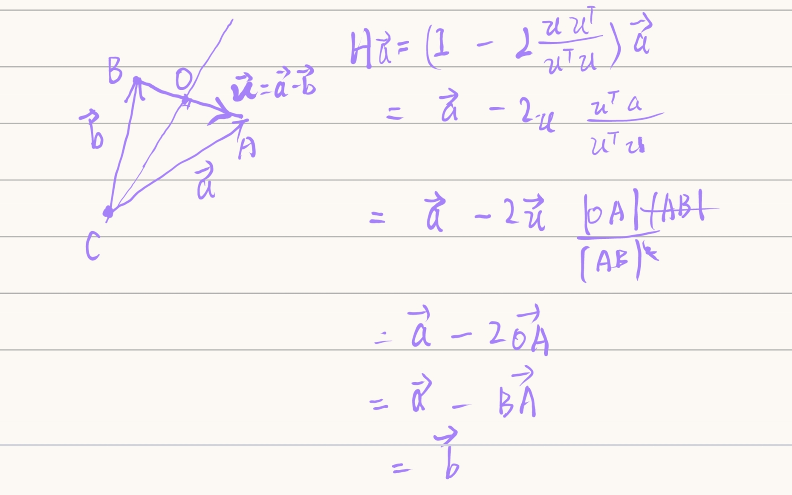
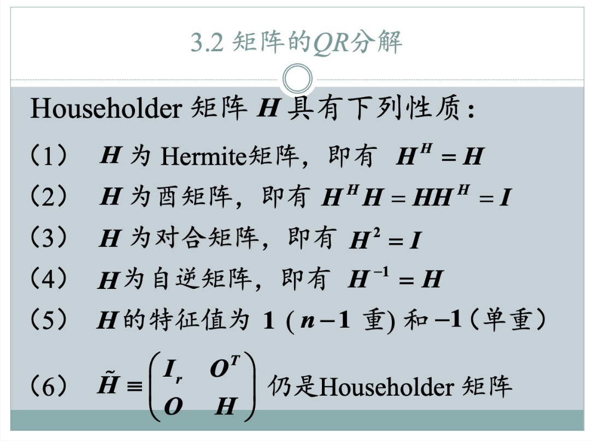

###　**选看：QR分解知识回顾与几何理解**

[TOC]

###　**Householder反射性质的几何证明**

考虑欧几里得空间中的三个点 $C, A, B$。
*   设点 $C$ 为原点。
*   将向量 $\vec{CA}$ 记作 $a$。
*   将向量 $\vec{CB}$ 记作 $b$。

我们证明 Householder 变换能够将 $a$ 反射到 $b$ 的前提是 $\|a\| = \|b\|$，即 $CA = CB$。
在这种情况下，三角形 $CAB$ 是一个以 $C$ 为顶点的等腰三角形。

Householder 向量定义为 $u = a - b = \vec{CA} - \vec{CB} = \vec{BA}$。
（这个向量是从点 $B$ 指向点 $A$ 的，其长度为 $BA$。）

**作辅助线与投影：**

1.  在线段 $AB$ 上作一条通过原点 $C$ 的垂线。
2.  设垂足为 $O$。
3.  由于 $\triangle CAB$ 是等腰三角形 ($CA=CB$)，$CO$ 是底边 $AB$ 上的高。因此，点 $O$ 也是线段 $AB$ 的中点，且 $CO \perp AB$。
4.  向量 $\vec{CO}$ 是与 $u = \vec{BA}$ 正交的分量。

**Householder 变换的几何解释与修正的投影描述：**

Householder 矩阵定义为 $H = I - 2 \frac{u u^T}{u^T u}$。我们目标是证明 $Ha = b$。
$Ha = a - 2 \frac{u (u^T a)}{u^T u}$

我们关注项 $\frac{u (u^T a)}{u^T u}$，这是向量 $a$ 在向量 $u$ 方向上的投影向量 $P_u a$。
现在，我们用线段长度来精确计算 $u^T a$ 和 $u^T u$。

1.  **计算 $u^T u$：**
    $u^T u = \|u\|^2$。
    在我们的几何构造中，$u = \vec{BA}$。所以，**$u^T u = (BA)^2$**。

2.  **计算 $u^T a$：**
    $u^T a = \vec{BA} \cdot \vec{CA}$。
    根据点积的几何定义，$\vec{BA} \cdot \vec{CA} = \|\vec{BA}\| \|\vec{CA}\| \cos(\angle CBA \text{ 的外角})$。
    或者更直接地，我们可以将 $\vec{CA}$ 在 $\vec{BA}$ 方向上的投影理解为 $\vec{OA}$。
    在你的几何图中，**点 $O$ 是垂足**。
    所以，向量 $a = \vec{CA}$ 在向量 $u = \vec{BA}$ 方向上的投影长度是 $OA$。
    因为 $\vec{BA}$ 和 $\vec{OA}$ 方向一致，所以 $u^T a = \vec{BA} \cdot \vec{CA} = (BA) \cdot (OA)$。
    所以，**$u^T a = BA \cdot OA$**。

3.  **计算投影向量 $P_u a$：**
    $P_u a = \frac{u (u^T a)}{u^T u} = \frac{\vec{BA} (BA \cdot OA)}{(BA)^2} = \frac{OA}{BA} \vec{BA}$。
    由于 $\vec{BA}$ 是从 $B$ 到 $A$ 的向量，其长度是 $BA$。
    向量 $\frac{OA}{BA} \vec{BA}$ 表示一个与 $\vec{BA}$ 同方向，长度为 $\frac{OA}{BA} \cdot BA = OA$ 的向量。
    这个向量就是 $\vec{OA}$。
    所以，**$P_u a = \vec{OA}$**。

**代回 Householder 变换：**

$Ha = a - 2 P_u a$
$Ha = \vec{CA} - 2 \vec{OA}$

**向量代数运算完成证明：**

由于点 $O$ 是线段 $AB$ 的中点，且 $\vec{OA}$ 和 $\vec{BA}$ 方向相同，所以 $\vec{BA} = 2 \vec{OA}$。
将 $2 \vec{OA}$ 替换为 $\vec{BA}$：
$Ha = \vec{CA} - \vec{BA}$

根据向量减法的法则：
$\vec{CA} - \vec{BA} = \vec{CA} + (-\vec{BA}) = \vec{CA} + \vec{AB}$

根据向量加法的三角形法则：
$\vec{CA} + \vec{AB} = \vec{CB}$

而 $\vec{CB}$ 正是向量 $b$。

因此，**$Ha = b$**。

### **对于任意向量 $v$（非零），先归一化为 $u = v/\|v\|$ 后求 $H = I - 2uu^T$，还是直接用 $H = I - 2 \frac{v v^T}{v^T v}$ 求 $H$，结果相同？**

**证明：**
我们设任意非零向量为 $v$。其模长为 $\|v\|$。
归一化后的单位向量为 $u = \frac{v}{\|v\|}$。

**方法一：先归一化，再求 $H$**
按照这种方法，Householder 矩阵 $H_u$ 的定义是基于单位向量 $u$：
$H_u = I - 2uu^T$

现在，我们将 $u = \frac{v}{\|v\|}$ 代入这个表达式：
$H_u = I - 2 \left( \frac{v}{\|v\|} \right) \left( \frac{v}{\|v\|} \right)^T$
$H_u = I - 2 \frac{v v^T}{\|v\|^2}$

因为对于实数向量，$\|v\|^2 = v^T v$。
所以：
$H_u = I - 2 \frac{v v^T}{v^T v}$

**方法二：直接用 $v$ 求 $H$**
按照这种方法，Householder 矩阵 $H_v$ 的定义是基于任意非零向量 $v$：
$H_v = I - 2 \frac{v v^T}{v^T v}$

**比较两种方法：**
我们看到 $H_u = I - 2 \frac{v v^T}{v^T v}$ 和 $H_v = I - 2 \frac{v v^T}{v^T v}$。
因此，$H_u = H_v$。

**结论：**
对于任意非零向量 $v$，先归一化后求 Householder 矩阵，还是直接用其原始形式求 Householder 矩阵，结果是完全相同的。这是因为分母上的 $\|v\|^2$ (即 $v^T v$) 恰好抵消了分子中 $v v^T$ 的标量因子 $\|v\|^2$。
实际计算中，通常使用 $H = I - 2 \frac{v v^T}{v^T v}$，因为这样可以避免先计算平方根来归一化向量 $v$，从而提高效率并减少数值误差。

###　**Householder 矩阵性质的证明**

**预备说明：**

我们将使用 Householder 矩阵的简化形式进行证明，即假设 Householder 向量 $u$ 已经归一化为单位向量。
此时 Householder 矩阵 $H$ 的定义为：
$H = I - 2uu^T$
其中 $u$ 是一个列向量，且 $\|u\| = 1$，即 $u^T u = 1$。

**关于实数矩阵的符号约定：**
Householder 变换在实数和复数域都适用。对于实数矩阵，其所有元素都是实数，因此：

*   复共轭操作没有作用，即 $a^* = a$。
*   共轭转置 $A^H$ 等同于普通转置 $A^T$。
鉴于PPT 例子是实数矩阵，我们将在证明中使用 $H^T$ 来表示转置，并强调其在实数域中的等价性。

---

### **性质 (1) $H$ 为 Hermite 矩阵，即 $H^H = H$**

**证明：**
我们使用 $H^T$ 来代替 $H^H$ 进行证明，这对于实数 Householder 矩阵是等价的。
目标是证明 $H^T = H$。

$H^T = (I - 2uu^T)^T$
根据转置的性质 $(A-B)^T = A^T - B^T$ 和 $(AB)^T = B^T A^T$：
$H^T = I^T - (2uu^T)^T$
$H^T = I - 2(uu^T)^T$
$H^T = I - 2(u^T)^T u^T$
$H^T = I - 2uu^T$

所以，$H^T = H$。
对于实数矩阵，这等价于 $H^H = H$。因此，$H$ 是 Hermite 矩阵（对于实数矩阵，Hermite 矩阵就是对称矩阵）。

---

### **性质 (2) $H$ 为酉矩阵，即 $H^H H = HH^H = I$**

**证明：**
由于我们已经证明了 $H^H = H$ (对于实数矩阵，即 $H^T = H$)，所以我们只需要证明 $H H = I$ (或者 $H^T H = I$ 或 $H H^T = I$) 即可。
目标是证明 $H H = I$。

$H H = (I - 2uu^T)(I - 2uu^T)$
展开乘积：
$H H = I \cdot I - I \cdot (2uu^T) - (2uu^T) \cdot I + (2uu^T)(2uu^T)$
$H H = I - 2uu^T - 2uu^T + 4(uu^T)(uu^T)$
$H H = I - 4uu^T + 4u(u^T u)u^T$

现在，利用 Householder 向量 $u$ 是单位向量的条件：$u^T u = 1$。
$H H = I - 4uu^T + 4u(1)u^T$
$H H = I - 4uu^T + 4uu^T$
$H H = I$

所以，$H H = I$。结合性质 (1) $H^H = H$，这自然意味着 $H^H H = H H^H = I$。
因此，$H$ 是酉矩阵（对于实数矩阵，酉矩阵就是正交矩阵）。

---

### **性质 (3) $H$ 为对合矩阵，即 $H^2 = I$**

**证明：**
这个性质直接从性质 (2) 的证明中得出。
在证明性质 (2) 时，我们直接计算了 $H H = H^2$ 并得到了 $H^2 = I$。
因此，$H$ 是对合矩阵。

---

### **性质 (4) $H$ 为自逆矩阵，即 $H^{-1} = H$**

**证明：**
从性质 (3) 我们知道 $H^2 = I$。
我们将等式两边同时乘以 $H^{-1}$：
$H^{-1} (H^2) = H^{-1} I$
$H^{-1} H H = H^{-1}$
$I H = H^{-1}$
$H = H^{-1}$

因此，$H$ 是自逆矩阵。

---

### **性质 (5) $H$ 的特征值为 $1$ ($n-1$ 重) 和 $-1$ (单重)**

**证明思路 (非严格代数证明，侧重几何理解)：**

1.  **特征值 $-1$：**
    我们知道 Householder 变换的目的是将一个向量 $x$ 反射到 $y = s e_1$ 的形式。而 $H = I - 2 P_u$ 可以理解为：
    $H x = x - 2 (\text{x 在 u 上的投影})$。
    如果 $x$ 与 Householder 向量 $u$ 平行（即 $x = c u$ for some scalar $c \neq 0$），那么 $x$ 在 $u$ 上的投影就是它本身 $x$。
    所以，$H x = x - 2x = -x$。
    即 $H(cu) = - (cu)$。
    这意味着 $u$ 是特征值 $-1$ 对应的特征向量。
    由于 $u$ 是一个非零向量，所以 $-1$ 至少是一个单重特征值。

2.  **特征值 $1$：**
    如果 $x$ 与 Householder 向量 $u$ 正交，那么 $x$ 在 $u$ 上的投影为 $0$。
    所以，$H x = x - 2(0) = x$。
    即 $H x = x$。
    这意味着任何与 $u$ 正交的向量都是特征值 $1$ 对应的特征向量。
    Householder 向量 $u$ 所在的向量空间是 1 维的。与 $u$ 正交的向量组成的子空间（即 $u$ 的正交补空间 $u^\perp$）的维度是 $n-1$ (如果矩阵是 $n \times n$ 的)。
    这个 $n-1$ 维空间中的所有向量都是特征值 $1$ 对应的特征向量。
    因此，$1$ 是 $n-1$ 重特征值。

**总结：** Householder 矩阵 $H$ 将与 $u$ 平行的向量翻转方向（乘以 $-1$），而将与 $u$ 正交的所有向量保持不变（乘以 $1$）。所以特征值是 $1$ (在 $u^\perp$ 空间中) 和 $-1$ (在 $u$ 的方向上)。

---

### **性质 (6) $\tilde{H} = \begin{pmatrix} I_r & O^T \\ O & H \end{pmatrix}$ 仍是 Householder 矩阵**

**证明：**

这个性质 (6) 是在 Householder QR 分解迭代过程中使用的关键构造，它描述了如何将一个作用于子空间的 Householder 矩阵嵌入到更大的矩阵中。

假设 $H$ 是一个 $k \times k$ 的 Householder 矩阵，由 $u \in \mathbb{R}^k$ (单位向量) 构造得到：$H = I_k - 2uu^T$。
我们构造一个更大的矩阵 $\tilde{H}$ 如下：
$\tilde{H} = \begin{pmatrix} I_r & O \\ O & H \end{pmatrix}$
其中 $I_r$ 是 $r \times r$ 的单位矩阵，$O$ 代表适当维度的零矩阵。
$\tilde{H}$ 是一个 $(r+k) \times (r+k)$ 的矩阵。

要证明 $\tilde{H}$ 仍然是 Householder 矩阵，我们需要找到一个合适的 Householder 向量 $\tilde{u}$，使得 $\tilde{H} = I_{r+k} - 2\tilde{u}\tilde{u}^T$。

构造 $\tilde{u}$ 如下：
$\tilde{u} = \begin{pmatrix} \mathbf{0}_r \\ u \end{pmatrix}$
其中 $\mathbf{0}_r$ 是 $r$ 维的零向量。

首先，检查 $\tilde{u}$ 是否是单位向量：
$\tilde{u}^T \tilde{u} = \begin{pmatrix} \mathbf{0}_r^T & u^T \end{pmatrix} \begin{pmatrix} \mathbf{0}_r \\ u \end{pmatrix} = \mathbf{0}_r^T \mathbf{0}_r + u^T u = 0 + 1 = 1$。
所以 $\tilde{u}$ 是一个单位向量。

现在，我们计算 $I_{r+k} - 2\tilde{u}\tilde{u}^T$：
$I_{r+k} - 2\tilde{u}\tilde{u}^T = \begin{pmatrix} I_r & O \\ O & I_k \end{pmatrix} - 2 \begin{pmatrix} \mathbf{0}_r \\ u \end{pmatrix} \begin{pmatrix} \mathbf{0}_r^T & u^T \end{pmatrix}$
$= \begin{pmatrix} I_r & O \\ O & I_k \end{pmatrix} - 2 \begin{pmatrix} \mathbf{0}_r \mathbf{0}_r^T & \mathbf{0}_r u^T \\ u \mathbf{0}_r^T & u u^T \end{pmatrix}$
$= \begin{pmatrix} I_r & O \\ O & I_k \end{pmatrix} - 2 \begin{pmatrix} O & O \\ O & u u^T \end{pmatrix}$
$= \begin{pmatrix} I_r - 2O & O - 2O \\ O - 2O & I_k - 2u u^T \end{pmatrix}$
$= \begin{pmatrix} I_r & O \\ O & I_k - 2u u^T \end{pmatrix}$
$= \begin{pmatrix} I_r & O \\ O & H \end{pmatrix}$

这正是 $\tilde{H}$。
因此，$\tilde{H}$ 仍然是一个 Householder 矩阵。

---

### **矩阵乘法性质：$\begin{pmatrix} I_r & O \\ O & H \end{pmatrix} \begin{pmatrix} A & B \\ O & C \end{pmatrix} = \begin{pmatrix} A & B \\ O & HC \end{pmatrix}$，这是 QR 分解可以对子矩阵操作的前提**

**证明：**
设 $\tilde{H} = \begin{pmatrix} I_r & O \\ O & H \end{pmatrix}$ 和 $M = \begin{pmatrix} A & B \\ O & C \end{pmatrix}$。
这里：

*   $I_r$ 是 $r \times r$ 单位矩阵。
*   $O$ 代表适当维度的零矩阵。
*   $H$ 是一个 Householder 矩阵，维度与 $C$ 匹配。
*   $A, B, C$ 是原始矩阵的分块。

我们执行矩阵乘法：
$\tilde{H} M = \begin{pmatrix} I_r & O \\ O & H \end{pmatrix} \begin{pmatrix} A & B \\ O & C \end{pmatrix}$

根据分块矩阵乘法的规则，结果矩阵的每个块由对应分块的乘积和求和得到：

*   **左上角块：** $I_r A + O \cdot O = A$
*   **右上角块：** $I_r B + O C = B$
*   **左下角块：** $O A + H O = O$
*   **右下角块：** $O B + H C = HC$

将这些结果组合起来，得到：
$\tilde{H} M = \begin{pmatrix} A & B \\ O & HC \end{pmatrix}$

**结论：**
这个矩阵乘法性质完美地解释了为什么 Householder QR 分解可以对子矩阵进行操作而不影响已经处理过的部分。
当我们将一个 Householder 矩阵 $H$ 嵌入到 $\tilde{H}$ 中，作用于一个已经部分上三角化的矩阵 $M$ (即 $M$ 的左下角是零矩阵 $O$) 时：

*   左上角的 $I_r$ 确保了已经形成的 $A$ (上三角部分) 保持不变。
*   右上角的 $O$ 确保了 $B$ 部分只受 $I_r$ 影响，即 $B$ 保持不变。
*   左下角的 $O$ 确保了 $O$ 仍然是 $O$，即已经清零的下三角部分保持为零。
*   只有右下角的子矩阵 $C$ 受到 $H$ 的作用，变为 $HC$。

这正是 Householder QR 分解迭代过程的精髓：每一步只处理一个未被清零的子矩阵的第一列，使其变为零，而不会破坏之前步骤已经获得的零元素。

### **Q 矩阵的性质：$Q = H_1 H_2 \dots H_p$**

**a) $Q$ 是一个 Householder 矩阵吗？**

**答案：不，一般情况下 $Q$ 不是一个 Householder 矩阵。**

*   **Householder 矩阵的定义：** 一个 Householder 矩阵 $H$ 具有形式 $I - 2uu^T$，它代表一个简单的反射操作（沿一个超平面反射）。
*   **$Q$ 的性质：** $Q = H_1 H_2 \dots H_p$ 是**多个 Householder 矩阵的乘积**。
    *   如果 $p=1$ (只需要一步 Householder 变换)，那么 $Q = H_1$，此时 $Q$ 是一个 Householder 矩阵。
    *   如果 $p>1$，那么 $Q$ 是多个反射的组合。多个反射的组合通常不再是一个简单的反射。它通常是一个更复杂的**旋转**（如果反射次数是偶数）或者**旋转加反射**（如果反射次数是奇数）。

**例如：**
例子中 $Q = H_1 H_2$。$H_1$ 是一个反射，$H_2$ 是另一个反射。它们的乘积是一个更复杂的正交变换，通常是一个旋转（因为两次反射）。它不再满足 $I - 2uu^T$ 的简单形式。

**b) $Q$ 一定可逆吗？**

**答案：是的，Q 矩阵一定可逆。**

*   **Householder 矩阵的性质：** 我们在前面的证明中已经看到，每个 Householder 矩阵 $H_i$ 都是**可逆的**，并且它还是**自逆的** ($H_i^{-1} = H_i$)。
*   **矩阵乘积的逆：** 如果多个矩阵都是可逆的，那么它们的乘积也是可逆的。
    $(H_1 H_2 \dots H_p)^{-1} = H_p^{-1} \dots H_2^{-1} H_1^{-1}$。
    由于每个 $H_i$ 都是可逆的，所以它们的乘积 $Q$ 必然是可逆的。

**c) 如何求 $Q$ 的逆？**

**答案：$Q^{-1}$ 可以通过 Householder 矩阵的逆来求得，且由于 Householder 矩阵的特殊性质，它非常简单。**

我们有 $Q = H_1 H_2 \dots H_p$。
那么 $Q^{-1} = (H_1 H_2 \dots H_p)^{-1}$。

根据矩阵乘积的逆的性质：
$Q^{-1} = H_p^{-1} H_{p-1}^{-1} \dots H_2^{-1} H_1^{-1}$

由于每个 Householder 矩阵 $H_i$ 都是**自逆的**（即 $H_i^{-1} = H_i$）：
$Q^{-1} = H_p H_{p-1} \dots H_2 H_1$

**结论：$Q$ 的逆矩阵就是所有 Householder 矩阵以相反的顺序相乘。**
对于实数矩阵，Householder 矩阵还是对称的 ($H_i^T = H_i$)，所以 $H_i^{-1} = H_i^T = H_i$。
因此 $Q^{-1} = H_p^T H_{p-1}^T \dots H_1^T = (H_1 H_2 \dots H_p)^T = Q^T$。
这再次确认了 $Q$ 是一个**正交矩阵**的性质 ($Q^{-1} = Q^T$)。

当然可以！这是一个非常重要的性质，也是 QR 分解中 Q 矩阵的关键所在。

###　**证明：为什么若干 Householder 矩阵的乘积是正交矩阵？**

**前提：**

1.  Householder 矩阵 $H_k$ 是正交矩阵。
    *   我们已经在性质 (2) 中证明了，对于实数矩阵，$H_k^T H_k = I$ 且 $H_k H_k^T = I$。

**证明：**
设 $Q$ 是 $p$ 个 Householder 矩阵的乘积：
$Q = H_1 H_2 \dots H_p$

要证明 $Q$ 是正交矩阵，我们需要证明 $Q^T Q = I$。

首先，计算 $Q^T$：
$Q^T = (H_1 H_2 \dots H_p)^T$
根据矩阵乘积转置的性质 $(AB)^T = B^T A^T$（即转置的顺序是逆序的）：
$Q^T = H_p^T H_{p-1}^T \dots H_2^T H_1^T$

现在，计算 $Q^T Q$：
$Q^T Q = (H_p^T H_{p-1}^T \dots H_2^T H_1^T) (H_1 H_2 \dots H_p)$

由于 Householder 矩阵 $H_k$ 是正交矩阵，所以 $H_k^T H_k = I$。
我们从中间向外逐步简化这个乘积：

$Q^T Q = H_p^T H_{p-1}^T \dots H_2^T (H_1^T H_1) H_2 \dots H_p$
$Q^T Q = H_p^T H_{p-1}^T \dots H_2^T (I) H_2 \dots H_p$
$Q^T Q = H_p^T H_{p-1}^T \dots (H_2^T H_2) \dots H_p$
$Q^T Q = H_p^T H_{p-1}^T \dots (I) \dots H_p$

重复这个过程，直到所有的 $H_k^T H_k$ 都变为 $I$：
$Q^T Q = H_p^T (H_{p-1}^T H_{p-1}) \dots H_p$ (这里漏写了一些项，展开更清晰)

$Q^T Q = H_p^T H_{p-1}^T \dots H_2^T H_1^T H_1 H_2 \dots H_p$
$Q^T Q = H_p^T H_{p-1}^T \dots H_2^T (I) H_2 \dots H_p$
$Q^T Q = H_p^T H_{p-1}^T \dots (H_2^T H_2) \dots H_p$
$Q^T Q = H_p^T H_{p-1}^T \dots (I) \dots H_p$
$Q^T Q = H_p^T (H_{p-1}^T H_{p-1}) H_p$
$Q^T Q = H_p^T (I) H_p$
$Q^T Q = H_p^T H_p$
$Q^T Q = I$

**结论：**
由于 $Q^T Q = I$，因此 $Q$ 是一个正交矩阵。

**核心原理：**
这个证明的关键在于：
1.  Householder 矩阵本身是正交矩阵。(性质 2)
2.  两个或多个正交矩阵的乘积仍然是正交矩阵。 这是一个更一般的定理，而上述证明就是这个定理的一个具体应用。

所以，QR 分解得到的 $Q$ 矩阵必然是正交矩阵，这正是我们所期望的，因为它使得 QR 分解在数值计算中具有优越的稳定性。

### **正交矩阵的定义和性质：**

一个 $m \times m$ 的方阵 $Q$ 被称为**正交矩阵**，如果它满足以下任何一个等价条件：

1.  **$Q^T Q = I$** (这通常是正式的定义)。
2.  **$Q Q^T = I$** (与第一个条件等价)。
3.  **$Q^{-1} = Q^T$** (逆矩阵等于转置)。
4.  **$Q$ 的列向量是标准正交基**：它们都是单位向量，并且相互正交。
5.  **$Q$ 的行向量是标准正交基**：它们都是单位向量，并且相互正交。

你的观察正是第 (5) 条性质。

**为什么 $Q^T Q = I$ 蕴含行向量是标准正交基？**

让我们来简单推导一下。
设 $Q = \begin{pmatrix} \mathbf{q}_1^T \\ \mathbf{q}_2^T \\ \vdots \\ \mathbf{q}_m^T \end{pmatrix}$，其中 $\mathbf{q}_i^T$ 是 $Q$ 的第 $i$ 行向量。
那么 $Q^T = \begin{pmatrix} \mathbf{q}_1 & \mathbf{q}_2 & \dots & \mathbf{q}_m \end{pmatrix}$。

计算 $Q Q^T$:
$Q Q^T = \begin{pmatrix} \mathbf{q}_1^T \\ \mathbf{q}_2^T \\ \vdots \\ \mathbf{q}_m^T \end{pmatrix} \begin{pmatrix} \mathbf{q}_1 & \mathbf{q}_2 & \dots & \mathbf{q}_m \end{pmatrix} = \begin{pmatrix} \mathbf{q}_1^T \mathbf{q}_1 & \mathbf{q}_1^T \mathbf{q}_2 & \dots & \mathbf{q}_1^T \mathbf{q}_m \\ \mathbf{q}_2^T \mathbf{q}_1 & \mathbf{q}_2^T \mathbf{q}_2 & \dots & \mathbf{q}_2^T \mathbf{q}_m \\ \vdots & \vdots & \ddots & \vdots \\ \mathbf{q}_m^T \mathbf{q}_1 & \mathbf{q}_m^T \mathbf{q}_2 & \dots & \mathbf{q}_m^T \mathbf{q}_m \end{pmatrix}$

如果 $Q Q^T = I = \begin{pmatrix} 1 & 0 & \dots & 0 \\ 0 & 1 & \dots & 0 \\ \vdots & \vdots & \ddots & \vdots \\ 0 & 0 & \dots & 1 \end{pmatrix}$，那么：

*   对角线上的元素 $\mathbf{q}_i^T \mathbf{q}_i = 1$。由于 $\mathbf{q}_i^T \mathbf{q}_i = \|\mathbf{q}_i\|^2$，这意味着 $\|\mathbf{q}_i\|^2 = 1$，所以 $\|\mathbf{q}_i\| = 1$ (行向量是单位向量)。
*   非对角线上的元素 $\mathbf{q}_i^T \mathbf{q}_j = 0$ (当 $i \neq j$ 时)。这意味着行向量 $\mathbf{q}_i$ 和 $\mathbf{q}_j$ 的内积为 0，所以它们相互正交。

所以，一个矩阵是正交矩阵，当且仅当它的行向量（或列向量）构成一个标准正交基。

### **QR 分解的流程 (基于 Householder 变换)**

QR 分解的目标是将任意一个 $m \times n$ 矩阵 $A$ 分解为 $A = QR$ 的形式，其中 $Q$ 是一个 $m \times m$ 的正交矩阵，$R$ 是一个 $m \times n$ 的上三角矩阵。Householder 变换提供了一种高效且数值稳定的方法来实现这一分解。

**核心思想：通过一系列 Householder 反射，逐步将矩阵 $A$ 转化为上三角矩阵 $R$。**

**关键任务：构造一系列 Householder 矩阵 $H_p \dots H_2 H_1$ (其中 $p = \min(m-1, n)$)，使得 $H_p \dots H_2 H_1 A = R$。**

**步骤分解：**

1.  **第一步：处理矩阵 $A$ 的第一列**
    *   首先，我们关注矩阵 $A$ 的第一列向量 $\mathbf{a}_1$。
    *   我们的目标是找到一个 Householder 矩阵 $H_1$，使得 $H_1 \mathbf{a}_1$ 成为一个除了第一个元素外，其他所有元素都为零的向量 $\tilde{\mathbf{a}}_1 = (\pm \|\mathbf{a}_1\|, 0, \dots, 0)^T$。
    *   由于 Householder 变换是一种反射，它保持向量的模长不变，因此 $\tilde{\mathbf{a}}_1$ 的模长必须等于 $\mathbf{a}_1$ 的模长。为了数值稳定性，通常选择 $\tilde{\mathbf{a}}_1$ 的第一个非零元素的符号与 $\mathbf{a}_1$ 的第一个元素符号相反（如果 $\mathbf{a}_1$ 的第一个元素为零，则任意选择）。
    *   有了 $\mathbf{a}_1$ 和目标向量 $\tilde{\mathbf{a}}_1$，我们就可以构造 Householder 向量 $v_1 = \mathbf{a}_1 - \tilde{\mathbf{a}}_1$。
    *   使用 $v_1$ (或其归一化形式 $u_1$)，我们便能构建出第一个 Householder 矩阵 $H_1 = I - 2 \frac{v_1 v_1^T}{v_1^T v_1}$。
    *   将 $H_1$ 作用于 $A$：$H_1 A = H_1 \begin{pmatrix} \mathbf{a}_1 & \mathbf{a}_2 & \dots \end{pmatrix} = \begin{pmatrix} H_1 \mathbf{a}_1 & H_1 \mathbf{a}_2 & \dots \end{pmatrix} = \begin{pmatrix} \tilde{\mathbf{a}}_1 & H_1 \mathbf{a}_2 & \dots \end{pmatrix}$。
    *   此时，$H_1 A$ 的第一列已经成功地被清零（除了第一个元素）。

2.  **迭代处理子矩阵：**
    *   在第一步之后，矩阵 $A$ 已经部分上三角化，其形式为 $\begin{pmatrix} \tilde{\mathbf{a}}_{1,1} & \mathbf{b}^T \\ \mathbf{0} & A' \end{pmatrix}$，其中 $A'$ 是一个 $(m-1) \times (n-1)$ 的子矩阵。
    *   接下来，我们利用 Householder QR 分解的关键性质：一个嵌入式 Householder 矩阵 $\tilde{H}_k = \begin{pmatrix} I_r & O \\ O & H_k \end{pmatrix}$ 作用于分块矩阵 $\begin{pmatrix} A_{top} & B_{top} \\ O & C_{bottom} \end{pmatrix}$ 时，结果是 $\begin{pmatrix} A_{top} & B_{top} \\ O & H_k C_{bottom} \end{pmatrix}$。
    *   这意味着我们可以在不影响已经清零的第一列的情况下，将 Householder 变换应用于子矩阵 $A'$。
    *   我们将对 $A'$ 的第一列重复上述构造 Householder 矩阵的过程，得到 $H_2'$。然后构造一个更大的嵌入式 Householder 矩阵 $H_2 = \begin{pmatrix} 1 & O \\ O & H_2' \end{pmatrix}$ (对于 $3 \times 3$ 矩阵的第二步，这里的 $I_r$ 是 1)。
    *   $H_2 (H_1 A)$ 将在不影响第一列的基础上，清零第二列的下半部分。

3.  **最终得到上三角矩阵 $R$：**
    *   重复上述迭代过程 $\min(m-1, n)$ 次，每一步构造一个 Householder 矩阵 $H_k$ (嵌入到更大的单位矩阵中)，并将其左乘到当前矩阵上。
    *   最终，我们将得到一个上三角矩阵 $R = H_p \dots H_2 H_1 A$。

**构造正交矩阵 $Q$：**

1.  我们得到的关系是 $(H_p \dots H_2 H_1) A = R$。
2.  为了得到标准形式 $A = QR$，我们需要将 Householder 矩阵的乘积移到 $R$ 的右边。
3.  定义 $Q_{prod} = H_p \dots H_2 H_1$。
4.  那么 $A = Q_{prod}^{-1} R$。
5.  由于每个 Householder 矩阵 $H_i$ 都具有**自逆性质** ($H_i^{-1} = H_i$)，因此 $Q_{prod}^{-1} = H_1^{-1} H_2^{-1} \dots H_p^{-1} = H_1 H_2 \dots H_p$。
6.  我们将 $Q = H_1 H_2 \dots H_p$ 定义为最终的正交矩阵。
7.  因此，我们成功地将 $A$ 分解为 $A = QR$。

这个过程高效、稳定，是数值线性代数中 QR 分解的基石。