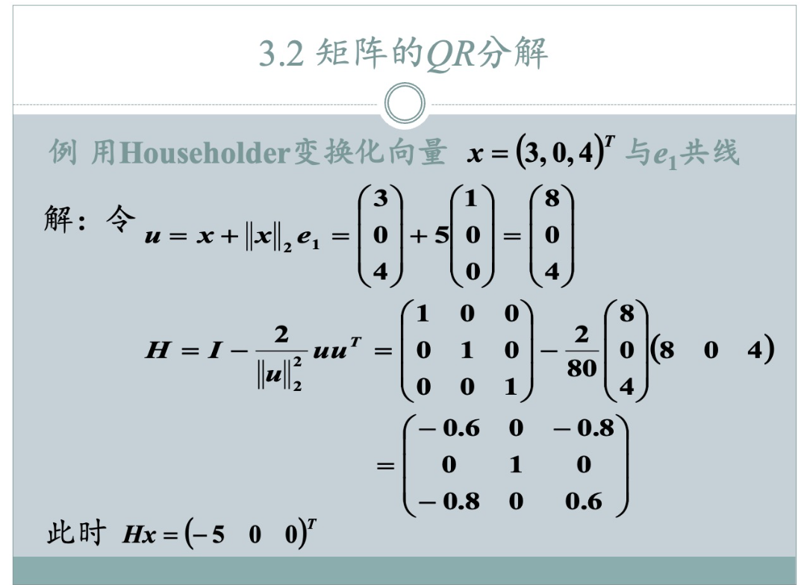

### 题型：Householder变换将a向量反射到b

**题目：** 用 Householder 变换，将向量 $x = (3, 0, 4)^T$ 与 $e_1$ 共线。

**步骤：**

1.  **确定原始向量 $x$：**
    $x = \begin{pmatrix} 3 \\ 0 \\ 4 \end{pmatrix}$

2.  **计算 $x$ 的模长 $\|x\|$：**
    $\|x\| = \sqrt{3^2 + 0^2 + 4^2} = \sqrt{9 + 0 + 16} = \sqrt{25} = 5$

3.  **确定目标向量 $\tilde{x}$：**
    目标是使变换后的向量与 $e_1 = \begin{pmatrix} 1 \\ 0 \\ 0 \end{pmatrix}$ 共线，且模长与 $x$ 相同。
    根据 Householder 变换的常见约定，为了数值稳定性，我们通常选择目标向量 $\tilde{x}$ 的第一个分量的符号与原始向量 $x$ 的第一个分量的符号相反（除非原始向量第一个分量为零）。
    $x_1 = 3 > 0$，所以我们选择目标向量的第一个分量为负值。
    所以，目标向量 $\tilde{x} = -\|x\| e_1 = -5 \begin{pmatrix} 1 \\ 0 \\ 0 \end{pmatrix} = \begin{pmatrix} -5 \\ 0 \\ 0 \end{pmatrix}$。

4.  **构造 Householder 向量 $v$：**
    我们使用 $v = x - \tilde{x}$ 来构造 Householder 向量。
    $v = \begin{pmatrix} 3 \\ 0 \\ 4 \end{pmatrix} - \begin{pmatrix} -5 \\ 0 \\ 0 \end{pmatrix} = \begin{pmatrix} 3 - (-5) \\ 0 - 0 \\ 4 - 0 \end{pmatrix} = \begin{pmatrix} 8 \\ 0 \\ 4 \end{pmatrix}$

5.  **计算 $v^T v$ (即 $\|v\|^2$)：**
    $v^T v = 8^2 + 0^2 + 4^2 = 64 + 0 + 16 = 80$

6.  **构造 Householder 矩阵 $H$：**
    $H = I - 2 \frac{v v^T}{v^T v}$
    $H = \begin{pmatrix} 1 & 0 & 0 \\ 0 & 1 & 0 \\ 0 & 0 & 1 \end{pmatrix} - 2 \frac{1}{80} \begin{pmatrix} 8 \\ 0 \\ 4 \end{pmatrix} \begin{pmatrix} 8 & 0 & 4 \end{pmatrix}$
    $H = \begin{pmatrix} 1 & 0 & 0 \\ 0 & 1 & 0 \\ 0 & 0 & 1 \end{pmatrix} - \frac{2}{80} \begin{pmatrix} 8 \cdot 8 & 8 \cdot 0 & 8 \cdot 4 \\ 0 \cdot 8 & 0 \cdot 0 & 0 \cdot 4 \\ 4 \cdot 8 & 4 \cdot 0 & 4 \cdot 4 \end{pmatrix}$
    $H = \begin{pmatrix} 1 & 0 & 0 \\ 0 & 1 & 0 \\ 0 & 0 & 1 \end{pmatrix} - \frac{1}{40} \begin{pmatrix} 64 & 0 & 32 \\ 0 & 0 & 0 \\ 32 & 0 & 16 \end{pmatrix}$
    $H = \begin{pmatrix} 1 & 0 & 0 \\ 0 & 1 & 0 \\ 0 & 0 & 1 \end{pmatrix} - \begin{pmatrix} 64/40 & 0 & 32/40 \\ 0 & 0 & 0 \\ 32/40 & 0 & 16/40 \end{pmatrix}$
    $H = \begin{pmatrix} 1 & 0 & 0 \\ 0 & 1 & 0 \\ 0 & 0 & 1 \end{pmatrix} - \begin{pmatrix} 1.6 & 0 & 0.8 \\ 0 & 0 & 0 \\ 0.8 & 0 & 0.4 \end{pmatrix}$
    $H = \begin{pmatrix} 1 - 1.6 & 0 & 0 - 0.8 \\ 0 & 1 & 0 \\ 0 - 0.8 & 0 & 1 - 0.4 \end{pmatrix}$
    $H = \begin{pmatrix} -0.6 & 0 & -0.8 \\ 0 & 1 & 0 \\ -0.8 & 0 & 0.6 \end{pmatrix}$

7.  **验证 $Hx$：**
    $Hx = \begin{pmatrix} -0.6 & 0 & -0.8 \\ 0 & 1 & 0 \\ -0.8 & 0 & 0.6 \end{pmatrix} \begin{pmatrix} 3 \\ 0 \\ 4 \end{pmatrix}$
    $Hx = \begin{pmatrix} (-0.6)(3) + 0(0) + (-0.8)(4) \\ 0(3) + 1(0) + 0(4) \\ (-0.8)(3) + 0(0) + 0.6(4) \end{pmatrix}$
    $Hx = \begin{pmatrix} -1.8 - 3.2 \\ 0 \\ -2.4 + 2.4 \end{pmatrix}$
    $Hx = \begin{pmatrix} -5.0 \\ 0 \\ 0 \end{pmatrix}$

**结果：**

使用我们的方法，得到的 Householder 矩阵是 $H = \begin{pmatrix} -0.6 & 0 & -0.8 \\ 0 & 1 & 0 \\ -0.8 & 0 & 0.6 \end{pmatrix}$，并且 $Hx = \begin{pmatrix} -5 \\ 0 \\ 0 \end{pmatrix}$。

**与 PPT 结果的比较：**

*   **Householder 矩阵 $H$：** 我们的结果与 PPT 中计算出的 $H$ 完全一致。
*   **变换后的向量 $Hx$：** 我们的结果是 $\begin{pmatrix} -5 \\ 0 \\ 0 \end{pmatrix}$，这也与 PPT 中给出的结果完全一致。

