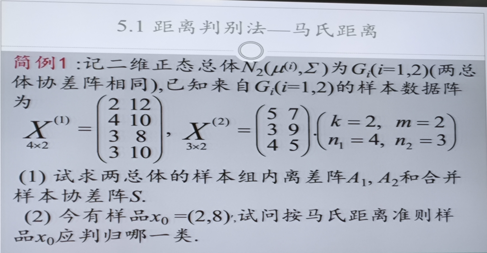
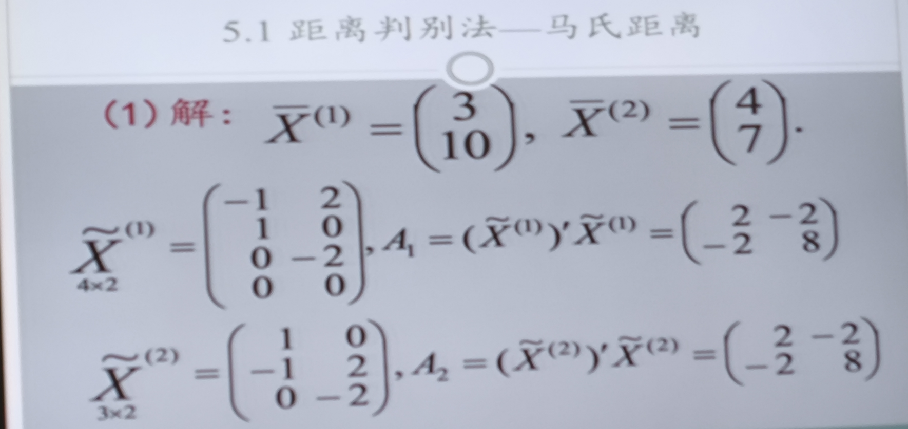
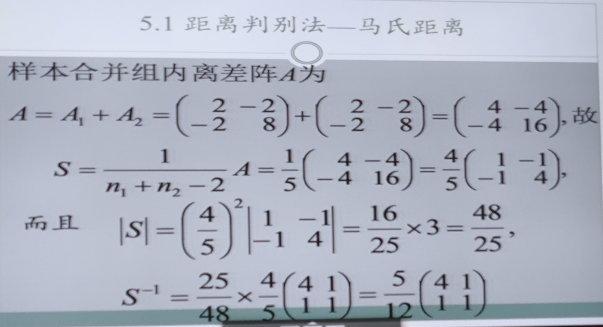
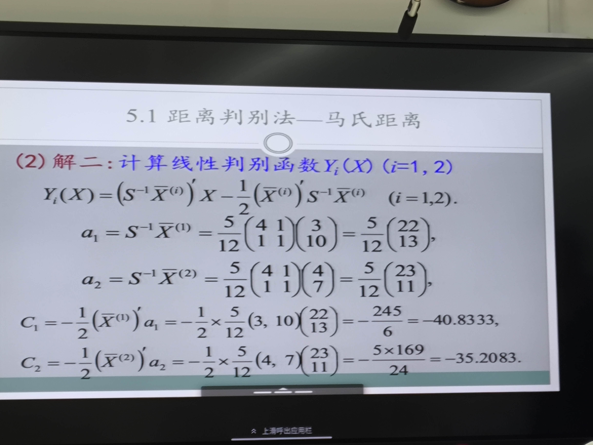

### 题型：判别样本属于哪一个类别

这道题目是关于**两个正态总体（协方差矩阵相等）的距离判别法（马氏距离）**。

#### 关键词：离差阵，协方差阵，合并协方差阵，马氏距离，样本判别

“二维正态总体”指的就是：我们要研究的每一个样本点，都包含两个特征指标（比如身高和体重），这两个指标构成的**向量**服从**二元正态分布**（Bivariate Normal Distribution）。

离差 (Deviation)就是单个数据与均值的差，怎么算，之前说过。

| 概念                                                         | 均值（中心位置）      | 协方差阵（形状胖瘦） |
  | :----------------------------------------------------------- | :-------------------- | :------------------- |
  | **总体参数 (Population)** 上帝视角，客观存在但通常未知的真值 | **$\mu$** (Mu)        | **$\Sigma$** (Sigma) |
  | **样本统计量 (Sample)** 人类视角，通过手中的数据算出来的估计值 | **$\bar{x}$** (x bar) | **$S$**              |

---
*   **协方差阵 ($S$)**：决定了**山的形状**（是圆山还是长山）。我们把数据合并，是为了**把这个形状看得更清楚**。
*   **均值向量 ($\bar{x}$) / 峰值**：决定了**山在哪里**。这是两座山**唯一的区别**。

---

马氏距离的几何理解：马氏距离就是把那个**底面是椭圆**的山峰，在数学上强行**“拉伸/压缩”成一个底面是正圆**的山峰，然后再用尺子去量 x-y 平面上的距离。

---
1.  **马氏距离：理论公式**（如果我们有上帝视角）：
    真正的马氏距离应该用 $\Sigma$ 和 $\mu$ 来算：
    $$ D^2 = (x - \mu)' \Sigma^{-1} (x - \mu) $$

2.  **实际操作**（我们只有几行数据）：
    因为 $\mu$ 和 $\Sigma$ 未知，我们只能用样本统计量去**替代**它们：
    
    *   用 $\bar{x}$ 替代 $\mu$
    *   用 $S$ 替代 $\Sigma$
    
    于是公式变成了样本马氏距离：
    $$ D^2 = (x - \bar{x})' S^{-1} (x - \bar{x}) $$
    
---
| 符号      | 数学术语           | 平方是一个动作还是名字的一部分？ | 也就是...                    |
  | :-------- | :----------------- | :------------------------------- | :--------------------------- |
  | **$R^2$** | **决定系数**       | **是名字的一部分**               | $R^2$ 这个整体就是系数本身。 |
  | **$D^2$** | **马氏距离的平方** | **是一个动作**                   | 它确实是把“距离”给平方了。   |

---

**多元正态分布的概率密度函数 (PDF):**
  $$ f(x) = \underbrace{\frac{1}{(2\pi)^{p/2}|\Sigma|^{1/2}}}_{\text{常数项 } C} \cdot \exp\left( \color{red}{-\frac{1}{2} (x-\mu)'\Sigma^{-1}(x-\mu)} \right) $$

  **马氏距离的平方:**
  $$ D^2 = \color{red}{(x-\mu)'\Sigma^{-1}(x-\mu)} $$

  所以，多元正态分布完全可以写成：
  $$ f(x) = C \cdot e^{-\frac{1}{2} D^2} $$

  **这意味着什么？**
  1.  **概率只取决于距离**：一个样本点 $x$ 出现的概率密度大小，**完全取决于**它到中心 $\mu$ 的马氏距离 $D$。
  2.  **等高线**：如果你把所有 $D^2$ 相同的点连起来，它们的概率密度 $f(x)$ 也是相等的。这就是为什么二维正态分布的等高线是**椭圆**（因为 $D^2 = \text{常数}$ 就是椭圆方程）。

用马氏距离的概念去理解多元正态分布，公式的物理意义瞬间就清晰了，不再是一堆可怕的矩阵运算。

  我们可以把它看作是 **“一维标准正态分布的推广”**：

  *   **一维情况**：
      $$ f(x) \propto e^{-\frac{1}{2} (\frac{x-\mu}{\sigma})^2} = e^{-\frac{1}{2} z^2} $$
      这里的 $z$ 是 z-score（标准分数），也就是**标准化的欧氏距离**。
  *   **多维情况**：
      $$ f(x) \propto e^{-\frac{1}{2} D^2} $$
      这里的 $D$ 是马氏距离，它其实就是**多维空间下的 z-score**。

---

马氏距离判别的一种比喻

*   **两个总体 ($G_1, G_2$)**：就是平原上的两座**山峰**。
    
    *   因为题目说“协方差阵相同”，所以这两座山是**“双胞胎山”**——胖瘦、高矮、坡度完全一模一样，只是坐落在不同的位置。
*   **新样本 ($x_0$)**：就是一个站在平原上的**登山者**。
*   **马氏距离**：登山者到达山顶需要跨越的**“等高线圈数”**。

---

1. 普通（单组）样本协方差阵 ($S_i$)
针对每一个单独的类别 $i$ 计算。只利用该类别下的 $n_i$ 个样本。

*   **公式**：
    $$ S_i = \frac{1}{n_i - 1} A_i $$
    *(其中 $A_i$ 是第 $i$ 组的组内离差阵)*
*   **意义**：只描述**第 $i$ 类**数据自己长什么样（胖瘦、倾斜方向）。

2. 合并样本协方差阵 ($S_{pooled}$)
当假设两组协方差矩阵相等时，我们将两组的离差阵“加起来”，共同估计那个统一的协方差矩阵。

*   **公式**：
    $$ S = \frac{A_1 + A_2}{(n_1 - 1) + (n_2 - 1)} = \frac{A_1 + A_2}{n_1 + n_2 - 2} $$
*   **直观理解**：它其实是两个单组协方差阵的**加权平均**（权重是自由度）：
    $$ S = \frac{(n_1-1)S_1 + (n_2-1)S_2}{(n_1-1) + (n_2-1)} $$

---

为什么可以用合并样本协方差阵？

我们在算马氏距离的时候均值是不一样的，所以我们认为两座山的位置不一样。

然而，山的形状是一样的，相当于用了一个更加准确的山的形状估计（由协方差阵描述）

---

### 一、 题目描述 

**已知：**
有两个二维正态总体 $G_1, G_2$，即 $N_2(\mu^{(i)}, \Sigma), (i=1,2)$。两总体的协方差矩阵相同。
已知来自 $G_1, G_2$ 的样本数据阵分别为：
$$
X^{(1)} = \begin{pmatrix} 2 & 12 \\ 4 & 10 \\ 3 & 8 \\ 3 & 10 \end{pmatrix}, \quad
X^{(2)} = \begin{pmatrix} 5 & 7 \\ 3 & 9 \\ 4 & 5 \end{pmatrix}
$$

其中 $k=2$ (类别数), $m=2$ (维数), $n_1=4, n_2=3$。

**问题：**
1.  试求两总体的样本组内离差阵 $A_1, A_2$ 和合并样本协方差阵 $S$。
2.  今有样品 $x_0 = (2, 8)'$，试问按马氏距离准则，样品 $x_0$ 应判归哪一类？

---

### 二、 计算离差阵和(合并)协方差阵

**1. 样本均值向量：**
$$ \bar{X}^{(1)} = \begin{pmatrix} 3 \\ 10 \end{pmatrix}, \quad \bar{X}^{(2)} = \begin{pmatrix} 4 \\ 7 \end{pmatrix} $$

**2. 组内离差阵：**
$$ A_1 = \begin{pmatrix} 2 & -2 \\ -2 & 8 \end{pmatrix}, \quad A_2 = \begin{pmatrix} 2 & -2 \\ -2 & 8 \end{pmatrix} $$
$$ A = A_1 + A_2 = \begin{pmatrix} 4 & -4 \\ -4 & 16 \end{pmatrix} $$

**3. 合并协方差阵 $S$ 及其逆矩阵 $S^{-1}$：**
$$ S = \frac{1}{n_1+n_2-2}A = \frac{1}{5}\begin{pmatrix} 4 & -4 \\ -4 & 16 \end{pmatrix} = \frac{4}{5}\begin{pmatrix} 1 & -1 \\ -1 & 4 \end{pmatrix} $$

$$ S^{-1} = \frac{5}{12} \begin{pmatrix} 4 & 1 \\ 1 & 1 \end{pmatrix} $$

---

### 三、 判别过程详解 

题目要求判断 $x_0 = \begin{pmatrix} 2 \\ 8 \end{pmatrix}$ 的归属。这里提供两种解法。

#### 解法一：直接计算马氏距离 (Mahalanobis Distance)

**判别准则：** 计算样品 $x_0$ 到两个总体中心的马氏距离平方 $D^2(x_0, G_i)$，**距离哪个小就属于哪一类**。
公式：$D^2(x_0, G_i) = (x_0 - \bar{X}^{(i)})' S^{-1} (x_0 - \bar{X}^{(i)})$

**1. 计算到 $G_1$ 的距离平方：**
$$ x_0 - \bar{X}^{(1)} = \begin{pmatrix} 2 \\ 8 \end{pmatrix} - \begin{pmatrix} 3 \\ 10 \end{pmatrix} = \begin{pmatrix} -1 \\ -2 \end{pmatrix} $$

$$
\begin{aligned}
D^2(x_0, G_1) &= \begin{pmatrix} -1 & -2 \end{pmatrix} \left[ \frac{5}{12} \begin{pmatrix} 4 & 1 \\ 1 & 1 \end{pmatrix} \right] \begin{pmatrix} -1 \\ -2 \end{pmatrix} \\
&= \frac{5}{12} \begin{pmatrix} -1 & -2 \end{pmatrix} \begin{pmatrix} 4(-1)+1(-2) \\ 1(-1)+1(-2) \end{pmatrix} \\
&= \frac{5}{12} \begin{pmatrix} -1 & -2 \end{pmatrix} \begin{pmatrix} -6 \\ -3 \end{pmatrix} \\
&= \frac{5}{12} ( (-1)(-6) + (-2)(-3) ) \\
&= \frac{5}{12} (6 + 6) = \frac{60}{12} = \mathbf{5}
\end{aligned}
$$

**2. 计算到 $G_2$ 的距离平方：**
$$ x_0 - \bar{X}^{(2)} = \begin{pmatrix} 2 \\ 8 \end{pmatrix} - \begin{pmatrix} 4 \\ 7 \end{pmatrix} = \begin{pmatrix} -2 \\ 1 \end{pmatrix} $$
$$
\begin{aligned}
D^2(x_0, G_2) &= \begin{pmatrix} -2 & 1 \end{pmatrix} \left[ \frac{5}{12} \begin{pmatrix} 4 & 1 \\ 1 & 1 \end{pmatrix} \right] \begin{pmatrix} -2 \\ 1 \end{pmatrix} \\
&= \frac{5}{12} \begin{pmatrix} -2 & 1 \end{pmatrix} \begin{pmatrix} -7 \\ -1 \end{pmatrix} \\
&= \frac{5}{12} (14 - 1) \\
&= \frac{5}{12} \times 13 = \frac{65}{12} \approx \mathbf{5.417}
\end{aligned}
$$

**3. 结论：**
因为 $D^2(x_0, G_1) = 5 < D^2(x_0, G_2) = 5.417$，即样品到 $G_1$ 的距离更近。
**故判 $x_0$ 属于第一类 $G_1$。**

---

#### 解法二：线性判别函数

**判别准则：** 比较线性判别函数值 $Y_i(x_0)$ 的大小，**数值大的属于该类**（注：$Y$值反映了对数似然比，值越大可能性越大）。

系数 $a_i$ 和常数 $C_i$：
*   $a_1 = S^{-1}\bar{X}^{(1)} = \frac{5}{12}\begin{pmatrix} 22 \\ 13 \end{pmatrix}$
*   $a_2 = S^{-1}\bar{X}^{(2)} = \frac{5}{12}\begin{pmatrix} 23 \\ 11 \end{pmatrix}$
*   $C_1 \approx -40.8333$
*   $C_2 \approx -35.2083$

判别函数公式：$Y_i(x) = a_i' x + C_i$

**1. 计算 $Y_1(x_0)$：**
$$
\begin{aligned}
a_1' x_0 &= \frac{5}{12} \begin{pmatrix} 22 & 13 \end{pmatrix} \begin{pmatrix} 2 \\ 8 \end{pmatrix} \\
&= \frac{5}{12} (44 + 104) = \frac{5 \times 148}{12} = \frac{740}{12} \approx 61.6667
\end{aligned}
$$
$$
Y_1(x_0) = 61.6667 + (-40.8333) = \mathbf{20.8334}
$$

**2. 计算 $Y_2(x_0)$：**
$$
\begin{aligned}
a_2' x_0 &= \frac{5}{12} \begin{pmatrix} 23 & 11 \end{pmatrix} \begin{pmatrix} 2 \\ 8 \end{pmatrix} \\
&= \frac{5}{12} (46 + 88) = \frac{5 \times 134}{12} = \frac{670}{12} \approx 55.8333
\end{aligned}
$$
$$
Y_2(x_0) = 55.8333 + (-35.2083) = \mathbf{20.625}
$$

**3. 结论：**
因为 $Y_1(x_0) = 20.8334 > Y_2(x_0) = 20.625$。
**故判 $x_0$ 属于第一类 $G_1$。**

*(两种方法得出的结论是一致的)*