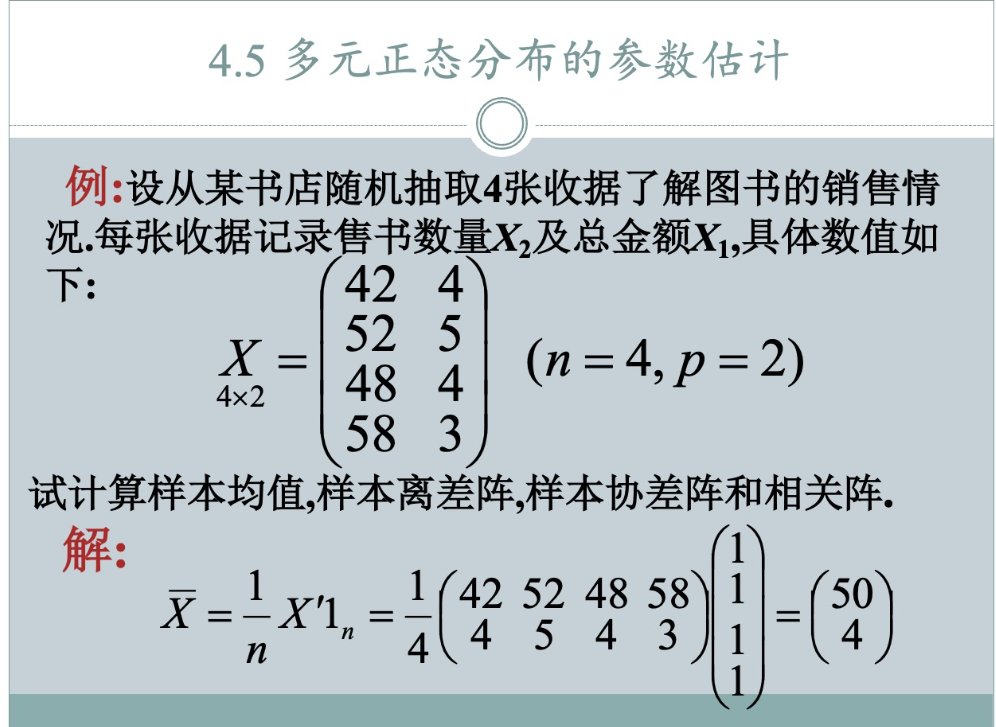
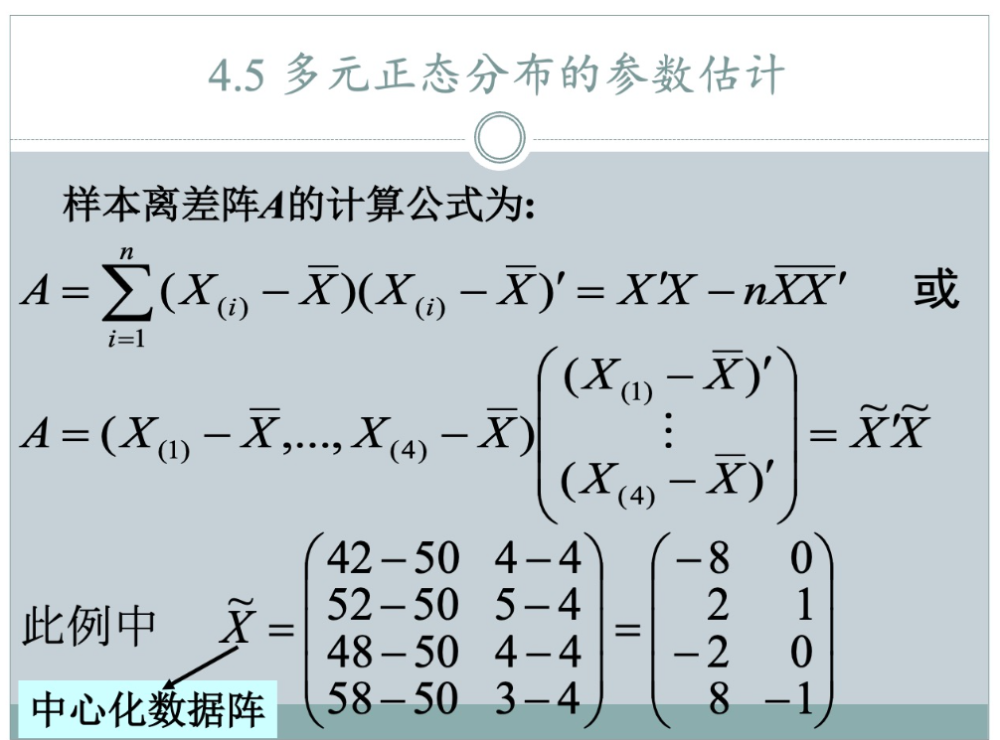
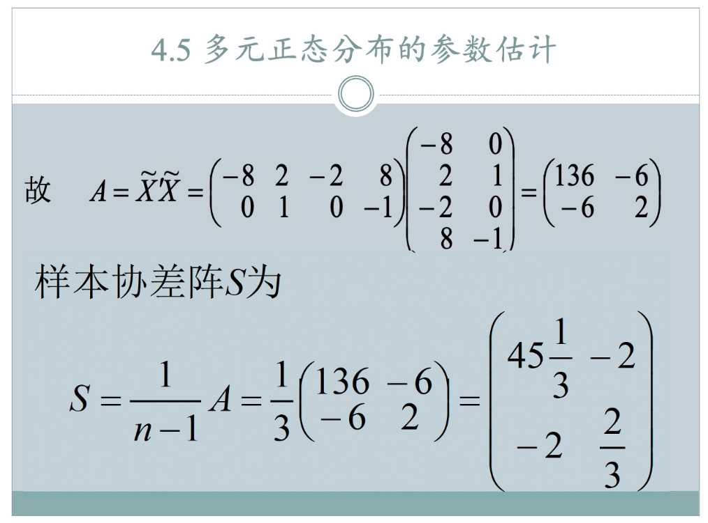
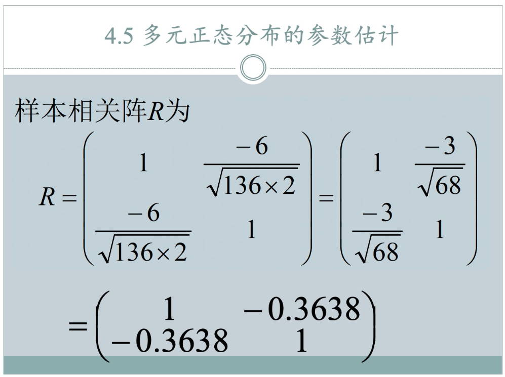

### 题型：协方差矩阵

**例题信息：**
从某书店随机抽取4张收据，了解图书的销售情况。每张收据记录售书数量 $X_2$ 及总金额 $X_1$。
数据矩阵 $X$ 如下：
$X = \begin{pmatrix} 42 & 4 \\ 52 & 5 \\ 48 & 4 \\ 58 & 3 \end{pmatrix}$

这里 $n=4$ (样本数量)，$p=2$ (变量数量，$X_1$ 是总金额， $X_2$ 是售书数量)。

---

**1. 计算样本均值向量 $\bar{X}$**

样本均值向量 $\bar{X}$ 的计算公式为：
$\bar{X} = \frac{1}{n} \sum_{\alpha=1}^n X_\alpha$

或者，如果数据以行为观测值（如您提供的矩阵 $X$），则可以按列求平均。
$X_1$ 列 (总金额): $42, 52, 48, 58$
$X_2$ 列 (售书数量): $4, 5, 4, 3$

$\bar{x}_1 = \frac{42 + 52 + 48 + 58}{4} = \frac{200}{4} = 50$
$\bar{x}_2 = \frac{4 + 5 + 4 + 3}{4} = \frac{16}{4} = 4$

所以，样本均值向量为：
$\bar{X} = \begin{pmatrix} 50 \\ 4 \end{pmatrix}$

---

**2. 计算样本离差阵 $A$**

样本离差阵的定义是 $A = \sum_{\alpha=1}^n (X_\alpha - \bar{X})(X_\alpha - \bar{X})'$。
首先，我们需要计算每个观测值与均值向量的离差。
$X_\alpha - \bar{X}$

观测值1: $X_1 = \begin{pmatrix} 42 \\ 4 \end{pmatrix}$
$X_1 - \bar{X} = \begin{pmatrix} 42 \\ 4 \end{pmatrix} - \begin{pmatrix} 50 \\ 4 \end{pmatrix} = \begin{pmatrix} -8 \\ 0 \end{pmatrix}$

观测值2: $X_2 = \begin{pmatrix} 52 \\ 5 \end{pmatrix}$
$X_2 - \bar{X} = \begin{pmatrix} 52 \\ 5 \end{pmatrix} - \begin{pmatrix} 50 \\ 4 \end{pmatrix} = \begin{pmatrix} 2 \\ 1 \end{pmatrix}$

观测值3: $X_3 = \begin{pmatrix} 48 \\ 4 \end{pmatrix}$
$X_3 - \bar{X} = \begin{pmatrix} 48 \\ 4 \end{pmatrix} - \begin{pmatrix} 50 \\ 4 \end{pmatrix} = \begin{pmatrix} -2 \\ 0 \end{pmatrix}$

观测值4: $X_4 = \begin{pmatrix} 58 \\ 3 \end{pmatrix}$
$X_4 - \bar{X} = \begin{pmatrix} 58 \\ 3 \end{pmatrix} - \begin{pmatrix} 50 \\ 4 \end{pmatrix} = \begin{pmatrix} 8 \\ -1 \end{pmatrix}$

现在，计算 $(X_\alpha - \bar{X})(X_\alpha - \bar{X})'$ 并求和：

第一项：$\begin{pmatrix} -8 \\ 0 \end{pmatrix} \begin{pmatrix} -8 & 0 \end{pmatrix} = \begin{pmatrix} 64 & 0 \\ 0 & 0 \end{pmatrix}$

第二项：$\begin{pmatrix} 2 \\ 1 \end{pmatrix} \begin{pmatrix} 2 & 1 \end{pmatrix} = \begin{pmatrix} 4 & 2 \\ 2 & 1 \end{pmatrix}$

第三项：$\begin{pmatrix} -2 \\ 0 \end{pmatrix} \begin{pmatrix} -2 & 0 \end{pmatrix} = \begin{pmatrix} 4 & 0 \\ 0 & 0 \end{pmatrix}$

第四项：$\begin{pmatrix} 8 \\ -1 \end{pmatrix} \begin{pmatrix} 8 & -1 \end{pmatrix} = \begin{pmatrix} 64 & -8 \\ -8 & 1 \end{pmatrix}$

将这四项相加：
$A = \begin{pmatrix} 64 & 0 \\ 0 & 0 \end{pmatrix} + \begin{pmatrix} 4 & 2 \\ 2 & 1 \end{pmatrix} + \begin{pmatrix} 4 & 0 \\ 0 & 0 \end{pmatrix} + \begin{pmatrix} 64 & -8 \\ -8 & 1 \end{pmatrix}$
$A = \begin{pmatrix} 64+4+4+64 & 0+2+0-8 \\ 0+2+0-8 & 0+1+0+1 \end{pmatrix} = \begin{pmatrix} 136 & -6 \\ -6 & 2 \end{pmatrix}$

所以，样本离差阵为：
$A = \begin{pmatrix} 136 & -6 \\ -6 & 2 \end{pmatrix}$

---

**3. 计算样本协差阵 $S$**

样本协差阵 $S$ 通常定义为 $S = \frac{1}{n-1} A$ (无偏估计)。
这里 $n=4$，所以 $n-1 = 3$。

$S = \frac{1}{3} \begin{pmatrix} 136 & -6 \\ -6 & 2 \end{pmatrix} = \begin{pmatrix} 136/3 & -6/3 \\ -6/3 & 2/3 \end{pmatrix} = \begin{pmatrix} 45.333 & -2 \\ -2 & 0.667 \end{pmatrix}$ (保留三位小数)

所以，样本协差阵为：
$S = \begin{pmatrix} 45.333 & -2 \\ -2 & 0.667 \end{pmatrix}$

---

**4. 计算相关阵 $R$**

相关阵 $R$ 的元素 $r_{ij}$ 定义为：
$r_{ij} = \frac{s_{ij}}{\sqrt{s_{ii}s_{jj}}}$
其中 $s_{ij}$ 是协方差矩阵 $S$ 的元素，$s_{ii}$ 和 $s_{jj}$ 是主对角线元素（即方差）。

从协方差矩阵 $S$ 中，我们有：
$s_{11} = 136/3 = 45.333$ (变量 $X_1$ 的方差)
$s_{22} = 2/3 = 0.667$ (变量 $X_2$ 的方差)
$s_{12} = s_{21} = -2$ (变量 $X_1$ 和 $X_2$ 的协方差)

首先计算标准差：
$\sqrt{s_{11}} = \sqrt{136/3} \approx \sqrt{45.333} \approx 6.733$
$\sqrt{s_{22}} = \sqrt{2/3} \approx \sqrt{0.667} \approx 0.816$

现在计算相关系数：
$r_{11} = 1$ (任何变量与其自身的相关系数都为1)
$r_{22} = 1$

$r_{12} = \frac{s_{12}}{\sqrt{s_{11}s_{22}}} = \frac{-2}{\sqrt{(136/3)(2/3)}} = \frac{-2}{\sqrt{272/9}} = \frac{-2}{ \frac{\sqrt{272}}{3} } = \frac{-6}{\sqrt{272}} = \frac{-6}{4\sqrt{17}} = \frac{-3}{2\sqrt{17}}$
$r_{12} \approx \frac{-3}{2 \times 4.123} \approx \frac{-3}{8.246} \approx -0.364$

$r_{21} = r_{12} \approx -0.364$

所以，相关阵为：
$R = \begin{pmatrix} 1 & -0.364 \\ -0.364 & 1 \end{pmatrix}$

---

**总结计算结果：**

1.  **样本均值向量 $\bar{X}$:**
    $\bar{X} = \begin{pmatrix} 50 \\ 4 \end{pmatrix}$

2.  **样本离差阵 $A$:**
    $A = \begin{pmatrix} 136 & -6 \\ -6 & 2 \end{pmatrix}$

3.  **样本协差阵 $S$:**
    $S = \begin{pmatrix} 136/3 & -2 \\ -2 & 2/3 \end{pmatrix} \approx \begin{pmatrix} 45.333 & -2 \\ -2 & 0.667 \end{pmatrix}$

4.  **相关阵 $R$:**
    $R = \begin{pmatrix} 1 & -0.364 \\ -0.364 & 1 \end{pmatrix}$

