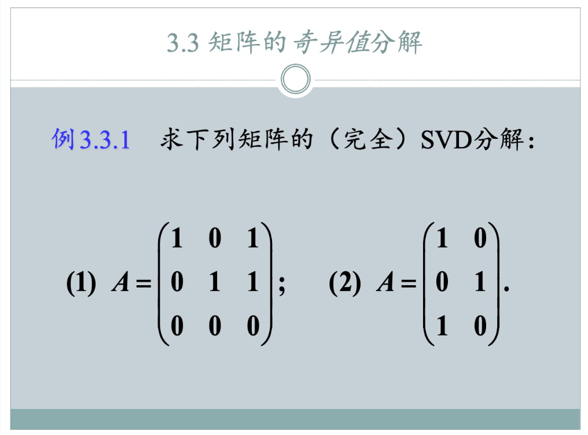
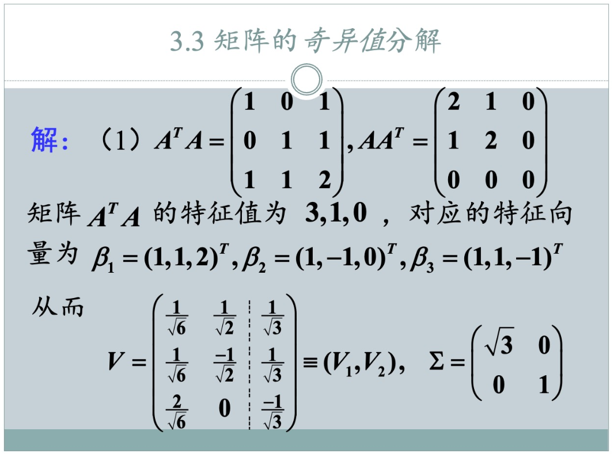
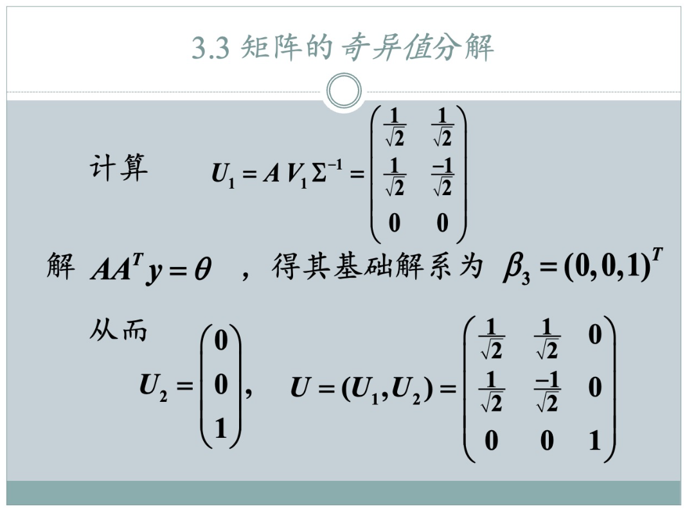
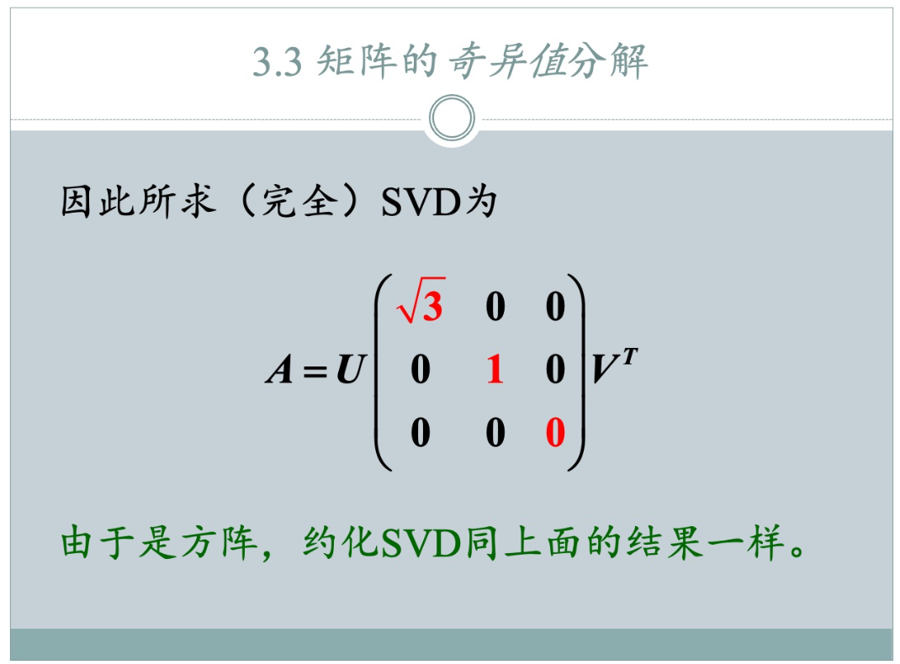

### 题型：矩阵的完全和约化SVD分解

### SVD 分解流程 (A = UΣVᵀ)

1.  **求 V**: 计算 $A^T A$，求其特征值 $\lambda_i$ 和对应的**单位**特征向量 $v_i$。将这些 $v_i$ 作为列，组成正交矩阵 **V**。

2.  **求 Σ**: 将特征值开根号得到奇异值 $\sigma_i = \sqrt{\lambda_i}$，并**从大到小排序**。将它们放在对角矩阵 **Σ** 的对角线上。

3.  **求 U**:
    *   对于**非零**奇异值 $\sigma_i > 0$，直接计算 $u_i = \frac{1}{\sigma_i} A v_i$。
    *   如果 U 的列数不够（因为存在零奇异值），则通过求解 $A A^T$ 的零空间（即特征值为0的单位特征向量）来补全剩余的 $u_i$。
    *   将所有 $u_i$ 作为列，组成正交矩阵 **U**。

---
### 关于约化SVD

*   **约化SVD分解**：直接**丢弃**所有零奇异值，以及 U 和 V 中与它们对应的向量。
    *   即：只保留 **r** 个非零奇异值，以及 U 和 V 的前 **r** 列。

---

我们来按照幻灯片中的思路，一步步对第一个矩阵进行完整的SVD分解，并最后给出其**完全SVD分解**和**约化SVD分解**两种形式。

**问题**: 求矩阵 A 的 (完全) SVD 分解：
$A = \begin{pmatrix} 1 & 0 & 1 \\ 0 & 1 & 1 \\ 0 & 0 & 0 \end{pmatrix}$

SVD分解的目标是找到三个矩阵 U, Σ, V，使得 $A = U \Sigma V^T$。

---

### 第一步：计算 $A^T A$，并求其特征值和特征向量

$A^T = \begin{pmatrix} 1 & 0 & 0 \\ 0 & 1 & 0 \\ 1 & 1 & 0 \end{pmatrix}$

$A^T A = \begin{pmatrix} 1 & 0 & 0 \\ 0 & 1 & 0 \\ 1 & 1 & 0 \end{pmatrix} \begin{pmatrix} 1 & 0 & 1 \\ 0 & 1 & 1 \\ 0 & 0 & 0 \end{pmatrix} = \begin{pmatrix} 1 & 0 & 1 \\ 0 & 1 & 1 \\ 1 & 1 & 2 \end{pmatrix}$

接下来，我们求解 $A^T A$ 的特征值 (λ) 和对应的特征向量 (β)。
求解特征方程 $\det(A^T A - \lambda I) = 0$:
$\begin{vmatrix} 1-\lambda & 0 & 1 \\ 0 & 1-\lambda & 1 \\ 1 & 1 & 2-\lambda \end{vmatrix} = (1-\lambda)((1-\lambda)(2-\lambda)-1) + 1(0-(1-\lambda)) = 0$
$(1-\lambda)(\lambda^2-3\lambda+1) - (1-\lambda) = 0$
$(1-\lambda)(\lambda^2-3\lambda) = 0$
$\lambda(1-\lambda)(\lambda-3) = 0$

得到特征值为 $\lambda_1 = 3, \lambda_2 = 1, \lambda_3 = 0$ (按从大到小排序)。

根据特征值，求对应的特征向量：
*   **对于 $\lambda_1 = 3$**: 解 $(A^T A - 3I)x = 0$，得到特征向量 $\beta_1 = \begin{pmatrix} 1 \\ 1 \\ 2 \end{pmatrix}$
*   **对于 $\lambda_2 = 1$**: 解 $(A^T A - 1I)x = 0$，得到特征向量 $\beta_2 = \begin{pmatrix} 1 \\ -1 \\ 0 \end{pmatrix}$
*   **对于 $\lambda_3 = 0$**: 解 $(A^T A - 0I)x = 0$，得到特征向量 $\beta_3 = \begin{pmatrix} 1 \\ 1 \\ -1 \end{pmatrix}$

这些结果与幻灯片中的一致。

### 第二步：构建矩阵 Σ 和 V

1.  **构建 Σ (奇异值矩阵)**
    奇异值 $\sigma_i = \sqrt{\lambda_i}$。
    $\sigma_1 = \sqrt{3}$
    $\sigma_2 = \sqrt{1} = 1$
    $\sigma_3 = \sqrt{0} = 0$
    矩阵 A 是 3x3 矩阵，所以 Σ 也是一个 3x3 矩阵。
    $\Sigma = \begin{pmatrix} \sigma_1 & 0 & 0 \\ 0 & \sigma_2 & 0 \\ 0 & 0 & \sigma_3 \end{pmatrix} = \begin{pmatrix} \sqrt{3} & 0 & 0 \\ 0 & 1 & 0 \\ 0 & 0 & 0 \end{pmatrix}$

2.  **构建 V (右奇异向量矩阵)**
    矩阵 V 的列向量 ($v_i$) 是对 $A^T A$ 的特征向量 ($\beta_i$) 进行单位化得到的。
    *   $v_1 = \frac{\beta_1}{||\beta_1||} = \frac{1}{\sqrt{1^2+1^2+2^2}}\begin{pmatrix} 1 \\ 1 \\ 2 \end{pmatrix} = \begin{pmatrix} 1/\sqrt{6} \\ 1/\sqrt{6} \\ 2/\sqrt{6} \end{pmatrix}$
    *   $v_2 = \frac{\beta_2}{||\beta_2||} = \frac{1}{\sqrt{1^2+(-1)^2+0^2}}\begin{pmatrix} 1 \\ -1 \\ 0 \end{pmatrix} = \begin{pmatrix} 1/\sqrt{2} \\ -1/\sqrt{2} \\ 0 \end{pmatrix}$
    *   $v_3 = \frac{\beta_3}{||\beta_3||} = \frac{1}{\sqrt{1^2+1^2+(-1)^2}}\begin{pmatrix} 1 \\ 1 \\ -1 \end{pmatrix} = \begin{pmatrix} 1/\sqrt{3} \\ 1/\sqrt{3} \\ -1/\sqrt{3} \end{pmatrix}$

    将这些单位向量作为列，构成矩阵 V：
    $V = \begin{pmatrix} 1/\sqrt{6} & 1/\sqrt{2} & 1/\sqrt{3} \\ 1/\sqrt{6} & -1/\sqrt{2} & 1/\sqrt{3} \\ 2/\sqrt{6} & 0 & -1/\sqrt{3} \end{pmatrix}$

### 第三步：构建矩阵 U (左奇异向量矩阵)

矩阵 U 的列向量 ($u_i$) 可以通过两种方式求得。

**方法一：** 对于非零奇异值 ($\sigma_1, \sigma_2$)，使用公式 $u_i = \frac{1}{\sigma_i}Av_i$
*   $u_1 = \frac{1}{\sigma_1}Av_1 = \frac{1}{\sqrt{3}}\begin{pmatrix} 1 & 0 & 1 \\ 0 & 1 & 1 \\ 0 & 0 & 0 \end{pmatrix} \begin{pmatrix} 1/\sqrt{6} \\ 1/\sqrt{6} \\ 2/\sqrt{6} \end{pmatrix} = \frac{1}{\sqrt{3}}\begin{pmatrix} 3/\sqrt{6} \\ 3/\sqrt{6} \\ 0 \end{pmatrix} = \begin{pmatrix} 3/\sqrt{18} \\ 3/\sqrt{18} \\ 0 \end{pmatrix} = \begin{pmatrix} 1/\sqrt{2} \\ 1/\sqrt{2} \\ 0 \end{pmatrix}$
*   $u_2 = \frac{1}{\sigma_2}Av_2 = \frac{1}{1}\begin{pmatrix} 1 & 0 & 1 \\ 0 & 1 & 1 \\ 0 & 0 & 0 \end{pmatrix} \begin{pmatrix} 1/\sqrt{2} \\ -1/\sqrt{2} \\ 0 \end{pmatrix} = \begin{pmatrix} 1/\sqrt{2} \\ -1/\sqrt{2} \\ 0 \end{pmatrix}$

**方法二：** 对于零奇异值 ($\sigma_3$)，对应的 $u_3$ 需要从 $A A^T$ 的零空间（即特征值为0对应的特征向量）中求得。
$A A^T = \begin{pmatrix} 1 & 0 & 1 \\ 0 & 1 & 1 \\ 0 & 0 & 0 \end{pmatrix} \begin{pmatrix} 1 & 0 & 0 \\ 0 & 1 & 0 \\ 1 & 1 & 0 \end{pmatrix} = \begin{pmatrix} 2 & 1 & 0 \\ 1 & 2 & 0 \\ 0 & 0 & 0 \end{pmatrix}$

求解 $A A^T y = 0$：
$\begin{pmatrix} 2 & 1 & 0 \\ 1 & 2 & 0 \\ 0 & 0 & 0 \end{pmatrix} \begin{pmatrix} y_1 \\ y_2 \\ y_3 \end{pmatrix} = \begin{pmatrix} 0 \\ 0 \\ 0 \end{pmatrix}$
解得 $y_1=0, y_2=0$，而 $y_3$ 可以是任意非零实数。我们取基础解系为 $\beta_3' = \begin{pmatrix} 0 \\ 0 \\ 1 \end{pmatrix}$。
单位化得到 $u_3$：
*   $u_3 = \frac{\beta_3'}{||\beta_3'||} = \begin{pmatrix} 0 \\ 0 \\ 1 \end{pmatrix}$

将 $u_1, u_2, u_3$ 作为列，构成矩阵 U：
$U = \begin{pmatrix} 1/\sqrt{2} & 1/\sqrt{2} & 0 \\ 1/\sqrt{2} & -1/\sqrt{2} & 0 \\ 0 & 0 & 1 \end{pmatrix}$

### 第四步：整合结果，写出SVD分解

#### 1. 完全SVD分解 (Full SVD)

将上面计算得到的 U, Σ, V 组合成 $A = U \Sigma V^T$ 的形式。
$A = \underbrace{\begin{pmatrix} 1/\sqrt{2} & 1/\sqrt{2} & 0 \\ 1/\sqrt{2} & -1/\sqrt{2} & 0 \\ 0 & 0 & 1 \end{pmatrix}}_{U~(3 \times 3)} \underbrace{\begin{pmatrix} \sqrt{3} & 0 & 0 \\ 0 & 1 & 0 \\ 0 & 0 & 0 \end{pmatrix}}_{\Sigma~(3 \times 3)} \underbrace{\begin{pmatrix} 1/\sqrt{6} & 1/\sqrt{6} & 2/\sqrt{6} \\ 1/\sqrt{2} & -1/\sqrt{2} & 0 \\ 1/\sqrt{3} & 1/\sqrt{3} & -1/\sqrt{3} \end{pmatrix}}_{V^T~(3 \times 3)}$

#### 2. 约化SVD分解 (Reduced SVD)

约化SVD只保留与非零奇异值相关的部分。矩阵 A 的秩 (rank) 为2，因为有两个非零奇异值。
*   $U_r$ 取 U 的前 r=2 列。
*   $\Sigma_r$ 取 Σ 的左上角 r x r (2x2) 的对角矩阵。
*   $V_r^T$ 取 $V^T$ 的前 r=2 行。

$A = \underbrace{\begin{pmatrix} 1/\sqrt{2} & 1/\sqrt{2} \\ 1/\sqrt{2} & -1/\sqrt{2} \\ 0 & 0 \end{pmatrix}}_{U_r~(3 \times 2)} \underbrace{\begin{pmatrix} \sqrt{3} & 0 \\ 0 & 1 \end{pmatrix}}_{\Sigma_r~(2 \times 2)} \underbrace{\begin{pmatrix} 1/\sqrt{6} & 1/\sqrt{6} & 2/\sqrt{6} \\ 1/\sqrt{2} & -1/\sqrt{2} & 0 \end{pmatrix}}_{V_r^T~(2 \times 3)}$

这样就完成了对第一个矩阵的详细分解。

### 为什么约化SVD分解要逆序排放奇异值

#### 层面一：为了方便进行约化分解

将奇异值从大到小排序，使得所有非零的奇异值都集中在矩阵 $\Sigma$ 的左上角，而所有的零奇异值（如果存在的话）都被推到了右下角。

$ \Sigma = \begin{pmatrix} \sigma_1 & & & & & \\ & \sigma_2 & & & \huge{0} & \\ & & \ddots & & & \\ & & & \sigma_r & & \\ & \huge{0} & & & 0 & \\ & & & & & \ddots \end{pmatrix} $

这个约定俗成的排序带来了巨大的便利：

*   **清晰的界限**：我们能立刻知道矩阵的秩 (rank) 就是非零奇异值的个数 `r`。
*   **简单的切片操作**：要从完全SVD得到约化SVD，我们不需要去搜索哪些奇异值是零。我们只需要简单地取矩阵的前 `r` 部分即可：
    *   取 $U$ 的前 `r` 列。
    *   取 $\Sigma$ 的左上角 `r x r` 块。
    *   取 $V^T$ 的前 `r` 行。

这使得算法实现起来非常干净和高效。**所以，这是一个重要的程序性原因。**

#### 层面二：更深刻的理由 —— 信息的层次与矩阵近似