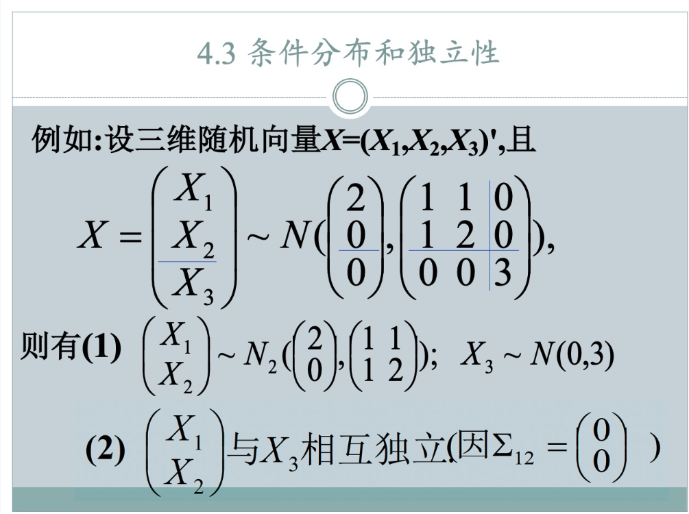
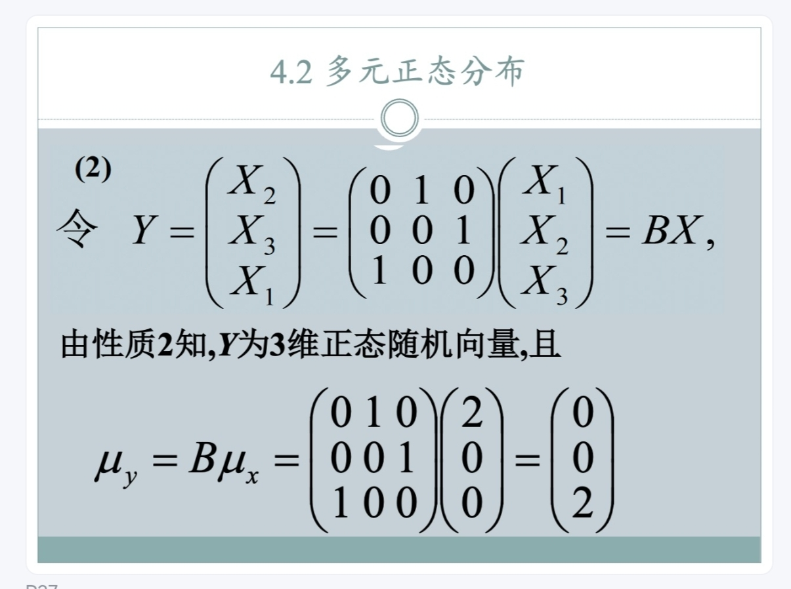
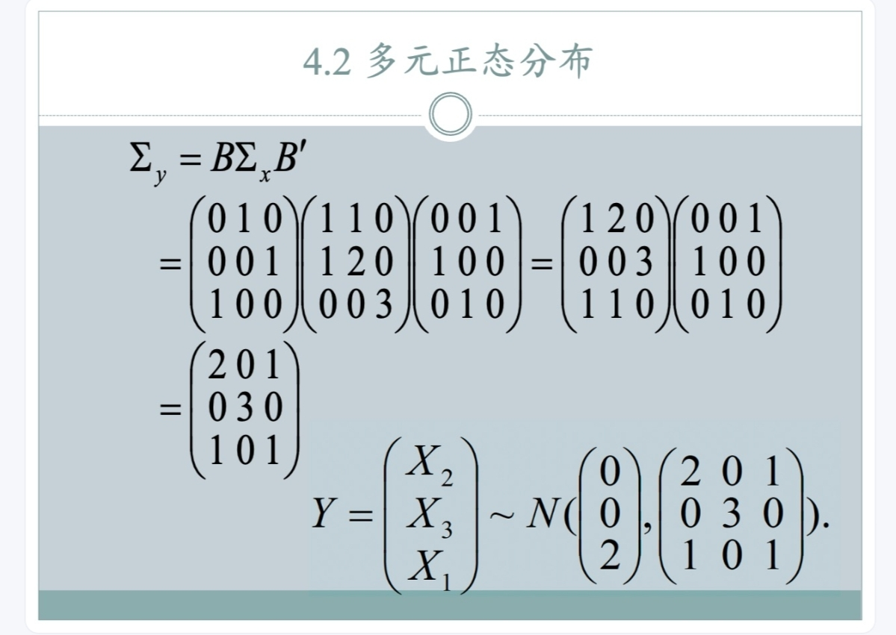
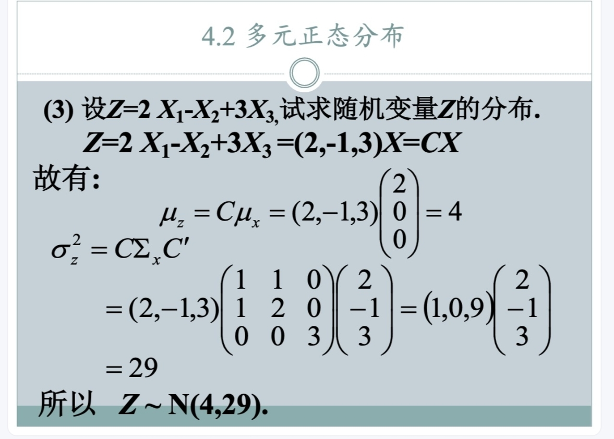

### 题型：多元正态分布线性变换之后的分布

### 题目

设三维随机向量 $\mathbf{X}=(X_1,X_2,X_3)'$ 服从多元正态分布 $N\left(\begin{pmatrix} 2 \\ 0 \\ 0 \end{pmatrix}, \begin{pmatrix} 1 & 1 & 0 \\ 1 & 2 & 0 \\ 0 & 0 & 3 \end{pmatrix}\right)$。

试求：

1.  $X_1$ 的分布以及 $\begin{pmatrix} X_2 \\ X_3 \end{pmatrix}$ 的分布。
2.  令 $\mathbf{Y}=\begin{pmatrix} X_2 \\ X_3 \\ X_1 \end{pmatrix}$，求 $\mathbf{Y}$ 的分布。
3.  设 $Z = 2X_1 - X_2 + 3X_3$，求随机变量 $Z$ 的分布。

### 解答

#### 第一问：求 $X_1$ 的分布以及 $\begin{pmatrix} X_2 \\ X_3 \end{pmatrix}$ 的分布

根据多元正态分布的性质，如果一个随机向量服从多元正态分布，那么其任何子向量也服从多元正态分布。

对于 $X_1$，它是 $\mathbf{X}$ 的第一个分量。
其均值是 $\mathbf{\mu}_{\mathbf{X}}$ 的第一个分量，即 $\mu_{X_1} = 2$。
其方差是 $\mathbf{\Sigma}_{\mathbf{X}}$ 的 (1,1) 位置元素，即 $\sigma^2_{X_1} = 1$。
所以，$X_1 \sim N(2, 1)$。

对于 $\begin{pmatrix} X_2 \\ X_3 \end{pmatrix}$，它是 $\mathbf{X}$ 的后两个分量。
其均值向量是 $\mathbf{\mu}_{\mathbf{X}}$ 的后两个分量，即 $\begin{pmatrix} \mu_{X_2} \\ \mu_{X_3} \end{pmatrix} = \begin{pmatrix} 0 \\ 0 \end{pmatrix}$。
其协方差矩阵是 $\mathbf{\Sigma}_{\mathbf{X}}$ 对应的子矩阵，即取第2、3行和第2、3列构成的矩阵：
$\begin{pmatrix} \sigma^2_{X_2} & \text{Cov}(X_2, X_3) \\ \text{Cov}(X_3, X_2) & \sigma^2_{X_3} \end{pmatrix} = \begin{pmatrix} 2 & 0 \\ 0 & 3 \end{pmatrix}$。
所以，$\begin{pmatrix} X_2 \\ X_3 \end{pmatrix} \sim N_2\left(\begin{pmatrix} 0 \\ 0 \end{pmatrix}, \begin{pmatrix} 2 & 0 \\ 0 & 3 \end{pmatrix}\right)$。

#### 第二问：求 $\mathbf{Y}=\begin{pmatrix} X_2 \\ X_3 \\ X_1 \end{pmatrix}$ 的分布

令 $\mathbf{Y} = B\mathbf{X}$，其中 $B$ 是一个置换矩阵，用于重新排列 $\mathbf{X}$ 的分量。
要得到 $\begin{pmatrix} X_2 \\ X_3 \\ X_1 \end{pmatrix}$，我们需要：
第一行选取 $X_2$ (对应 $\mathbf{X}$ 的第二列)
第二行选取 $X_3$ (对应 $\mathbf{X}$ 的第三列)
第三行选取 $X_1$ (对应 $\mathbf{X}$ 的第一列)
所以矩阵 $B$ 为：
$B = \begin{pmatrix} 0 & 1 & 0 \\ 0 & 0 & 1 \\ 1 & 0 & 0 \end{pmatrix}$

根据线性变换的性质，如果 $\mathbf{X} \sim N(\mathbf{\mu}_{\mathbf{X}}, \mathbf{\Sigma}_{\mathbf{X}})$，那么 $\mathbf{Y} = B\mathbf{X} \sim N(B\mathbf{\mu}_{\mathbf{X}}, B\mathbf{\Sigma}_{\mathbf{X}}B')$。

首先计算 $\mathbf{\mu}_{\mathbf{Y}} = B\mathbf{\mu}_{\mathbf{X}}$：
$\mathbf{\mu}_{\mathbf{Y}} = \begin{pmatrix} 0 & 1 & 0 \\ 0 & 0 & 1 \\ 1 & 0 & 0 \end{pmatrix} \begin{pmatrix} 2 \\ 0 \\ 0 \end{pmatrix} = \begin{pmatrix} 0 \cdot 2 + 1 \cdot 0 + 0 \cdot 0 \\ 0 \cdot 2 + 0 \cdot 0 + 1 \cdot 0 \\ 1 \cdot 2 + 0 \cdot 0 + 0 \cdot 0 \end{pmatrix} = \begin{pmatrix} 0 \\ 0 \\ 2 \end{pmatrix}$

接下来计算 $\mathbf{\Sigma}_{\mathbf{Y}} = B\mathbf{\Sigma}_{\mathbf{X}}B'$：
$B\mathbf{\Sigma}_{\mathbf{X}} = \begin{pmatrix} 0 & 1 & 0 \\ 0 & 0 & 1 \\ 1 & 0 & 0 \end{pmatrix} \begin{pmatrix} 1 & 1 & 0 \\ 1 & 2 & 0 \\ 0 & 0 & 3 \end{pmatrix} = \begin{pmatrix} 1 & 2 & 0 \\ 0 & 0 & 3 \\ 1 & 1 & 0 \end{pmatrix}$

$B' = \begin{pmatrix} 0 & 0 & 1 \\ 1 & 0 & 0 \\ 0 & 1 & 0 \end{pmatrix}$

$\mathbf{\Sigma}_{\mathbf{Y}} = (B\mathbf{\Sigma}_{\mathbf{X}})B' = \begin{pmatrix} 1 & 2 & 0 \\ 0 & 0 & 3 \\ 1 & 1 & 0 \end{pmatrix} \begin{pmatrix} 0 & 0 & 1 \\ 1 & 0 & 0 \\ 0 & 1 & 0 \end{pmatrix} = \begin{pmatrix} 1 \cdot 0 + 2 \cdot 1 + 0 \cdot 0 & 1 \cdot 0 + 2 \cdot 0 + 0 \cdot 1 & 1 \cdot 1 + 2 \cdot 0 + 0 \cdot 0 \\ 0 \cdot 0 + 0 \cdot 1 + 3 \cdot 0 & 0 \cdot 0 + 0 \cdot 0 + 3 \cdot 1 & 0 \cdot 1 + 0 \cdot 0 + 3 \cdot 0 \\ 1 \cdot 0 + 1 \cdot 1 + 0 \cdot 0 & 1 \cdot 0 + 1 \cdot 0 + 0 \cdot 1 & 1 \cdot 1 + 1 \cdot 0 + 0 \cdot 0 \end{pmatrix} = \begin{pmatrix} 2 & 0 & 1 \\ 0 & 3 & 0 \\ 1 & 0 & 1 \end{pmatrix}$

所以，$\mathbf{Y} = \begin{pmatrix} X_2 \\ X_3 \\ X_1 \end{pmatrix} \sim N\left(\begin{pmatrix} 0 \\ 0 \\ 2 \end{pmatrix}, \begin{pmatrix} 2 & 0 & 1 \\ 0 & 3 & 0 \\ 1 & 0 & 1 \end{pmatrix}\right)$。

#### 第三问：求 $Z = 2X_1 - X_2 + 3X_3$ 的分布

令 $Z = C\mathbf{X}$，其中 $C = (2, -1, 3)$。

根据线性变换的性质，如果 $\mathbf{X} \sim N(\mathbf{\mu}_{\mathbf{X}}, \mathbf{\Sigma}_{\mathbf{X}})$，那么 $Z = C\mathbf{X} \sim N(C\mathbf{\mu}_{\mathbf{X}}, C\mathbf{\Sigma}_{\mathbf{X}}C')$.

首先计算均值 $\mu_Z = C\mathbf{\mu}_{\mathbf{X}}$：
$\mu_Z = (2, -1, 3) \begin{pmatrix} 2 \\ 0 \\ 0 \end{pmatrix} = 2 \cdot 2 + (-1) \cdot 0 + 3 \cdot 0 = 4$

接下来计算方差 $\sigma^2_Z = C\mathbf{\Sigma}_{\mathbf{X}}C'$：
$C\mathbf{\Sigma}_{\mathbf{X}} = (2, -1, 3) \begin{pmatrix} 1 & 1 & 0 \\ 1 & 2 & 0 \\ 0 & 0 & 3 \end{pmatrix} = (2 \cdot 1 + (-1) \cdot 1 + 3 \cdot 0, \quad 2 \cdot 1 + (-1) \cdot 2 + 3 \cdot 0, \quad 2 \cdot 0 + (-1) \cdot 0 + 3 \cdot 3)$
$= (2 - 1 + 0, \quad 2 - 2 + 0, \quad 0 + 0 + 9)$
$= (1, 0, 9)$

$\sigma^2_Z = (1, 0, 9) \begin{pmatrix} 2 \\ -1 \\ 3 \end{pmatrix} = 1 \cdot 2 + 0 \cdot (-1) + 9 \cdot 3 = 2 + 0 + 27 = 29$

所以，$Z \sim N(4, 29)$。