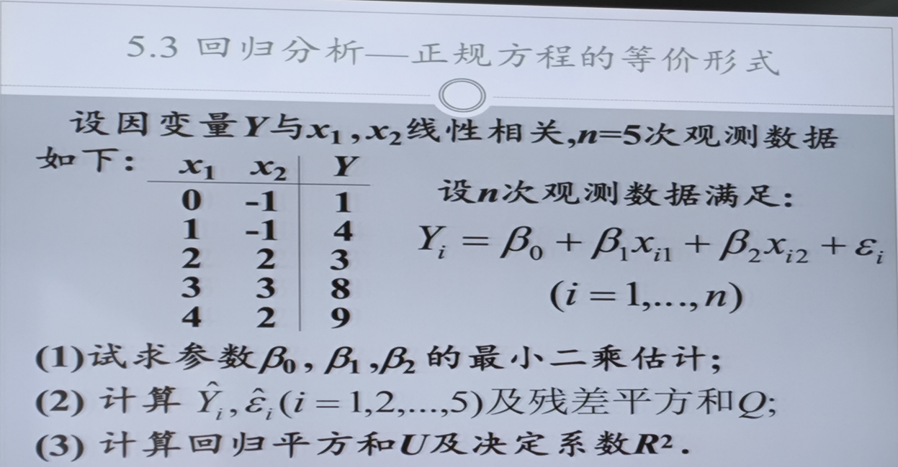

### 题型：求多元线性回归

#### 关键词：正规方程，残差平方和，总离差平方和，回归平方和，决定系数

我们需要根据给定的数据，建立回归模型 $Y = \beta_0 + \beta_1 x_1 + \beta_2 x_2 + \varepsilon$。

以下是详细的解题步骤：

### 第一步：整理数据与构建矩阵

首先列出数据矩阵 $X$（注意第一列全为1，对应截距项 $\beta_0$）和观测向量 $Y$。

$$
X = \begin{bmatrix}
1 & 0 & -1 \\
1 & 1 & -1 \\
1 & 2 & 2 \\
1 & 3 & 3 \\
1 & 4 & 2
\end{bmatrix}, \quad
Y = \begin{bmatrix}
1 \\
4 \\
3 \\
8 \\
9
\end{bmatrix}
$$

计算必要的求和统计量：
*   $n = 5$
*   $\sum x_1 = 0+1+2+3+4 = 10$
*   $\sum x_2 = -1-1+2+3+2 = 5$
*   $\sum Y = 1+4+3+8+9 = 25$，则 $\bar{Y} = 5$

---

### (1) 试求参数 $\beta_0, \beta_1, \beta_2$ 的最小二乘估计

利用正规方程（Normal Equations）公式：$\hat{\beta} = (X^T X)^{-1} X^T Y$

**1. 计算 $X^T X$ 矩阵：**

$$
X^T X = \begin{bmatrix}
n & \sum x_1 & \sum x_2 \\
\sum x_1 & \sum x_1^2 & \sum x_1 x_2 \\
\sum x_2 & \sum x_1 x_2 & \sum x_2^2
\end{bmatrix}
$$

*   $\sum x_1^2 = 0 + 1 + 4 + 9 + 16 = 30$
*   $\sum x_2^2 = 1 + 1 + 4 + 9 + 4 = 19$
*   $\sum x_1 x_2 = 0(-1) + 1(-1) + 2(2) + 3(3) + 4(2) = 0 - 1 + 4 + 9 + 8 = 20$

$$
X^T X = \begin{bmatrix}
5 & 10 & 5 \\
10 & 30 & 20 \\
5 & 20 & 19
\end{bmatrix}
$$

**2. 计算 $X^T Y$ 向量：**

$$
X^T Y = \begin{bmatrix}
\sum Y \\
\sum x_1 Y \\
\sum x_2 Y
\end{bmatrix}
$$

*   $\sum Y = 25$
*   $\sum x_1 Y = 0(1) + 1(4) + 2(3) + 3(8) + 4(9) = 0 + 4 + 6 + 24 + 36 = 70$
*   $\sum x_2 Y = -1(1) - 1(4) + 2(3) + 3(8) + 2(9) = -1 - 4 + 6 + 24 + 18 = 43$

$$
X^T Y = \begin{bmatrix}
25 \\
70 \\
43
\end{bmatrix}
$$

**3. 解线性方程组：**
$$
\begin{cases}
5\hat{\beta}_0 + 10\hat{\beta}_1 + 5\hat{\beta}_2 = 25 \quad \cdots(1) \\
10\hat{\beta}_0 + 30\hat{\beta}_1 + 20\hat{\beta}_2 = 70 \quad \cdots(2) \\
5\hat{\beta}_0 + 20\hat{\beta}_1 + 19\hat{\beta}_2 = 43 \quad \cdots(3)
\end{cases}
$$

*   由 (1) 式化简除以 5：$\hat{\beta}_0 + 2\hat{\beta}_1 + \hat{\beta}_2 = 5 \Rightarrow \hat{\beta}_0 = 5 - 2\hat{\beta}_1 - \hat{\beta}_2 \quad \cdots(4)$
*   将 (2) 式减去 2倍的 (1) 式：
    $(10\hat{\beta}_0 + 30\hat{\beta}_1 + 20\hat{\beta}_2) - 2(5\hat{\beta}_0 + 10\hat{\beta}_1 + 5\hat{\beta}_2) = 70 - 50$
    $10\hat{\beta}_1 + 10\hat{\beta}_2 = 20 \Rightarrow \hat{\beta}_1 + \hat{\beta}_2 = 2 \Rightarrow \hat{\beta}_1 = 2 - \hat{\beta}_2 \quad \cdots(5)$
*   将 (3) 式减去 (1) 式：
    $10\hat{\beta}_1 + 14\hat{\beta}_2 = 18 \Rightarrow 5\hat{\beta}_1 + 7\hat{\beta}_2 = 9 \quad \cdots(6)$

将 (5) 代入 (6)：
$5(2 - \hat{\beta}_2) + 7\hat{\beta}_2 = 9$
$10 - 5\hat{\beta}_2 + 7\hat{\beta}_2 = 9$
$2\hat{\beta}_2 = -1 \Rightarrow \mathbf{\hat{\beta}_2 = -0.5}$

求 $\hat{\beta}_1$：
$\hat{\beta}_1 = 2 - (-0.5) \Rightarrow \mathbf{\hat{\beta}_1 = 2.5}$

求 $\hat{\beta}_0$：
$\hat{\beta}_0 = 5 - 2(2.5) - (-0.5) = 5 - 5 + 0.5 \Rightarrow \mathbf{\hat{\beta}_0 = 0.5}$

**结论 (1)：**
参数的最小二乘估计为：
**$\hat{\beta}_0 = 0.5, \quad \hat{\beta}_1 = 2.5, \quad \hat{\beta}_2 = -0.5$**
回归方程为：$\hat{Y} = 0.5 + 2.5x_1 - 0.5x_2$

---

### (2) 计算 $\hat{Y}_i, \hat{\varepsilon}_i$ 及残差平方和 $Q$

利用回归方程 $\hat{Y}_i = 0.5 + 2.5x_{i1} - 0.5x_{i2}$ 进行计算。
残差 $\hat{\varepsilon}_i = Y_i - \hat{Y}_i$。

| $i$  | $x_1$ | $x_2$ | $Y$  | $\hat{Y}$ (计算过程)                   | $\hat{Y}$ (拟合值) | $\hat{\varepsilon}$ (残差) | $\hat{\varepsilon}^2$ |
| :--: | :---: | :---: | :--: | :------------------------------------- | :----------------: | :------------------------: | :-------------------: |
|  1   |   0   |  -1   |  1   | $0.5 + 2.5(0) - 0.5(-1) = 0.5+0+0.5$   |       **1**        |           **0**            |           0           |
|  2   |   1   |  -1   |  4   | $0.5 + 2.5(1) - 0.5(-1) = 0.5+2.5+0.5$ |      **3.5**       |          **0.5**           |         0.25          |
|  3   |   2   |   2   |  3   | $0.5 + 2.5(2) - 0.5(2) = 0.5+5-1$      |      **4.5**       |          **-1.5**          |         2.25          |
|  4   |   3   |   3   |  8   | $0.5 + 2.5(3) - 0.5(3) = 0.5+7.5-1.5$  |      **6.5**       |          **1.5**           |         2.25          |
|  5   |   4   |   2   |  9   | $0.5 + 2.5(4) - 0.5(2) = 0.5+10-1$     |      **9.5**       |          **-0.5**          |         0.25          |

**残差平方和 $Q$：**
$Q = \sum \hat{\varepsilon}_i^2 = 0 + 0.25 + 2.25 + 2.25 + 0.25 = 5$

**结论 (2)：**
*   拟合值 $\hat{Y}$ 为：**1, 3.5, 4.5, 6.5, 9.5**
*   残差 $\hat{\varepsilon}$ 为：**0, 0.5, -1.5, 1.5, -0.5**
*   残差平方和 $Q = 5$

---

### (3) 计算回归平方和 $U$ 及决定系数 $R^2$

**第一步：计算“样本和均值的差值平方和”（即总离差平方和 $SST$）**
已知样本均值 $\bar{Y} = 5$，原始数据 $Y = [1, 4, 3, 8, 9]$。
$$
\begin{aligned}
SST &= (1-5)^2 + (4-5)^2 + (3-5)^2 + (8-5)^2 + (9-5)^2 \\
&= (-4)^2 + (-1)^2 + (-2)^2 + 3^2 + 4^2 \\
&= 16 + 1 + 4 + 9 + 16 \\
&= \mathbf{46}
\end{aligned}
$$

**第二步：获取“样本和预测的差值平方和”（即残差平方和 $Q$）**
根据第(2)问的计算结果，预测值与真实值的误差平方总和为：
$$ Q = \mathbf{5} $$

**第三步：计算决定系数 $R^2$**
利用公式：$R^2 = 1 - \frac{\text{样本和预测的差值平方和}}{\text{样本和均值的差值平方和}}$

$$
\begin{aligned}
R^2 &= 1 - \frac{Q}{SST} \\
&= 1 - \frac{5}{46} \\
&= 1 - 0.1087 \\
&\approx \mathbf{0.8913}
\end{aligned}
$$

**第四步：计算回归平方和 $U$**
回归平方和 $U$ 代表被模型解释的部分（即 $SST$ 中扣除 $Q$ 的部分，也是分子）：
$$
U = SST - Q = 46 - 5 = \mathbf{41}
$$

**(3) 问最终结果：**

*   回归平方和 $U = \mathbf{41}$
*   决定系数 $R^2 \approx \mathbf{0.8913}$

### 决定系数：衡量拟合的好坏

为什么“波动大”的时候，哪怕预测有误差，我们也认为“还行”？

假设我们要预测两个东西：
*   **场景A（波动极大）：** 预测某支股票的价格，它在 10元 到 1000元 之间剧烈波动（$SST$ 也就是分母非常大）。
    *   如果你的模型预测它也是几百块，哪怕误差有个几十块（$Q$ 分子较大），相对于那个几百块的巨大波动范围，这点误差微不足道。
    *   **结果：** $\frac{Q}{SST}$ 很小，$R^2$ 很高（接近1）。
    *   **含义：** 虽然不准，但你的模型成功捕捉到了“大趋势”。

*   **场景B（波动极小）：** 预测一包标准食盐的重量，它就在 499克 到 501克 之间波动（$SST$ 也就是分母非常小）。
    *   如果你的模型预测误差有 10克（$Q$ 分子和场景A一样大），这简直是灾难性的错误，因为连平均值的波动都没这么大。
    *   **结果：** $\frac{Q}{SST}$ 会变得巨大（甚至超过1），$R^2$ 会变得很差（甚至变成负数）。
    *   **含义：** 在这种精细的场景下，同样的绝对误差是不可接受的。

