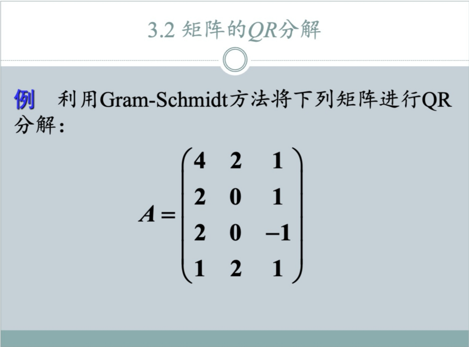
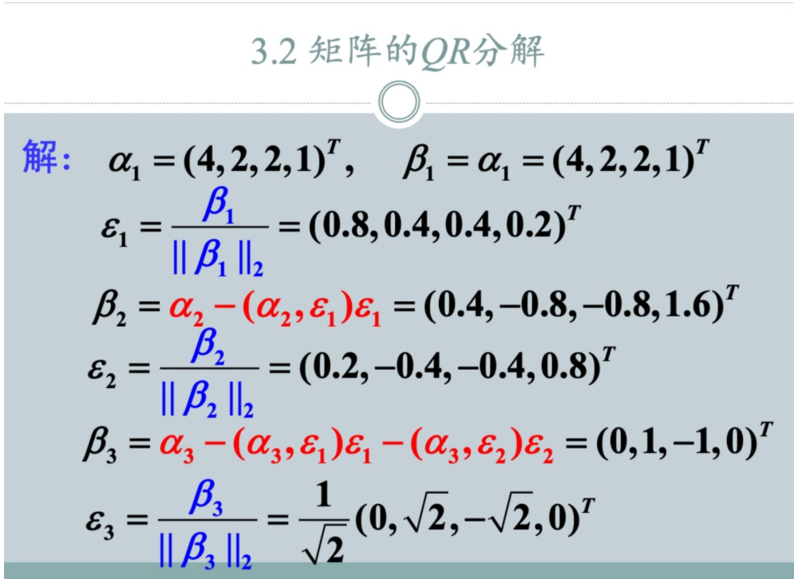
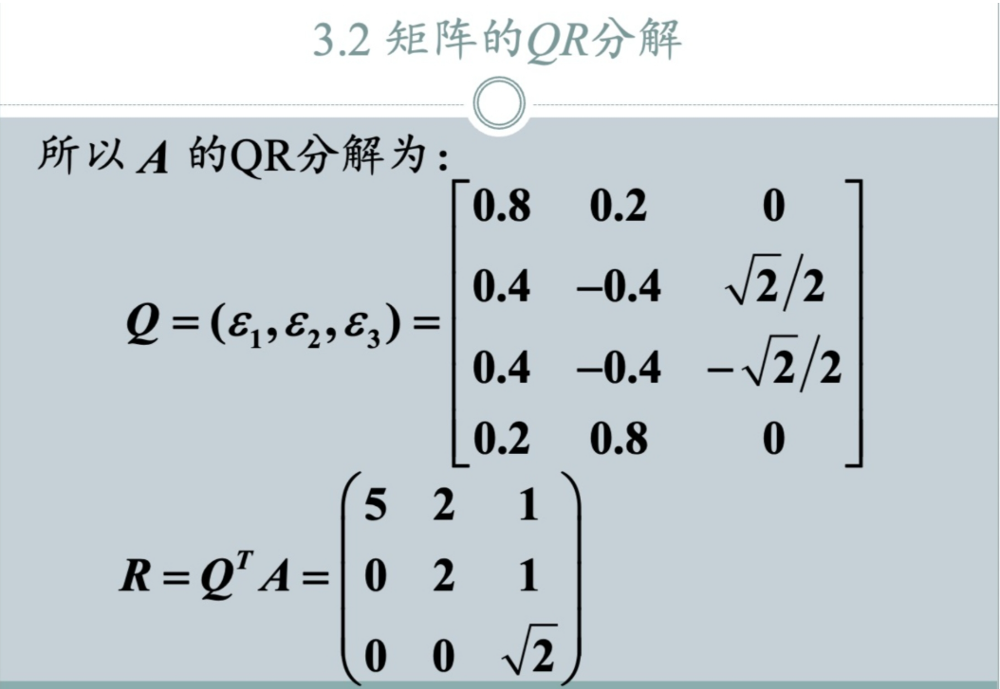

---

### 1. 题目 (Problem Statement)

利用 Gram-Schmidt 正交化方法（格拉姆-施密特方法）将下列矩阵 $A$ 进行 QR 分解：

$$
A = \begin{pmatrix} 
4 & 2 & 1 \\ 
2 & 0 & 1 \\ 
2 & 0 & -1 \\ 
1 & 2 & 1 
\end{pmatrix}
$$

---

### 2. 通用方法 (General Method)

**QR 分解** 的目标是将一个线性无关的实矩阵 $A$ 分解为两个矩阵的乘积：$A = QR$。
*   **$Q$ (正交矩阵):** 其列向量是标准正交向量组（即向量长度为1且两两正交）。
*   **$R$ (上三角矩阵):** 对角线元素为正，且为上三角形式。

**核心步骤（施密特正交化 Gram-Schmidt Process）：**

设矩阵 $A$ 的列向量为 $\alpha_1, \alpha_2, \alpha_3, \dots, \alpha_n$。

1.  **正交化 (Orthogonalization):** 构造一组两两正交的向量 $\beta_1, \beta_2, \dots$
    *   $\beta_1 = \alpha_1$
    *   $\beta_2 = \alpha_2 - \frac{\langle \alpha_2, \beta_1 \rangle}{\langle \beta_1, \beta_1 \rangle}\beta_1$ （或者写成投影形式 $\beta_2 = \alpha_2 - \langle \alpha_2, \epsilon_1 \rangle \epsilon_1$）
    *   $\beta_k = \alpha_k - \sum_{j=1}^{k-1} \langle \alpha_k, \epsilon_j \rangle \epsilon_j$

2.  **单位化 (Normalization):** 将正交向量转化为单位向量 $\epsilon$。
    *   $\epsilon_k = \frac{\beta_k}{\|\beta_k\|_2}$

3.  **构造矩阵:**
    *   **$Q$ 矩阵**：由 $\epsilon_1, \epsilon_2, \dots, \epsilon_n$ 作为列向量组成。
    *   **$R$ 矩阵**：
        *   对角线元素 $r_{kk} = \|\beta_k\|_2$。
        *   上三角元素 $r_{jk} = \langle \alpha_k, \epsilon_j \rangle$ ($j < k$)。
        *   或者直接通过 $R = Q^T A$ 计算。

---

### 3. 详细题解 (Detailed Solution)

记矩阵 $A$ 的三个列向量分别为 $\alpha_1, \alpha_2, \alpha_3$。

$$
\alpha_1 = (4, 2, 2, 1)^T, \quad \alpha_2 = (2, 0, 0, 2)^T, \quad \alpha_3 = (1, 1, -1, 1)^T
$$

#### 第一步：处理第一个向量 $\alpha_1$

1.  **确定 $\beta_1$:**
    $$ \beta_1 = \alpha_1 = (4, 2, 2, 1)^T $$
2.  **计算模长 $\|\beta_1\|_2$:**
    $$ \|\beta_1\|_2 = \sqrt{4^2 + 2^2 + 2^2 + 1^2} = \sqrt{16+4+4+1} = \sqrt{25} = 5 $$
3.  **单位化得到 $\epsilon_1$:**
    $$ \epsilon_1 = \frac{\beta_1}{5} = (0.8, 0.4, 0.4, 0.2)^T $$

#### 第二步：处理第二个向量 $\alpha_2$

1.  **计算投影系数:**
    $$ \langle \alpha_2, \epsilon_1 \rangle = 2\times0.8 + 0\times0.4 + 0\times0.4 + 2\times0.2 = 1.6 + 0.4 = 2 $$
2.  **正交化得到 $\beta_2$:**
    $$ \beta_2 = \alpha_2 - \langle \alpha_2, \epsilon_1 \rangle \epsilon_1 $$
    $$ \beta_2 = (2, 0, 0, 2)^T - 2 \times (0.8, 0.4, 0.4, 0.2)^T $$
    $$ \beta_2 = (2, 0, 0, 2)^T - (1.6, 0.8, 0.8, 0.4)^T $$
    $$ \beta_2 = (0.4, -0.8, -0.8, 1.6)^T $$
3.  **计算模长 $\|\beta_2\|_2$:**
    $$ \|\beta_2\|_2 = \sqrt{0.4^2 + (-0.8)^2 + (-0.8)^2 + 1.6^2} = \sqrt{0.16 + 0.64 + 0.64 + 2.56} = \sqrt{4} = 2 $$
4.  **单位化得到 $\epsilon_2$:**
    $$ \epsilon_2 = \frac{\beta_2}{2} = (0.2, -0.4, -0.4, 0.8)^T $$

#### 第三步：处理第三个向量 $\alpha_3$

1.  **计算投影系数:**
    *   对 $\epsilon_1$ 的投影：$\langle \alpha_3, \epsilon_1 \rangle = 1(0.8) + 1(0.4) + (-1)(0.4) + 1(0.2) = 1$
    *   对 $\epsilon_2$ 的投影：$\langle \alpha_3, \epsilon_2 \rangle = 1(0.2) + 1(-0.4) + (-1)(-0.4) + 1(0.8) = 0.2 - 0.4 + 0.4 + 0.8 = 1$
2.  **正交化得到 $\beta_3$:**
    $$ \beta_3 = \alpha_3 - \langle \alpha_3, \epsilon_1 \rangle \epsilon_1 - \langle \alpha_3, \epsilon_2 \rangle \epsilon_2 $$
    $$ \beta_3 = (1, 1, -1, 1)^T - 1 \cdot \epsilon_1 - 1 \cdot \epsilon_2 $$
    $$ \beta_3 = (1, 1, -1, 1)^T - (0.8, 0.4, 0.4, 0.2)^T - (0.2, -0.4, -0.4, 0.8)^T $$
    计算分量：
    *   第1分量: $1 - 0.8 - 0.2 = 0$
    *   第2分量: $1 - 0.4 - (-0.4) = 1$
    *   第3分量: $-1 - 0.4 - (-0.4) = -1$
    *   第4分量: $1 - 0.2 - 0.8 = 0$
    $$ \beta_3 = (0, 1, -1, 0)^T $$
3.  **计算模长 $\|\beta_3\|_2$:**
    $$ \|\beta_3\|_2 = \sqrt{0^2 + 1^2 + (-1)^2 + 0^2} = \sqrt{2} $$
4.  **单位化得到 $\epsilon_3$:**
    $$ \epsilon_3 = \frac{\beta_3}{\sqrt{2}} = \left(0, \frac{1}{\sqrt{2}}, -\frac{1}{\sqrt{2}}, 0\right)^T = \left(0, \frac{\sqrt{2}}{2}, -\frac{\sqrt{2}}{2}, 0\right)^T $$

#### 第四步：组装 Q 和 R 矩阵

**$Q$ 矩阵：** 由 $\epsilon_1, \epsilon_2, \epsilon_3$ 组成。
$$
Q = (\epsilon_1, \epsilon_2, \epsilon_3) = \begin{bmatrix} 
0.8 & 0.2 & 0 \\ 
0.4 & -0.4 & \frac{\sqrt{2}}{2} \\ 
0.4 & -0.4 & -\frac{\sqrt{2}}{2} \\ 
0.2 & 0.8 & 0 
\end{bmatrix}
$$

**$R$ 矩阵：** 通过 $R = Q^T A$ 计算，或直接利用之前的计算结果（对角线为模长，上三角为投影系数）。
*   $r_{11} = \|\beta_1\| = 5$
*   $r_{22} = \|\beta_2\| = 2$
*   $r_{33} = \|\beta_3\| = \sqrt{2}$
*   $r_{12} = \langle \alpha_2, \epsilon_1 \rangle = 2$
*   $r_{13} = \langle \alpha_3, \epsilon_1 \rangle = 1$
*   $r_{23} = \langle \alpha_3, \epsilon_2 \rangle = 1$

$$
R = \begin{pmatrix} 
5 & 2 & 1 \\ 
0 & 2 & 1 \\ 
0 & 0 & \sqrt{2} 
\end{pmatrix}
$$

### 最终结果
$$ A = QR $$
即：
$$
\begin{pmatrix} 4 & 2 & 1 \\ 2 & 0 & 1 \\ 2 & 0 & -1 \\ 1 & 2 & 1 \end{pmatrix} = 
\begin{bmatrix} 0.8 & 0.2 & 0 \\ 0.4 & -0.4 & \frac{\sqrt{2}}{2} \\ 0.4 & -0.4 & -\frac{\sqrt{2}}{2} \\ 0.2 & 0.8 & 0 \end{bmatrix}
\begin{pmatrix} 5 & 2 & 1 \\ 0 & 2 & 1 \\ 0 & 0 & \sqrt{2} \end{pmatrix}
$$